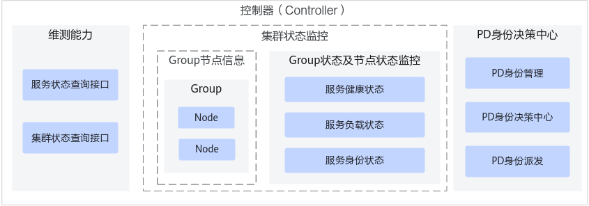

# 功能介绍

控制器（Controller）作为整个Server集群的身份决策大脑及状态管控中心，主要功能包括：集群节点状态管控、PD身份决策与下发等，其架构如[图1 控制器（Controller）架构图](#fig12171552133317)所示。

**图 1**  控制器（Controller）架构图<a name="fig12171552133317"></a>  


# 安装部署

使用控制器（Controller）之前，需要完成以下环境准备。

1.  已参见[准备MindIE镜像](准备MindIE镜像.md)完成MindIE镜像制作。
2.  参见[准备TLS证书](准备TLS证书.md)提前准备好证书，将证书路径配置到[启动配置文件（ms\_controller.json）](配置说明-5.md#section17710114519012)对应证书路径。
3.  参见[使用kubectl部署多机PD分离服务示例](使用kubectl部署多机PD分离服务示例.md)完成部署。

# 配置说明

**启动配置文件（ms_controller.json）**

ms_controller.json配置文件样例如下所示，参数解释请参见[ms\_controller.json配置文件参数解释](#section183933919369)，用户可根据具体场景进行配置。

```
{
  "allow_all_zero_ip_listening": false,
  "deploy_mode": "pd_separate",
  "initial_dist_server_port": 10000,
  "cluster_port":8899,
  "process_manager" : {
    "to_file": true,
    "file_path": "./logs/controller_process_status.json"
  },
  "cluster_status" : {
    "to_file": true,
    "file_path": "./logs/cluster_status_output.json"
  },
  "controller_backup_cfg" :{
    "function_sw":false,
    "database_server_dns":"etcd.default.svc.cluster.local",
    "database_server_port":2379
  },
 "fault_recovery_func_dict":{
    "lingqu_link":false
  },
  "global_rank_table_file_path": "./conf/global_rank_table_file.json",
  "cluster_synchronization_seconds": 1,
  "rank_table_detecting_seconds": 5,
  "disappeared_server_waiting_seconds": 7200,
  "default_p_rate": 0,
  "default_d_rate": 0,
  "is_heterogeneous": false,
  "server_online_attempt_times": 4,
  "server_online_wait_seconds": 5,
  "init_role_attempt_times": 2,
  "check_role_attempt_times": 300,
  "check_role_wait_seconds": 5,
  "mindie_server_control_port": 1026,
  "mindie_server_port": 1025,
  "mindie_server_metric_port": 1027,
  "controller_alarm_port": 1027,
  "mindie_ms_coordinator_port": 1026,
  "node_manager_port": 1028, 
  "mindie_ms_coordinator_external_port": 1028,
  "http_timeout_seconds": 5,
  "http_retries": 3,
  "role_decision_methods": "digs",
  "digs_request_summary_input_length": 3000,
  "digs_request_summary_output_length": 200,
  "digs_model_config_path":"./conf/model_config/llama2-70B.json",
  "digs_machine_config_path":"./conf/machine_config/800IA2.json",
  "digs_prefill_slo": 1000,
  "digs_decode_slo": 50,
  "multi_node_infer_config": {
    "multi_node_infer_enable": false,
    "p_node_config": {
      "enable_dist_dp_server": false,
      "node_machine_num": 2,
      "tp_size": 4,
      "dp_size": 4,
      "sp_size": 1
    },
    "d_node_config": {
      "enable_dist_dp_server": false,
      "node_machine_num": 2,
      "tp_size": 4,
      "dp_size": 4,
      "sp_size": 1
    }
  },
  "model_type": "llama2-70B",
  "transfer_type": "D2DTransfer",
  "digs_pp": 1,
  "digs_periodic_role_decision": {
    "auto_pd_role_switching_enable": true,
    "role_decision_time_period": 86400,
    "tasks_end_wait_seconds": 300
  },
  "http_server": {
    "ip" : "127.0.0.1",
    "port": 1026
  },
  "tls_config": {
    "request_coordinator_tls_enable": true,
    "request_coordinator_tls_items": {
      "ca_cert" : "./security/request_coordinator/security/certs/ca.pem",
      "tls_cert": "./security/request_coordinator/security/certs/cert.pem",
      "tls_key": "./security/request_coordinator/security/keys/cert.key.pem",
      "tls_passwd": "./security/request_coordinator/security/pass/key_pwd.txt",
      "kmc_ksf_master": "./security/request_coordinator/tools/pmt/master/ksfa",
      "kmc_ksf_standby": "./security/request_coordinator/tools/pmt/standby/ksfb",
      "tls_crl": ""
    },
    "request_server_tls_enable": true,
    "request_server_tls_items": {
      "ca_cert" : "./security/request_server/security/certs/ca.pem",
      "tls_cert": "./security/request_server/security/certs/cert.pem",
      "tls_key": "./security/request_server/security/keys/cert.key.pem",
      "tls_passwd": "./security/request_server/security/pass/key_pwd.txt",
      "kmc_ksf_master": "./security/request_server/tools/pmt/master/ksfa",
      "kmc_ksf_standby": "./security/request_server/tools/pmt/standby/ksfb",
      "tls_crl": ""
    },
    "http_server_tls_enable": true,
    "http_server_tls_items": {
      "ca_cert" : "./security/http_server/security/certs/ca.pem",
      "tls_cert": "./security/http_server/security/certs/cert.pem",
      "tls_key": "./security/http_server/security/keys/cert.key.pem",
      "tls_passwd": "./security/http_server/security/pass/key_pwd.txt",
      "kmc_ksf_master": "./security/http_server/tools/pmt/master/ksfa",
      "kmc_ksf_standby": "./security/http_server/tools/pmt/standby/ksfb",
      "tls_crl": ""
    },
    "cluster_tls_enable": true,
    "cluster_tls_items": {
      "ca_cert" : "./security/cluster/security/certs/ca.pem",
      "tls_cert": "./security/cluster/security/certs/cert.pem",
      "tls_key": "./security/cluster/security/keys/cert.key.pem",
      "tls_passwd": "./security/cluster/security/pass/key_pwd.txt",
      "kmc_ksf_master": "./security/cluster/tools/pmt/master/ksfa",
      "kmc_ksf_standby": "./security/cluster/tools/pmt/standby/ksfb",
      "tls_crl": ""
    },
    "etcd_server_tls_enable": true,
    "etcd_server_tls_items": {
      "ca_cert" : "./security/etcd_server/security/certs/ca.pem",
      "tls_cert": "./security/etcd_server/security/certs/cert.pem",
      "tls_key": "./security/etcd_server/security/keys/cert.key.pem",
      "tls_passwd": "./security/etcd_server/security/pass/key_pwd.txt",
      "kmc_ksf_master": "./security/etcd_server/tools/pmt/master/ksfa",
      "kmc_ksf_standby": "./security/etcd_server/tools/pmt/standby/ksfb",
      "tls_crl": ""
    },
    "ccae_tls_enable": true,
    "ccae_tls_items": {
      "ca_cert" : "./security/ccae/security/certs/ca.pem",
      "tls_cert": "./security/ccae/security/certs/cert.pem",
      "tls_key": "./security/ccae/security/keys/cert.key.pem",
      "tls_passwd": "./security/ccae/security/pass/key_pwd.txt",
      "kmc_ksf_master": "./security/ccae/tools/pmt/master/ksfa",
      "kmc_ksf_standby": "./security/ccae/tools/pmt/standby/ksfb",
      "tls_crl": ""
    },
    "alarm_tls_enable": true,
    "alarm_tls_items": {
      "ca_cert" : "./security/alarm_server/security/certs/ca.pem",
      "tls_cert": "./security/alarm_server/security/certs/cert.pem",
      "tls_key": "./security/alarm_server/security/keys/cert.key.pem",
      "tls_passwd": "./security/alarm_server/security/pass/key_pwd.txt",
      "kmc_ksf_master": "./security/alarm_server/tools/pmt/master/ksfa",
      "kmc_ksf_standby": "./security/alarm_server/tools/pmt/standby/ksfb",
      "tls_crl": ""
    },
    "external_coordinator_tls_enable": true,
    "external_coordinator_tls_items": {
      "ca_cert" : "./security/external_coordinator/security/certs/ca.pem",
      "tls_cert": "./security/external_coordinator/security/certs/cert.pem",
      "tls_key": "./security/external_coordinator/security/keys/cert.key.pem",
      "tls_passwd": "./security/external_coordinator/security/pass/key_pwd.txt",
      "kmc_ksf_master": "./security/external_coordinator/tools/pmt/master/ksfa",
      "kmc_ksf_standby": "./security/external_coordinator/tools/pmt/standby/ksfb",
      "tls_crl": ""
    }
  },
  "log_info": {
    "log_level": "INFO",
    "to_file": true,
    "to_stdout": true,
    "run_log_path": "./logs/ms_controller_run_log.txt",
    "operation_log_path": "./logs/ms_controller_operation_log.txt",
    "max_log_str_size": 4096,
    "max_log_file_size": 20,
    "max_log_file_num": 10
  }
}
```

**ms_controller.json配置文件参数解释**

ms\_controller.json配置文件中各个字段解释如[表1](#table9563227112415)所示，用户可根据具体场景进行配置。

**表 1**  参数说明

|参数名称|取值范围|配置说明|
|--|--|--|
|allow_all_zero_ip_listening|<li>true：允许全零监管。<li>false：禁止全零监管。|必填；默认值为false。是否允许全零监管，在取值为false状态下，如果使用全零监管将导致程序运行失败并报错。全零监管会导致三面隔离失效，不满足安全配置要求，故默认禁止绑定IP地址为0.0.0.0。若仍需绑定IP地址为0.0.0.0，那么在保证安全前提下，需要将该参数设置为true。|
|deploy_mode|<li>pd_separate或pd_disaggregation：多机PD分离部署；<li>pd_disaggregation_single_container：单机PD分离部署；<li>single_node：无身份部署。|必填；默认值为pd_separate。<br>部署模式。|
|initial_dist_server_port|[1024, 65535]|在DeepSeek大EP分布式并行场景下，配置的D节点Server实例起始端口号，在其他场景该参数不生效。|
|cluster_port|-|选填；默认值8899。<br>MindCluster ClusterD gRPC服务端端口。|
|**process_manager：进程状态备份功能**|-|-|
|to_file|<li>true：开启。<li>false：关闭。|必填；默认值为true。<br>是否开启进程状态备份功能。<br>如果开启，会在程序启动时，自动加载进程状态备份文件。在程序运行的过程中，自动生成进程状态备份文件。备份文件详情请参见表2。|
|file_path|-|开启to_file开关时必填。<br>进程状态备份文件路径，要求该路径为真实存在且可读，同时确保该路径安全可靠，运行时会自动创建进程状态备份文件至该路径。如果进程文件保存在容器中的临时路径，在controller容器重启后，将发生文件丢失，需要重启整个集群才能恢复正常服务。<br>如果修改身份决策的相关配置，则需要删除进程状态备份文件，重启整个集群，否则将继承历史的身份决策结果。|
|**cluster_status：集群服务状态导出功能**|-|-|
|to_file|<li>true：开启。<li>false：关闭。|必填；默认值为true。<br>是否开启集群服务状态导出功能。<br>如果开启，在程序运行的过程中会输出集群状态至文件。集群服务状态输出文件详情请参见表3。|
|file_path|-|开启to_file开关时必填。<br>集群状态导出文件路径，要求该文件所在的路径真实存在且可读，同时确保该路径安全可靠，运行时会自动创建文件至该路径。|
|**ccae：端到端运维管理功能**ms_controller.json配置文件默认不带CCAE相关参数，如需开启，需自行添加，样例如下：<br>"ccae" : {    <br>"ip": "",    <br>"port": 0  <br>},|
|ip|IPv4或IPv6|开启CCAE时必填。<br>CCAE服务端IP。|
|port|[1024,65535]|开启CCAE时必填。<br>CCAE服务端端口。|
|**controller_backup_cfg**：**配置Controller主备倒换**|-|-|
|function_sw|<li>true：开启。<li>false：关闭。|Controller主备倒换功能开关，默认值为false。|
|database_server_dns|-|ETCD服务端的域名，默认值为etcd.default.svc.cluster.local。|
|database_server_port|-|ETCD服务端的端口号，默认值为2379。|
|**fault_recovery_func_dict**|-|-|
|lingqu_link|<li>true：开启。<li>false：关闭。|Atlas 800I A3超节点服务器环境中，灵衢网络L1-L2 1520的端口故障后，推理业务快速恢复功能开关，默认为false。|
|global_rank_table_file_path|-|必填。<br>全局集群信息表路径，要求该文件真实存在且可读，同时确保该路径安全可靠。<br>如设置环境变量GLOBAL_RANK_TABLE_FILE_PATH，则优先读取环境变量的值。<br>**全局集群信息表是Controller管控集群状态、管理Server节点的信息源。需要保证文件的安全性和内容的正确性。**|
|cluster_synchronization_seconds|[1,65535]，单位为秒。|必填；默认值为1秒。<br>同步集群信息的时间周期。|
|rank_table_detecting_seconds|[1,65535]，单位为秒。|必填；默认值为5秒。<br>读取集群信息表的周期。|
|disappeared_server_waiting_seconds|[1,65535]，单位为秒。|必填；<br>默认值为7200秒。全局集群信息表中，删除Server的等待时间，到此时间时Server将会被移除。|
|default_p_rate|[0,15]|必填；默认值为0。<br>PD分离部署模式下，P所占的比例。<li>0：表示自动决策最佳比例，default_d_rate需要同时为0；<li>非0：表示指定P的比例，default_d_rate需要同时非0，且default_p_rate和default_d_rate的和小于等于16。<br>如设置环境变量MINDIE_MS_P_RATE，则优先读取环境变量的值。|
|default_d_rate|[0,15]|必填；默认值为0。<br>PD分离部署模式下，D所占的比例。<li>0：表示自动决策最佳比例，default_p_rate需要同时为0；<li>非0：表示指定D的比例，default_p_rate需要同时非0，且default_d_rate和default_p_rate的和小于等于16。<br>如设置环境变量MINDIE_MS_D_RATE，则优先读取环境变量的值。|
|is_heterogeneous|<li>false：表示同构场景；即Server在不同硬件设备上随机指定PD身份。<li>true：表示异构场景；即支持指定Atlas 800I A2 推理服务器（32G）为P节点，指定Atlas 800I A2 推理服务器（64G）为D节点。|必填；默认值为false。<br>是否为异构场景，异构场景需要同步修改集群信息表，增加hardware_type字段。<br>**异构场景下，P节点hardware-type标签必须为"800I A2(32G)"，D节点hardware-type标签必须为"800I A2(64G)"。**|
|server_online_attempt_times|[1,65535]|必填；默认值为4。<br>集群初始化时，Server节点上线状态的检查次数|
|server_online_wait_seconds|[1,65535]，单位为秒。|必填；默认值为5。<br>集群初始化时，Server节点上线状态的检查间隔|
|init_role_attempt_times|[1,65535]|必填；默认值为2。<br>Server身份初始化时的重试次数，只有当检查到身份为Unkonwn才会触发重新下发身份的操作。|
|check_role_attempt_times|[1,65535]|必填；默认值为300。<br>Server身份初始化的检查次数。|
|check_role_wait_seconds|[1,65535]，单位为秒。|必填；默认值为5秒。<br>Server身份初始化的检查间隔。|
|mindie_server_control_port|[1024,65535]|必填；默认值为1026。<br>Server的管理端口。|
|mindie_server_port|[1024,65535]|必填；默认值为1025。<br>Server的数据端口。|
|mindie_server_metric_port|[1024,65535]|必填；默认值为1027。<br>Server的metrics端口。|
|controller_alarm_port|[1024,65535]|必填；默认值为1027。<br>Controller作为告警服务端端口。|
|mindie_ms_coordinator_port|[1024,65535]|必填；默认值为1026。<br>MindIE Coordinator的管理端口。|
|node_manager_port|[1024,65535]|必填；默认值为1028。<br>MindIE node_manager的管理端口。|
|mindie_ms_coordinator_external_port|[1024,65535]|必填；默认值为1028。<br>MindIE Coordinator的外部端口。|
|http_timeout_seconds|[1,65535]，单位为秒。|必填；默认值为5秒。<br>通信超时时间。|
|http_retries|[0,65535]|必填；默认值为3。<br>通信异常重试次数。|
|role_decision_methods|digs|必填；默认值为digs。<br>PD身份决策算法；目前仅支持digs。|
|digs_request_summary_input_length|[1,65535]|必填；默认值为3000。<br>推理请求的平均输入长度。<br>确定模型及设备配置后，此参数和digs_request_summary_output_length是影响PD最佳比例计算的主要参数。<li>推理请求为长输入短输出时，P实例的个数多于D实例的个数；<li>推理请求为短输入长输出时，D实例的个数多于P实例的个数。|
|digs_request_summary_output_length|[1,65535]|必填；默认值为200。<br>推理请求的平均输出长度。<br>确定模型及设备配置后，此参数和digs_request_summary_input_length是影响PD最佳比例计算的主要参数。<li>推理请求为长输入短输出时，P实例的个数多于D实例的个数；<li>推理请求为短输入长输出时，D实例的个数多于P实例的个数。|
|digs_model_config_path|-|必填；默认值为llama3-70B模型的配置文件路径。<li>身份决策算法需要使用的模型参数信息，要求该文件真实存在且可读，格式参考模型配置文件描述。|
|digs_machine_config_path|-|必填；默认值为Atlas 800I A2 推理服务器的硬件参数文件路径。<br>身份决策算法需要使用的机器参数信息，要求该文件真实存在且可读，格式参考硬件设备文件描述。|
|digs_prefill_slo|[1,65535]|必填；默认值为1000。<br>Prefill速率。|
|digs_decode_slo|[1,65535]|必填；默认值为50。<br>Decode速率。|
|**multi_node_infer_config**|-|-|
|multi_node_infer_enable|<li>false：不开启<li>true：开启|选填；默认值为false。<br>该参数仅在DeepSeek大规模专家并行场景下生效，配置是否开启多节点推理。|
|p_node_config|-|配置P节点。|
|d_node_config|-|配置D节点。|
|enable_dist_dp_server|<li>false：不开启<li>true：开启|选填；默认值为false。<br>该参数仅在DeepSeek大规模专家并行场景下生效，表示是否开启分布式并行策略。|
|node_machine_num|[1, 768]|选填；默认值为2。<br>该参数仅在DeepSeek大规模专家并行场景下生效，表示P/D实例数。|
|tp_size|[1, 16]|选填；默认值为4。<br>该参数仅在DeepSeek大规模专家并行场景下生效，tp数据并行大小。|
|dp_size|[1, 512]|选填；默认值为4。<br>该参数仅在DeepSeek大规模专家并行场景下生效，dp数据并行大小。|
|sp_size|[1, 16]|选填；默认值为1。<br>该参数仅在DeepSeek大规模专家并行场景下生效，sp数据并行大小。|
|model_type|-|必填；默认值为llama3-70B。<br>推理模型的名称。<br>上报CCAE的模型名称默认为该参数的值，如需上报的模型名称为使用的模型，请自行修改该参数值。|
|transfer_type|D2DTransfer|必填；默认值为D2DTransfer。<br>传输类型。|
|digs_pp|[1,65535]|必填；默认值为1。<br>任务并行数。|
|**digs_periodic_role_decision**|-|-|
|auto_pd_role_switching_enable|<li>false：不开启<li>true：开启|必填；默认值为true。<br>是否开启PD节点身份切换。|
|role_decision_time_period|[3600, 1296000]|必填；默认值为86400。<br>PD节点身份切换时间间隔，单位为秒。|
|tasks_end_wait_seconds|[1, 65535]|必填；默认值为300。<br>PD节点身份切换场景，任务执行后等待时长，单位为秒。|
|**http_server：Controller HTTPS服务端配置**|-|-|
|ip|IPv4或IPv6|必填；默认值为127.0.0.1。<br>Controller服务端IP，用于健康检查。<br>如设置环境变量POD_IP，则优先读取环境变量的值。|
|port|[1024,65535]|必填；默认值为1026。<br>Controller服务端端口，用于健康检查。|
|**tls_config：证书配置**|-|-|
|request_coordinator_tls_enable|<li>true：开启<li>false：关闭|必填；默认值为true。<br>是否开启与Coordinator通信接口的tls安全认证。建议用户开启，确保与Coordinator的通信安全。如果关闭则存在较高的网络安全风险。|
|**request_coordinator_tls_items：Coordinator HTTPS客户端的证书相关配置**|-|-|
|ca_cert|-|开启tls时必填。<br>Coordinator HTTPS客户端ca根证书文件路径，要求该文件真实存在且可读。|
|tls_cert|-|开启tls时必填。<br>Coordinator HTTPS客户端tls证书文件路径，要求该文件真实存在且可读。|
|tls_key|-|开启tls时必填。<br>Coordinator HTTPS客户端tls私钥文件路径，要求该文件真实存在且可读。|
|tls_passwd|-|开启tls时必填。<br>Coordinator HTTPS客户端的KMC加密的私钥口令的文件路径，要求该文件真实存在且可读。|
|kmc_ksf_master|-|开启tls时必填。<br>Coordinator HTTPS客户端加密口令的KMC密钥库文件，要求该文件真实存在且可读。|
|kmc_ksf_standby|-|开启tls时必填。<br>Coordinator HTTPS客户端加密口令的KMC standby密钥库备份文件，要求该文件真实存在且可读。|
|tls_crl|-|开启tls时必填。<br>Coordinator HTTPS客户端校验证书吊销列表CRL文件路径，要求该文件真实存在且可读。如为空，则不进行吊销校验。|
|request_server_tls_enable|<li>true：开启<li>false：关闭|必填。默认值为true。<br>是否开启与Server通信接口的tls安全认证。建议用户开启，确保与Server的通信安全。如果关闭则存在较高的网络安全风险。|
|**request_server_tls_items： HTTPS客户端的证书相关配置**|-|-|
|ca_cert|-|开启tls时必填。<br>Server HTTPS客户端ca根证书文件路径，要求该文件真实存在且可读。|
|tls_cert|-|开启tls时必填。<br>Server HTTPS客户端tls证书文件路径，要求该文件真实存在且可读。|
|tls_key|-|开启tls时必填。<br>Server HTTPS客户端tls私钥文件路径，要求该文件真实存在且可读。|
|tls_passwd|-|开启tls时必填。<br>Server HTTPS客户端的KMC加密的私钥口令的文件路径，要求该文件真实存在且可读。|
|kmc_ksf_master|-|开启tls时必填。<br>Server HTTPS客户端加密口令的KMC密钥库文件，要求该文件真实存在且可读。|
|kmc_ksf_standby|-|开启tls时必填。<br>Server HTTPS客户端加密口令的KMC standby密钥库备份文件，要求该文件真实存在且可读。|
|tls_crl|-|开启tls时必填。<br>Server HTTPS客户端校验证书吊销列表CRL文件路径，要求该文件真实存在且可读。如为空，则不进行吊销校验。|
|http_server_tls_enable|<li>true：开启<li>false：关闭|必填。默认值为true。<br>是否开启Controller HTTPS服务端tls。建议用户开启，确保Controller与客户端之间的通信安全。如果关闭则存在较高的网络安全风险。|
|**http_server_tls_items属性：Controller HTTPS服务端的证书相关配置**|-|-|
|ca_cert|-|开启tls时必填。<br>Controller HTTPS服务端ca根证书文件路径，要求该文件真实存在且可读。|
|tls_cert|-|开启tls时必填。<br>Controller HTTPS服务端tls证书文件路径，要求该文件真实存在且可读。|
|tls_key|-|开启tls时必填。<br>Controller HTTPS服务端tls私钥文件路径，要求该文件真实存在且可读。|
|tls_passwd|-|开启tls时必填。<br>Controller HTTPS服务端的KMC加密的私钥口令的文件路径，要求该文件真实存在且可读。|
|kmc_ksf_master|-|开启tls时必填。<br>Controller HTTPS服务端加密口令的KMC密钥库文件，要求该文件真实存在且可读。|
|kmc_ksf_standby|-|开启tls时必填。<br>Controller HTTPS服务端加密口令的KMC standby密钥库备份文件，要求该文件真实存在且可读。|
|tls_crl|-|开启tls时必填。<br>Controller HTTPS服务端校验客户端的证书吊销列表CRL文件路径，要求该文件真实存在且可读。如为空，则不进行吊销校验。|
|cluster_tls_enable|<li>true：开启<li>false：关闭|必填。默认值为true。<br>是否开启与MindCluster ClusterD通信接口的tls安全认证。建议用户开启，确保与MindCluster ClusterD的通信安全。如果关闭则存在较高的网络安全风险。|
|**_tls_items属性：MindCluster 服务端的证书相关配置**|-|-|
|ca_cert|-|开启tls时必填。<br>MindCluster ClusterD gRPC服务端ca根证书文件路径，要求该文件真实存在且可读。|
|tls_cert|-|开启tls时必填。<br>MindCluster ClusterD gRPC服务端tls证书文件路径，要求该文件真实存在且可读。|
|tls_key|-|开启tls时必填。<br>MindCluster ClusterD gRPC服务端tls私钥文件路径，要求该文件真实存在且可读。|
|tls_passwd|-|开启tls时必填。<br>MindCluster ClusterD gRPC服务端的KMC加密的私钥口令的文件路径，要求该文件真实存在且可读。|
|kmc_ksf_master|-|开启tls时必填。<br>MindCluster ClusterD gRPC服务端加密口令的KMC密钥库文件，要求该文件真实存在且可读。|
|kmc_ksf_standby|-|开启tls时必填。<br>MindCluster ClusterD gRPC服务端加密口令的KMC standby密钥库备份文件，要求该文件真实存在且可读。|
|tls_crl|-|开启tls时必填。<br>MindCluster ClusterD gRPC服务端校验客户端的证书吊销列表CRL文件路径，要求该文件真实存在且可读。如为空，则不进行吊销校验。|
|etcd_server_tls_enable|<li>true：开启<li>false：关闭|必填。默认值为true。<br>是否开启与ETCD通信接口的tls安全认证。建议用户开启，确保与ETCD的通信安全。如果关闭则存在较高的网络安全风险。|
|**etcd_server_tls_items属性：查询分布式存储系统（ETCD）状态信息的通信证书配置**|-|-|
|ca_cert|PD分离|开启tls时必填。<br>ETCD服务端ca根证书文件路径，要求该文件真实存在且可读。|
|tls_cert|PD分离|开启tls时必填。<br>ETCD服务端tls证书文件路径，要求该文件真实存在且可读。|
|tls_key|PD分离|开启tls时必填。<br>ETCD服务端tls私钥文件路径，要求该文件真实存在且可读。|
|tls_passwd|PD分离|开启tls时必填。<br>ETCD服务端的KMC加密的私钥口令的文件路径，要求该文件真实存在且可读。|
|kmcKsfMaster|PD分离|开启tls时必填。<br>ETCD服务端加密口令的KMC密钥库文件，要求该文件真实存在且可读。|
|kmcKsfStandby|PD分离|开启tls时必填。<br>ETCD服务端加密口令的KMC standby密钥库备份文件，要求该文件真实存在且可读。|
|tls_crl|PD分离|开启tls时必填。<br>ETCD服务端校验客户端的证书吊销列表CRL文件路径，要求该文件真实存在且可读。如为空，则不进行吊销校验。|
|ccae_tls_enable|<li>true：开启<li>false：关闭|选填。默认值为true。<br>是否开启CCAE HTTPS服务端tls，开启CCAE时必填。|
|**ccae_tls_items属性：CCAE HTTPS服务端的证书相关配置**ms_controller.json配置文件默认不带CCAE相关参数，如需开启，需自行在"tls_config"字段中添加，样例如下：<br>"ccae_tls_enable": true,    <br>"ccae_tls_items": {      <br>"ca_cert" : "",      <br>"tls_cert": "",      <br>"tls_key": "",      <br>"tls_passwd": "",      <br>"kmc_ksf_master": "",      <br>"kmc_ksf_standby": "",      <br>"tls_crl": ""    <br>}|-|-|
|ca_cert|-|开启CCAE时必填。<br>CCAE HTTPS服务端ca根证书文件路径，要求该文件真实存在且可读。|
|tls_cert|-|开启CCAE时必填。<br>校验CCAE HTTPS服务端tls证书文件路径，要求该文件真实存在且可读。|
|tls_key|-|开启CCAE时必填。<br>校验CCAE HTTPS服务端tls私钥文件路径，要求该文件真实存在且可读。|
|tls_passwd|-|开启CCAE时必填。<br>校验CCAE HTTPS服务端的KMC加密的私钥口令的文件路径，要求该文件真实存在且可读。|
|kmc_ksf_master|-|开启CCAE时必填。<br>校验CCAE HTTPS服务端加密口令的KMC密钥库文件，要求该文件真实存在且可读。|
|kmc_ksf_standby|-|开启CCAE时必填。<br>校验CCAE HTTPS服务端加密口令的KMC standby密钥库备份文件，要求该文件真实存在且可读。|
|tls_crl|-|开启CCAE时必填。<br>校验CCAE HTTPS服务端校验客户端的证书吊销列表CRL文件路径，要求该文件真实存在且可读。如为空，则不进行吊销校验。|
|alarm_tls_enable|<li>true：开启<li>false：关闭|必填。默认值为true。<br>是否开启与Coordinator告警通信接口的tls安全认证。建议用户开启，确保与Coordinator告警的通信安全。如果关闭则存在较高的网络安全风险。|
|**alarm_tls_items属性：Controller作为告警服务端的证书相关配置**|-|-|
|ca_cert|-|开启tls时必填。<br>Controller告警服务端ca根证书文件路径，要求该文件真实存在且可读。|
|tls_cert|-|开启tls时必填。<br>Controller告警服务端tls证书文件路径，要求该文件真实存在且可读。|
|tls_key|-|开启tls时必填。<br>Controller告警服务端tls私钥文件路径，要求该文件真实存在且可读。|
|tls_passwd|-|开启tls时必填。<br>Controller告警服务端的KMC加密的私钥口令的文件路径，要求该文件真实存在且可读。|
|kmc_ksf_master|-|开启tls时必填。<br>Controller告警服务端加密口令的KMC密钥库文件，要求该文件真实存在且可读。|
|kmc_ksf_standby|-|开启tls时必填。<br>Controller告警服务端加密口令的KMC standby密钥库备份文件，要求该文件真实存在且可读。|
|tls_crl|-|开启tls时必填。<br>Controller告警服务端校验客户端的证书吊销列表CRL文件路径，要求该文件真实存在且可读。如为空，则不进行吊销校验。|
|external_coordinator_tls_enable|<li>true：开启<li>false：关闭|必填。默认值为true。<br>是否开启与Controller作为客户端访问Coordinator外部端口的tls安全认证。建议用户开启，确保与Coordinator外部端口的通信安全。如果关闭则存在较高的网络安全风险。|
|**external_coordinator_tls_items属性：Controller作为客户端访问Coordinator外部端口的证书相关配置**|-|-|
|ca_cert|-|开启tls时必填。<br>访问Coordinator外部端口的ca根证书文件路径，要求该文件真实存在且可读。|
|tls_cert|-|开启tls时必填。<br>访问Coordinator外部端口的tls证书文件路径，要求该文件真实存在且可读。|
|tls_key|-|开启tls时必填。<br>访问Coordinator外部端口的tls私钥文件路径，要求该文件真实存在且可读。|
|tls_passwd|-|开启tls时必填。<br>访问Coordinator外部端口KMC加密的私钥口令的文件路径，要求该文件真实存在且可读。|
|kmc_ksf_master|-|开启tls时必填。<br>访问Coordinator外部端口加密口令的KMC密钥库文件，要求该文件真实存在且可读。|
|kmc_ksf_standby|-|开启tls时必填。<br>访问Coordinator外部端口加密口令的KMC standby密钥库备份文件，要求该文件真实存在且可读。|
|tls_crl|-|开启tls时必填。<br>访问Coordinator外部端口校验客户端的证书吊销列表CRL文件路径，要求该文件真实存在且可读。如为空，则不进行吊销校验。|
|**log_info：日志功能**（建议使用环境变量配置日志，详情请参见日志配置）|-|-|
|log_level|<li>CRITICAL<li>ERROR<li>WARN<li>INFO<li>DEBUG|可选；默认值为INFO。<br>设置日志级别。<br>如设置环境变量MINDIEMS_LOG_LEVEL或者MINDIE_LOG_LEVEL，则优先读取环境变量的值。|
|to_file|<li>true：输出到文件。<li>false：不输出到文件。|可选；默认值为true。<br>是否输出到文件。<br>如设置环境变量MINDIE_LOG_TO_FILE，则优先读取环境变量的值。|
|to_stdout|<li>true：输出到标准输出流。<li>false：不输出到标准输出流。|可选；默认值为false。<br>是否输出到标准输出流。<br>如设置环境变量MINDIE_LOG_TO_STDOUT，则优先读取环境变量的值。|
|run_log_path|-|可选。默认路径与MINDIE_LOG_PATH环境变量的默认路径相同，详情请参见日志配置。如设置环境变量MINDIE_LOG_PATH，则优先读取环境变量的值。当to_file为true时生效。<br>运行日志路径，要求该文件所在的路径真实存在且可读，运行时会自动创建文件。|
|operation_log_path|-|可选。默认路径与MINDIE_LOG_PATH环境变量的默认路径相同，详情请参见日志配置。如设置环境变量MINDIE_LOG_PATH，则优先读取环境变量的值。当to_file为true时生效。<br>审计日志路径，要求该文件所在的路径真实存在且可读，运行时会自动创建文件。|
|max_log_str_size|[128,65535]|可选；默认值为4096。<br>单条日志最大长度。|
|max_log_file_size|[1,500]，单位MB。|可选；默认值为20，当to_file为true时生效。<br>单个日志文件存储上限。如设置环境变量MINDIE_LOG_ROTATE，则优先读取环境变量的值。|
|max_log_file_num|[1,64]|可选；默认值为10，当to_file为true时生效。<br>最大日志文件存储数量。如设置环境变量MINDIE_LOG_ROTATE，则优先读取环境变量的值。|


>[!NOTE]说明
>如果推理服务所在的计算节点的网络为跨公网和局域网，绑定0.0.0.0的IP地址可能导致网络隔离失效，存在较大安全风险。故该场景下默认禁止EndPoint的IP地址绑定为0.0.0.0。若用户仍需要使用0.0.0.0，请在环境具备全零监管防护能力的前提下，通过设置配置项“allow\_all\_zero\_ip\_listening“为true手动打开允许配置0.0.0.0的IP地址开关，启用全零监管的安全风险由用户自行承担。

<br>

**进程备份文件**

支持持久化保存业务数据文件，通过ms\_controller.json配置文件指定路径信息，进程备份文件的更新周期与同步集群状态的周期一致。进程备份文件包含Server是否为故障节点、Server的身份、所属组ID、资源总量和PD分离部署模式下Server节点是否已经完成身份下发等信息。

-   在集群初始化阶段，如果超过Server节点上线状态的检查总时间，Server节点的静态配置采集接口或者动态状态采集接口仍然返回非200，则认为Server节点上线失败，为故障节点。
-   在集群初始化阶段，如果Server节点指定身份接口请求失败，则认为身份下发失败。如果身份下发成功，但是Server节点在身份初始化检查总时间内一直切换失败，则认为Server节点为故障节点。可能有以下两种场景：
    -   Server节点被指定为P节点，超过身份初始化的检查总时间，仍然为RoleUnknown或者RoleSwitching状态。
    -   Server节点被指定为D节点，超过身份初始化的检查总时间，仍然为RoleUnknown状态或者该D节点和全部的P节点建链失败。

进程备份文件样例如下所示，参数解释请参见[表2](#table456413212915)所示。

```
{
  "server": [
    {
      "delete_time": 0,
      "id": xx,
      "ip": "xx.xx.xx.1",
      "is_faulty": false,
      "is_initialized": true,
      "peers": [
        xx,
      ],
      "static_info": {
        "group_id": 0,
        "label": 2,
        "role": 80,
        "total_block_num": 320,
        "total_slots_num": 200
      }
    },
    {
      "delete_time": 0,
      "id": xx,
      "ip": "xx.xx.xx.2",
      "is_faulty": false,
      "is_initialized": true,
      "peers": [
        xx
      ],
      "static_info": {
        "group_id": 0,
        "label": 3,
        "role": 68,
        "total_block_num": 320,
        "total_slots_num": 200
      }
    }
  ]
}
```

**表 2**  进程备份文件参数解释

|参数|类型|描述|
|--|--|--|
|delete_time|int64_t|Server节点在ranktable中的删除时间。|
|id|uint64_t|Server节点的IP地址转换得到的唯一ID。|
|ip|string|Server节点的IP地址。|
|is_faulty|bool|Server节点是否为故障节点。|
|is_initialized|bool|Server节点是否已经完成身份下发。无身份部署模式下，此字段永远为false。|
|peers|size_t数组|Server节点需要连接的其他节点ID。<li>当前节点为P节点，则表示需要与该P节点连接的D节点ID。<li>当前节点为D节点，则表示需要与该D节点连接的P节点ID。|
|**static_info属性**|-|-|
|group_id|uint64_t|Server节点所在的GroupID。|
|label|枚举类型|Server节点的标签类型：<li>0：表示倾向于作为Prefill实例。<li>1：表示倾向于作为Decode实例。<li>2：表示只允许作为Prefill实例。<li>3：表示只允许作为Decode实例。<br>当前版本仅支持2和3标签。|
|role|枚举类型|Server节点的身份：<li>85：表示角色未知。<li>80：表示该Server节点为P节点。<li>68：表示该Server节点为D节点。|
|total_block_num|size_t|Server节点的block总量。|
|total_slots_num|size_t|Server节点的slot总量。|

<br>

**集群服务状态输出文件**

集群状态输出文件主要包含以下内容：

-   Coordinator的健康状态，Controller和Coordinator之间的通信接口请求成功，则认为Coordinator为健康状态。
-   Server是否为故障节点，以及非故障节点的健康状态。
    -   在集群初始化阶段，如果超过Server节点上线状态的检查总时间后，Server节点的静态配置采集接口或者动态状态采集接口仍然返回非200，则认为Server节点上线失败，为故障节点。
    -   在集群初始化阶段，如果Server节点身份初始化失败，则认为Server节点上线失败，为故障节点。可能有以下两种场景：
        -   Server节点被指定为P节点，超过身份初始化的检查总时间，仍然为RoleUnknown或者RoleSwitching状态。
        -   Server节点被指定为D节点，超过身份初始化的检查总时间，仍然为RoleUnknown状态或者该D节点和全部的P节点建链失败。

    -   集群初始化完成后，Controller和非故障的Server之间的通信接口请求成功，则认为Server为健康状态。

集群服务状态输出文件样例如下所示，参数解释请参见[表3](#table782348185310)所示。

```
{
  "coordinator": [
    {
      "ip": "xx.xx.xx.xx",
      "is_healthy": true
    }
  ],
  "server": [
    {
      "delete_time": 0,
      "dynamic_info": {
        "avail_block_num": 320,
        "avail_slots_num": 200
      },
      "ip": "xx.xx.xx.1",
      "is_faulty": false,
      "is_healthy": true,
      "model_name": "llama3-70b",
      "peers": [
        "xx.xx.xx.2"
      ],
      "static_info": {
        "block_size": 128,
        "group_id": 1,
        "label": 2,
        "max_output_len": 512,
        "max_seq_len": 2560,
        "role": 80,
        "total_block_num": 320,
        "total_slots_num": 200
      }
    },
    {
      "delete_time": 0,
      "dynamic_info": {
        "avail_block_num": 244,
        "avail_slots_num": 181
      },
      "ip": "xx.xx.xx.2",
      "is_faulty": false,
      "is_healthy": true,
      "model_name": "llama3-70b",
      "peers": [
        "xx.xx.xx.1"
      ],
      "static_info": {
        "block_size": 128,
        "group_id": 1,
        "label": 3,
        "max_output_len": 512,
        "max_seq_len": 2560,
        "role": 68,
        "total_block_num": 320,
        "total_slots_num": 200
      }
    },
    {
      "delete_time": 0,
      "dynamic_info": {
        "avail_block_num": 0,
        "avail_slots_num": 200
      },
      "ip": "xx.xx.xx.3",
      "is_faulty": true,
      "is_healthy": false,
      "model_name": "llama3-70b",
      "peers": [
        "xx.xx.xx.4"
      ],
      "static_info": {
        "block_size": 128,
        "group_id": 0,
        "label": 2,
        "max_output_len": 512,
        "max_seq_len": 2560,
        "role": 80,
        "total_block_num": 1024,
        "total_slots_num": 200
      }
    },
    {
      "delete_time": 0,
      "dynamic_info": {
        "avail_block_num": 0,
        "avail_slots_num": 200
      },
      "ip": "xx.xx.xx.4",
      "is_faulty": true,
      "is_healthy": true,
      "model_name": "llama3-70b",
      "peers": [
        "xx.xx.xx.3"
      ],
      "static_info": {
        "block_size": 128,
        "group_id": 0,
        "label": 3,
        "max_output_len": 512,
        "max_seq_len": 2560,
        "role": 68,
        "total_block_num": 1024,
        "total_slots_num": 200
      }
    }
  ]，
  "processed_switch_faults": [
     "xxxxx"
]
}
```

**表 3**  集群服务状态输出文件参数解释

|参数|类型|描述|
|--|--|--|
|**Coordinator信息**|-|-|
|ip|string|Coordinator节点的IP地址。|
|is_healthy|bool|Coordinator节点的健康状态。<li>true：表示健康，Controller与该Coordinator通信正常。<li>false：表示非健康，Coordinator与该Coordinator通信正常。|
|**Server信息**|-|-|
|delete_time|int64_t|Server节点在ranktable中的删除时间。|
|**dynamic_info属性**|-|-|
|avail_block_num|size_t|Server节点的可用block数量。|
|avail_slots_num|size_t|Server节点的可用slot数量。|
|ip|string|Server节点的IP地址。|
|is_faulty|bool|是否为故障节点。|
|is_healthy|bool|是否为健康节点。<br>当节点为故障节点时，此字段仅表示Controller与该Server的最后一次通信是否成功。|
|model_name|string|推理使用的模型。|
|peers|string数组|Server节点需要连接的其他节点。<li>当前节点为P节点，则表示需要与该P节点连接的D节点。<li>当前节点为D节点，则表示需要与该D节点连接的P节点。|
|**static_info属性**|-|-|
|block_size|size_t|KV Cache block的size大小。|
|group_id|uint64_t|Server节点所在的GroupID。|
|label|枚举类型|Server节点的标签类型：<li>0，表示倾向于作为Prefill实例。<li>1，表示倾向于作为Decode实例。<li>2，表示只允许作为Prefill实例。<li>3，表示只允许作为Decode实例。<br>当前版本仅支持2和3标签。|
|max_output_len|size_t|最大输出长度。|
|max_seq_len|size_t|最大序列长度。|
|role|枚举类型|Server节点的身份：<li>85，表示角色未知。<li>80，表示该Server节点为P节点。<li>68，表示该Server节点为D节点。|
|total_block_num|size_t|Server节点的block总量。|
|total_slots_num|size_t|Server节点的slot总量。|
|processed_switch_faults|string数组|Server节点的灵衢端口故障码id，用于记录已处理的灵衢端口故障，该特性仅支持**大规模专家并行场景**。|

<br>

**环境变量**

当前支持的环境变量如下所示。

**表 4**  Controller支持的环境变量

|环境变量名称|含义|
|--|--|
|MINDIE_MS_CONTROLLER_CONFIG_FILE_PATH|ms_controller配置文件的读取路径。|
|GLOBAL_RANK_TABLE_FILE_PATH|集群信息文件的读取路径。集群信息文件请参见8中的global_ranktable.json文件。<br>环境变量的优先级高于ms_controller配置文件的global_rank_table_file_path属性。|
|POD_IP|ms_controller所在Pod的IP。<br>环境变量的优先级高于ms_controller配置文件的http_server.ip属性。|
|MINDIE_MS_P_RATE|PD分离部署模式下，P的比例。<li>0：表示自动进行决策最佳比例，D的比例需要同时为0；<li>非0：表示指定P的比例，D的比例需要同时非0。<br>环境变量的优先级高于ms_controller配置文件的default_p_rate属性。|
|MINDIE_MS_D_RATE|PD分离部署模式下，D的比例。<li>0：表示自动进行决策最佳比例，P的比例需要同时为0；<li>非0：表示指定D的比例，P的比例需要同时非0。<br>环境变量的优先级高于ms_controller配置文件的default_d_rate属性。|
|MINDIEMS_LOG_LEVEL|用户可动态设置Controller输出的日志等级。默认值为空，环境变量的优先级高于表1中log_level参数。日志级别如下所示：<li>CRITICAL<li>ERROR<li>WARN<li>INFO<li>DEBUG<br>说明：<br>优先使用MINDIE_LOG_LEVEL设置日志等级，当前保留MINDIEMS_LOG_LEVEL是为了兼容旧版本配置方式。<br>若MINDIE_LOG_LEVEL设置为空则使用MINDIEMS_LOG_LEVEL。|
|MINDIE_CHECK_INPUTFILES_PERMISSION|用户可设置是否需要检查外部挂载文件，具体包括ms_controller.json, rank_table.json以及证书相关文件。默认值为空，表示需要做权限校验。<li>0：对外部挂载文件不做权限校验。<li>非0：对外部挂载文件做权限校验。<br>说明：当用户使用MINDIE_MS_CONTROLLER_CONFIG_FILE_PATH设置配置文件路径时，ms_controller.json为外部挂载文件。|
|MODEL_ID|部署模型的唯一标识。|
|**注：日志相关环境变量详情请参见。**|-|-|

<br>

**模型配置文件**

模型配置文件信息如下所示。

**表 5**  模型配置文件

|参数名称|含义|类型|默认值|有效值|
|--|--|--|--|--|
|hidden_size|隐藏层的特征维度。|<li>string<li>int<li>double|8129|[0.000001, 2147483647.000000]|
|initializer_range|权重参数初始化的范围。|<li>string<li>int<li>double|0.02|[0.000001, 2147483647.000000]|
|intermediate_size|FFN隐藏层大小。|<li>string<li>int<li>double|28672|[0.000001, 2147483647.000000]|
|max_position_embeddings|最大位置嵌入数量。|<li>string<li>int<li>double|4096|[0.000001, 2147483647.000000]|
|num_attention_heads|attention头数量。|<li>string<li>int<li>double|64|[0.000001, 2147483647.000000]|
|num_hidden_layers|隐藏层数。|<li>string<li>int<li>double|80|[0.000001, 2147483647.000000]|
|num_key_value_heads|kv头数量。|<li>string<li>int<li>double|8|[0.000001, 2147483647.000000]|
|torch_dtype|PyTorch所用数据类型。|string|float16|<li>float16<li>bfloat16|

<br>

**硬件设备信息文件**

硬件设备信息文件如下所示。

**表 6**  硬件设备信息文件

|参数名称|含义|类型|配置值|有效值|
|--|--|--|--|--|
|BW_GB|节点内卡间通信带宽。|<li>string<li>int<li>double|392|[0.000001, 2147483647.000000]|
|BW_RDMA_Gb|节点间通信带宽。|<li>string<li>int<li>double|200|[0.000001, 2147483647.000000]|
|BWeff|节点内通信带宽效率。|<li>string<li>int<li>double|0.5|[0.000001, 1.000000]|
|TFLOPS|单卡算力。|<li>string<li>int<li>double|246|[0.000001, 2147483647.000000]|
|TFLOPSeff|算力效率。|<li>string<li>int<li>double|0.5|[0.000001, 1.000000]|
|MBW_TB|NPU访存带宽。|<li>string<li>int<li>double|0.8|[0.000001, 2147483647.000000]|
|MBW_TBeff|NPU访存带宽效率。|<li>string<li>int<li>double|0.3|[0.000001, 1.000000]|
|alpha|集合通信启动时延。|<li>string<li>int<li>double|2|[0.000001, 2147483647.000000]|
|MEMCapacity|显存大小（GB）。|<li>string<li>int<li>double|32|[0.000001, 2147483647.000000]|
|eta_OOM|显存OOM水线。|<li>string<li>int<li>double|0.9|[0.000001, 1.000000]|
|staticTransferDelay|节点间通信静态时延。|<li>string<li>int<li>double|0.00001|[0.000001, 2147483647.000000]|


>[!NOTE]说明
>其他配置要求：
>-   ms\_controller运行时需要依赖对应lib目录下的so，主要涉及：libboundscheck.so、libcrypto.so.3、libhse\_cryption.so、libmie\_role\_manager.so和libssl.so.3。
>-   export LD\_LIBRARY\_PATH=$LD\_LIBRARY\_PATH:$MIES\_INSTALL\_PATH/lib（该目录需要替换为对应依赖的so的路径）
>-   开启tls校验或者将日志写入日志文件时，需要导入以下KMC依赖的环境变量。
>    ```
>    export HSECEASY_PATH=$MIES_INSTALL_PATH/lib
>    ```
>-   设置输出的日志等级，例如将日志等级设置为INFO。
>    ```
>    export MINDIE_LOG_LEVEL=INFO
>    ```

# Controller准备倒换

## 特性介绍
本特性通过ETCD分布式锁机制实现Kubernetes集群中Controller的主备倒换功能，确保系统高可用性。初始化时拉起两个Controller，通过ETCD分布式锁竞争来实现主备身份确认，当主Controller发生故障时，备用Controller能自动接管工作，实现无缝故障转移。**该特性只支持在大规模专家并行场景下使用**。

## 使用样例

**限制与约束**

-   主、备Controller节点不支持部署在同一台节点上。
-   特性生效依赖ETCD服务端正确部署，服务端需要3个副本，以保证ETCD集群的可靠性。
-   ETCD服务端需要使用v3.6版本。
-   PD分离服务部署并开启主备Controller的场景下，主备切换与无冗余故障缩容恢复（D实例硬件故障而发生缩P保D）同时发生时会让无冗余故障恢复失效。

**生成ETCD安全证书**

Controller主备依赖ETCD分布式锁功能，涉及集群内不同POD间通信，建议使用CA证书做双向认证，证书配置请参考如下步骤：

>[!NOTE]说明
>如果不使用CA证书做双向认证加密通信，则服务间将进行明文传输，可能会存在较高的网络安全风险。

1.  请用户自行准备证书生成的相关前置文件，文件放置目录以/home/{用户名}/auto_gen_ms_cert为例。
    -   server.cnf

        ```
        [req] # 主要请求内容
        req_extensions = v3_req
        distinguished_name = req_distinguished_name
        
        [req_distinguished_name] # 证书主体信息
        countryName = CN
        stateOrProvinceName = State
        localityName = City
        organizationName = Organization
        organizationalUnitName = Unit
        commonName = etcd-server
        
        [v3_req] # 核心属性
        basicConstraints = CA:FALSE
        keyUsage = digitalSignature, keyEncipherment
        extendedKeyUsage = serverAuth, clientAuth
        subjectAltName = @alt_names
        
        [alt_names] # 服务标识
        DNS.1 = etcd
        DNS.2 = etcd.default
        DNS.3 = etcd.default.svc
        DNS.4 = etcd.default.svc.cluster.local
        DNS.5 = etcd-0.etcd
        DNS.6 = etcd-0.etcd.default.svc.cluster.local
        DNS.7 = etcd-1.etcd
        DNS.8 = etcd-1.etcd.default.svc.cluster.local
        DNS.9 = etcd-2.etcd
        DNS.10 = etcd-2.etcd.default.svc.cluster.local
        ```

    -   client.cnf

        ```
        [req] # 主要请求内容
        req_extensions = v3_req
        distinguished_name = req_distinguished_name
        
        [req_distinguished_name] # 证书主体信息
        countryName = CN
        stateOrProvinceName = State
        localityName = City
        organizationName = Organization
        organizationalUnitName = Unit
        commonName = etcd-client
        
        [v3_req] # 核心属性
        basicConstraints = CA:FALSE
        keyUsage = digitalSignature, keyEncipherment
        extendedKeyUsage = clientAuth
        subjectAltName = @alt_names
        
        [alt_names] # 服务标识
        DNS.1 = mindie-service-controller
        DNS.2 = mindie-service-coordinator
        ```

    -   crl.conf

        ```
        # OpenSSL configuration for CRL generation
        #
        ####################################################################
        [ ca ] # CA框架声明，指示OpenSSL使用哪个预定义的CA配置块作为默认设置
        default_ca = CA_default # The default ca section
        ####################################################################
        [ CA_default ] # 核心CA设置，所有关键路径、文件和默认操作
        dir             = {dir}  # 添加此根目录定义
        database        = $dir/index.txt
        crlnumber       = $dir/pulp_crl_number
        new_certs_dir   = $dir/newcerts
        certificate     = $dir/ca.pem
        private_key     = $dir/ca.key
        serial          = $dir/serial
        database = /home/{用户名}/auto_gen_ms_cert/etcdca4/index.txt
        crlnumber = /home/{用户名}/auto_gen_ms_cert/etcdca4/pulp_crl_number
        
        
        default_days = 365 # how long to certify for
        default_crl_days= 365 # how long before next CRL
        default_md = default # use public key default MD
        preserve = no # keep passed DN ordering
        
        ####################################################################
        [ crl_ext ] # CRL扩展属性
        # CRL extensions.
        # Only issuerAltName and authorityKeyIdentifier make any sense in a CRL.
        # issuerAltName=issuer:copy
        authorityKeyIdentifier=keyid:always,issuer:always
        ```

        >[!NOTE]说明
        >文件中_\{dir\}_路径建议为各节点都能访问的共享目录。

    -   gen\_etcd\_controller\_ca.sh

        ```
        ```bash
        #!/bin/bash
        # 1. 创建所需文件和目录
        mkdir -p /home/{用户名}/auto_gen_ms_cert/etcdca4/newcerts
        touch /home/{用户名}/auto_gen_ms_cert/etcdca4/index.txt
        echo 1000 > /home/{用户名}/auto_gen_ms_cert/etcdca4/pulp_crl_number
        echo "01" > /home/{用户名}/auto_gen_ms_cert/etcdca4/serial
        
        # 2. 设置权限
        chmod 700 /home/{用户名}/auto_gen_ms_cert/etcdca4/newcerts
        chmod 600 /home/{用户名}/auto_gen_ms_cert/etcdca4/{index.txt,pulp_crl_number,serial}
        
        # 3. 创建CA证书
        openssl genrsa -out ca.key 2048
        openssl req -x509 -new -nodes -key ca.key \
        -subj "/CN=my-cluster-ca" \
        -days 3650 -out ca.pem
        
        # 4. 生成服务端证书
        openssl genrsa -out server.key 2048
        openssl req -new -key server.key -out server.csr \
        -subj "/CN=etcd-server" -config server.cnf
        openssl x509 -req -in server.csr -CA ca.pem -CAkey ca.key -CAcreateserial \
        -out server.pem -days 3650 -extensions v3_req -extfile server.cnf
        
        #5. 吊销列表
        openssl ca -passin pass:{password} -revoke server.pem -keyfile ca.key -cert ca.pem -config crl.conf
        openssl ca -passin pass:{password}  -gencrl -keyfile ca.key -cert ca.pem -out server_crl.pem -config crl.conf
        
        # 6. 生成客户端证书
        openssl genrsa -out client.key 2048
        openssl req -new -key client.key -out client.csr \
        -subj "/CN=etcd-client" -config client.cnf
        openssl x509 -req -in client.csr -CA ca.pem -CAkey ca.key -CAcreateserial \
        -out client.pem -days 3650 -extensions v3_req -extfile client.cnf
        
        # 7. 加密公钥 (使用 KMC)
        # 以kmc_encrypt加密工具为例，并自行配置{password}
        kmc_encrypt -in client.key -out client.key.enc -key_id {password}
        
        # 8. 设置权限
        chmod 0400 ./*.key
        chmod 0400 ./*.pem
        

2.  创建crl.conf所需文件和目录。

    ```
    touch index.txt
    touch pulp_crl_number
    mkdir newcerts
    ```

3.  执行以下命令运行gen\_etcd\_controller\_ca.sh，生成服务端证书、客户端证书、吊销列表等文件。

    ```
    bash gen_etcd_controller_ca.sh
    ```

    回显类似如下内容表示生成成功：

    ```
    Generating RSA private key, 2048 bit long modulus (2 primes)
    .................+++++
    ............................................................................................................................................................................................................................................................................................................................................................................................................+++++
    e is 65537 (0x010001)
    Generating RSA private key, 2048 bit long modulus (2 primes)
    ..............................................+++++
    ...................................+++++
    e is 65537 (0x010001)
    Signature ok
    subject=CN = etcd-server
    Getting CA Private Key
    Using configuration from crl.conf
    Adding Entry with serial number 3D619FEFB51EEA23F8707008E3C8FACFC8D45547 to DB for /CN=etcd-server
    Revoking Certificate 3D619FEFB51EEA23F8707008E3C8FACFC8D45547.
    Data Base Updated
    Using configuration from crl.conf
    Generating RSA private key, 2048 bit long modulus (2 primes)
    .........................................................+++++
    ...........+++++
    e is 65537 (0x010001)
    Signature ok
    subject=CN = etcd-client
    Getting CA Private Key
    ```

    运行完成后，在当前目录生成以下文件或目录：

    ```
    ca.key
    ca.pem
    ca.srl
    client.cnf
    client.csr
    client_encrypted.key
    client.key
    client.pem
    crl.conf
    gen_etcd_controller_ca.sh
    index.txt
    index.txt.attr
    index.txt.attr.old
    index.txt.old
    key_pwd.txt
    newcerts
    pulp_crl_number
    pulp_crl_number.old
    serial
    server.cnf
    server_crl.pem
    server.csr
    server.key
    server.pem
    ```
<br>

**部署ETCD服务端**

1.  使用以下命令加载ETCD镜像。

    ```
    docker pull quay.io/coreos/etcd:v3.6.0-rc.4
    ```

    >[!NOTE]说明
    >-   如果docker pull失败，可以用podman命令下载ETCD镜像后保存，再使用docker load命令导入，命令如下：
    >    ```
    >    apt install podman
    >    podman pull quay.io/coreos/etcd:v3.6.0-rc.4
    >    ```
    >-   需要在三个节点上加载此镜像。

2.  在集群中创建ETCD资源。

    1.  使用以下命令自行创建local-pvs.yaml文件。

        ```
        vim local-pvs.yaml
        ```

        在文件中写入以下内容：

        ```
        # local-pvs.yaml 创建PV
        apiVersion: v1
        kind: PersistentVolume
        metadata:
          name: etcd-data-0  # 必须与StatefulSet的PVC命名规则匹配
        spec:
          capacity:
            storage: 4096M
          volumeMode: Filesystem
          accessModes: [ReadWriteOnce]
          persistentVolumeReclaimPolicy: Retain
          storageClassName: local-storage  # 必须与PVC的storageClass匹配
          local:
            path: /mnt/data/etcd-0  # 节点上的实际路径
          nodeAffinity:
            required:
              nodeSelectorTerms:
                - matchExpressions:
                    - key: kubernetes.io/hostname
                      operator: In
                      values: ["ubuntu"]  # 绑定到特定节点
        
        ---
        apiVersion: v1
        kind: PersistentVolume
        metadata:
          name: etcd-data-1
        spec:
          capacity:
            storage: 4096M
          accessModes: [ReadWriteOnce]
          persistentVolumeReclaimPolicy: Retain
          storageClassName: local-storage
          local:
            path: /mnt/data/etcd-1
          nodeAffinity:
            required:
              nodeSelectorTerms:
                - matchExpressions:
                    - key: kubernetes.io/hostname
                      operator: In
                      values: ["worker-80-39"]
        
        ---
        apiVersion: v1
        kind: PersistentVolume
        metadata:
          name: etcd-data-2
        spec:
          capacity:
            storage: 4096M
          accessModes: [ReadWriteOnce]
          persistentVolumeReclaimPolicy: Retain
          storageClassName: local-storage
          local:
            path: /mnt/data/etcd-2
          nodeAffinity:
            required:
              nodeSelectorTerms:
                - matchExpressions:
                    - key: kubernetes.io/hostname
                      operator: In
                      values: ["worker-153"]
        ```

        关键参数如下所示：

        - path：对应节点的路径，必须真实且存在。
        - values：待部署的节点名称。

    2.  在K8s集群的master节点执行以下命令。

        ```
        kubectl apply -f  local-pvs.yaml
        ```

        返回结果如下所示表示创建成功：

        ```
        persistentvolume/etcd data-0 created
        persistentvolume/etcd-data-1 created
        persistentvolume/etcd-data-2 created
        ```

    3.  使用以下命令在3个节点上打上app=etcd标签。

        ```
        kubectl label nodes <节点名> app=etcd
        ```

    4.  使用以下命令自行创建etcd.yaml文件，配置ETCD Pod侧证书。

        ```
        vim etcd.yaml
        ```

        根据[3](#li4951978014)生成的相关证书文件，将文件生成路径挂载至ETCD容器内，并配置ETCD使用加密通信，指定使用ca.pem、server.pem和server.key进行通信，关键配置信息如以下加粗内容。

        ```
        # etcd.yaml 在3个节点上创建同步的ETCD数据库
        ---
        apiVersion: v1
        kind: Service
        metadata:
          name: etcd
          namespace: default
        spec:
          type: ClusterIP
          clusterIP: None # Headless Service，用于StatefulSet的DNS解析
          selector:
            app: etcd  # 选择标签为app=etcd的Pod
          publishNotReadyAddresses: true  # 允许未就绪Pod被DNS发现
          ports:
            - name: etcd-client
              port: 2379 # 客户端通信端口
            - name: etcd-server
              port: 2380 # 节点间通信端口
            - name: etcd-metrics
              port: 8080 # etcd 集群管控端口
        ---
        apiVersion: apps/v1
        kind: StatefulSet
        metadata:
          name: etcd
          namespace: default
        spec:
          serviceName: etcd # 绑定 Headless Service
          replicas: 3 # 奇数节点保证Raft
          podManagementPolicy: OrderedReady # 允许并行启动（需配合初始化脚本）
          updateStrategy:
            type: RollingUpdate # 滚动更新策略
          selector:
            matchLabels:
              app: etcd # 匹配 Pod 标签
          template:
            metadata:
              labels:
                app: etcd # Pod 标签
              annotations:
                serviceName: etcd
            spec:
              affinity:
                podAntiAffinity:
                  requiredDuringSchedulingIgnoredDuringExecution:
                    - labelSelector:
                        matchExpressions:
                          - key: app
                            operator: In
                            values: [etcd]
                      topologyKey: "kubernetes.io/hostname" # 跨节点部署
              containers:
                - name: etcd
                  image: k8s.gcr.io/etcd:3.4.13-0
                  imagePullPolicy: IfNotPresent
                  ports:
                    - name: etcd-client
                      containerPort: 2379
                    - name: etcd-server
                      containerPort: 2380
                    - name: etcd-metrics
                      containerPort: 8080
        #          readinessProbe:
        #            httpGet:
        #              path: /readyz
        #              port: 8080
        #            initialDelaySeconds: 10
        #            periodSeconds: 5
        #            timeoutSeconds: 5
        #            successThreshold: 1
        #            failureThreshold: 30
        #          livenessProbe:
        #            httpGet:
        #              path: /livez
        #              port: 8080
        #            initialDelaySeconds: 15
        #            periodSeconds: 10
        #            timeoutSeconds: 5
        #            failureThreshold: 3
                  env:
                    - name: MY_POD_IP
                      valueFrom:
                        fieldRef:
                          fieldPath: status.podIP
                    - name: K8S_NAMESPACE
                      valueFrom:
                        fieldRef:
                          fieldPath: metadata.namespace
                    - name: HOSTNAME
                      valueFrom:
                        fieldRef:
                          fieldPath: metadata.name
                    - name: SERVICE_NAME
                      valueFrom:
                        fieldRef:
                          fieldPath: metadata.annotations['serviceName']
                    - name: ETCDCTL_ENDPOINTS
                      value: "$(HOSTNAME).$(SERVICE_NAME):2379"
                    - name: URI_SCHEME
                      value: "https"
                  command:
                    - /usr/local/bin/etcd
                  args:
                    - --log-level=debug
                    - --name=$(HOSTNAME) # 节点唯一标识
                    - --data-dir=/data # 数据存储路径
                    - --wal-dir=/data/wal
                    - --listen-peer-urls=https://$(MY_POD_IP):2380 # 监管节点间通信
                    - --listen-client-urls=https://$(MY_POD_IP):2379 # 监管客户端请求
                    - --advertise-client-urls=https://$(HOSTNAME).$(SERVICE_NAME):2379  # 客户端地址
                    - --initial-cluster-state=new # 新集群初始化模式
                    - --initial-cluster-token=etcd-$(K8S_NAMESPACE) # 集群唯一标识
                    - --initial-cluster=etcd-0=https://etcd-0.etcd:2380,etcd-1=https://etcd-1.etcd:2380,etcd-2=https://etcd-2.etcd:2380 # 初始节点列表
                    - --initial-advertise-peer-urls=https://$(HOSTNAME).$(SERVICE_NAME):2380 # 对外公布的节点间通信地址
                    - --listen-metrics-urls=http://$(MY_POD_IP):8080 # 集群管控地址
                    - --quota-backend-bytes=8589934592
                    - --auto-compaction-retention=5m
                    - --auto-compaction-mode=revision
                    - --client-cert-auth
                    - --cert-file=/etc/ssl/certs/etcdca/server.pem
                    - --key-file=/etc/ssl/certs/etcdca/server.key
                    - --trusted-ca-file=/etc/ssl/certs/etcdca/ca.pem
                    - --peer-client-cert-auth
                    - --peer-trusted-ca-file=/etc/ssl/certs/etcdca/ca.pem
                    - --peer-cert-file=/etc/ssl/certs/etcdca/server.pem
                    - --peer-key-file=/etc/ssl/certs/etcdca/server.key
                  volumeMounts:
                    - name: etcd-data
                      mountPath: /data # 挂载持久化存储
                    - name: etcd-ca
                      mountPath: /etc/ssl/certs/etcdca # 物理机/home/{用户名}/auto_gen_ms_cert目录在容器中的挂载路径
              volumes:
                - name: crt
                  hostPath:
                    path: /usr/local/Ascend/driver
                - name: etcd-ca
                  hostPath:
                    path: /home/{用户名}/auto_gen_ms_cert # 物理机创建文件及生成文件路径
                    type: Directory
          volumeClaimTemplates:
            - metadata:
                name: etcd-data
              spec:
                accessModes: [ "ReadWriteOnce" ] # 单节点读写
                storageClassName: local-storage
                resources:
                  requests:
                    storage: 4096M # 存储空间
        ```

    5.  在K8s集群master节点执行如下命令。

        ```
        kubectl apply -f etcd.yaml
        ```

        返回结果如下所示表示创建成功：

        ```
        service/etcd created
        statefulset.apps/etcd created
        ```

    6.  执行以下命令查询ETCD集群的Pod。

        ```
        kubectl get pod -A
        ```

        回显如下所示：

        ```
        NAMESPACE	NAME	READY	STATUS	  RESTARTS	AGE	IP 	          NODE	          NOMINATED NODE	  READINESS GATES
        default         etcd-0	1/1	Running	  0	        44h	xxx.xxx.xxx.xxx   ubuntu          <none>	          <none>
        default         etcd-1	1/1     Running	  0	        44h	xxx.xxx.xxx.xxx   worker-153      <none>                  <none>
        default         etcd-2  1/1     Running	  0             44h	xxx.xxx.xxx.xxx   worker-80-39    <none>                  <none>
        ```

    >[!NOTE]说明
    >如果要修改ETCD集群中的yaml文件，重新创建ETCD资源，则需要先执行删除，命令如下：
    >```
    >kubectl delete -f etcd.yaml && kubectl delete pvc --all && kubectl delete pv etcd-data-0 etcd-data-1 etcd-data-2
    >```

<br>

**配置并启动MindIE**

1.  配置Controller侧证书。

    根据[3](#li4951978014)生成的相关证书文件，将文件生成路径挂载至Controller容器内，即修改deployment/controller\_init.yaml文件。

    ```
    apiVersion: mindxdl.gitee.com/v1
    kind: AscendJob
    metadata:
      name: mindie-ms-controller        #以具体任务为准, xxxx默认mindie-ms
      namespace: mindie            #以MindIE为准，用户可修改
      labels:
        framework: pytorch
        app: mindie-ms-controller      #固定
        jobID: xxxx               # 推理任务的名称，用户需配置，追加，xxxx默认mindie-ms
        ring-controller.atlas: ascend-xxxx
    spec:
      schedulerName: volcano   # work when enableGangScheduling is true
      runPolicy:
        schedulingPolicy:      # work when enableGangScheduling is true
          minAvailable: 1      # 保持和replicas一致
          queue: default
      successPolicy: AllWorkers
      replicaSpecs:
        Master:
          replicas: 1           # controller的副本数
          restartPolicy: Always
          template:
            metadata:
              labels:
                #ring-controller.atlas: ascend-xxxx
                app: mindie-ms-controller
                jobID: xxxx      #推理任务的名称，用户需配置，追加，xxxx默认mindie
            spec:                              # 保持默认值
              nodeSelector:
                masterselector: dls-master-node
                #accelerator: huawei-Ascend910
                # machine-id: "7"
              terminationGracePeriodSeconds: 0
              automountServiceAccountToken: false
              securityContext:
                fsGroup: 1001
              containers:
                - image: mindie:dev-2.0.RC1-B081-800I-A2-py311-ubuntu22.04-aarch64
                  imagePullPolicy: IfNotPresent
                  name: ascend
                  securityContext:
                    # allowPrivilegeEscalation: false
                    privileged: true
                    capabilities:
                      drop: [ "ALL" ]
                    seccompProfile:
                      type: "RuntimeDefault"
                  readinessProbe:
                    exec:
                      command:
                        - bash
                        - -c
                        - "$MIES_INSTALL_PATH/scripts/http_client_ctl/probe.sh readiness"
                    periodSeconds: 5
                  livenessProbe:
                    exec:
                      command:
                        - bash
                        - -c
                        - "$MIES_INSTALL_PATH/scripts/http_client_ctl/probe.sh liveness"
                    periodSeconds: 5
                  startupProbe:
                    exec:
                      command:
                        - bash
                        - -c
                        - "$MIES_INSTALL_PATH/scripts/http_client_ctl/probe.sh startup"
                    periodSeconds: 5
                    failureThreshold: 100
                  env:
                    - name: POD_IP
                      valueFrom:
                        fieldRef:
                          fieldPath: status.podIP
                    - name: GLOBAL_RANK_TABLE_FILE_PATH
                      value: "/user/serverid/devindex/config/..data/global_ranktable.json"
                    - name: MIES_INSTALL_PATH
                      value: $(MINDIE_USER_HOME_PATH)/Ascend/mindie/latest/mindie-service
                    - name: CONFIG_FROM_CONFIGMAP_PATH
                      value: /mnt/configmap
                    - name: CONTROLLER_LOG_CONFIG_PATH
                      value: /root/mindie
                  envFrom:
                    - configMapRef:
                        name: common-env
                  command: [ "/bin/bash", "-c", "
                      /mnt/configmap/boot.sh; \n
                  " ]
                  resources:
                    requests:
                      memory: "2Gi"
                      cpu: "4"
                    limits:
                      memory: "4Gi"
                      cpu: "8"
                  volumeMounts:
                    - name: global-ranktable
                      mountPath: /user/serverid/devindex/config
                    - name: mindie-http-client-ctl-config
                      mountPath: /mnt/configmap/http_client_ctl.json
                      subPath: http_client_ctl.json
                    - name: python-script-get-group-id
                      mountPath: /mnt/configmap/get_group_id.py
                      subPath: get_group_id.py
                    - name: boot-bash-script
                      mountPath: /mnt/configmap/boot.sh
                      subPath: boot.sh
                    - name: mindie-ms-controller-config
                      mountPath: /mnt/configmap/ms_controller.json
                      subPath: ms_controller.json
                    - name: status-data
                      mountPath: /usr/local/Ascend/mindie/latest/mindie-service/logs
                    - name: localtime
                      mountPath: /etc/localtime
                    - name: mnt
                      mountPath: /mnt
    		- name: controller-ca
    		  mountPath: /etc/ssl/certs/etcdca # 物理机/home/{用户名}/auto_gen_ms_cert目录在容器中的挂载路径
              volumes:
                - name: localtime
                  hostPath:
                    path: /etc/localtime
                - name: global-ranktable
                  configMap:
                    name: global-ranktable
                    defaultMode: 0640
                - name: mindie-http-client-ctl-config
                  configMap:
                    name: mindie-http-client-ctl-config
                    defaultMode: 0640
                - name: python-script-get-group-id
                  configMap:
                    name: python-script-get-group-id
                    defaultMode: 0640
                - name: boot-bash-script
                  configMap:
                    name: boot-bash-script
                    defaultMode: 0550
                - name: mindie-ms-controller-config
                  configMap:
                    name: mindie-ms-controller-config
                    defaultMode: 0640
                - name: status-data
                  hostPath:
                    path: /data/mindie-ms/status
                    type: Directory
                - name: mnt
                  hostPath:
                    path: /mnt
                - name: controller-ca
                  hostPath:
                    path: /home/{用户名}/auto_gen_ms_cert # 物理机创建文件及生成文件路径
                    type: Directory
    ```

2.  配置user\_config.json配置文件。

    -   修改“tls\_enable“为“true“，使CA认证流程生效；
    -   配置kmc加密工具，即配置“kmc\_ksf\_master“和“kmc\_ksf\_standby“参数；
    -   配置“infer\_tls\_items“与“management\_tls\_items“相关证书，详情请参见[功能介绍](功能介绍-30.md)；
    -   修改“etcd\_server\_tls\_enable“为“true“，并将生成好的客户端证书配置到“etcd\_server\_tls\_items“中。

    ```
    {
      "version": "v1.0",
      "deploy_config": {
        "p_instances_num": 1,
        "d_instances_num": 1,
        "single_p_instance_pod_num": 2,
        "single_d_instance_pod_num": 8,
        "p_pod_npu_num": 8,
        "d_pod_npu_num": 8,
        "prefill_distribute_enable": 0,
        "decode_distribute_enable": 1,
        "image_name": "mindie:dev-2.0.RC1.B091-800I-A2-py311-ubuntu22.04-aarch64",
        "job_id": "mindie",
        "hardware_type": "800I_A2",
        "mindie_env_path": "./conf/mindie_env.json",
        "mindie_host_log_path": "/root/log/ascend_log",
        "mindie_container_log_path": "/root/mindie",
        "weight_mount_path": "/mnt/mindie_data/deepseek_diff_level/deepseek_r1_w8a8_ep_level2",
        "controller_backup_cfg": {
          "function_sw": false
        },
    
        "tls_config": {
          "tls_enable": true,
          "kmc_ksf_master": "/etc/ssl/certs/etcdca/tools/pmt/master/ksfa",
          "kmc_ksf_standby": "/etc/ssl/certs/etcdca/tools/pmt/standby/ksfb",
          "infer_tls_items": {
            "ca_cert": "./security/infer/security/certs/ca.pem",
            "tls_cert": "./security/infer/security/certs/cert.pem",
            "tls_key": "./security/infer/security/keys/cert.key.pem",
            "tls_passwd": "./security/infer/security/pass/key_pwd.txt",
            "tls_crl": ""
          },
          "management_tls_items": {
            "ca_cert": "./security/management/security/certs/management_ca.pem",
            "tls_cert": "./security/management/security/certs/cert.pem",
            "tls_key": "./security/management/security/keys/cert.key.pem",
            "tls_passwd": "./security/management/security/pass/key_pwd.txt",
            "tls_crl": ""
          },
          "cluster_tls_enable": true,
          "cluster_tls_items": {
            "ca_cert": "./security/clusterd/security/certs/ca.pem",
            "tls_cert": "./security/clusterd/security/certs/cert.pem",
            "tls_key": "./security/clusterd/security/keys/cert.key.pem",
            "tls_passwd": "./security/clusterd/security/pass/key_pwd.txt",
            "tls_crl": ""
          },
          "etcd_server_tls_enable": true,
          "etcd_server_tls_items": {
            "ca_cert" : "/etc/ssl/certs/etcdca/ca.pem",
            "tls_cert": "/etc/ssl/certs/etcdca/client.pem",
            "tls_key": "/etc/ssl/certs/etcdca/client.key.enc",
            "tls_passwd": "/etc/ssl/certs/etcdca/key_pwd.txt",
            "kmc_ksf_master": "/etc/ssl/certs/etcdca/tools/pmt/master/ksfa",
            "kmc_ksf_standby": "/etc/ssl/certs/etcdca/tools/pmt/standby/ksfb",
            "tls_crl": "/etc/ssl/certs/etcdca/server_crl.pem"
          }
        }
      },
    ...
    }
    ```

3.  设置Controller反亲和性调度。

    反亲和性调度是由deployment/controller\_init.yaml文件配置，默认未配置，则会把两个Controller资源都调度到同一个节点上。配置反亲和性调度需要将以下内容粘贴至文件中的**spec**字段下方，即可将Controller主备调度到不同的节点上。

    ```
    affinity:
      podAntiAffinity:
        requiredDuringSchedulingIgnoredDuringExecution:
          - labelSelector:
              matchExpressions:
                - key: app
                  operator: In
                  values:
                  - mindie-ms-controller
            topologyKey: kubernetes.io/hostname
    ```

    >[!NOTE]说明
    >必须将controller\_init.yaml中的masterselector参数所在行进行注释，才能部署在目标节点上，否则将会部署在master节点上，导致部署失败。

4.  使用以下命令将需要部署的两个Controller节点设置为同一标签。

    ```
    kubectl label node worker-155 accelerator=huawei-Ascend310P
    ```

    -   node：资源类型。
    -   worker-155：节点名称，根据实际名称填写。
    -   accelerator=huawei-Ascend310P：标签键和标签值，根据实际标签值填写。

        >[!NOTE]说明
        >-   标签值可通过以下命令进行查看，回显中accelerator的值即为标签值。
        >    ```
        >    kubectl get node -A --show-labels | grep accelerator
        >    ```
        >-   如果使用以上命令未查询到标签值，则使用以下命令根据实际使用的NPU设备类型为节点打上accelerator=huawei-Ascend910或者accelerator=huawei-Ascend310P标签。
        >    ```
        >    kubectl label node {节点名称} accelerator=huawei-Ascend910
        >    ```

    即可将controller\_init.yaml文件中的nodeSelector字段下“accelerator“参数配置为上述节点标签。

5.  在user\_config.json配置文件中开启允许部署两个Controller节点参数，配置参数如下所示。

    ```
    ...
            "controller_backup_cfg": {
              "function_sw": true
            },
    ...
    ```

    -   false：关闭；
    -   true：开启。

        >[!NOTE]说明
        >可通过查询对应节点日志判断主备：如果日志中出现"[TryRenewLease]Renewed lease"，表明当前节点抢到ETCD分布式锁，为主节点。


# 重配置功能

## 特性介绍

MindIE Motor提供了节点故障后的实例级Job重配置功能，无论是硬件故障还是软件退出，都可以做到实例级重调度，并在10min内自动恢复实例。**该特性只支持在大规模专家并行场景下使用**。

## 使用样例

**限制与约束**

需要部署MindCluster服务，并启动Job重调度能力（配套部署脚本默认启用），重配置分为有冗余节点和无冗余节点两种。

-   **有冗余**：当冗余节点足够恢复故障实例时，则恢复仅涉及到故障的Prefill和Decode实例。
-   **无冗余**：出现故障节点时，实例无法直接恢复，需要根据弹性模板释放其他实例来恢复故障实例。当前的恢复策略为**缩P保D**，即D实例故障后，当P实例个数大于1个的情况下，则释放P实例得到冗余节点，以此恢复D实例。

<br>   


**操作步骤**

1.  开启Job重调度功能。

    该功能由deployment/server_init.yaml文件配置，关键配置参数如以下加粗内容所示。

    -   fault-scheduling：取值为"force"，表示开启Job重调度功能。
    -   fault-retry-times：表示重调度次数，取值范围：[7200, 10000]。
    -   restartPolicy：取值为"Never"。

    ```
    ...
    # 定义 PriorityClass
    apiVersion: scheduling.k8s.io/v1
    kind: PriorityClass
    metadata:
      name: high-priority
    value: 100
    globalDefault: false
    description: "D used for high-priority jobs and P for low-priority jobs"
    ---
    apiVersion: mindxdl.gitee.com/v1
    kind: AscendJob
    metadata:
      name: xxxx-server-0        #以具体任务为准, xxxx默认为mindie-ms
      namespace: mindie            #以MindIE为准，用户可修改
      annotations:
        sp-block: "384"
      labels:
        framework: pytorch
        app: mindie-ms-server      #固定
        jobID: xxxx               # 推理任务的名称，用户需配置，默认为mindie-ms
        ring-controller.atlas: ascend-xxxx
        fault-scheduling: force
        fault-retry-times: "10000"
        grt-group/deploy-server: 1
    spec:
      schedulerName: volcano   
      runPolicy:
        schedulingPolicy:      
          minAvailable: x      # 与replicas保持一致
          queue: default
          priorityClass: high-priority
      successPolicy: AllWorkers
      replicaSpecs:
        Master:
          replicas: 1           # server的副本数
          restartPolicy: Never
          template:
            metadata:
              labels:
                ring-controller.atlas: ascend-xxxx
                app: mindie-ms-server
                jobID: xxxx      #推理任务的名称，用户需配置，默认mindie
    ...
    ```

2.  打开ms\_controller.json配置文件，配置对接MindCluster的端口号，默认值为8899。

    ```
    {
      "allow_all_zero_ip_listening": false,
      "deploy_mode": "pd_separate",
      "initial_dist_server_port": 10000,
      "cluster_port":8899,
    ...
    }
    ```

3.  进入/_\{MindIE安装目录\}_/latest/mindie-service目录并使用以下命令启动服务，当故障出现时将会自动触发故障重配置功能。

    ```
    ./bin/mindieservice_daemon
    ```


# 报错信息查询

Controller启动后，运行过程中可能出现的报错信息主要如下所示。

**表 1**  报错信息

|报错类型|报错原因|报错信息|
|--|--|--|
|系统异常|自身节点通信异常。|与周边组件失联，报出错误日志，级别为错误，关键日志信息如下所示：<br>[HttpClient] Failed to send http request.|
|系统异常|进程异常退出。|部署平台通过健康探针，识别该异常退出，实现进程重启，业务恢复。关键日志信息如下所示：<br>[Controller]Run: exit|
|节点异常|部分节点无法获得实时状态。|<li>无法获得状态的节点，不会被纳入可调度节点。<li>节点异常，报出错误日志。关键日志信息如下所示：[ServerRequestHandler]GetNodeStatus: send request failed, node id xxx, ip xxx, port xxx, ret code xxx, request ret %d<li>集群服务状态输出文件中，可观测到该节点异常。该节点的is_healthy字段为false。|
|节点异常|部分节点身份下发失败。|<li>下发身份失败的节点，不会被纳入可调度节点。<li>节点异常，报出错误日志。关键日志信息如下所示：<br>[NodeScheduler]PostSingleRole: request failed, node id xxx, ip xxx, port xxx, ret code xxx, request ret xxx<li>集群服务状态中可观测到该节点异常，该节点的is_healthy字段为false。|
|节点异常|某个Group内可用节点少于1P1D。|Group不可用，报出错误日志，关键日志信息如下所示：<br>[NodeScheduler]SendRole: all p node failed in group xxx<br>[NodeScheduler]SendRole: all d node failed in group xxx|