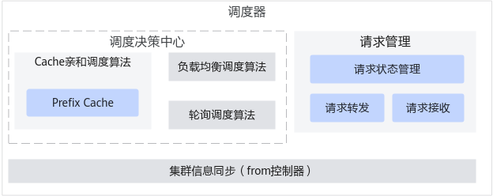

# 功能介绍

调度器（Coordinator）作为集群的数据面入口，主要提供负载均衡的调度算法和Cache亲和的调度算法。调度器（Coordinator）作为用户的推理请求入口，基于当前集群的节点现状和配置的调度算法，实现最优节点的选择、请求的监管、转发等，提升集群场景的节点资源利用率，其架构图如[图1 调度器（Coordinator）架构图](#fig589521417362)所示。

**图 1**  调度器（Coordinator）架构图<a name="fig589521417362"></a>  



# 安装部署

使用调度器（Coordinator）之前，需要完成以下环境准备。

1.  已参见[准备MindIE镜像](准备MindIE镜像.md)完成MindIE镜像制作。
2.  参见[准备TLS证书](准备TLS证书.md)提前准备好证书，将证书路径配置到[ms\_coordinator.json启动配置文件](配置说明-11.md#section122161257338)对应证书路径。
3.  参见[使用kubectl部署多机PD分离服务示例](使用kubectl部署多机PD分离服务示例.md)完成部署。


# 配置说明

**ms_coordinator.json启动配置文件**

ms\_coordinator.json启动配置文件样例如下所示，参数解释请参见[ms\_coordinator.json启动配置文件参数解释](#section1759442933513)。

```
{
    "http_config": {
        "allow_all_zero_ip_listening": false,        
        "predict_ip": "127.0.0.1",
        "predict_port": "1025",
        "manage_ip": "127.0.0.1",
        "manage_port": "1026",
        "alarm_port": "1027",
        "external_port": "1028",
        "status_port": "1029",
        "server_thread_num": 10,
        "client_thread_num": 10,
        "http_timeout_seconds": 600,
        "keep_alive_seconds": 180,
        "server_name": "MindIE-MS",
        "user_agent": "Coordinator/1.0"
    },
    "request_limit": {
        "single_node_max_requests": 1000,
        "max_requests": 10000,
        "body_limit": 10
    },
    "metrics_config": {
        "enable": false,
        "trigger_size": 100
    },
    "prometheus_metrics_config": {
        "reuse_time": 3
    },
    "exception_config": {
        "max_retry": 5,
        "schedule_timeout": 600,
        "first_token_timeout": 600,
        "infer_timeout": 600,
        "tokenizer_timeout": 300
    },
    "log_info": {
        "log_level": "INFO",
        "to_file": true,
        "to_stdout": true,
        "run_log_path": "./logs/ms_coordinator_run_log.txt",
        "operation_log_path": "./logs/ms_coordinator_operation_log.txt",
        "max_log_str_size": 4096,
        "max_log_file_size": 20,
        "max_log_file_num": 10
    },
    "digs_scheduler_config": {
        "deploy_mode": "pd_separate",
        "scheduler_type": "digs_scheduler",
        "algorithm_type": "load_balance",
        "cache_size": "100",
        "slots_thresh": "0.05",
        "block_thresh": "0.05",
        "max_schedule_count": "10000",
        "reordering_type": "1",
        "max_res_num": "5000",
        "res_limit_rate": "1.1",
        "select_type": "2",
        "load_cost_values": "1, 0",
        "load_cost_coefficient": "0, 0.22, 1024, 24, 6, 0, 1, 0, 1"
    },
    "string_token_rate": 4.02,
    "tls_config": {
        "controller_server_tls_enable": true,
        "controller_server_tls_items": {
            "ca_cert" : "./security/controller/security/certs/ca.pem",
            "tls_cert": "./security/controller/security/certs/cert.pem",
            "tls_key": "./security/controller/security/keys/cert.key.pem",
            "tls_passwd": "./security/controller/security/pass/key_pwd.txt",
            "kmcKsfMaster": "./security/controller/tools/pmt/master/ksfa",
            "kmcKsfStandby": "./security/controller/tools/pmt/standby/ksfb",
            "tls_crl": ""
        },
        "request_server_tls_enable": true,
        "request_server_tls_items": {
            "ca_cert" : "./security/request/security/certs/ca.pem",
            "tls_cert": "./security/request/security/certs/cert.pem",
            "tls_key": "./security/request/security/keys/cert.key.pem",
            "tls_passwd": "./security/request/security/pass/key_pwd.txt",
            "kmcKsfMaster": "./security/request/tools/pmt/master/ksfa",
            "kmcKsfStandby": "./security/request/tools/pmt/standby/ksfb",
            "tls_crl": ""
        },
        "mindie_client_tls_enable": true,
        "mindie_client_tls_items": {
            "ca_cert" : "./security/mindie/security/certs/ca.pem",
            "tls_cert": "./security/mindie/security/certs/cert.pem",
            "tls_key": "./security/mindie/security/keys/cert.key.pem",
            "tls_passwd": "./security/mindie/security/pass/key_pwd.txt",
            "kmcKsfMaster": "./security/mindie/tools/pmt/master/ksfa",
            "kmcKsfStandby": "./security/mindie/tools/pmt/standby/ksfb",
            "tls_crl": ""
        },
        "mindie_mangment_tls_enable": true,
        "mindie_mangment_tls_items": {
            "ca_cert" : "./security/mindie_mgmt/security/certs/ca.pem",
            "tls_cert": "./security/mindie_mgmt/security/certs/cert.pem",
            "tls_key": "./security/mindie_mgmt/security/keys/cert.key.pem",
            "tls_passwd": "./security/mindie_mgmt/security/pass/key_pwd.txt",
            "kmcKsfMaster": "./security/mindie_mgmt/tools/pmt/master/ksfa",
            "kmcKsfStandby": "./security/mindie_mgmt/tools/pmt/standby/ksfb",
            "tls_crl": ""
        },
        "external_tls_enable": true,
        "external_tls_items": {
            "ca_cert" : "./security/external/security/certs/ca.pem",
            "tls_cert": "./security/external/security/certs/cert.pem",
            "tls_key": "./security/external/security/keys/cert.key.pem",
            "tls_passwd": "./security/external/security/pass/key_pwd.txt",
            "kmcKsfMaster": "./security/external/tools/pmt/master/ksfa",
            "kmcKsfStandby": "./security/external/tools/pmt/standby/ksfb",
            "tls_crl": ""
        },
        "status_tls_enable": true,
        "status_tls_items": {
            "ca_cert" : "./security/status/security/certs/ca.pem",
            "tls_cert": "./security/status/security/certs/cert.pem",
            "tls_key": "./security/status/security/keys/cert.key.pem",
            "tls_passwd": "./security/status/security/pass/key_pwd.txt",
            "kmcKsfMaster": "./security/status/tools/pmt/master/ksfa",
            "kmcKsfStandby": "./security/status/tools/pmt/standby/ksfb",
            "tls_crl": ""
        },
        "etcd_server_tls_enable": true,
        "etcd_server_tls_items": {
            "ca_cert" : "./security/etcd_server/security/certs/ca.pem",
            "tls_cert": "./security/etcd_server/security/certs/cert.pem",
            "tls_key": "./security/etcd_server/security/keys/cert.key.pem",
            "tls_passwd": "./security/etcd_server/security/pass/key_pwd.txt",
            "kmcKsfMaster": "./security/etcd_server/tools/pmt/master/ksfa",
            "kmcKsfStandby": "./security/etcd_server/tools/pmt/standby/ksfb",
            "tls_crl": ""
        },
        "alarm_client_tls_enable": true,
        "alarm_client_tls_items": {
            "ca_cert" : "./security/alarm/security/certs/ca.pem",
            "tls_cert": "./security/alarm/security/certs/cert.pem",
            "tls_key": "./security/alarm/security/keys/cert.key.pem",
            "tls_passwd": "./security/alarm/security/pass/key_pwd.txt",
            "kmcKsfMaster": "./security/alarm/tools/pmt/master/ksfa",
            "kmcKsfStandby": "./security/alarm/tools/pmt/standby/ksfb",
            "tls_crl": ""
        }
    },
    "backup_config":{
        "database_server_dns":"etcd.default.svc.cluster.local",
        "database_server_port":2379,
        "function_enable": false
    }
}
```
<br>

**ms_coordinator.json启动配置文件参数解释**
ms\_coordinator.json配置文件中各个字段解释如[表1](#table1012322111483)所示，用户可根据具体场景进行配置。

**表 1**  ms\_coordinator.json启动配置文件参数说明

|参数名称|支持特性|取值范围|配置说明|
|--|--|--|--|
|**http_config：通信配置**|
|allow_all_zero_ip_listening|PD分离Prefix Cache（单机）|true：允许全零监管。false：禁止全零监管。|必填；默认值为false。是否允许全零监管，在取值为false状态下，如果使用全零监管将导致程序运行失败并报。全零监管会导致三面隔离失效，不满足安全配置要求，故默认禁止绑定IP地址为0.0.0.0。若仍需绑定IP地址为0.0.0.0，那么在保证安全前提下，需要将该参数设置为true。|
|predict_ip|PD分离Prefix Cache（单机）|IPv4或IPv6|必填；默认值为"127.0.0.1"用户侧接口的监管IP。|
|predict_port|PD分离Prefix Cache（单机）|[1024, 65535]|必填；默认值为"1025"。用户侧接口的监管端口。|
|manage_ip|PD分离Prefix Cache（单机）|IPv4或IPv6|必填；默认值为"127.0.0.1"。集群内通信接口的监管IP。|
|manage_port|PD分离Prefix Cache（单机）|[1024, 65535]|必填；默认值为"1026"。集群内通信接口的监管端口。|
|alarm_port|PD分离|[1024, 65535]|必填；默认值为"1027"。Coordinator上报告警至Controller端口。|
|external_port|PD分离Prefix Cache（单机）|[1024, 65535]|必填；默认值为"1028"。Coordinator的外部端口。|
|status_port|PD分离Prefix Cache（单机）|[1024, 65535]|必填；默认值为"1029"。Coordinator的状态查询端口。|
|server_thread_num|PD分离Prefix Cache（单机）|[1, 10000]|必填；默认值为10。HTTP Server线程池数量；建议不超出系统最大线程数的1/4。|
|client_thread_num|PD分离Prefix Cache（单机）|[1, 10000]|必填；默认值为10。HTTP Client线程池数量；建议不超出系统最大线程数的1/4。|
|http_timeout_seconds|PD分离Prefix Cache（单机）|[0, 3600]，单位秒。|必填；默认值为600秒。0表示立即触发超时。HTTP通信超时时间。|
|keep_alive_seconds|PD分离|[0, 3600]，单位秒。|必填；默认值为180秒。0表示关闭长链接的保活检查。长链接的保活检查时间。保活检查时间内无消息，将关闭长链接。建议用户配置该值大于0，防止调度器被Dos攻击。|
|server_name|PD分离Prefix Cache（单机）|-|必填；默认值为MindIE-MS。服务器名称。|
|user_agent|PD分离Prefix Cache（单机）|-|必填；默认值为Coordinator/1.0。软件版本号。|
|**request_limit：请求限制**|
|single_node_max_requests|PD分离Prefix Cache（单机）|[1, 2000]|必填；默认值为1000。单个Server节点可处理的最大请求数量；该参数配置的值不能超过Server能支持的最大限制。如设置环境变量MINDIE_MS_COORDINATOR_CONFIG_SINGLE_NODE_MAX_REQ，则优先读取环境变量的值。|
|max_requests|PD分离Prefix Cache（单机）|[1, 90000]|必填；默认值为10000。可处理的最大请求数量。PD分离场景：建议single_node_max_requests * P节点数量 + 1000左右余量。PD混部场景：建议single_node_max_requests * 节点数量 + 1000左右余量。如设置环境变量MINDIE_MS_COORDINATOR_CONFIG_MAX_REQ，则优先读取环境变量的值。当请求数超过该值，请求会被拒绝。调度器允许最大的外部链接数为3 * max_requests。超过链接上限后，调度器不再允许被外部连接，防止Dos攻击。|
|body_limit|PD分离Prdfix Cache（单机）|[1, 20]，单位MB。|必填；默认值为10。单条请求消息体的字节数上限。如果请求消息体大小超过该值，请求将发送失败。|
|**metrics_config：性能统计**|
|enable|PD分离Prefix Cache（单机）|true：开启。false：关闭。|必填；默认值为false。是否开启性能统计。该参数的功能为辅助定位问题，打开此功能有可能影响业务性能，建议用户在正常业务场景下关闭此功能。|
|trigger_size|PD分离Prefix Cache（单机）|[1, 10000]|必填；当enable为true时有效。默认值为100。触发性能统计的请求数。|
|**prometheus_metrics_config：服务化管控指标**|
|reuse_time|PD分离Prefix Cache（单机）|[1, 100]，单位秒。|必填；默认值为3。管控指标查询接口使用。如果距离上一轮查询时间小于reuse_time，则复用上一轮管控指标的时间；复用结果的查询不会刷新上一轮查询时间。|
|**exception_config：异常配置**|
|max_retry|PD分离Prefix Cache（单机）|[0, 10]|必填；默认值为5。通信异常最大重试次数。|
|schedule_timeout|PD分离Prefix Cache（单机）|[0, 3600]，单位秒。|必填；默认值为600；0表示关闭调度的超时检查。调度超时时间，请求在调度超时时间内没完成调度，将向用户返回错误。|
|first_token_timeout|PD分离Prefix Cache（单机）|[0, 3600]，单位秒。|必填；默认值为600；0表示关闭首token的超时检查。首token超时时间，请求在首token的超时时间内没完成首token推理，将向用户返回错误。|
|infer_timeout|PD分离Prefix Cache（单机）|[0, 65535]，单位秒。|必填；默认值为600；0表示关闭推理的超时检查。请求推理的超时时间，请求在推理的超时时间内没完成全部推理，将向用户返回错误。|
|tokenizer_timeout|PD分离|[0, 3600]，单位秒。|必填；默认值为300；0表示关闭计算token的超时检查。计算token的超时时间，请求在计算token的超时时间内没完成tokenizer任务，将向用户返回错误。|
|**log_info：日志配置**（建议使用环境变量配置日志，详情请参见日志配置）|
|log_level|PD分离Prefix Cache（单机）|CRITICALERRORWARNINFODEBUG|可选；默认值为INFO。设置日志级别。如设置环境变量MINDIE_LOG_LEVEL或MINDIEMS_LOG_LEVEL，则优先读取环境变量的值。业务性能受参数影响较大，参数配置为ERROR时性能最佳，配置为DEBUG时性能最差，两者性能相差十倍左右。|
|to_file|PD分离Prefix Cache（单机）|true：输出到文件。false：不输出到文件。|可选；默认值为true。是否输出到文件。如设置环境变量MINDIE_LOG_TO_FILE，则优先读取环境变量的值。|
|to_stdout|PD分离Prefix Cache（单机）|true：输出到标准输出流。false：不输出到标准输出流。|可选；默认值为false。是否输出到标准输出流。如设置环境变量MINDIE_LOG_TO_STDOUT，则优先读取环境变量的值。|
|run_log_path|PD分离Prefix Cache（单机）|-|可选。默认路径与MINDIE_LOG_PATH环境变量的默认路径相同，具体请参考日志配置章节。如设置环境变量MINDIE_LOG_PATH，则优先读取环境变量的值。当to_file为true时生效。运行日志路径，要求该文件所在的路径真实存在且可读，运行时会自动创建文件。|
|operation_log_path|PD分离Prefix Cache（单机）|-|可选。默认路径与MINDIE_LOG_PATH环境变量的默认路径相同，具体请参考日志配置章节。如设置环境变量MINDIE_LOG_PATH，则优先读取环境变量的值。当to_file为true时生效。审计日志路径，要求该文件所在的路径真实存在且可读，运行时会自动创建文件。|
|max_log_str_size|PD分离Prefix Cache（单机）|[128, 65535]|可选；默认值为4096。单条日志最大长度。|
|max_log_file_size|PD分离Prefix Cache（单机）|[1, 500]，单位MB。|可选；默认值为20。单个日志文件存储上限。如设置环境变量MINDIE_LOG_ROTATE，则优先读取环境变量的值。|
|max_log_file_num|PD分离Prefix Cache（单机）|[1, 64]|可选；默认值为10。最大日志文件存储数量。如设置环境变量MINDIE_LOG_ROTATE，则优先读取环境变量的值。|
|**digs_scheduler_config：调度器配置**|
|deploy_mode|PD分离Prefix Cache（单机）|PD分离：pd_separate或pd_disaggregation：多机PD分离模式部署；pd_disaggregation_single_container：单机PD分离部署；Prefix Cache（单机）single_node：单机部署模式。|必填；默认值为"pd_separate"。部署模式。|
|scheduler_type|PD分离Prefix Cache（单机）|PD分离：digs_scheduler：digs调度器；Prefix Cache（单机）default_scheduler：默认调度器。|必填；默认值为"digs_scheduler"。调度器类型。deploy_mode为"pd_separate"时，此值必须为"digs_scheduler";deploy_mode为"single_node"时，此值必须为"default_scheduler"。|
|algorithm_type|PD分离Prefix Cache（单机）|PD分离：load_balance：负载均衡；推理请求调度分配给资源较多的实例。Prefix Cache（单机）cache_affinity：Cache亲和算法；OpenAI多轮会话场景下，推理请求调度给处理过历史轮次会话的实例。|必填；默认值为"load_balance"。调度算法。scheduler_type为"digs_scheduler"时，此值必须为"load_balance"；scheduler_type为"default_scheduler"时，此值必须为"cache_affinity"。|
|cache_size|Prefix Cache（单机）|["1", "10000"]|algorithm_type为"cache_affinity"时必填；默认值为"100"。Cache缓存上限。（仅支持Prefix Cache算法）|
|slots_thresh|Prefix Cache（单机）|["0.0", "1.0"]|algorithm_type为"cache_affinity"时必填；默认值为"0.05"。可用slot占总slot的比例，slots资源预警线。（仅支持Prefix Cache算法）|
|block_thresh|Prefix Cache（单机）|["0.0", "1.0"]|algorithm_type为"cache_affinity"时必填；默认值为"0.05"。可用block占总block的比例，block资源预警线。 （仅支持Prefix Cache算法）|
|max_schedule_count|PD分离|["1", "90000"]|scheduler_type为"digs_scheduler"时必填；默认值为"10000"。可以同时调度的最大请求数量，建议与max_requests保持一致。（仅支持PD分离负载均衡算法）|
|reordering_type|PD分离|"1"：fcfs，先到先调度；"2"：sjf，短序列先调度；"3"：ljf，长序列先调度。|scheduler_type为"digs_scheduler"时必填；默认值为"1"。|
|max_res_num|PD分离|["1", "10000"]|scheduler_type为"digs_scheduler"时必填；默认值为"5000"。调度器可注册的最大节点数量。|
|res_limit_rate|PD分离|[0.0, 2000.0]|当"select_type"取值为"2"时，该参数才生效，表示请求占用资源总数/实际总资源比值上限。|
|select_type|PD分离|"1"：简单负载均衡，无上限控制。"2"：带有资源上限控制的负载均衡。|表示具体使用的资源调度策略，默认值为"2"。|
|load_cost_values|PD分离|"1, 0"：表示每个请求的slots资源需求是1，blocks资源需求根据实际情况决定。"1, 1"：表示每个请求blocks的资源需求固定为1。|选填；默认值为"1, 0"。表示请求的资源，有slots和blocks连个维度资源。当配置为"1, 0"时，为正常负载均衡调度策略配置。当配置为"1, 1"时，忽视请求在blocks维度的资源差异，调度策略退化为轮循。|
|load_cost_coefficient|PD分离|从前往后值的含义以及取值范围（取值范围仅供参考，其上限可根据实际情况调整）如下所示：AICore感知的序列长度汇总的系数：[0, 1000]请求输入长度的系数：[0, 1000]请求固定输出长度：[0, 100MB]AICore核数：[1, 1000]AICore分组后每组的核数：[1, 1000]maxBatchSize的系数：[0, 1000]实际上报序列长度汇总的系数：[0, 1000]slots汇总的系数：[0, 1000]blocks汇总的系数：[0, 1000]|选填；默认值为"0, 0.22, 1024, 24, 6, 0, 1, 0, 1"。表示负载均衡调度策略公式中各参数或系数的自定义配置。|
|string_token_rate|PD分离|[1.0, 100.0]|表示从输入字符串转换成token数量的比例。|
|**tls_config：证书配置**|
|**调度器（Coordinator）的管理端口通信证书配置**|
|controller_server_tls_enable|PD分离Prefix Cache（单机）|与Coordinator管理端口的通信，是否开启tls校验。建议用户打开，确保控制器（Controller）或用户与管理端口通信安全。如果关闭则存在较高的网络安全风险。|必填；默认值为true。|
|ca_cert|PD分离Prefix Cache（单机）|ca根证书路径。|开启tls校验时必填。|
|tls_cert|PD分离Prefix Cache（单机）|tls证书路径。|开启tls校验时必填。|
|tls_key|PD分离Prefix Cache（单机）|经口令加密的tls私钥证书路径。|开启tls校验时必填。|
|tls_passwd|PD分离Prefix Cache（单机）|加密tls私钥证书的口令，经KMC加密后，写入的密文路径。|开启tls校验时必填。|
|kmcKsfMaster|PD分离Prefix Cache（单机）|KMC加密的根密钥路径。|开启tls校验时必填。|
|kmcKsfStandby|PD分离Prefix Cache（单机）|KMC加密的工作密钥路径。|开启tls校验时必填。|
|tls_crl|PD分离Prefix Cache（单机）|吊销的证书列表路径。|开启tls校验时必填。证书吊销列表CRL文件路径，要求该文件真实存在且可读。如为空，则不进行吊销校验。|
|**调度器（Coordinator）的数据端口与用户的通信证书配置**|
|request_server_tls_enable|PD分离Prefix Cache（单机）|接受推理请求的输入，通信是否开启tls校验。建议用户打开，确保与推理用户的通信安全。如果关闭则存在较高的网络安全风险。|必填；默认值为true。|
|ca_cert|PD分离Prefix Cache（单机）|ca根证书路径。|开启tls校验时必填。|
|tls_cert|PD分离Prefix Cache（单机）|tls证书路径。|开启tls校验时必填。|
|tls_key|PD分离Prefix Cache（单机）|经口令加密的tls私钥证书路径。|开启tls校验时必填。|
|tls_passwd|PD分离Prefix Cache（单机）|加密tls私钥证书的口令，经KMC加密后，写入的密文路径。|开启tls校验时必填。|
|kmcKsfMaster|PD分离Prefix Cache（单机）|KMC加密的根密钥路径。|开启tls校验时必填。|
|kmcKsfStandby|PD分离Prefix Cache（单机）|KMC加密的工作密钥路径。|开启tls校验时必填。|
|tls_crl|PD分离Prefix Cache（单机）|吊销的证书列表路径。|开启tls校验时必填。证书吊销列表CRL文件路径，要求该文件真实存在且可读。如为空，则不进行吊销校验。|
|**调度器（Coordinator）与Server数据端口的通信证书配置**|
|mindie_client_tls_enable|PD分离Prefix Cache（单机）|与Server的通信，是否开启tls校验。建议用户打开，确保与Server的通信安全。如果关闭则存在较高的网络安全风险。|必填；默认值为true。|
|ca_cert|PD分离Prefix Cache（单机）|ca根证书路径。|开启tls校验时必填。|
|tls_cert|PD分离Prefix Cache（单机）|tls证书路径。|开启tls校验时必填。|
|tls_key|PD分离Prefix Cache（单机）|经口令加密的tls私钥证书路径。|开启tls校验时必填。|
|tls_passwd|PD分离Prefix Cache（单机）|加密tls私钥证书的口令，经KMC加密后，写入的密文路径。|开启tls校验时必填。|
|kmcKsfMaster|PD分离Prefix Cache（单机）|KMC加密的根密钥路径。|开启tls校验时必填。|
|kmcKsfStandby|PD分离Prefix Cache（单机）|KMC加密的工作密钥路径。|开启tls校验时必填。|
|tls_crl|PD分离Prefix Cache（单机）|吊销的证书列表路径。|开启tls校验时必填。证书吊销列表CRL文件路径，要求该文件真实存在且可读。如为空，则不进行吊销校验。|
|**调度器（Coordinator）与Server管理端口的通信证书配置**|
|mindie_mangment_tls_enable|PD分离Prefix Cache（单机）|接受用户查询服务化管控指标的通信，是否开启tls校验。建议用户打开，确保与管控指标用户的通信安全。如果关闭则存在较高的网络安全风险。|必填；默认值为true。|
|ca_cert|PD分离Prefix Cache（单机）|ca根证书路径。|开启tls校验时必填。|
|tls_cert|PD分离Prefix Cache（单机）|tls证书路径。|开启tls校验时必填。|
|tls_key|PD分离Prefix Cache（单机）|经口令加密的tls私钥证书路径。|开启tls校验时必填。|
|tls_passwd|PD分离Prefix Cache（单机）|加密tls私钥证书的口令，经KMC加密后，写入的密文路径。|开启tls校验时必填。|
|kmcKsfMaster|PD分离Prefix Cache（单机）|KMC加密的根密钥路径。|开启tls校验时必填。|
|kmcKsfStandby|PD分离Prefix Cache（单机）|KMC加密的工作密钥路径。|开启tls校验时必填。|
|tls_crl|PD分离Prefix Cache（单机）|吊销的证书列表路径。|开启tls校验时必填。证书吊销列表CRL文件路径，要求该文件真实存在且可读。如为空，则不进行吊销校验。|
|**用户查询调度器（Coordinator）信息的通信证书配置**|
|external_tls_enable|PD分离Prefix Cache（单机）|接受用户查询的通信，是否开启tls校验。建议用户打开，确保与Coordinator的通信安全。如果关闭则存在较高的网络安全风险。|必填；默认值为true。|
|ca_cert|PD分离Prefix Cache（单机）|ca根证书路径。|开启tls校验时必填。|
|tls_cert|PD分离Prefix Cache（单机）|tls证书路径。|开启tls校验时必填。|
|tls_key|PD分离Prefix Cache（单机）|经口令加密的tls私钥证书路径。|开启tls校验时必填。|
|tls_passwd|PD分离Prefix Cache（单机）|加密tls私钥证书的口令，经KMC加密后，写入的密文路径。|开启tls校验时必填。|
|kmcKsfMaster|PD分离Prefix Cache（单机）|KMC加密的根密钥路径。|开启tls校验时必填。|
|kmcKsfStandby|PD分离Prefix Cache（单机）|KMC加密的工作密钥路径。|开启tls校验时必填。|
|tls_crl|PD分离Prefix Cache（单机）|吊销的证书列表路径。|开启tls校验时必填。证书吊销列表CRL文件路径，要求该文件真实存在且可读。如为空，则不进行吊销校验。|
|**查询调度器（Coordinator）状态信息的通信证书配置**|
|status_tls_enable|PD分离Prefix Cache（单机）|查询Coordinator的状态，是否开启tls校验。建议用户打开，确保与Coordinator的通信安全。如果关闭则存在较高的网络安全风险。|必填；默认值为true。|
|ca_cert|PD分离Prefix Cache（单机）|ca根证书路径。|开启tls校验时必填。|
|tls_cert|PD分离Prefix Cache（单机）|tls证书路径。|开启tls校验时必填。|
|tls_key|PD分离Prefix Cache（单机）|经口令加密的tls私钥证书路径。|开启tls校验时必填。|
|tls_passwd|PD分离Prefix Cache（单机）|加密tls私钥证书的口令，经KMC加密后，写入的密文路径。|开启tls校验时必填。|
|kmcKsfMaster|PD分离Prefix Cache（单机）|KMC加密的根密钥路径。|开启tls校验时必填。|
|kmcKsfStandby|PD分离Prefix Cache（单机）|KMC加密的工作密钥路径。|开启tls校验时必填。|
|tls_crl|PD分离Prefix Cache（单机）|吊销的证书列表路径。|开启tls校验时必填。证书吊销列表CRL文件路径，要求该文件真实存在且可读。如为空，则不进行吊销校验。|
|**查询分布式存储系统（ETCD）状态信息的通信证书配置**|
|etcd_server_tls_enable|PD分离|查询ETCD的状态，是否开启tls校验。建议用户打开，确保与etcd的通信安全。如果关闭则存在较高的网络安全风险。|必填；默认值为true。|
|ca_cert|PD分离|ca根证书路径。|开启tls校验时必填。|
|tls_cert|PD分离|tls证书路径。|开启tls校验时必填。|
|tls_key|PD分离|经口令加密的tls私钥证书路径。|开启tls校验时必填。|
|tls_passwd|PD分离|加密tls私钥证书的口令，经KMC加密后，写入的密文路径。|开启tls校验时必填。|
|kmcKsfMaster|PD分离|KMC加密的根密钥路径。|开启tls校验时必填。|
|kmcKsfStandby|PD分离|KMC加密的工作密钥路径。|开启tls校验时必填。|
|tls_crl|PD分离|吊销的证书列表路径。|开启tls校验时必填。证书吊销列表CRL文件路径，要求该文件真实存在且可读。如为空，则不进行吊销校验。|
|**调度器（Coordinator）上报告警至Controller端口的通信证书配置**|
|alarm_client_tls_enable|PD分离|Coordinator上报告警至Controller的通信，是否开启tls校验。建议用户打开，确保与Controller的通信安全。如果关闭则存在较高的网络安全风险。|必填；默认值为true。|
|ca_cert|PD分离|ca根证书路径。|开启tls校验时必填。|
|tls_cert|PD分离|tls证书路径。|开启tls校验时必填。|
|tls_key|PD分离|经口令加密的tls私钥证书路径。|开启tls校验时必填。|
|tls_passwd|PD分离|加密tls私钥证书的口令，经KMC加密后，写入的密文路径。|开启tls校验时必填。|
|kmcKsfMaster|PD分离|KMC加密的根密钥路径。|开启tls校验时必填。|
|kmcKsfStandby|PD分离|KMC加密的工作密钥路径。|开启tls校验时必填。|
|tls_crl|PD分离|吊销的证书列表路径。|开启tls校验时必填。证书吊销列表CRL文件路径，要求该文件真实存在且可读。如为空，则不进行吊销校验。|
|**backup_config：控制开启Coordinator主备倒换**|
|database_server_dns|PD分离|ETCD Service的域名。|开启主备倒换后必填；默认值为etcd.default.svc.cluster.local（表示部署在default命名空间下的ETCD服务）。|
|database_server_port|PD分离|ETCD Service的端口。|开启主备倒换后必填；默认值为2379。|
|function_enable|PD分离|true：开启Coordinator主备倒换。false：关闭Coordinator主备倒换。|选填；默认值为false。表示是否开启Coordinator主备倒换。|


>[!NOTE]说明
>如果推理服务所在的计算节点的网络为跨公网和局域网，绑定0.0.0.0的IP地址可能导致网络隔离失效，存在较大安全风险。故该场景下默认禁止EndPoint的IP地址绑定为0.0.0.0。若用户仍需要使用0.0.0.0，请在环境具备全零监管防护能力的前提下，通过设置配置项“allow\_all\_zero\_ip\_listening“为true手动打开允许配置0.0.0.0的IP地址开关，启用全零监管的安全风险由用户自行承担。

<br>

**环境变量**

当前调度器（Coordinator）支持的环境变量如下所示。

**表 2**  Coordinator支持的环境变量

|环境变量名称|含义|
|--|--|
|MINDIE_MS_COORDINATOR_CONFIG_FILE_PATH|ms_coordinator配置文件的读取路径。|
|MINDIE_MS_COORDINATOR_CONFIG_SINGLE_NODE_MAX_REQ|单个节点可处理的最大请求数量。|
|MINDIE_MS_COORDINATOR_CONFIG_MAX_REQ|可处理的最大请求数量。|
|MINDIE_CHECK_INPUTFILES_PERMISSION|用户可设置是否需要检查外部挂载文件，具体包括ms_coordinator.json以及证书相关文件。默认值为空，表示需要做权限校验。0：对外部挂载文件不做权限校验。非0：对外部挂载文件做权限校验。当用户使用MINDIE_MS_COORDINATOR_CONFIG_FILE_PATH设置配置文件路径时，ms_coordinator.json为外部挂载文件。|
|HSECEASY_PATH|默认值为空。设置KMC解密工具的依赖库路径。开启tls校验时必须设置。|
|**注：日志相关环境变量详情请参见。**|


# 启动调度器

调度器的执行程序为ms\_coordinator，其存放路径为：_\{MindIE安装目录\}_/latest/mindie-service/bin/，启动ms\_coordinator时需要读取[ms\_coordinator.json启动配置文件](配置说明-11.md)中的配置信息，且运行ms\_coordinator时需要依赖_\{MindIE安装目录\}_/latest/mindie-service/lib/目录下的so文件，包括libboundscheck.so、libcrypto.so.3、libhse\_cryption.so、libssl.so.3和libmie\_digs.so文件。

**前提条件**

启动ms\_coordinator需提前配置好以下环境变量。

-   设置链接库的路径：

    ```
    export LD_LIBRARY_PATH=$LD_LIBRARY_PATH:${MindIE安装目录}/latest/mindie-service/lib
    ```

-   设置KMC解密工具的依赖库路径：

    ```
    export HSECEASY_PATH=${MindIE安装目录}/latest/mindie-service/lib
    ```

-   设置ms\_coordinator.json配置文件的路径：

    ```
    export MINDIE_MS_COORDINATOR_CONFIG_FILE_PATH=${MindIE安装目录}/latest/mindie-service/conf/ms_coordinator.json
    ```
<br>

**启动命令**

ms\_coordinator有两种启动方式，且命令必须在_\{MindIE安装目录\}_/latest/mindie-service/bin/目录中执行。

-   方式一：直接启动

    ```
    ./ms_coordinator
    ```

-   方式二：带参数启动

    ```
    ./ms_coordinator {predict_ip} {predict_port} {manage_ip} {manage_port}
    ```

    参数解释：

    -   _\{predict\_ip\}_：如果配置，则将取代ms\_coordinator.json启动配置文件中的predict\_ip参数；
    -   _\{predict\_port\}_：如果配置，则将取代ms\_coordinator.json启动配置文件中的predict\_port参数;
    -   _\{manage\_ip\}_：如果配置，则将取代ms\_coordinator.json启动配置文件中的manage\_ip参数；
    -   _\{manage\_port\}_：如果配置，则将取代ms\_coordinator.json启动配置文件中的manage\_port参数。

# 停止调度器

两种停止调度器的方式如下所示。

-   方式一（推荐）：使用后台进程方式启动服务。
    -   使用kill命令停止进程。

        ```
        kill {ms_coordinator 进程ID}
        ```

        >[!NOTE]说明
        >Linux系统中查询ms\_coordinator主进程ID：
        >1.  查看所有与ms\_coordinator相关的进程列表。
        >    ```
        >    ps -ef | grep ms_coordinator
        >    ```
        >2.  在输出结果中找到PID列，PID即为ms\_coordinator的主进程ID。

    -   或使用pkill命令停止进程。

        ```
        pkill -9 ms_coordinator
        ```

-   方式二：以直接启动进程方式启动服务，可以通过直接按ctrl+c停止服务。

# Coordinator准备倒换

## 特性介绍

本特性通过ETCD分布式锁机制实现Kubernetes集群中Coordinator的主备倒换功能，确保系统高可用性。开启使用Coordinator主备倒换特性开关时，初始化时拉起两个Coordinator，通过ETCD分布式锁竞争来实现主备身份确认，当主Coordinator发生故障时，备用Coordinator能在一定时间间隔后自动接管工作。**该特性只支持在大规模专家并行场景下使用**。

## 使用样例

**限制与约束**

-   主、备Coordinator节点不支持部署在同一台节点上。
-   ETCD服务端需要使用v3.6版本。
-   特性生效依赖ETCD服务端正确部署，服务端需要3个副本，以保证ETCD集群的可靠性。
-   如果已经部署Controller主备倒换，则可以与Controller共用一套ETCD集群，跳过生成ETCD安全证书和部署ETCD服务端操作步骤，直接参考[配置并启动MindIE](#section188811656111116)部署Coordinator主备倒换。

**生成ETCD安全证书**

Coordinator主备依赖ETCD分布式锁功能，涉及集群内不同POD间通信，建议使用CA证书做双向认证，证书配置请参考如下步骤：

>[!NOTE]说明
>如果不使用CA证书做双向认证加密通信，则服务间将进行明文传输，可能会存在较高的网络安全风险。

1.  请用户自行准备证书生成的相关前置文件，文件放置目录以/home/_\{用户名\}_/auto\_gen\_ms\_cert为例。
    -   server.cnf

        ```
        [req] # 主要请求内容
        req_extensions = v3_req
        distinguished_name = req_distinguished_name
        
        [req_distinguished_name] # 证书主体信息
        countryName = CN
        stateOrProvinceName = State
        localityName = City
        organizationName = Organization
        organizationalUnitName = Unit
        commonName = etcd-server
        
        [v3_req] # 核心属性
        basicConstraints = CA:FALSE
        keyUsage = digitalSignature, keyEncipherment
        extendedKeyUsage = serverAuth, clientAuth
        subjectAltName = @alt_names
        
        [alt_names] # 服务标识
        DNS.1 = etcd
        DNS.2 = etcd.default
        DNS.3 = etcd.default.svc
        DNS.4 = etcd.default.svc.cluster.local
        DNS.5 = etcd-0.etcd
        DNS.6 = etcd-0.etcd.default.svc.cluster.local
        DNS.7 = etcd-1.etcd
        DNS.8 = etcd-1.etcd.default.svc.cluster.local
        DNS.9 = etcd-2.etcd
        DNS.10 = etcd-2.etcd.default.svc.cluster.local
        ```

    -   client.cnf

        ```
        [req] # 主要请求内容
        req_extensions = v3_req
        distinguished_name = req_distinguished_name
        
        [req_distinguished_name] # 证书主体信息
        countryName = CN
        stateOrProvinceName = State
        localityName = City
        organizationName = Organization
        organizationalUnitName = Unit
        commonName = etcd-client
        
        [v3_req] # 核心属性
        basicConstraints = CA:FALSE
        keyUsage = digitalSignature, keyEncipherment
        extendedKeyUsage = clientAuth
        subjectAltName = @alt_names
        
        [alt_names] # 服务标识
        DNS.1 = mindie-service-controller
        DNS.2 = mindie-service-coordinator
        ```

    -   crl.conf

        ```
        # OpenSSL configuration for CRL generation
        #
        ####################################################################
        [ ca ] # CA框架声明，指示OpenSSL使用哪个预定义的CA配置块作为默认设置
        default_ca = CA_default # The default ca section
        ####################################################################
        [ CA_default ] # 核心CA设置，所有关键路径、文件和默认操作
        dir             = {dir}  # 添加此根目录定义
        database        = $dir/index.txt
        crlnumber       = $dir/pulp_crl_number
        new_certs_dir   = $dir/newcerts
        certificate     = $dir/ca.pem
        private_key     = $dir/ca.key
        serial          = $dir/serial
        database = /home/{用户名}/auto_gen_ms_cert/etcdca4/index.txt
        crlnumber = /home/{用户名}/auto_gen_ms_cert/etcdca4/pulp_crl_number
        
        
        default_days = 365 # how long to certify for
        default_crl_days= 365 # how long before next CRL
        default_md = default # use public key default MD
        preserve = no # keep passed DN ordering
        
        ####################################################################
        [ crl_ext ] # CRL扩展属性
        # CRL extensions.
        # Only issuerAltName and authorityKeyIdentifier make any sense in a CRL.
        # issuerAltName=issuer:copy
        authorityKeyIdentifier=keyid:always,issuer:always
        ```

        >[!NOTE]说明
        >文件中_\{dir\}_路径建议为各节点都能访问的共享目录。

    -   gen\_etcd\_ca.sh

        ```
        ```bash
        #!/bin/bash
        # 1. 创建所需文件和目录
        mkdir -p /home/{用户名}/auto_gen_ms_cert/etcdca4/newcerts
        touch /home/{用户名}/auto_gen_ms_cert/etcdca4/index.txt
        echo 1000 > /home/{用户名}/auto_gen_ms_cert/etcdca4/pulp_crl_number
        echo "01" > /home/{用户名}/auto_gen_ms_cert/etcdca4/serial
        
        # 2. 设置权限
        chmod 700 /home/{用户名}/auto_gen_ms_cert/etcdca4/newcerts
        chmod 600 /home/{用户名}/auto_gen_ms_cert/etcdca4/{index.txt,pulp_crl_number,serial}
        
        # 3. 创建CA证书
        openssl genrsa -out ca.key 2048
        openssl req -x509 -new -nodes -key ca.key \
        -subj "/CN=my-cluster-ca" \
        -days 3650 -out ca.pem
        
        # 4. 生成服务端证书
        openssl genrsa -out server.key 2048
        openssl req -new -key server.key -out server.csr \
        -subj "/CN=etcd-server" -config server.cnf
        openssl x509 -req -in server.csr -CA ca.pem -CAkey ca.key -CAcreateserial \
        -out server.pem -days 3650 -extensions v3_req -extfile server.cnf
        
        #5. 吊销列表
        openssl ca -passin pass:{password} -revoke server.pem -keyfile ca.key -cert ca.pem -config crl.conf
        openssl ca -passin pass:{password}  -gencrl -keyfile ca.key -cert ca.pem -out server_crl.pem -config crl.conf
        
        # 6. 生成客户端证书
        openssl genrsa -out client.key 2048
        openssl req -new -key client.key -out client.csr \
        -subj "/CN=etcd-client" -config client.cnf
        openssl x509 -req -in client.csr -CA ca.pem -CAkey ca.key -CAcreateserial \
        -out client.pem -days 3650 -extensions v3_req -extfile client.cnf
        
        # 7. 加密公钥 (使用 KMC)
        # 以kmc_encrypt加密工具为例，并自行配置{password}
        kmc_encrypt -in client.key -out client.key.enc -key_id {password}
        
        # 8. 设置权限
        chmod 0400 ./*.key
        chmod 0400 ./*.pem
        

2.  创建crl.conf所需文件和目录。

    ```
    touch index.txt
    touch pulp_crl_number
    mkdir newcerts
    ```

3.  执行以下命令运行gen\_etcd\_ca.sh，生成服务端证书、客户端证书、吊销列表等文件。

    ```
    bash gen_etcd_ca.sh
    ```

    回显类似如下内容表示生成成功：

    ```
    Generating RSA private key, 2048 bit long modulus (2 primes)
    .................+++++
    ............................................................................................................................................................................................................................................................................................................................................................................................................+++++
    e is 65537 (0x010001)
    Generating RSA private key, 2048 bit long modulus (2 primes)
    ..............................................+++++
    ...................................+++++
    e is 65537 (0x010001)
    Signature ok
    subject=CN = etcd-server
    Getting CA Private Key
    Using configuration from crl.conf
    Adding Entry with serial number 3D619FEFB51EEA23F8707008E3C8FACFC8D45547 to DB for /CN=etcd-server
    Revoking Certificate 3D619FEFB51EEA23F8707008E3C8FACFC8D45547.
    Data Base Updated
    Using configuration from crl.conf
    Generating RSA private key, 2048 bit long modulus (2 primes)
    .........................................................+++++
    ...........+++++
    e is 65537 (0x010001)
    Signature ok
    subject=CN = etcd-client
    Getting CA Private Key
    ```
    运行完成后，在当前目录生成以下文件或目录：

    ```
    ca.key
    ca.pem
    ca.srl
    client.cnf
    client.csr
    client_encrypted.key
    client.key
    client.pem
    crl.conf
    gen_etcd_ca.sh
    index.txt
    index.txt.attr
    index.txt.attr.old
    index.txt.old
    key_pwd.txt
    newcerts
    pulp_crl_number
    pulp_crl_number.old
    serial
    server.cnf
    server_crl.pem
    server.csr
    server.key
    server.pem
    ```

**部署ETCD服务端**

1.  使用以下命令加载ETCD镜像。

    ```
    docker pull quay.io/coreos/etcd:v3.6.0-rc.4
    ```

    >[!NOTE]说明
    >-   如果docker pull失败，可以用podman命令下载ETCD镜像后保存，再使用docker load命令导入，命令如下：
    >    ```
    >    apt install podman
    >    podman pull quay.io/coreos/etcd:v3.6.0-rc.4
    >    ```
    >-   需要在三个节点上加载此镜像。

2.  在集群中创建ETCD资源。
    1.  使用以下命令自行创建local-pvs.yaml文件。

        ```
        vim local-pvs.yaml
        ```

        在文件中写入以下内容：

        ```
        # local-pvs.yaml 创建PV
        apiVersion: v1
        kind: PersistentVolume
        metadata:
          name: etcd-data-0  # 必须与StatefulSet的PVC命名规则匹配
        spec:
          capacity:
            storage: 4096M
          volumeMode: Filesystem
          accessModes: [ReadWriteOnce]
          persistentVolumeReclaimPolicy: Retain
          storageClassName: local-storage  # 必须与PVC的storageClass匹配
          local:
            path: /mnt/data/etcd-0  # 节点上的实际路径
          nodeAffinity:
            required:
              nodeSelectorTerms:
                - matchExpressions:
                    - key: kubernetes.io/hostname
                      operator: In
                      values: ["ubuntu"]  # 绑定到特定节点
        
        ---
        apiVersion: v1
        kind: PersistentVolume
        metadata:
          name: etcd-data-1
        spec:
          capacity:
            storage: 4096M
          accessModes: [ReadWriteOnce]
          persistentVolumeReclaimPolicy: Retain
          storageClassName: local-storage
          local:
            path: /mnt/data/etcd-1
          nodeAffinity:
            required:
              nodeSelectorTerms:
                - matchExpressions:
                    - key: kubernetes.io/hostname
                      operator: In
                      values: ["worker-80-39"]
        
        ---
        apiVersion: v1
        kind: PersistentVolume
        metadata:
          name: etcd-data-2
        spec:
          capacity:
            storage: 4096M
          accessModes: [ReadWriteOnce]
          persistentVolumeReclaimPolicy: Retain
          storageClassName: local-storage
          local:
            path: /mnt/data/etcd-2
          nodeAffinity:
            required:
              nodeSelectorTerms:
                - matchExpressions:
                    - key: kubernetes.io/hostname
                      operator: In
                      values: ["worker-153"]
        ```

        关键参数如下所示：

        -   path：对应节点的路径，必须真实且存在。
        -   values：待部署的节点名称。

    2.  在K8s集群的master节点执行以下命令。

        ```
        kubectl apply -f  local-pvs.yaml
        ```

        返回结果如下所示表示创建成功：

        ```
        persistentvolume/etcd data-0 created
        persistentvolume/etcd-data-1 created
        persistentvolume/etcd-data-2 created
        ```

    3.  使用以下命令在3个节点上打上app=etcd标签。

        ```
        kubectl label nodes <节点名> app=etcd
        ```

    4.  使用以下命令自行创建etcd.yaml文件，配置ETCD Pod侧证书。

        ```
        vim etcd.yaml
        ```

        根据[3](使用样例.md#li4951978014)生成的相关证书文件，将文件生成路径挂载至ETCD容器内，并配置ETCD使用加密通信，指定使用ca.pem、server.pem和server.key进行通信，关键配置信息如以下加粗内容。

        ```
        # etcd.yaml 在3个节点上创建同步的ETCD数据库
        ---
        apiVersion: v1
        kind: Service
        metadata:
          name: etcd
          namespace: default
        spec:
          type: ClusterIP
          clusterIP: None # Headless Service，用于StatefulSet的DNS解析
          selector:
            app: etcd  # 选择标签为app=etcd的Pod
          publishNotReadyAddresses: true  # 允许未就绪Pod被DNS发现
          ports:
            - name: etcd-client
              port: 2379 # 客户端通信端口
            - name: etcd-server
              port: 2380 # 节点间通信端口
            - name: etcd-metrics
              port: 8080 # etcd 集群管控端口
        ---
        apiVersion: apps/v1
        kind: StatefulSet
        metadata:
          name: etcd
          namespace: default
        spec:
          serviceName: etcd # 绑定 Headless Service
          replicas: 3 # 奇数节点保证Raft
          podManagementPolicy: OrderedReady # 允许并行启动（需配合初始化脚本）
          updateStrategy:
            type: RollingUpdate # 滚动更新策略
          selector:
            matchLabels:
              app: etcd # 匹配 Pod 标签
          template:
            metadata:
              labels:
                app: etcd # Pod 标签
              annotations:
                serviceName: etcd
            spec:
              affinity:
                podAntiAffinity:
                  requiredDuringSchedulingIgnoredDuringExecution:
                    - labelSelector:
                        matchExpressions:
                          - key: app
                            operator: In
                            values: [etcd]
                      topologyKey: "kubernetes.io/hostname" # 跨节点部署
              containers:
                - name: etcd
                  image: k8s.gcr.io/etcd:3.4.13-0
                  imagePullPolicy: IfNotPresent
                  ports:
                    - name: etcd-client
                      containerPort: 2379
                    - name: etcd-server
                      containerPort: 2380
                    - name: etcd-metrics
                      containerPort: 8080
        #          readinessProbe:
        #            httpGet:
        #              path: /readyz
        #              port: 8080
        #            initialDelaySeconds: 10
        #            periodSeconds: 5
        #            timeoutSeconds: 5
        #            successThreshold: 1
        #            failureThreshold: 30
        #          livenessProbe:
        #            httpGet:
        #              path: /livez
        #              port: 8080
        #            initialDelaySeconds: 15
        #            periodSeconds: 10
        #            timeoutSeconds: 5
        #            failureThreshold: 3
                  env:
                    - name: MY_POD_IP
                      valueFrom:
                        fieldRef:
                          fieldPath: status.podIP
                    - name: K8S_NAMESPACE
                      valueFrom:
                        fieldRef:
                          fieldPath: metadata.namespace
                    - name: HOSTNAME
                      valueFrom:
                        fieldRef:
                          fieldPath: metadata.name
                    - name: SERVICE_NAME
                      valueFrom:
                        fieldRef:
                          fieldPath: metadata.annotations['serviceName']
                    - name: ETCDCTL_ENDPOINTS
                      value: "$(HOSTNAME).$(SERVICE_NAME):2379"
                    - name: URI_SCHEME
                      value: "https"
                  command:
                    - /usr/local/bin/etcd
                  args:
                    - --log-level=debug
                    - --name=$(HOSTNAME) # 节点唯一标识
                    - --data-dir=/data # 数据存储路径
                    - --wal-dir=/data/wal
                    - --listen-peer-urls=https://$(MY_POD_IP):2380 # 监管节点间通信
                    - --listen-client-urls=https://$(MY_POD_IP):2379 # 监管客户端请求
                    - --advertise-client-urls=https://$(HOSTNAME).$(SERVICE_NAME):2379  # 客户端地址
                    - --initial-cluster-state=new # 新集群初始化模式
                    - --initial-cluster-token=etcd-$(K8S_NAMESPACE) # 集群唯一标识
                    - --initial-cluster=etcd-0=https://etcd-0.etcd:2380,etcd-1=https://etcd-1.etcd:2380,etcd-2=https://etcd-2.etcd:2380 # 初始节点列表
                    - --initial-advertise-peer-urls=https://$(HOSTNAME).$(SERVICE_NAME):2380 # 对外公布的节点间通信地址
                    - --listen-metrics-urls=http://$(MY_POD_IP):8080 # 集群管控地址
                    - --quota-backend-bytes=8589934592
                    - --auto-compaction-retention=5m
                    - --auto-compaction-mode=revision
                    - --client-cert-auth
                    - --cert-file=/etc/ssl/certs/etcdca/server.pem
                    - --key-file=/etc/ssl/certs/etcdca/server.key
                    - --trusted-ca-file=/etc/ssl/certs/etcdca/ca.pem
                    - --peer-client-cert-auth
                    - --peer-trusted-ca-file=/etc/ssl/certs/etcdca/ca.pem
                    - --peer-cert-file=/etc/ssl/certs/etcdca/server.pem
                    - --peer-key-file=/etc/ssl/certs/etcdca/server.key
                  volumeMounts:
                    - name: etcd-data
                      mountPath: /data # 挂载持久化存储
                    - name: etcd-ca
                      mountPath: /etc/ssl/certs/etcdca # 物理机/home/{用户名}/auto_gen_ms_cert目录在容器中的挂载路径
              volumes:
                - name: crt
                  hostPath:
                    path: /usr/local/Ascend/driver
                - name: etcd-ca
                  hostPath:
                    path: /home/{用户名}/auto_gen_ms_cert # 物理机创建文件及生成文件路径
                    type: Directory
          volumeClaimTemplates:
            - metadata:
                name: etcd-data
              spec:
                accessModes: [ "ReadWriteOnce" ] # 单节点读写
                storageClassName: local-storage
                resources:
                  requests:
                    storage: 4096M # 存储空间
        ```

    5.  在K8s集群master节点执行如下命令。

        ```
        kubectl apply -f etcd.yaml
        ```

        返回结果如下所示表示创建成功：

        ```
        service/etcd created
        statefulset.apps/etcd created
        ```

    6.  执行以下命令查询ETCD集群的Pod。

        ```
        kubectl get pod -A
        ```

        回显如下所示：

        ```
        NAMESPACE	NAME	READY	STATUS	  RESTARTS	AGE	IP 	          NODE	          NOMINATED NODE	  READINESS GATES
        default         etcd-0	1/1	Running	  0	        44h	xxx.xxx.xxx.xxx   ubuntu          <none>	          <none>
        default         etcd-1	1/1     Running	  0	        44h	xxx.xxx.xxx.xxx   worker-153      <none>                  <none>
        default         etcd-2  1/1     Running	  0             44h	xxx.xxx.xxx.xxx   worker-80-39    <none>                  <none>
        ```

        >[!NOTE]说明
        >如果要修改ETCD集群中的yaml文件，重新创建ETCD资源，则需要先执行删除，命令如下：
        >```
        >kubectl delete -f etcd.yaml && kubectl delete pvc --all && kubectl delete pv etcd-data-0 etcd-data-1 etcd-data-2
        >```

<br>

**配置K8s管理端**

当出现硬件故障时（诸如机器重启），K8s集群无法迅速感知容器POD的状态，导致推理业务无法在指定时间内恢复，可通过执行如下步骤以加快业务恢复速度。

>[!NOTE]说明
>如果不要求硬件故障影响时长，可不执行下述步骤。

1.  查询K8sManager节点心跳超时标记阈值

    执行以下命令查询node-monitor-grace-period。

    ```
    kubectl describe pod <kube-controller-manager-pod 名> -n kube-system | grep "node-monitor-grace-period"
    ```

    如果结果为空表示为默认值。

2.  修改配置节点心跳超时标记阈值

    1. 定位配置文件

         在控制平面节点（运行 kube-controller-manager 的节点）上，配置文件路径一般固定：

        ```
        ls /etc/kubernetes/manifests/kube-controller-manager.yaml
        ```

        有结果则正常，否则需自行找到kube-controller-manager.yaml

    2. 编辑配置文件，添加/修改参数

        执行以下命令修改node-monitor-grace-period。

        ```
        vi /etc/kubernetes/manifests/kube-controller-manager.yaml
        ```

        修改内容如下：

        ```
        apiVersion: v1
        kind: Pod
        metadata:
        name: kube-controller-manager-<控制平面节点名>  # 如 kube-controller-manager-node-97-10
        namespace: kube-system
        spec:
        containers:
        - command:
            - kube-controller-manager
            # 其他原有参数...（保留不变）
            - --kubeconfig=/etc/kubernetes/controller-manager.conf
            - --authentication-kubeconfig=/etc/kubernetes/controller-manager.conf
            # 添加/修改 node-monitor-grace-period 参数（改为 20s）
            - --node-monitor-grace-period=20s
            # 其他原有参数...
        ```

    3. 保存退出，需自行重启kube-controller-manager。

3.  验证参数是否生效。

    查看Pod详细信息，确认参数已添加。

    ```
    kubectl describe pod <kube-controller-manager-pod 名> -n kube-system | grep "node-monitor-grace-period"
    ```

    正常输出（示例）：

    ```
    --node-monitor-grace-period=20s
    ```

<br>

**配置并启动MindIE**

1.  配置Coordinator侧证书。

    如果要开启证书CA认证。根据[3](使用样例.md#li4951978014)生成的相关证书文件，将文件生成路径挂载至Coordinator容器内，即修改deployment/coordinator\_init.yaml文件。

    ```
    apiVersion: mindxdl.gitee.com/v1
    kind: AscendJob
    metadata:
      name: mindie-ms-coordinator        #以具体任务为准, xxxx默认mindie-ms
      namespace: mindie            #以MindIE为准，用户可修改
      labels:
        framework: pytorch
        app: mindie-ms-coordinator      #固定
        jobID: xxxx               # 推理任务的名称，用户需配置，追加，xxxx默认mindie-ms
        ring-controller.atlas: ascend-xxxx
    spec:
      schedulerName: volcano   # work when enableGangScheduling is true
      runPolicy:
        schedulingPolicy:      # work when enableGangScheduling is true
          minAvailable: 1      # 保持和replicas一致
          queue: default
      successPolicy: AllWorkers
      replicaSpecs:
        Master:
          replicas: 1           # Coordinator的副本数
          restartPolicy: Always
          template:
            metadata:
              labels:
                #ring-controller.atlas: ascend-xxxx
                app: mindie-ms-coordinator
                jobID: xxxx      #推理任务的名称，用户需配置，追加，xxxx默认mindie
            spec:                # 和之前保持一致
    #          nodeSelector:
                #accelerator: huawei-Ascend910
                # machine-id: "7"
              terminationGracePeriodSeconds: 0
              automountServiceAccountToken: false
              securityContext:
                fsGroup: 1001
              containers:
                - image: mindie:dev-2.0.RC1-B087-800I-A2-py311-ubuntu22.04-aarch64
                  imagePullPolicy: IfNotPresent
                  name: ascend
                  securityContext:
                    # allowPrivilegeEscalation: false
                    privileged: true
                    capabilities:
                      drop: [ "ALL" ]
                    seccompProfile:
                      type: "RuntimeDefault"
                  readinessProbe:
                    exec:
                      command:
                        - bash
                        - -c
                        - "$MIES_INSTALL_PATH/scripts/http_client_ctl/probe.sh readiness"
                    periodSeconds: 5
                  livenessProbe:
                    exec:
                      command:
                        - bash
                        - -c
                        - "$MIES_INSTALL_PATH/scripts/http_client_ctl/probe.sh liveness"
                    periodSeconds: 5
                    timeoutSeconds: 4
                  startupProbe:
                    exec:
                      command:
                        - bash
                        - -c
                        - "$MIES_INSTALL_PATH/scripts/http_client_ctl/probe.sh startup"
                    periodSeconds: 5
                    failureThreshold: 100
                  env:
                    - name: POD_IP
                      valueFrom:
                        fieldRef:
                          fieldPath: status.podIP
                    - name: GLOBAL_RANK_TABLE_FILE_PATH
                      value: "/user/serverid/devindex/config/..data/global_ranktable.json"
                    - name: MIES_INSTALL_PATH
                      value: $(MINDIE_USER_HOME_PATH)/Ascend/mindie/latest/mindie-service
                    - name: CONFIG_FROM_CONFIGMAP_PATH
                      value: /mnt/configmap
                    - name: COORDINATOR_LOG_CONFIG_PATH
                      value: /root/mindie
                  envFrom:
                    - configMapRef:
                        name: common-env
                  command: [ "/bin/bash", "-c", "
                          /mnt/configmap/boot.sh; \n
                      " ]
                  resources:
                    requests:
                      memory: "4Gi"
                      cpu: "16"
                    limits:
                      memory: "8Gi"
                      cpu: "64"
                  volumeMounts:
                    - name: global-ranktable
                      mountPath: /user/serverid/devindex/config
                    - name: mindie-http-client-ctl-config
                      mountPath: /mnt/configmap/http_client_ctl.json
                      subPath: http_client_ctl.json
                    - name: python-script-get-group-id
                      mountPath: /mnt/configmap/get_group_id.py
                      subPath: get_group_id.py
                    - name: boot-bash-script
                      mountPath: /mnt/configmap/boot.sh
                      subPath: boot.sh
                    - name: mindie-ms-controller-config
                      mountPath: /mnt/configmap/ms_controller.json
                      subPath: ms_controller.json
                    - name: mindie-ms-coordinator-config
                      mountPath: /mnt/configmap/ms_coordinator.json
                      subPath: ms_coordinator.json
                    - name: localtime
                      mountPath: /etc/localtime
                    - name: mnt
                      mountPath: /mnt
                    - name: coredump
                      mountPath: /var/coredump
    		- name: coordinator-ca
    		  mountPath: /etc/ssl/certs/etcdca # 物理机/home/{用户名}/auto_gen_ms_cert目录在容器中的挂载路径
              volumes:
                - name: localtime
                  hostPath:
                    path: /etc/localtime
                - name: global-ranktable
                  configMap:
                    name: global-ranktable
                    defaultMode: 0640
                - name: mindie-http-client-ctl-config
                  configMap:
                    name: mindie-http-client-ctl-config
                    defaultMode: 0640
                - name: python-script-get-group-id
                  configMap:
                    name: python-script-get-group-id
                    defaultMode: 0640
                - name: boot-bash-script
                  configMap:
                    name: boot-bash-script
                    defaultMode: 0550
                - name: mindie-ms-controller-config
                  configMap:
                    name: mindie-ms-controller-config
                    defaultMode: 0640
                - name: mindie-ms-coordinator-config
                  configMap:
                    name: mindie-ms-coordinator-config
                    defaultMode: 0640
                - name: mnt
                  hostPath:
                    path: /mnt
                - name: coredump
                  hostPath:
                    path: /var/coredump
                    type: DirectoryOrCreate
    	    - name: coordinator-ca
                  hostPath:
                    path: /home/{用户名}/auto_gen_ms_cert # 物理机创建文件及生成文件路径
                    type: Directory
    ---
    apiVersion: v1
    kind: Service
    metadata:
      labels:
        app: mindie-ms-coordinator
        jobID: xxxx                     # 推理任务的名称，用户需配置，追加，xxxx默认mindie-ms
      name: mindie-ms-coordinator-infer
      namespace: mindie
    spec:
      ports:
        - nodePort: 31015
          port: 1025
          protocol: TCP
          targetPort: 1025
      selector:
        app: mindie-ms-coordinator
      sessionAffinity: None
      type: NodePort
    status:
      loadBalancer: {}
    ```

2.  配置user\_config.json配置文件。

    -   修改“tls\_enable“为“true“，使CA认证流程生效；
    -   配置kmc加密工具，即配置“kmc\_ksf\_master“和“kmc\_ksf\_standby“参数；
    -   配置“infer\_tls\_items“与“management\_tls\_items“相关证书，详情请参见[功能介绍](功能介绍-30.md)；
    -   修改“etcd\_server\_tls\_enable“为“true“，并将生成好的客户端证书配置到“etcd\_server\_tls\_items“中。

        ```
        {
        "version": "v1.0",
        "deploy_config": {
            "p_instances_num": 1,
            "d_instances_num": 1,
            "single_p_instance_pod_num": 2,
            "single_d_instance_pod_num": 8,
            "p_pod_npu_num": 8,
            "d_pod_npu_num": 8,
            "prefill_distribute_enable": 0,
            "decode_distribute_enable": 1,
            "image_name": "mindie:dev-2.0.RC1.B091-800I-A2-py311-ubuntu22.04-aarch64",
            "job_id": "mindie",
            "hardware_type": "800I_A2",
            "mindie_env_path": "./conf/mindie_env.json",
            "mindie_host_log_path": "/root/log/ascend_log",
            "mindie_container_log_path": "/root/mindie",
            "weight_mount_path": "/mnt/mindie_data/deepseek_diff_level/deepseek_r1_w8a8_ep_level2",
            "coordinator_backup_cfg": {
            "function_enable": true
            },
            "controller_backup_cfg": {
            "function_sw": false
            },
        
            "tls_config": {
            "tls_enable": true,
            "kmc_ksf_master": "/etc/ssl/certs/etcdca/tools/pmt/master/ksfa",
            "kmc_ksf_standby": "/etc/ssl/certs/etcdca/tools/pmt/standby/ksfb",
            "infer_tls_items": {
                "ca_cert": "./security/infer/security/certs/ca.pem",
                "tls_cert": "./security/infer/security/certs/cert.pem",
                "tls_key": "./security/infer/security/keys/cert.key.pem",
                "tls_passwd": "./security/infer/security/pass/key_pwd.txt",
                "tls_crl": ""
            },
            "management_tls_items": {
                "ca_cert": "./security/management/security/certs/management_ca.pem",
                "tls_cert": "./security/management/security/certs/cert.pem",
                "tls_key": "./security/management/security/keys/cert.key.pem",
                "tls_passwd": "./security/management/security/pass/key_pwd.txt",
                "tls_crl": ""
            },
            "cluster_tls_enable": true,
            "cluster_tls_items": {
                "ca_cert": "./security/clusterd/security/certs/ca.pem",
                "tls_cert": "./security/clusterd/security/certs/cert.pem",
                "tls_key": "./security/clusterd/security/keys/cert.key.pem",
                "tls_passwd": "./security/clusterd/security/pass/key_pwd.txt",
                "tls_crl": ""
            },
            "etcd_server_tls_enable": true,
            "etcd_server_tls_items": {
                "ca_cert" : "/etc/ssl/certs/etcdca/ca.pem",
                "tls_cert": "/etc/ssl/certs/etcdca/client.pem",
                "tls_key": "/etc/ssl/certs/etcdca/client.key.enc",
                "tls_passwd": "/etc/ssl/certs/etcdca/key_pwd.txt",
                "kmc_ksf_master": "/etc/ssl/certs/etcdca/tools/pmt/master/ksfa",
                "kmc_ksf_standby": "/etc/ssl/certs/etcdca/tools/pmt/standby/ksfb",
                "tls_crl": "/etc/ssl/certs/etcdca/server_crl.pem"
            }
            }
        },
        ...
        }
        ```

3.  在user_config.json配置文件中开启允许部署两个Coordinator节点参数，配置参数如下所示。

    ```
    ...
            "coordinator_backup_cfg": {
              "function_enable": true
            },
    ...
    ```

    -   false：关闭；
    -   true：开启。

4.  执行以下命令启动MindIE。

    ```
    python deploy_ac_job.py
    ```

    >[!NOTE]说明
    >可通过查询对应节点日志判断主备：如果日志中出现"[TryRenewLease]Renewed lease"，表明当前节点抢到ETCD分布式锁，为主节点。

5.  发送请求验证服务是否启动成功。

    有以下两种方式发送请求：

    -   Coordinator的虚拟IP和端口号方式：https://PodIP:1025。（其中仅有READY为1的才可执行推理请求）
    -   K8s集群内任意物理机IP:31015。

    该样例使用物理机IP和端口号方式：

    ```
    #!/bin/bash
    url="https://{物理机IP地址}:31015/infer"
    data='{
        "inputs": "My name is Olivier and I",
        "stream": true,
        "parameters": {
            "max_new_tokens": 10
        }
    }'
    curl -i -L -H "Content-Type: application/json" -X POST --data "$data"  -w '%{http_code}\n'  \
            --cert   /home/ras/public/clusterD-ca/client.pem   \
            --key /home/ras/public/clusterD-ca/client.key.pem \
            --cacert /home/ras/public/clusterD-ca/ca.pem \
            --pass 1234qwer \
            $url
    ```

    回显如下所示表示服务启动成功：

    ```
    HTTPS/1.1 200 OK
    Server: MindIE-MS
    Content-Type: text/event-stream; charset=utf-8
    Transfer-Encoding: chunked
    data: {"prefill_time":470,"decode_time":null,"token":{"id":4571,"text":"'m"}}
    data: {"prefill_time":null,"decode_time":102,"token":{"id":260,"text":" a"}}
    data: {"prefill_time":null,"decode_time":46,"token":{"id":223,"text":" "}}
    data: {"prefill_time":null,"decode_time":23,"token":{"id":1737,"text":"25 years"}}
    data: {"prefill_time":null,"decode_time":23,"token":{"id":9916,"text":" old boy"}}
    data: {"prefill_time":null,"decode_time":23,"token":{"id":30609,"text":" from Switzerland"}}
    data: {"prefill_time":null,"decode_time":23,"generated_text":"'m a 25 years old boy from Switzerland.","details":null,"token":{"id":16,"text":null}}
    200
    ```

# 报错信息查询

Coordinator启动后，运行过程中可能出现的报错信息主要如下所示。

|异常类型|异常原因|异常表现|
|--|--|--|
|系统异常|自身节点通信异常。|与周边组件失联，报出错误日志，级别为致命，关键日志信息如下所示：<li>获取请求信息失败：<br>Get request info failed<br>如果推理请求结果正确，请忽略。<li>记录请求与用户链接的映射失败：<br>Connection record failed如果推理请求结果正确，请忽略。<li>获取链接失败：<br>Get connection failed<br>该报错信息可能是推理请求处理过程中，集群里部分节点存在故障，导致通信失败；只要集群内还有可用的节点，后续的推理请求会调用到可用的节点上进行处理，可能会影响推理性能，但不影响请求推理结果。|
|系统异常|进程异常退出。|部署平台通过健康探针，识别该异常退出，实现进程重启，业务恢复。<br>部署平台会将故障异常退出的节点重新拉起，如果一直拉起失败，则需要检查是否硬件故障。|
|系统异常|集群中无可用调度节点。|拒绝推理服务请求，在返回的错误码中告知错误详情。记录异常日志，级别为致命。关键日志信息如下所示：<li>PD分离不够1P1D：<br>MindIE-MS Coordinator is not ready<li>PD混部不够1个节点：<br>MindIE-MS Coordinator is not ready<br>该报错信息说明集群中可用的节点数量不足，有以下两种情况：<li>节点还没完成初始化，等待一段时间后再次查看。<li>节点出现故障。|
|系统异常|集群中某些节点无法通信。|报出错误日志，关键日志信息如下所示：<li>与Server连接失败：<br>Apply connection to node failed<br>该报错信息可能是推理请求处理过程中，集群里部分节点存在故障，导致通信失败；只要集群内还有可用的节点，后续的推理请求会调用到可用的节点上进行处理，可能会影响推理性能，但不影响请求推理结果。<li>P节点的返回消息格式不对：<br>P instance error<br>该报错信息为程序BUG，需进一步排查问题。<li>收到不存在的请求推理结果：<br>DResultNormalToken: Get request id info failed<br>该报错信息为程序BUG，需进一步排查问题。<li>接收P节点消息失败：<br>Receive messages from p instance failed<br>该报错信息为程序BUG，需进一步排查问题。<li>发送消息给P节点失败：<br>Send messges to p instance failed<br>该报错信息可能是推理请求处理过程中，集群里部分节点存在故障，导致通信失败；只要集群内还有可用的实例，后续的推理请求会调用到可用的实例上进行处理，可能会影响推理性能，但不影响请求推理结果。|
|请求异常|请求量过大，超出限流阈值。|拒绝推理服务请求，关键日志信息如下所示：<br>Too many requests<br>该报错信息两种解决方式如下所示：<li>请用户自行降低发送请求的数量，直到没有出现Too many requests报错信息。<li>修改ms_coordinator.json文件中的max_requests参数，按照实际需要发送的推理请求量调大此值。|
|请求异常|请求处理超时。|返回通知用户请求处理超时。包含三种类型：调度超时，首token超时和推理整体超时。关键日志信息如下所示：<li>调度超时：<br>Request schedule timeout<br>现该报错信息时，建议降低发送请求的数量，或者修改ms_coordinator.json文件中的schedule_timeout参数，按照用户能接受的等待时间调大此值。<li>首token超时：<br>Request first token timeout<br>出现该报错信息时，建议降低发送请求的数量，或者修改ms_coordinator.json文件中的first_token_timeout参数，按照用户能接受的等待时间调大此值。<li>推理整体超时：<br>Request inference timeout出<br>现该报错信息时，建议降低发送请求的数量，或者修改ms_coordinator.json文件中的infer_timeout参数，按照用户能接受的等待时间调大此值。<li>tokenizer超时：<br>Request tokenizer timeout<br>出现该报错信息时，建议降低发送请求的数量，或者修改ms_coordinator.json文件中的tokenizer_timeout参数，按照用户能接受的等待时间调大此值。|
|请求异常|推理请求处理计算失败。|返回通知用户请求处理失败，直接将Server的错误日志透传回用户，并删除本次请求。<br>如果推理请求结果正确，请忽略；如果推理不正确，说明为程序BUG，需进一步排查问题。|


