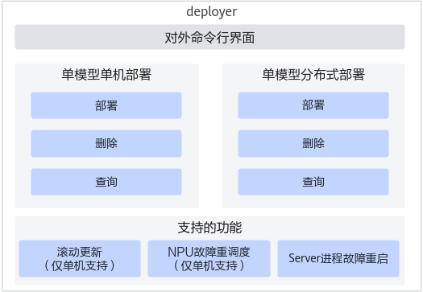

# 功能介绍

基于Kubernetes（简称K8s）平台，整合Kubernetes生态组件（包括昇腾MindCluster组件），提供对Server推理服务的一键式自动部署能力，用户可以通过deployer提供的命令行工具，实现一键自动化部署和运维管理，简化用户部署Server推理服务集群的流程，以下是集群管理组件部署面支持的特性框架图。

**图 1**  特性框架图<a name="fig170711912419"></a>  


支持的特性如下所示：

- 支持命令行操作界面；
- 提供单模型单机的部署能力；

- 支持单模型分布式部署能力；
- 支持滚动更新（仅单机支持）、NPU故障重调度（仅单机支持）、Server进程故障重启等能力。

# 配置说明

Deployer的服务端组件发布件为ms_server，是一个HTTP服务端，相关命令解释如[表1](#table9153583215)所示。

**表 1**  集群管理组件服务端相关命令

|指令|说明|
|--|--|
|./ms_server ms_server.json|启动集群管理组件服务端命令。ms_server是MindIE Motor中的集群管理组件服务端组件，命令中ms_server.json配置文件的具体配置和参数说明请参见ms_server.json配置文件。ms_server.json需要不大于640权限，否则启动失败。|
|./ms_server -h/--help|查询命令使用方法。|
|进程退出信号|./ms_server进程注册了信号处理函数捕获SIGINT和SIGTERM信号，用户启动ms_server后，通过发送SIGINT，SIGTERM信号可正常停止该进程。|

<br>

**ms_server.json配置文件**

```
{
    "ip": "127.0.0.1",
    "port": 9789,
    "k8s_apiserver_ip": "127.0.0.1",
    "k8s_apiserver_port": 6443,
    "log_info": {
        "log_level": "INFO",
        "run_log_path": "/var/log/mindie-ms/run/log.txt",
        "operation_log_path": "/var/log/mindie-ms/operation/log.txt"
    },
    "ms_status_file": "/var/lib/mindie-ms/status.json",
    "server_tls_items": {
        "ca_cert" : "./security/msserver/security/certs/ca.pem",
        "tls_cert": "./security/msserver/security/certs/cert.pem",
        "tls_key": "./security/msserver/security/keys/cert.key.pem",
        "tls_passwd": "./security/msserver/security/pass/key_pwd.txt",
        "kmcKsfMaster": "./security/msserver/tools/pmt/master/ksfa",
        "kmcKsfStandby": "./security/msserver/tools/pmt/standby/ksfb",
        "tls_crl": ""
    },
    "client_k8s_tls_enable": true,
    "client_k8s_tls_items": {
        "ca_cert" : "./security/kubeclient/security/certs/ca.pem",
        "tls_cert": "./security/kubeclient/security/certs/cert.pem",
        "tls_key": "./security/kubeclient/security/keys/cert.key.pem",
        "tls_passwd": "./security/kubeclient/security/pass/key_pwd.txt",
        "kmcKsfMaster": "./security/kubeclient/tools/pmt/master/ksfa",
        "kmcKsfStandby": "./security/kubeclient/tools/pmt/standby/ksfb",
        "tls_crl": ""
    },
    "client_mindie_server_tls_enable": true,
    "client_mindie_tls_items": {
        "ca_cert" : "./security/mindieclient/security/certs/ca.pem",
        "tls_cert": "./security/mindieclient/security/certs/cert.pem",
        "tls_key": "./security/mindieclient/security/keys/cert.key.pem",
        "tls_passwd": "./security/mindieclient/security/pass/key_pwd.txt",
        "kmcKsfMaster": "./security/mindieclient/tools/pmt/master/ksfa",
        "kmcKsfStandby": "./security/mindieclient/tools/pmt/standby/ksfb",
        "tls_crl": ""
    }
 }
```

**表 2**  ms\_server.json参数解释

|参数|类型|说明|
|--|--|--|
|ip|String|必填。<br>集群管理组件服务端IP；支持IPv4或IPv6，如配置了环境变量MINDIE_MS_SERVER_IP，则优先从环境变量读取。<br>考虑到集群管理组件运行业务的安全问题，建议不对外提供服务，配置成127.0.0.1；使用其他IP对外暴露接口将有安全风险，请用户需要慎重使用。|
|port|Int|必填。<br>集群管理组件服务端对外端口，取值范围：[1024，65535]，默认值9789。|
|k8s_apiserver_ip|String|必填。<br>Kubernetes管理节点的物理机IP地址。|
|k8s_apiserver_port|Int|必填。<br>Kubernetes对外访问的HTTPS端口，取值范围：[1024，65535]，默认值：6443（该端口为K8s的HTTPS端口）。|
|log_info|Object|集群管理组件服务端日志配置信息，包括log_level、run_log_path和operation_log_path子参数，详情请参见表3。<br>建议使用环境变量配置日志，详情请参见日志配置。|
|ms_status_file|String|必填。<br>用于服务状态保存的文件路径。<br>用户需要提前创建该文件所在的目录，第一次启动ms_server时会自动创建该文件，用户不需要自己创建，也不能手动修改。<br>后续部署的服务状态信息将由ms_server自动写入该文件，ms_server重启将读取该文件恢复状态。该文件的格式如下表4|
|server_tls_items|Object|集群管理组件服务端tls配置，详情请参见表5。|
|client_k8s_tls_enable|Bool|必填。<br>集群管理组件与Kubernetes对接的客户端是否需要开启tls安全通信，建议用户打开，确保与kubernetes通信安全。<br>-client_k8s_tls_enable为true，访问Kubernetes的HTTPS接口。<br>-client_k8s_tls_enable为false，访问Kubernetes的HTTP接口。|
|client_k8s_tls_items|Object|Kubernetes客户端tls配置，当client_k8s_tls_enable为true时，该参数中的key值为必填项，详情请参见表6。|
|client_mindie_server_tls_enable|Bool|必填。<br>集群管理组件对接Server接口是否开启tls安全通信。建议用户打开，确保集群管理组件管理节点与计算节点Server间通信安全。|
|client_mindie_tls_items|Object|Server客户端tls配置，当client_mindie_server_tls_enable为true时，该参数中的key值为必填项，详情请参见表7。|


**表 3**  log_info子参数解释

|参数|类型|说明|
|--|--|--|
|log_level|String|选填。支持等级如下：<br>-DEBUG<br>-INFO<br>-WARN<br>-ERROR<br>-CRITICAL<br>如设置环境变量MINDIE_LOG_LEVEL或MINDIEMS_LOG_LEVEL，则优先读取环境变量的值。默认日志等级为INFO级别。|
|run_log_path|String|集群管理组件服务端运行日志保存文件路径，选填。<br>可访问文件。默认路径请参考日志配置，如设置环境变量MINDIE_LOG_PATH，则优先读取环境变量的值。<br>Kubernetes容器化部署集群管理组件服务端时，必须为/var/log/mindie-ms/run/log.txt。|
|operation_log_path|String|集群管理组件服务端操作保存文件路径，选填。<br>可访问文件。默认路径请参考日志配置，如设置环境变量MINDIE_LOG_PATH，则优先读取环境变量的值.<br>Kubernetes容器化部署集群管理组件服务端时，必须为/var/log/mindie-ms/operation/log.txt。|


**表 4**  status持久化业务状态文件解释

|参数|类型|说明|
|--|--|--|
|server_list|Array|表示集群管理组件管理的推理服务列表清单。未部署服务时为空。|
|namespace|String|表示服务的命名空间。|
|replicas|Int|推理实例数。|
|server_name|Sting|推理服务名。|
|server_type|String|服务类型，当前只支持多机推理服务，取值mindie_cross_node。|
|use_service|Bool|是否使用kubernetes的Service暴露服务端口。|


**表 5**  server_tls_items子参数解释

|参数|类型|说明|
|--|--|--|
|ca_cert|String|必填。<br>集群管理组件HTTPS服务端的CA证书，使用kubernetes集群CA证书。集群管理组件服务端会校验客户端证书信息的CN为msclientuser，O为msgroup，请确保客户端的证书是kubernetes CA所信任的，且包含这些信息。<br>集群管理组件服务端ca根证书文件路径，该路径真实存在且可读。|
|tls_cert|String|必填。<br>使用kubernetes集群CA证书签发的服务证书。<br>集群管理组件服务端tls证书文件路径，该路径真实存在且可读。|
|tls_key|String|必填。<br>使用kubernetes集群CA证书签发的服务证书私钥。<br>集群管理组件服务端tls私钥文件路径，该路径真实存在且可读。|
|tls_passwd|String|必填。<br>集群管理组件HTTPS服务端的KMC加密的私钥口令的文件路径。|
|kmcKsfMaster|String|必填。<br>集群管理组件HTTPS服务端加密口令的KMC密钥库文件。|
|kmcKsfStandby|String|必填。<br>集群管理组件HTTPS服务端加密口令的KMC standby密钥库备份文件。|
|tls_crl|String|必填。<br>集群管理组件服务端校验客户端的证书吊销列表CRL文件路径，要求该文件真实存在且可读。若为空，则不进行吊销校验。|


**表 6**  client_k8s_tls_items子参数解释

|参数|类型|说明|
|--|--|--|
|ca_cert|String|必填。<br>使用kubernetes集群CA证书。<br>集群管理组件和Kubernetes对接的客户端的ca根证书文件路径，该路径真实存在且可读。|
|tls_cert|String|必填。<br>使用kubernetes集群CA证书签发的客户端证书，证书的CN与通过kubernetes RBAC机制创建的用户名一致。<br>集群管理组件和Kubernetes对接的客户端的tls证书文件路径，该路径真实存在且可读。|
|tls_key|String|必填。<br>使用kubernetes集群CA证书签发的客户端证书私钥。<br>集群管理组件和Kubernetes对接的客户端的tls私钥文件路径，该路径真实存在且可读。|
|tls_passwd|String|必填。<br>kmc加密的私钥口令的文件路径。|
|kmcKsfMaster|String|必填。<br>Server作为kube api-server的客户端加密口令的KMC密钥库文件。|
|kmcKsfStandby|String|必填。<br>Server作为kube api-server的客户端加密口令的KMC密钥库备份文件。|
|tls_crl|String|必填。<br>集群管理组件服务端校验Kubernetes API Server的证书吊销列表CRL文件路径，要求该文件真实存在且可读。若为空，则不进行吊销校验。|


**表 7**  client_mindie_tls_items子参数解释

|参数|类型|说明|
|--|--|--|
|ca_cert|String|必填。<br>集群管理组件和Server对接的客户端的ca根证书文件路径，该路径真实存在且可读。|
|tls_cert|String|必填。<br>集群管理组件和Server对接的客户端的tls证书文件路径，该路径真实存在且可读。|
|tls_key|String|必填。<br>集群管理组件和Server对接的客户端的tls私钥文件路径，该路径真实存在且可读。|
|tls_passwd|String|必填。<br>kmc加密的私钥口令的文件路径。|
|kmcKsfMaster|String|必填。<br>Server作为kube api-server的客户端加密口令的KMC密钥库文件。|
|kmcKsfStandby|String|必填。<br>Server作为kube api-server的客户端加密口令的KMC密钥库备份文件。|
|tls_crl|String|必填。<br>集群管理组件服务端校验Server的证书吊销列表CRL文件路径，要求该文件真实存在且可读。若为空，则不进行吊销校验。|

<br>

**环境变量**

当前支持的环境变量请参见[日志配置](日志配置.md)。

**错误码说明**

当前只会返回两种错误码，如下所示。

具体错误客户端会在屏幕打印异常信息；服务端的错误信息请参见[表3](配置说明.md)中"run\_log\_path"参数配置的文件路径。

<li>0：表示服务正常。
<li>1：表示异常情况。


