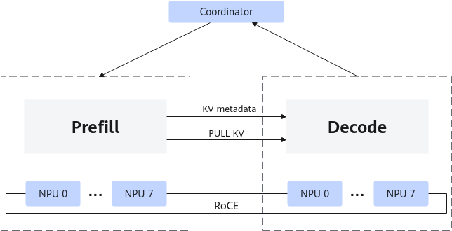
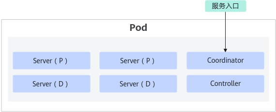
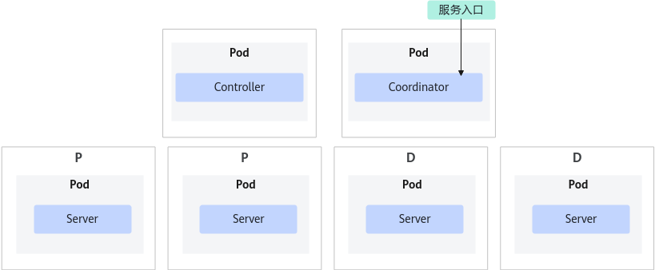

# 场景介绍

**PD分离服务部署介绍**

Prefill&Decode分离服务部署（简称：PD分离服务部署），PD分离服务部署又分为单机PD分离服务部署和多机PD分离服务部署，是将Prefill（预填充）和Decode（解码）这两个推理阶段分开处理的技术，通常适用于对时延有严格要求的场景。PD分离服务部署可以提高NPU的利用率，尤其是大语言模型，将Prefill实例和Decode实例分开部署，减少Prefill阶段和Decode阶段分时复用在时延上造成的互相干扰，实现同时延下吞吐提升。PD分离工作原理如[图1](#fig7842711175715)所示。

目前支持PD分离单机和PD分离多机服务部署：

- PD分离单机服务部署：Controller、Coordinator和Server组件全部运行在同一个Pod内，适用于部署在一台服务器的场景。
- PD分离多机服务部署：Controller、Coordinator和Server组件分别运行在独立的Pod内，适用于部署在多台服务器的场景。

**图 1**  PD分离工作原理<a name="fig7842711175715"></a>  


大语言模型推理的阶段可以分为Prefill与Decode阶段：

- Prefill阶段：在生成式语言模型中，Prefill阶段涉及到模型对初始提示（Prompt）的处理，生成初始的隐藏状态（Hidden States）。这个阶段通常涉及对整个模型的一次前向传播，因此计算密集度较高。对于每个新的输入序列，都需要进行一次Prefill。
- Decode阶段：在Prefill阶段之后，模型基于初始隐藏状态逐步生成后续的文本。这一阶段的特点是计算相对较少，但需要反复进行计算，直到生成足够的文本或达到某个终止条件。在生成过程中，只计算最新的token激活值，并进行attention计算，计算最终的预测token。

**部署方案**

- 单机PD分离服务部署方案：

    通过K8s的Service开放PD集群的推理入口，创建1个K8s的Deployment部署一个Pod，其中以进程方式分别部署Controller（单进程副本）、Coordinator（单进程副本）以及Server（多进程副本）。

    **图 2**  单机PD分离服务部署方案<a name="fig12111194813817"></a>  
    

- 多机PD分离服务部署方案：

    通过K8s的Service为Coordinator Pod开放PD集群的推理入口，创建3个K8s的Deployment分别部署Controller（单Pod副本）、Coordinator（单Pod副本）以及Server（多Pod副本）。

    **图 3**  多机PD分离服务部署方案<a name="fig636385121013"></a>  
    

**PD分离优势**

PD分离主要包括以下优势：

- 资源利用优化：由于Prefill阶段计算密集，而Decode阶段计算较为稀疏，将这两个阶段分离可以更好的利用NPU的计算资源。
- 提高吞吐量：分离后的Prefill和Decode可以同时处理不同的请求，这意味着在Prefill阶段处理新请求的同时，Decode阶段可以继续处理之前请求的解码任务，从而提高了整体的处理能力。
- 降低延迟：由于Prefill和Decode分别在不同的阶段进行，可以减少等待时间，特别是当有多个请求并发到达时。

**限制与约束**

- 单机PD分离服务部署
    - 仅Atlas 800I A2 推理服务器和Atlas 800I A3 超节点服务器支持此特性。
    - 不同P、D节点使用的NPU卡数量必须相同。
    - 仅支持LLaMA3系列和Qwen2系列。
    - 支持与Prefix Cache特性同时使用。
    - 不支持和稀疏量化、KV Cache int8量化配合使用。
    - 该特性暂不支持n、best\_of、use\_beam\_search、logprobs、top\_logprobs等与多序列推理相关的后处理参数。

- 多机PD分离服务部署
    - 仅Atlas 800I A2 推理服务器支持此特性。
    - P节点与D节点仅支持相同型号的机型。
    - P节点与D节点使用的NPU卡数量必须相同。
    - NPU网口互联（带宽：200Gbps）。
    - 不支持和Multi LoRA、并行解码、SplitFuse、Prefix Cache、Function Call、多机推理和长序列特性同时使用。
    - 仅支持LLaMA3系列和Qwen2系列。
    - 不支持和稀疏量化、KV Cache int8量化配合使用。
    - 该特性暂不支持n、best\_of、use\_beam\_search、logprobs、top\_logprobs等与多序列推理相关的后处理参数。

- 当前不支持“停止字符串”方式停止推理文本（即不支持stop，include\_stop\_str\_in\_output参数，参数详情请参见[推理接口](推理接口.md)。

**硬件环境**

PD分离部署支持的硬件环境如[表1](推理接口.md)所示。

**表 1**  PD分离部署支持的硬件列表

|类型|型号|内存|
|--|--|--|
|服务器|Atlas 800I A2 推理服务器|32GB64GB|
|服务器|Atlas 800I A3 超节点服务器|64GB|


>[!NOTE]说明
>- 集群必须具备参数面互联：即服务器NPU卡对应的端口处在同一个VLAN，可以通过RoCE互通。
>- 为保障业务稳定运行，用户应严格控制自建Pod的权限，避免高权限Pod修改MindIE内部参数而导致异常。

# 准备镜像

**MindIE与ATB Models配套使用场景**

详情请参见[准备MindIE镜像](准备MindIE镜像.md)制作MindIE镜像。

**MindIE与MindSpore配套使用场景**

>[!NOTE]说明
>MindIE 2.0.RC1版本未配套MindSpore 2.6.0版本，如需使用MindIE与MindSpore配套场景，请参见《MindIE 1.0.0 Service开发指南》中的“集群服务部署 \> PD分离服务部署 \> 安装部署 \> 准备镜像 \>  [MindIE与MindSpore配套使用场景](https://www.hiascend.com/document/detail/zh/mindie/100/mindieservice/servicedev/mindie_service0056.html)”章节。

1. 详情请参见《MindIE LLM开发指南》中的“推理与服务化 \> 离线推理 \> MindSpore Models服务化使用”章节，制作支持MindSpore后端的MindIE容器。
2. 将[1](#li199181911175214)制作的容器通过以下命令保存为镜像。

    ```
    docker commit container_id image_id:tag
    ```

# 配置自动生成证书

若用户开启Server的TLS认证功能（HTTPS或gRPC）时，通信客户端需要校验服务端证书的IP，由于PodIP的动态性，需要在Pod启动时生成具有PodIP别名的服务证书，以实现Server中PD节点间的通信，以及集群管理组件对Server的证书认证和校验。MindIE提供证书生成能力，具体操作步骤如下所示。

>[!NOTE]说明
>建议用户在运行环境中的各个计算节点准备和配置证书，提升服务安全性。

**操作步骤**

此方法只适用于使用自签名CA证书进行证书签发的场景。

需要按照以下方法准备Server、Controller和Coordinator三套证书。

1. 准备自签名CA证书和加密私钥。

    1. 执行以下命令生成配置文件。

        ```
        cat > ca.conf <<-EOF
        ```

        配置文件ca.conf示例如下，其中req\_distinguished\_name中的字段需要自行配置：

        ```
        [ req ]
        distinguished_name    = req_distinguished_name
        prompt                = no
        
        [ req_distinguished_name ]
        C                     = CN
        ST                    = Sichuan
        L                     = Chengdu
        O                     = Huawei
        OU                    = Ascend
        CN                    = MindIE
        
        [ v3_ca ]
        subjectKeyIdentifier = hash
        authorityKeyIdentifier = keyid:always,issuer
        basicConstraints = critical, CA:true
        keyUsage = critical, digitalSignature, cRLSign, keyCertSign
        EOF
        ```

    2. 执行以下命令创建格式为PKCS\#1的PKI私钥ca.key.pem。

        ```
        openssl genrsa -aes256 -out ca.key.pem 4096
        ```

    3. 根据回显输入私钥口令，然后按回车键。

        ```
        Enter pass phrase for ca.key.pem:
        Verifying - Enter pass phrase for ca.key.pem:
        ```

        出于安全考虑，以及后续导入证书的要求，用户输入的私钥口令的复杂度必须符合以下要求：

        - 口令长度至少8个字符；
        - 口令必须包含如下至少两种字符的组合：
            - 至少一个小写字母；
            - 至少一个大写字母；
            - 至少一个数字；
            - 至少一个特殊字符。

    4. 执行以下命令赋予ca.key.pem私钥文件可读权限。

        ```
        chmod 400 ca.key.pem
        ```

    5. 执行以下命令检查是否存在ca.key.pem私钥文件，并查看私钥内容。

        ```
        openssl rsa -in ca.key.pem
        ```

        根据回显输入[1.c](#li2262159142419)设置的私钥口令，然后按回车键，当打印私钥内容时表示ca.key.pem私钥文件生成成功。

    6. 执行以下命令创建CSR文件，根据回显输入[1.c](#li2262159142419)设置的私钥口令，然后按回车键。

        ```
        openssl req -out ca.csr -key ca.key.pem -new -config ca.conf -batch
        ```

    7. 执行以下命令赋予ca.csr文件可读可写权限。

        ```
        chmod 600 ca.csr
        ```

    8. 执行以下命令检查是否存在ca.csr文件，当打印ca.csr文件内容表示ca.csr文件生成成功。

        ```
        openssl req -in ca.csr -noout -text
        ```

    9. 执行以下命令生成CA证书ca.pem。

        ```
        openssl x509 -req -in ca.csr -out ca.pem -sha256 -days 7300 -extfile ca.conf -extensions v3_ca -signkey ca.key.pem
        ```

    10. 执行以下命令检查是否存在ca.pem文件，当有回显内容时表示ca.pem生成成功。

        ```
        openssl x509 -in ca.pem -noout -text
        ```

    11. 执行以下命令赋予ca.pem文件可读权限。

        ```
        chmod 400 ca.pem
        ```

2. 导入自签名CA证书和加密私钥。

   使用以下命令进入MindIE Motor安装目录。

    ```
    cd /{MindIE安装目录}/mindie-service/
    ```

 3. 通过MindIE证书管理工具import\_cert接口导入CA证书和私钥，输入证书私钥口令、生成KMC加密口令文件和KMC密钥库文件。MindIE证书管理工具详情请参见[config\_mindie\_server\_tls\_cert.py](config_mindie_server_tls_cert-py.md)。

    ```
    python3 ./scripts/config_mindie_server_tls_cert.py ./security/ca import_cert  {证书文件路径}  {加密私钥文件路径}
    ```

    参数解释：

    - *{证书文件路径}*：为CA证书的源路径。
    - *{加密私钥文件路径}*：为CA私钥的源路径。

    在回显时输入生成CA密钥时设置的口令：

    ```
    Password for private key file: 
    Retype password for private key file: 
    ```

4. 准备生成证书的配置文件。
    - 生成用户证书的配置文件（gen\_cert.json）：

        ```
        {
            "ca_cert": "./security/ca/ca.pem",
            "ca_key": "./security/ca/ca.key.pem",
            "ca_key_pwd": "./security/ca/ca_passwd.txt",
            "cert_config": "./cert_info.json",
            "output_path": "./gen_cert_output",
            "kmc_ksf_master": "./tools/pmt/master/ksfa",
            "kmc_ksf_standby": "./tools/pmt/standby/ksfb"
        }
        ```

    - 配置"cert\_config"参数中的cert\_info.json配置文件的待生成证书信息：

        ```
        {
            "subject": "subject_name",
            "expired_time": 3650,
            "serial_number": 123,
            "req_distinguished_name": {
                "C": "***",
                "ST": "***",
                "L": "***",
                "O": "***",
                "OU": "***",
                "CN": "***"
            },
            "alt_names": {
                "IP": [],
                "DNS": []
            }
        }
        ```

4. 在[脚本介绍](使用kubectl部署多机PD分离服务示例.md#section1373016122377)的mindie\_server.yaml、mindie\_ms\_controller.yaml和mindie\_ms\_coordinator.yaml配置文件中挂载上述自签名CA证书文件和配置文件到容器内/mnt/security目录，并配置为只读权限。
5. 在[脚本介绍](使用kubectl部署多机PD分离服务示例.md#section1373016122377)的容器启动脚本boot.sh中适配添加证书生成命令，以生成Server的证书为例，在“if [ $exit_code -eq 2 ]; then”分支内添加以下生成证书的命令。

    ```
    cp /mnt/security/ca.pem $MIES_INSTALL_PATH/security/ca
    cp /mnt/security/ca.key.pem $MIES_INSTALL_PATH/security/ca
    cp /mnt/security/ca_passwd.txt $MIES_INSTALL_PATH/security/ca
    cp /mnt/security/gen_cert.json $MIES_INSTALL_PATH
    cp /mnt/security/cert_info.json $MIES_INSTALL_PATH
    cp -r /mnt/security/tools $MIES_INSTALL_PATH/
    chmod 500 ./bin/gen_cert
    mkdir gen_cert_output
    python3 ./scripts/config_mindie_server_tls_cert.py  ./  gen_cert ./gen_cert.json  --ip=$MIES_CONTAINER_IP,{host_ip}
    chmod 400 ./gen_cert_output/*
    // 拷贝生成的证书到特定的路径
    cp ./gen_cert_output/cert.pem /home/{用户名称}/Ascend/mindie/latest/mindie-service/security/certs/server.pem
    cp ./gen_cert_output/cert.key.pem /home/{用户名称}/Ascend/mindie/latest/mindie-service/security/keys/server.key.pem
    cp ./gen_cert_output/cert_passwd.txt /home/{用户名称}/Ascend/mindie/latest/mindie-service/security/pass/mindie_server_key_pwd.txt
    rm -rf ./gen_cert_output/*
    // 下面使用其他证书配置(gen_cert_xxx.json, cert_info_xxx.json)重复上述步骤继续导入其他证书
    // cp /mnt/security/gen_cert_xxx.json $MIES_INSTALL_PATH
    // cp /mnt/security/cert_info_xxx.json $MIES_INSTALL_PATH
    // python3 ./scripts/config_mindie_server_tls_cert.py  ./  gen_cert ./gen_cert_xxx.json  --ip=$MIES_CONTAINER_IP,{host_ip}
    ```

    \{host\_ip\}：仅Coordinator需要配置，配置为提供推理API的物理机IP。

    >[!NOTE]说明
    >- Server、集群管理组件控制器（Controller）和调度器（Coordinator）三套证书准备完成后，请参考《MindIE LLM开发指南》中的“核心概念与配置 \> 配置参数说明（服务化）”章节、[控制器（Controller）配置说明](配置说明-5.md)和[调度器（Coordinator）配置说明](配置说明-11.md)将每个证书拷贝至指定的路径下。
    >- 启动Server Pod调用生成证书接口如出现“failed to read random number from system.”报错，大概率是由于环境熵不足，需要在计算节点安装haveged组件补熵。详情请参考《MindIE安装指南》中的“附录  \> 启动haveged服务”章节，将熵补至4096。

# 安装部署

## 使用kubectl部署单机PD分离服务示例

**限制与约束**

- 该示例支持部署PD分离模式的Server、Coordinator和Controller。
- Atlas 800I A2 推理服务器需要配置卡IP并安装Ascend Operator组件。
- 当前部署脚本不支持NPU故障重调度场景。
<br>

**脚本介绍**

本节使用MindIE Motor安装目录（examples/kubernetes\_deploy\_scripts）中的脚本实现一键式部署和卸载MindIE PD分离集群功能，集群管理员用户可参考这些脚本文件线下使用K8s kubectl工具操作集群。

集群管理员用户只需在管理节点完成启动脚本编写、业务配置和kubernetes配置，然后调用部署脚本，实现自动下发业务配置和启动脚本，自动全局ranktable生成，以及自动调度Pod到计算节点。

>[!NOTE]说明
>- MindIE的安装部署脚本需由K8s管理员执行，防止脚本或配置被恶意篡改，导致任意命令执行或容器逃逸风险。
>- K8s管理员应严格管控MindIE ConfigMap的写、更新和删除权限，建议安装目录权限设置为750，文件权限为640。防止其被恶意修改后挂载至Pod内部引发安全风险，建议通过Namespace和RBAC方法进行权限约束。
>- MindIE服务在启用TLS证书的情况下，需要在controller\_init.yaml和coordinator\_init.yaml文件中删除Kubernetes的三项健康探针配置（readinessProbe、livenessProbe和startupProbe以及子字段），否则可能导致服务被Kubernetes频繁重启。MindIE服务通过主备切换和Pod重调度等机制支持高可靠特性，因此删除健康探针不会影响服务的高可靠性运行。
>- 当请求发送速度高于处理速度时，Coordinator会缓存未处理的请求，并导致内存占用上升，最后可能因达到内存上限而被终止。在请求积压的场景下，通过配置coordinator\_init.yaml文件中的"memory"参数，能够有效应对请求积压引起的内存增长。
     - "requests"字段下的"memory"参数表示Coordinator运行所需最小内存，建议配置为"8Gi"。
     - "limits"字段下的"memory"参数表示Coordinator可用内存的上限，建议配置为"48Gi"。

脚本文件目录结构如下所示：

```
├── boot_helper
│   ├── boot.sh
│   ├── gen_config_single_container.py
│   ├── get_group_id.py
│   ├── mindie_cpu_binding.py
│   ├── server_prestop.sh
│   └── update_mindie_server_config.py
├── chat.sh
├── conf
├── delete.sh
├── deploy.sh
├── deploy_ac_job.py
├── deployment
│   ├── controller_init.yaml
│   ├── coordinator_init.yaml
│   ├── mindie_ms_controller.yaml
│   ├── mindie_ms_coordinator.yaml
│   ├── mindie_server.yaml
│   ├── mindie_server_heterogeneous.yaml
│   ├── mindie_service_single_container.yaml
│   ├── mindie_service_single_container_base_A3.yaml
│   ├── server_init.yaml
│   └── single_container_init.yaml
├── gen_ranktable_helper
│   ├── gen_global_ranktable.py
│   └── global_ranktable.json
├── generate_stream.sh
├── log.sh
├── user_config.json
├── user_config_base_A3.json
└── utils
    ├── validate_config.py
    └── validate_utils.py
```

**单机PD分离部署场景相关的关键目录及文件解释如下表所示：**

**表 1**  关键目录及文件解释

|目录/文件|说明|
|--|--|
|conf|集群管理组件和Server的主要业务配置文件，PD分离管理调度策略和模型相关配置。|
|boot_helper|该目录包含容器启动脚本boot.sh，对conf目录下配置文件修正（包括在用户只提供一份Server的config.json情况下生成多份端口号不冲突的config文件）及生成对应global_ranktable的辅助脚本gen_config_single_container.py。<br>**MindIE依赖jemalloc.so库文件，禁止在/usr/目录下安装非法同名的so文件，引入任意命令执行等安全风险。**|
|deployment|K8s部署任务定义，配置NPU资源使用量，实例数，镜像等。在单机PD分离部署场景下只使用到mindie_service_single_container.yaml文件。|
|`chat.sh`|使用curl发送HTTPS请求给推理服务的简单对话示例，**适用于Prefix Cache场景**。|
|generate_stream.sh|使用curl发送HTTPS请求给推理服务的流式响应示例。|
|`deploy.sh`|部署入口脚本，一键拉起所有MindIE组件。|
|`delete.sh`|卸载脚本，一键卸载所有MindIE组件。|
|`log.sh`|查询Pod的打印日志，可查询到部署的所有Pod的日志。|

<br>

**操作步骤**

以LLaMA3-8B模型为例，每个实例配置2张卡，配置4个实例。部署样例如下所示，以下操作均在部署脚本路径下完成：

1. 进入集群管理节点宿主机，首次部署用户需创建命名空间，默认值为mindie，如需创建其它名称请自行替换。

    ```
    kubectl create namespace mindie
    ```

2. 配置Controller组件的启动配置文件ms\_controller.json，其配置文件详细说明请参见[配置说明](配置说明-5.md)。

    配置“deploy\_mode“参数为“pd\_disaggregation\_single\_container“，表示单机PD分离部署模式，如下所示：

    ```
    "deploy_mode"= "pd_disaggregation_single_container"
    ```

    >[!NOTE]说明
    >- ms\_controller.json配置文件中的"request\_coordinator\_tls\_enable"、"request\_server\_tls\_enable"、"http\_server\_tls\_enable"和"cluster\_tls\_enable"参数为控制是否使用HTTPS的开关。**建议用户打开（即设置为"true"），确保通信安全；如果关闭则存在较高的网络安全风险**。
         - true：集群内MindIE组件使用了HTTPS接口，并导入证书到容器内，配置相应的证书路径。
         - false：集群内MindIE组件使用了HTTP接口，无需准备证书文件。
    >- 由于单机PD分离部署功能中所有组件处于同一个Pod，文件中"http\_server"模块的port默认值为1026，与其他端口号存在冲突，则需修改为其他非冲突端口号，建议值为1027。（配置文件中配置的端口存在冲突情况下，程序将自动分配其他非冲突端口号保证程序能正常拉起）
    >- 配置文件ms\_controller.json中的"default\_p\_rate"和"default\_d\_rate"参数分别控制集群中P节点和D节点数量的比值（如设置环境变量MINDIE\_MS\_P\_RATE和MINDIE\_MS\_D\_RATE，则优先读取环境变量的值，环境变量详情请参见[环境变量](配置说明-5.md#section418760103619)），默认均为0，根据模型、硬件、服务信息等自动决策最佳配比，也可以根据场景分别设置为P和D节点的实际数量。

3. 配置Coordinator组件的启动配置文件ms\_coordinator.json，其配置文件详细说明请参见[配置说明](配置说明-11.md)。

    PD场景下需配置"deploy\_mode"参数为单机PD分离部署模式，如下所示：

    ```
    deploy_mode="pd_disaggregation_single_container"
    ```

    >[!NOTE]说明
    >ms\_coordinator.json配置文件中的"controller\_server\_tls\_enable"、"request\_server\_tls\_enable"、"mindie\_client\_tls\_enable"和"mindie\_mangment\_tls\_enable"参数为控制是否使用HTTPS的开关。**建议用户打开（即设置为**"true"**），确保通信安全；如果关闭则存在较高的网络安全风险**。
    >-   true：集群内MindIE组件使用了HTTPS接口，并导入证书到容器内，配置相应的证书路径。
    >-   false：集群内MindIE组件使用了HTTP接口，无需准备证书文件。

4. 配置Server服务启动的config.json配置文件，PD分离服务部署模式需要配置的参数如[表2](#table472745002618)所示，具体参数解释请参见《MindIE LLM开发指南》中的“核心概念与配置 \> 配置参数说明（服务化）”章节。

    **表 2** config.json关键配置参数解释

    |参数|说明|
    |--|--|
    |modelName|模型名配置，关联模型权重文件的模型，如配置为llama3-8b。|
    |modelWeightPath|模型权重文件目录配置，需配置为mindie_service_single_container.yaml文件中指定挂载在容器中的权重路径（默认为/mnt/mindie-service/ms/model），确保集群可调度Ascend计算节点在该路径下存在模型文件。|
    |worldSize|配置一个P/D实例占用的NPU卡数；例如配置为“2”，表示使用两张卡。|
    |npuDeviceIds|卡号配置成从0开始编号，总数与worldSize一致，如配置为[[0,1]]。|
    |inferMode|配置为dmi。|
    |tp|整网张量并行数，取值为worldSize参数值；该参数为补充参数，请自行在ModelConfig字段下配置。|


    在单机PD分离部署场景下，多个Server进程将运行于同一Pod中，每个Server进程需对应独立的配置文件。为简化配置流程，可使用mindie\_service\_single\_container.yaml文件中的MINDIE\_MS\_GEN\_SERVER\_PORT环境变量进行管理。该环境变量支持两种配置模式：

    - true（默认值）：系统将根据用户配置的config.json文件，自动生成多个配置文件（config1.json、config2.json、...、config\{server\_num\}.json）。每个配置文件对应一个Server进程，系统将为配置文件中的端口参数：port、managementPort、metricsPort和interCommPort分配互不冲突的端口号，确保各进程独立运行。
    - false：用户需提供与Server数量匹配的配置文件（config1.json、config2.json、...、config\{server\_num\}.json）。在该模式下，用户可自由配置各端口参数。系统具备端口冲突检测机制，若配置文件中存在端口冲突，系统将自动分配其他可用端口号，确保程序正常启动。

5. 配置http\_client\_ctl.json配置文件，该配置文件为集群启动、存活、就绪探针HTTP客户端工具的配置文件，具体参数解释请参见[表4](MindIE探针工具.md#table13687127115213)。

    **tls_enable**参数为控制是否使用HTTPS的开关，若集群内MindIE组件使用了HTTPS接口，需设置**tls_enable**为"true"，并导入证书到容器内，配置相应的证书路径。如使用HTTP接口，则设置**tls_enable**为"false"，无需准备证书文件。

    >[!NOTE]说明
    >建议用户打开tls\_enable，确保通信安全；如果关闭则存在较高的网络安全风险。

6. 配置kubernetes Deployment，主要配置参数如下所示。

    Atlas 800I A2 推理服务器：在部署脚本目录中配置deployment路径下的mindie\_service\_single\_container.yaml文件。

    Atlas 800I A3 超节点服务器：在部署脚本目录中配置deployment路径下的mindie\_service\_single\_container\_base\_A3.yaml文件。

    >[!NOTE]说明
    >-  本脚本仅作为一个部署参考，Pod容器的安全性由用户自行保证，实际生产环境请针对镜像和Pod安全进行加固。
    >-  用户在使用kubetl部署Deployment时，可修改deployment的配置yaml文件，请避免使用危险配置，确保使用安全镜像（非root权限用户），配置安全的Pod上下文。
    >-  用户应挂载安全路径（非软链接，非系统危险路径，非业务敏感路径），并设置合理的文件目录权限，避免挂载/home等公共目录，防止被非法用户篡改，导致容器逃逸问题。
    >-  宿主机模型权重挂载路径需要根据实际情况配置，示例如下：
    >       ```
    >       - name: model-path
    >         hostPath:
    >           path: /data/LLaMA3-8B
    >       ```

    - mindie_service_single_container.yaml主要配置的字段如下所示：
        - huawei.com/Ascend910：配置所有P/D实例占用的NPU卡数总和，与Server的所有config配置文件中worldSize参数配置的卡数总和保持一致。
        - sp-block：super-pod块大小，指代虚拟超节点的NPU数量。该参数仅在使用Atlas 800I A3 超节点服务器时配置（即的mindie\_service\_single\_container\_base\_A3.yaml文件），其值与huawei.com/Ascend910参数的值保持一致。
        - image：配置镜像名。
            - MindIE与ATB Models配套使用场景：镜像名请参见[准备镜像]。
            - MindIE与MindSpore配套使用场景：镜像名请参见[准备镜像]。

        - startupProbe：启动探针，每180秒检测一次启动状态，如果启动探针连续失败的次数达到30次则认为未启动成功，Pod将会自动重启。请用户根据实际场景设置合理的启动时间。
        - readinessProbe：就绪探针，每180秒检测一次就绪状态。如果探针失败，Pod将停止接收流量，直到再次通过检查。请用户根据实际场景设置合理的触发时间。
        - livenessProbe：存活探针，每180秒检测一次存活状态。用于探测容器的健康，如果任意进程无应答则执行重启等操作。请用户根据实际场景设置合理的触发时间。
        - MINDIE\_MS\_GEN\_SERVER\_PORT：判定Server的多份配置文件是否由程序根据基本config.json文件自动生成。
        - MINDIE\_MS\_P\_RATE：PD分离部署模式下，P所占的比例。

            - 0：表示自动决策最佳比例，MINDIE\_MS\_D\_RATE需要同时为0；
            - 非0：表示指定P的比例，MINDIE\_MS\_D\_RATE需要同时非0，且MINDIE\_MS\_P\_RATE和MINDIE\_MS\_D\_RATE的和小于等于单机NPU卡数。

                **该环境变量的优先级高于ms\_controller.json配置文件中default\_p\_rate。**

        - MINDIE\_MS\_D\_RATE：PD分离部署模式下，D所占的比例。

            - 0：表示自动决策最佳比例，MINDIE\_MS\_P\_RATE需要同时为0；
            - 非0：表示指定P的比例，MINDIE\_MS\_P\_RATE需要同时非0，且MINDIE\_MS\_P\_RATE和MINDIE\_MS\_D\_RATE的和小于等于单机NPU卡数。

                **该环境变量的优先级高于ms\_controller.json配置文件中default\_d\_rate。**

        - MINDIE\_LOG\_TO\_FILE：统一设置MindIE各组件日志是否写入文件。

            默认值为1，表示写入文件。取值范围为：[false, true]，且支持[0, 1]。

        - MINDIE\_LOG\_TO\_STDOUT：统一设置MindIE各组件日志是否打印。

            默认值为1，表示打印日志。取值范围为：[false, true]，且支持[0, 1]。

        - MINDIE\_LOG\_LEVEL：统一设置MindIE各组件日志级别。

            默认值为INFO。日志级别取值 [CRITICAL, ERROR, WARN, INFO, DEBUG]。

7. 配置启动脚本`boot.sh`，可配置环境变量请参考[表3](#table18214541124514)。

    **表 3**  环境变量列表

    |环境变量|类型|说明|
    |--|--|--|
    |MINDIE_INFER_MODE|PD分离|推理模式，表示是否PD分离。standard：PD混部；dmi：PD分离。该环境变量未在boot.sh脚本默认配置中，如有需要可自行添加。|
    |MINDIE_DECODE_BATCH_SIZE|公共变量|最大Decode的batch大小。取值范围：[1, 5000]该环境变量未在boot.sh脚本默认配置中，如有需要可自行添加。|
    |MINDIE_PREFILL_BATCH_SIZE|公共变量|最大Prefill的batch大小。取值范围：[1, MINDIE_DECODE_BATCH_SIZE - 1]该环境变量未在boot.sh脚本默认配置中，如有需要可自行添加。|
    |MINDIE_MAX_SEQ_LEN|公共变量|最大序列长度。整型数字，取值范围：(0, 4294967295]该环境变量未在boot.sh脚本默认配置中，如有需要可自行添加。|
    |MINDIE_MAX_ITER_TIMES|公共变量|最大输出长度。整型数字，取值范围：[1, MINDIE_MAX_SEQ_LEN-1]该环境变量未在boot.sh脚本默认配置中，如有需要可自行添加。|
    |MINDIE_MODEL_NAME|公共变量|模型名。该环境变量未在boot.sh脚本默认配置中，如有需要可自行添加。|
    |MINDIE_MODEL_WEIGHT_PATH|公共变量|模型权重文件路径。该环境变量未在boot.sh脚本默认配置中，如有需要可自行添加。|
    |MINDIE_ENDPOINT_HTTPS_ENABLED|公共变量|是否在Prefill/Decode实例上启用HTTPS。true：启用；false：禁用。该环境变量未在boot.sh脚本默认配置中，如有需要可自行添加。|
    |MINDIE_INTER_COMM_TLS_ENABLED|公共变量|推理实例间通信开启TLS。true：启用；false：禁用。该环境变量未在boot.sh脚本默认配置中，如有需要可自行添加。|
    |HSECEASY_PATH|公共变量|KMC解密工具的依赖库路径。|
    |MINDIE_MS_CONTROLLER_CONFIG_FILE_PATH|公共变量|Controller组件配置文件路径。|
    |MINDIE_MS_COORDINATOR_CONFIG_FILE_PATH|公共变量|Coordinator组件配置文件路径。|
    |ATB_LLM_HCCL_ENABLE|公共变量|是否使能HCCL通信后端，默认开启。1：启用；0：禁用。使用Atlas 800I A2 推理服务器部署单机PD分离服务运行稠密模型时，为获得最优性能，建议关闭该环境变量。|
    |HCCL_OP_EXPANSION_MODE|公共变量|用于配置通信算法的编排展开位置，默认值为：AIV。当ATB_LLM_HCCL_ENABLE配置为1时，该环境变量生效，取值如下：AI_CPU：代表通信算法的编排展开位置在Device侧的AI CPU计算单元。AIV：代表通信算法的编排展开位置在Device侧的Vector Core计算单元。HOST：代表通信算法的编排展开位置为Host侧CPU，Device侧根据硬件型号自动选择相应的调度器。HOST_TS：代表通信算法的编排展开位置为Host侧CPU，Host向Device的Task Scheduler下发任务，Device的Task Scheduler负责任务的调度与执行。该环境变量详情请参见《CANN 环境变量参考》中的“HCCL_OP_EXPANSION_MODE”章节（社区版）。|
    |HCCL_RDMA_RETRY_CNT|公共变量|用于配置RDMA网卡的重传次数，需要配置为整数，取值范围为[1,7]，默认值为7。|
    |HCCL_RDMA_TIMEOUT|公共变量|用于配置RDMA网卡重传超时时间的系数timeout。RDMA网卡重传超时时间最小值的计算公式为：4.096 μs * 2 ^ timeout，其中timeout为该环境变量配置值，且实际重传超时时间与用户网络状况有关。该环境变量配置为整数，取值范围为[5,20]，默认值为18。|
    |HCCL_EXEC_TIMEOUT|公共变量|通过该环境变量可控制设备间执行时同步等待的时间，在该配置时间内各设备进程等待其他设备执行通信同步。此处用于设置首token超时时间。单位为s，取值范围为：[0, 2147483647]，默认值为60，当配置为0时代表永不超时。|
    |**注：日志相关环境变量详情请参见。**|


8.  拉起单机PD分离服务。

    >[!NOTE]说明
    >拉起服务前，建议用户使用MindStudio的预检工具进行配置文件字段校验，辅助校验配置的合法性，详情请参见[链接](https://gitcode.com/Ascend/msit/tree/master/msprechecker)。

    配置容器内MindIE安装的目录：根据制作镜像时实际的安装路径，修改MINDIE\_USER\_HOME\_PATH的value值，如安装路径是/xxx/Ascend/mindie，则配置为/xxx 。

    ```
    export MINDIE_USER_HOME_PATH={镜像的安装路径}
    ```

    -   Atlas 800I A2 推理服务器

        使用以下命令拉起集群：

        ```
        bash deploy.sh
        ```

        或

        ```
        bash deploy.sh 800i_a2
        ```

    -   Atlas 800I A3 超节点服务器

        使用以下命令可拉起集群：

        ```
        bash deploy.sh 800i_a3
        ```

9.  使用kubectl命令查看PD集群状态。

    ```
    kubectl get pods -n mindie
    ```

    回显示例如下：

    ```
    NAME                                     READY   STATUS    RESTARTS   AGE    IP               NODE       NOMINATED NODE   READINESS GATES
    mindie-server-7b795f8df9-vl9hv           1/1     Running   0          145m   xx.xx.xx.xx   ubuntu     <none>           <none>
    ```

    -   Controller、Coordinator和Server组件均启动在以mindie-server开头的Pod中。

    如观察Pod进入Running状态，表示Pod容器已成功被调度到节点并正常启动，但还需要进一步确认业务程序是否启动成功。

    -   通过脚本示例提供的log.sh脚本可查询这些Pod的标准输出日志，查看程序是否出现异常：

        ```
        bash log.sh
        ```

    -   如需要查询具体Pod（如上面mindie-server-7b795f8df9-vl9hv）的日志，则执行以下命令：

        ```
        kubectl logs mindie-server-7b795f8df9-vl9hv -n mindie
        ```

    -   获取的Pod日志将输出生成global\_ranktable.json文件。

        -   Atlas 800I A2 推理服务器生成global\_ranktable.json文件如下所示，样例中参数解释如[表4](#table1791172513220)所示。

            ```
            {
              "version": "1.0",
              "server_group_list": [
                {
                  "group_id": "2",
                  "server_count": "4",
                  "server_list": [
                    {
                      "server_id": "127.0.0.1",
                      "server_ip": "127.0.0.1",
                      "predict_port": "xxxx",
                      "mgmt_port": "xxxx",
                      "metric_port": "xxxx",
                      "inter_comm_port": "xxxx",
                      "device": [
                        {
                           "device_id": "0",
                           "device_ip": "1.1.1.1",
                           "rank_id": "0",
                           "device_logical_id": "0"
                         },
                        {
                           "device_id": "1",
                           "device_ip": "1.1.1.2",
                           "rank_id": "1",
                           "device_logical_id": "1"
                         }
                      ]
                    },
                    {
                      "server_id": "127.0.0.1",
                      "server_ip": "127.0.0.1",
                      "predict_port": "xxxx",
                      "mgmt_port": "xxxx",
                      "metric_port": "xxxx",
                      "inter_comm_port": "xxxx",
                      "device": [
                        {
                           "device_id": "2",
                           "device_ip": "1.1.1.3",
                           "rank_id": "2",
                           "device_logical_id": "2"
                         },
                        {
                           "device_id": "3",
                           "device_ip": "1.1.1.4",
                           "rank_id": "3",
                           "device_logical_id": "3"
                         }
                      ]
                    },
                    {
                      "server_id": "127.0.0.1",
                      "server_ip": "127.0.0.1",
                      "predict_port": "xxxx",
                      "mgmt_port": "xxxx",
                      "metric_port": "xxxx",
                      "inter_comm_port": "xxxx",
                      "device": [
                        {
                           "device_id": "4",
                           "device_ip": "1.1.1.5",
                           "rank_id": "4",
                           "device_logical_id": "4"
                         },
                        {
                           "device_id": "5",
                           "device_ip": "1.1.1.6",
                           "rank_id": "5",
                           "device_logical_id": "5"
                         }
                      ]
                    },
                    {
                      "server_id": "127.0.0.1",
                      "server_ip": "127.0.0.1",
                      "predict_port": "xxxx",
                      "mgmt_port": "xxxx",
                      "metric_port": "xxxx",
                      "inter_comm_port": "xxxx",
                      "device": [
                        {
                           "device_id": "6",
                           "device_ip": "1.1.1.7",
                           "rank_id": "6",
                           "device_logical_id": "6"
                         },
                        {
                           "device_id": "7",
                           "device_ip": "1.1.1.8",
                           "rank_id": "7",
                           "device_logical_id": "7"
                         }
                      ]
                    }
                  ]
                },
                {
                  "group_id": "1",
                  "server_count": "1",
                  "server_list": [
                    {
                      "server_ip": "127.0.0.1"
                    }
                  ]
                },
                {
                  "group_id": "0",
                  "server_count": "1",
                  "server_list": [
                    {
                      "server_ip": "127.0.0.1"
                    },
                  ]
                }
              ],
              "status": "completed"
            }
            
            ```

        -   Atlas 800I A3 超节点服务器生成global\_ranktable.json文件如下所示，样例中参数解释如[表4](#table1791172513220)所示。

            ```
            {
              "version": "1.0",
              "server_group_list": [
                {
                  "group_id": "2",
                  "server_count": "4",
                  "server_list": [
                    {
                      "server_id": "127.0.0.1",
                      "server_ip": "127.0.0.1",
                      "predict_port": "xxxx",
                      "mgmt_port": "xxxx",
                      "metric_port": "xxxx",
                      "inter_comm_port": "xxxx",
                      "device": [
                        {
                           "device_id": "0",
                           "device_ip": "1.1.1.1",
                           "super_device_id": "xxxxxxxxxx",
                           "rank_id": "0",
                           "device_logical_id": "0"
                         },
                        {
                           "device_id": "1",
                           "device_ip": "1.1.1.2",
                           "super_device_id": "xxxxxxxxxx",
                           "rank_id": "1",
                           "device_logical_id": "1"
                         }
                      ]
                    },
                    {
                      "server_id": "127.0.0.1",
                      "server_ip": "127.0.0.1",
                      "predict_port": "xxxx",
                      "mgmt_port": "xxxx",
                      "metric_port": "xxxx",
                      "inter_comm_port": "xxxx",
                      "device": [
                        {
                           "device_id": "2",
                           "device_ip": "1.1.1.3",
                           "super_device_id": "xxxxxxxxxx",
                           "rank_id": "2",
                           "device_logical_id": "2"
                         },
                        {
                           "device_id": "3",
                           "device_ip": "1.1.1.4",
                           "super_device_id": "xxxxxxxxxx",
                           "rank_id": "3",
                           "device_logical_id": "3"
                         }
                      ]
                    },
                    {
                      "server_id": "127.0.0.1",
                      "server_ip": "127.0.0.1",
                      "predict_port": "xxxx",
                      "mgmt_port": "xxxx",
                      "metric_port": "xxxx",
                      "inter_comm_port": "xxxx",
                      "device": [
                        {
                           "device_id": "4",
                           "device_ip": "1.1.1.5",
                           "super_device_id": "xxxxxxxxxx",
                           "rank_id": "4",
                           "device_logical_id": "4"
                         },
                        {
                           "device_id": "5",
                           "device_ip": "1.1.1.6",
                           "super_device_id": "xxxxxxxxxx",
                           "rank_id": "5",
                           "device_logical_id": "5"
                         }
                      ]
                    },
                    {
                      "server_id": "127.0.0.1",
                      "server_ip": "127.0.0.1",
                      "predict_port": "xxxx",
                      "mgmt_port": "xxxx",
                      "metric_port": "xxxx",
                      "inter_comm_port": "xxxx",
                      "device": [
                        {
                           "device_id": "6",
                           "device_ip": "1.1.1.7",
                           "super_device_id": "xxxxxxxxxx",
                           "rank_id": "6",
                           "device_logical_id": "6"
                         },
                        {
                           "device_id": "7",
                           "device_ip": "1.1.1.8",
                           "super_device_id": "xxxxxxxxxx",
                           "rank_id": "7",
                           "device_logical_id": "7"
                         }
                      ]
                    }
                  ],
                  "super_pod_list": [
                    {
                      "super_pod_id": "0",
                      "server_list": [
                        {
                          "server_id": "127.0.0.1"
                         }
                       ]
                    }
                  ]
                },
                {
                  "group_id": "1",
                  "server_count": "1",
                  "server_list": [
                    {
                      "server_ip": "127.0.0.1"
                    }
                  ]
                },
                {
                  "group_id": "0",
                  "server_count": "1",
                  "server_list": [
                    {
                      "server_ip": "127.0.0.1"
                    },
                  ]
                }
              ],
              "status": "completed"
            }
            ```

        **表 4**  global\_ranktable.json文件参数解释

        |参数|类型|描述|
        |--|--|--|
        |version|string|Ascend Operator的版本号。|
        |status|string|集群信息表的状态。<br>-completed：部署完成。<br>-initializing：初始化中。|
        |group_id|string|各组件的ID。<br>-0：存储Coordinator的部署信息。<br>-1：存储Controller的部署信息。<br>-2：存储Server的部署信息。|
        |server_count|string|各组件的进程总数。|
        |server_list|json对象数组|各组件的进程部署信息。<br>-Controller实例：列表有效长度为[0, 1]。<br>-Coordinator实例：列表有效长度为[0, 1]。<br>-Server实例：列表有效长度为[0, npu_num]（npu_num为npu个数）。|
        |server_id|string|组件节点的主机IP。|
        |server_ip|string|组件节点的IP地址。|
        |predict_port|string|EndPoint提供的业务面RESTful接口绑定的端口号。|
        |mgmt_port|string|EndPoint提供的内部接口绑定的端口号。|
        |metric_port|string|服务管控指标接口（普罗格式）端口号。|
        |inter_comm_port|string|集群内部实例间的通信端口。|
        |device|json对象数组|NPU设备信息，仅Server有此属性。列表有效长度[1, 128]。|
        |device_id|string|NPU的设备ID。|
        |device_ip|string|NPU的IP地址。|
        |super_device_id|string|超节点场景下NPU设备ID；该参数只涉及Atlas 800I A3 超节点服务器。|
        |rank_id|string|NPU的逻辑ID，即Server所在Pod内可见的卡设备的序列ID。|
        |device_logical_id|string|NPU的逻辑ID，即Server所在Pod内可见的卡设备的序列ID。|
        |super_pod_list|string|超节点列表；该参数只涉及Atlas 800I A3 超节点服务器。|
        |super_pod_id|string|当前超节点ID；该参数只涉及Atlas 800I A3 超节点服务器。|


    -   如需要进入容器查找更多定位信息，则执行以下命令：

        ```
        kubectl exec -it mindie-server-7b795f8df9-vl9hv -n mindie -- bash
        ```

10. 通过脚本示例提供的generate\_stream.sh发起流式推理请求。

    部署成功后，会在节点上开放31015端口用于推理业务接口，需要修改generate\_stream.sh中的IP地址为集群管理节点宿主机的IP地址，如Coordinator组件启用了HTTPS，需要配置相关的证书；如使用HTTP，需修改脚本中的HTTPS为HTTP，并删除证书相关配置。

    ```
    bash generate_stream.sh
    ```

    >[!NOTE]说明
    >HTTP协议存在安全风险，建议您使用HTTPS安全协议。

11. 卸载PD集群。

    如需停止PD服务或者修改业务配置重新部署实例，需要调用以下命令卸载已部署的实例，重新部署请执行[8](#li1651115619332)。

    ```
    bash delete.sh mindie ./
    ```

    >[!NOTE]说明
    >-   mindie为[1](#li121732348534)创建的命名空间，请根据实际的命名空间进行替换。
    >-   delet.sh卸载脚本需要在examples/kubernetes\_deploy\_scripts目录下执行，否则无法停止服务并报错。


## 使用kubectl部署多机PD分离服务示例

**限制与约束**

- 该示例支持部署PD分离模式的Server、Coordinator、Controller。
- Atlas 800I A2 推理服务器需要配置卡IP并安装Ascend Operator组件。
- 当前部署脚本不支持NPU故障重调度场景。
- 异构场景中的P实例需部署在Atlas A2 推理系列产品（32G）设备上，D实例需部署在Atlas A2 推理系列产品（64G）设备上。

**脚本介绍**

本节使用MindIE Motor安装目录（examples/kubernetes_deploy_scripts）中的脚本实现一键式部署和卸载MindIE PD分离集群功能，集群管理员用户可参考这些脚本文件线下使用K8s kubectl工具操作集群。

集群管理员用户只需在管理节点完成启动脚本编写、业务配置和kubernetes配置，然后调用部署脚本，实现自动下发业务配置和启动脚本，自动全局ranktable生成，以及自动调度Pod到计算节点。

>[!NOTE]说明
>- MindIE的安装部署脚本需由K8s管理员执行，防止脚本或配置被恶意篡改，导致任意命令执行或容器逃逸风险。
>- K8s管理员应严格管控MindIE ConfigMap的写、更新和删除权限，建议安装目录权限设置为750，文件权限为640。防止其被恶意修改后挂载至Pod内部引发安全风险，建议通过Namespace和RBAC方法进行权限约束。
>- MindIE服务在启用TLS证书的情况下，需要在controller_init.yaml和coordinator_init.yaml文件中删除Kubernetes的三项健康探针配置（readinessProbe、livenessProbe和startupProbe以及子字段），否则可能导致服务被Kubernetes频繁重启。MindIE服务通过主备切换和Pod重调度等机制支持高可靠特性，因此删除健康探针不会影响服务的高可靠性运行。
>- 当请求发送速度高于处理速度时，Coordinator会缓存未处理的请求，并导致内存占用上升，最后可能因达到内存上限而被终止。在请求积压的场景下，通过配置coordinator\_init.yaml文件中的"memory"参数，能够有效应对请求积压引起的内存增长。
     - **requests**字段下的**memory**参数表示Coordinator运行所需最小内存，建议配置为"8Gi"。
     - **limits**字段下的**memory**参数表示Coordinator可用内存的上限，建议配置为"48Gi"。

脚本文件目录结构如下所示：

```
├── boot_helper
│   ├── boot.sh
│   ├── gen_config_single_container.py
│   ├── get_group_id.py
│   ├── mindie_cpu_binding.py
│   ├── server_prestop.sh
│   └── update_mindie_server_config.py
├── chat.sh
├── conf
├── delete.sh
├── deploy.sh
├── deploy_ac_job.py
├── deployment
│   ├── controller_init.yaml
│   ├── coordinator_init.yaml
│   ├── mindie_ms_controller.yaml
│   ├── mindie_ms_coordinator.yaml
│   ├── mindie_server.yaml
│   ├── mindie_server_heterogeneous.yaml
│   ├── mindie_service_single_container.yaml
│   ├── mindie_service_single_container_base_A3.yaml
│   ├── server_init.yaml
│   └── single_container_init.yaml
├── gen_ranktable_helper
│   ├── gen_global_ranktable.py
│   └── global_ranktable.json
├── generate_stream.sh
├── log.sh
├── user_config.json
├── user_config_base_A3.json
└── utils
    ├── validate_config.py
    └── validate_utils.py
```

**多机PD分离部署场景相关的关键目录及文件解释如下表所示：**

**表 1**  关键目录及文件解释

|目录/文件|说明|
|--|--|
|conf|集群管理组件和Server的主要业务配置文件，PD分离管理调度策略和模型相关配置。|
|boot_helper|该目录包含容器启动脚本boot.sh，获取group_id，刷新环境变量到配置文件，设置启动程序的环境变量等，用户可根据需要在这里调整日志等级等。<br>**MindIE依赖jemalloc.so库文件，禁止在/usr/目录下安装非法同名的so文件，引入任意命令执行等安全风险。**|
|deployment|K8s部署任务定义，配置NPU资源使用量，实例数，镜像等。|
|gen_ranktable_helper|生成global_ranktable.json的工具。|
|`chat.sh`|使用curl发送HTTPS请求给推理服务的简单对话示例，**适用于Prefix Cache场景**。|
|generate_stream.sh|使用curl发送HTTPS请求给推理服务的流式响应示例。|
|`deploy.sh`|部署入口脚本，一键拉起所有MindIE组件。|
|`delete.sh`|卸载脚本，一键卸载所有MindIE组件。|
|`log.sh`|查询Pod的打印日志，可查询到部署的所有Pod的日志。|

<br>

**操作步骤**

以LLaMA3-8B模型为例，每个实例配置2张卡，配置4个实例。部署样例如下所示，以下操作均在部署脚本路径下完成：

>[!NOTE]说明
>以下操作步骤不区分同构部署和异构部署，异构部署在对应的操作步骤有单独的配置说明。

1.  <a name="li121732348534"></a>进入集群管理节点宿主机，首次部署用户需创建mindie命名空间，默认值为mindie，如需创建其它名称请自行替换。

    ```
    kubectl create namespace mindie
    ```

2.  配置Controller组件的启动配置文件ms\_controller.json，其配置文件详细说明请参见[配置说明](配置说明-5.md)。

    PD场景下需配置"deploy\_mode"参数为PD分离部署模式，如下所示：

    ```
    "deploy_mode"= "pd_separate"
    ```

    如需进行异构部署，则需要配置"is\_heterogeneous"参数为"true"，如下所示：

    ```
    is_heterogeneous: true
    ```

    >[!NOTE]说明
    >- ms_controller.json配置文件中的**request_coordinator_tls_enable**、**request_server_tls_enable**、**http_server_tls_enable**和**cluster_tls_enable**参数为控制是否使用HTTPS的开关。**建议用户打开（即设置为"true"），确保通信安全；如果关闭则存在较高的网络安全风险**。
        - true：集群内MindIE组件使用了HTTPS接口，并导入证书到容器内，配置相应的证书路径。
        - false：集群内MindIE组件使用了HTTP接口，无需准备证书文件。
    >- 配置文件ms_controller.json中的**default_p_rate**和**default_d_rate**参数分别控制集群中P节点和D节点数量的比值（如设置环境变量MINDIE_MS_P_RATE和MINDIE_MS_D_RATE，则优先读取环境变量的值，环境变量详情请参见[环境变量](配置说明-5.md#section418760103619)），默认均为0，根据模型、硬件、服务信息等自动决策最佳配比，也可以根据场景分别设置为P和D节点的实际数量。

3.  配置Coordinator组件的启动配置文件ms_coordinator.json，其配置文件详细说明请参见[配置说明](配置说明-11.md)。

    PD场景下需配置"deploy_mode"参数为PD分离部署模式，如下所示：

    ```
    deploy_mode="pd_separate"
    ```

    >[!NOTE]说明
    >ms_coordinator.json配置文件中的**controller_server_tls_enable**、**request_server_tls_enable**、**mindie_client_tls_enable**和**mindie_mangment_tls_enable**参数为控制是否使用HTTPS的开关。**建议用户打开（即设置为"true"），确保通信安全；如果关闭则存在较高的网络安全风险**。
    >- true：集群内MindIE组件使用了HTTPS接口，并导入证书到容器内，配置相应的证书路径。
    >- false：集群内MindIE组件使用了HTTP接口，无需准备证书文件。

4.  配置Server服务启动的config.json配置文件，PD分离服务部署模式需要配置的参数如[表2](#table472745002618)所示，具体参数解释请参见《MindIE LLM开发指南》中的“核心概念与配置 \> 配置参数说明（服务化）”章节。

    **表 2**  config.json关键配置参数解释

    |参数|说明|
    |--|--|
    |modelName|模型名配置，关联模型权重文件的模型，如配置为llama3-8b。|
    |modelWeightPath|模型权重文件目录配置，默认情况下脚本会挂载物理机的/data目录，modelWeightPath需配置为/data路径下的模型权重路径，确保集群可调度Ascend计算节点在该路径下存在模型文件。|
    |worldSize|配置一个P/D实例占用的NPU卡数；例如配置为"2"，表示使用两张卡。|
    |npuDeviceIds|卡号配置成从0开始编号，总数与worldSize一致，如配置为[0,1]。|
    |inferMode|配置为dmi。|
    |tp|整网张量并行数，取值为worldSize参数值；该参数为补充参数，请自行在ModelConfig字段下配置。|


5.  配置http_client_ctl.json配置文件，该配置文件为集群启动、存活、就绪探针HTTP客户端工具的配置文件，具体参数解释请参见[表4](MindIE探针工具.md#table13687127115213)。

    "tls_enable"参数为控制是否使用HTTPS的开关，若集群内MindIE组件使用了HTTPS接口，需设置"tls_enable"为"true"，并导入证书到容器内，配置相应的证书路径。如使用HTTP接口，则设置"tls_enable"为"false"，无需准备证书文件。

    >[!NOTE]说明
    >建议用户打开tls_enable，确保通信安全；如果关闭则存在较高的网络安全风险。

6.  配置kubernetes Deployment。

    在部署脚本目录中的deployment目录下找到mindie_server.yaml、mindie_ms_coordinator.yaml、mindie_ms_controller.yaml和mindie_server_heterogeneous.yaml（仅异构场景配置）文件。

    >[!NOTE]说明
    >-   本脚本仅作为一个部署参考，Pod容器的安全性由用户自行保证，实际生产环境请针对镜像和Pod安全进行加固。
    >-   用户在使用kubetl部署Deployment时，可修改deployment的配置yaml文件，请避免使用危险配置，确保使用安全镜像（非root权限用户），配置安全的Pod上下文。
    >-   用户应挂载安全路径（非软链接，非系统危险路径，非业务敏感路径），并设置合理的文件目录权限，避免挂载/home等公共目录，防止被非法用户篡改，导致容器逃逸问题。

    -   mindie\_server.yaml主要配置的字段如下所示：
        -   replicas：
            -   同构场景：配置P和D的总实例数，如果配置为3P1D，即配置为4。
            -   异构场景：配置P的实例数，如果配置为3P，即配置为3。

        -   huawei.com/Ascend910：配置一个P/D实例占用的NPU卡数，与MindIE Serve的config.json配置文件中worldSize参数配置的卡数保持一致。
        -   image：配置镜像名。
            -   MindIE与ATB Models配套使用场景：镜像名请参见[准备镜像]。
            -   MindIE与MindSpore配套使用场景：镜像名请参见[准备镜像]。

        -   startupProbe：启动探针，默认启动时间为500秒，如果在该时间内服务未启动成功，Pod将会自动重启。请用户根据实际场景设置合理的启动时间。
        -   affinity：反亲和部署配置，默认注释不启用，去掉注释后开启。开启后，每个Server Pod将会反亲和部署到不同的计算节点，多个Pod不会部署到同一节点。
        -   nodeSelector：节点选择，配置期望调度的节点，通过节点参数实现。
            -   hardware\_type：异构部署需要配置，同构部署无需配置；使能Controller决策异构推理身份。
            -   hardware-type：异构部署需要配置，同构部署无需配置；是纳管到K8s集群的节点标签，用于分配异构设备资源，异构部署之前，需执行下面命令为异构计算节点打上标签。

                ```
                kubectl label node xx_node hardware-type=xx_device
                ```

                >[!NOTE]说明
                >异构场景下，参数取值需满足以下要求：
                >-   hardware_type：如配置为P节点，该参数必须为"800I A2(32G)"；如需配置为D节点，该参数必须为"800I A2(64G)"。
                >-   hardware-type：该参数的值不能有空格。

        -   MINDIE_LOG_TO_FILE：统一设置MindIE各组件日志是否写入文件。

            默认值为1，日志写入文件。取值范围为：[false, true]，且支持[0, 1]。

        -   MINDIE_LOG_TO_STDOUT：统一设置MindIE各组件是否打印日志。

            默认值为1，打印日志。取值范围为：[false, true]，且支持[0, 1]。

        -   MINDIE_LOG_LEVEL：统一设置MindIE各组件日志级别。

            默认值为INFO。日志级别取值 [CRITICAL, ERROR, WARN, INFO, DEBUG]。

    -   mindie\_ms\_coordinator.yaml和mindie\_ms\_controller.yaml文件主要关注image镜像名的修改及日志设置。

        -   MindIE与ATB Models配套使用场景：镜像名请参见[准备镜像]。
        -   MindIE与MindSpore配套使用场景：镜像名请参见[准备镜像]。
        -   MINDIE\_LOG\_TO\_FILE：统一设置MindIE各组件日志是否写入文件。

            默认值为1，日志写入文件。取值范围为：[false, true]，且支持[0, 1]。

        -   MINDIE\_LOG\_TO\_STDOUT：统一设置MindIE各组件是否打印日志。

            默认值为1，打印日志。取值范围为：[false, true]，且支持[0, 1]。

        -   MINDIE\_LOG\_LEVEL：统一设置MindIE各组件日志级别。

            默认值为INFO。日志级别取值 [CRITICAL, ERROR, WARN, INFO, DEBUG]。

        >[!NOTE]说明
        >-   mindie\_ms\_coordinator.yaml文件需特别关注livenessProbe（存活探针）参数，在高并发推理请求场景下，可能会因为探针超时，从而被K8s识别为Pod不存活，导致K8s重启Coordinator容器，建议用户谨慎开启livenessProbe（存活探针）。
        >-   为了支持MindIE Controller故障恢复功能，mindie\_ms\_controller.yaml文件中volumes参数的name: status-data所配置的目录，必须为待部署计算节点（该计算节点通过nodeSelector参数指定）上真实存在，且volumeMounts参数中的name: status-data挂载路径必须为：/_MindIE Motor安装路径_/logs。

    -   mindie\_server\_heterogeneous.yaml文件主要配置的字段如下所示：
        -   replicas：配置D的实例数，如果配置为4D，即配置为4。
        -   huawei.com/Ascend910：配置一个P/D实例占用的NPU卡数，2卡即配置为2。
        -   image：配置镜像名。
            -   MindIE与ATB Models配套使用场景：镜像名请参见[准备镜像]。
            -   MindIE与MindSpore配套使用场景：镜像名请参见[准备镜像]。

        -   startupProbe：启动探针，默认启动时间为500秒，如果在该时间内服务未启动成功，Pod将会自动重启。请用户根据实际场景设置合理的启动时间。
        -   nodeSelector：节点选择，配置期望调度的节点，通过节点参数实现。
            -   hardware\_type：异构部署需要配置，同构部署无需配置；使能Controller决策异构推理身份，该参数配置的值与mindie\_server.yaml文件中hardware\_type参数的值不能一样。
            -   hardware-type：异构部署需要配置，同构部署无需配置；是纳管到K8s集群的节点标签，用于分配异构设备资源，异构部署之前，需执行下面命令为异构计算节点打上标签，该参数配置的值与mindie\_server.yaml文件中hardware-type参数的值不能一样。

                ```
                kubectl label node xx_node hardware-type=xx_device2
                ```

                >[!NOTE]说明
                >异构场景下，参数取值需满足以下要求：
                >-   hardware\_type：如配置为P节点，该参数必须为"800I A2\(32G\)"；如需配置为D节点，该参数必须为"800I A2\(64G\)"。
                >-   hardware-type：该参数的值不能有空格。

        -   MINDIE\_LOG\_TO\_FILE：统一设置MindIE各组件日志是否写入文件。

            默认值为1，日志写入文件。取值范围为：[false, true]，且支持[0, 1]。

        -   MINDIE\_LOG\_TO\_STDOUT：统一设置MindIE各组件是否打印日志。

            默认值为1，打印日志。取值范围为：[false, true]，且支持[0, 1]。

        -   MINDIE\_LOG\_LEVEL：统一设置MindIE各组件日志级别。

            默认值为INFO。日志级别取值 [CRITICAL, ERROR, WARN, INFO, DEBUG]。

7.  配置启动脚本`boot.sh`，可配置环境变量请参考[表3](#table18214541124514)。

    **表 3**  环境变量列表

    |环境变量|类型|说明|
    |--|--|--|
    |MINDIE_INFER_MODE|PD分离|推理模式，表示是否PD分离。standard：PD混部；dmi：PD分离。该环境变量未在boot.sh脚本默认配置中，如有需要可自行添加。|
    |MINDIE_DECODE_BATCH_SIZE|公共变量|最大Decode的batch大小。取值范围：[1, 5000]该环境变量未在boot.sh脚本默认配置中，如有需要可自行添加。|
    |MINDIE_PREFILL_BATCH_SIZE|公共变量|最大Prefill的batch大小。取值范围：[1, MINDIE_DECODE_BATCH_SIZE - 1]该环境变量未在boot.sh脚本默认配置中，如有需要可自行添加。|
    |MINDIE_MAX_SEQ_LEN|公共变量|最大序列长度。整型数字，取值范围：(0, 4294967295]该环境变量未在boot.sh脚本默认配置中，如有需要可自行添加。|
    |MINDIE_MAX_ITER_TIMES|公共变量|最大输出长度。整型数字，取值范围：[1, MINDIE_MAX_SEQ_LEN-1]该环境变量未在boot.sh脚本默认配置中，如有需要可自行添加。|
    |MINDIE_MODEL_NAME|公共变量|模型名。该环境变量未在boot.sh脚本默认配置中，如有需要可自行添加。|
    |MINDIE_MODEL_WEIGHT_PATH|公共变量|模型权重文件路径。该环境变量未在boot.sh脚本默认配置中，如有需要可自行添加。|
    |MINDIE_ENDPOINT_HTTPS_ENABLED|公共变量|是否在Prefill/Decode实例上启用HTTPS。true：启用；false：禁用。该环境变量未在boot.sh脚本默认配置中，如有需要可自行添加。|
    |MINDIE_INTER_COMM_TLS_ENABLED|公共变量|推理实例间通信开启TLS。true：启用；false：禁用。该环境变量未在boot.sh脚本默认配置中，如有需要可自行添加。|
    |HCCL_RDMA_RETRY_CNT|公共变量|用于配置RDMA网卡的重传次数，需要配置为整数，取值范围为[1,7]，默认值为7。|
    |HCCL_RDMA_TIMEOUT|公共变量|用于配置RDMA网卡重传超时时间的系数timeout。RDMA网卡重传超时时间最小值的计算公式为：4.096 μs * 2 ^ timeout，其中timeout为该环境变量配置值，且实际重传超时时间与用户网络状况有关。该环境变量配置为整数，取值范围为[5,20]，默认值为18。|
    |HCCL_EXEC_TIMEOUT|公共变量|通过该环境变量可控制设备间执行时同步等待的时间，在该配置时间内各设备进程等待其他设备执行通信同步。此处用于设置首token超时时间。单位为s，取值范围为：[0, 2147483647]，默认值为60，当配置为0时代表永不超时。|
    |HSECEASY_PATH|公共变量|KMC解密工具的依赖库路径.|
    |MINDIE_MS_CONTROLLER_CONFIG_FILE_PATH|公共变量|Controller组件配置文件路径。|
    |MINDIE_MS_COORDINATOR_CONFIG_FILE_PATH|公共变量|Coordinator组件配置文件路径。|
    |**注：日志相关环境变量详情请参见。**|


8. 拉起PD集群。

    配置容器内mindie安装的目录：根据制作镜像时实际的安装路径，修改MINDIE\_USER\_HOME\_PATH的value值，如安装路径是/xxx/Ascend/mindie，则配置为/xxx 。

    ```
    export MINDIE_USER_HOME_PATH={镜像的安装路径}
    ```

    >[!NOTE]说明
    >拉起服务前，建议用户使用MindStudio的预检工具进行配置文件字段校验，辅助校验配置的合法性，详情请参见[链接](https://gitcode.com/Ascend/msit/tree/master/msprechecker)。

    使用以下命令拉起集群。

    ```
    bash deploy.sh
    ```

    执行命令后，会同步等待global\_ranktable.json生成完成，如长时间处于阻塞状态，请ctrl+c中断后查看集群Pod状态，进行下一步的调试定位。

    global\_ranktable.json样例如下所示，样例中参数解释如[表4]所示。

    ```
    {
      "version": "1.0",
      "server_group_list": [
        {
          "group_id": "2",
          "server_count": "2",
          "server_list": [
            {
              "server_id": "xxx.xxx.xxx.1",
              "server_ip": "xxx.xxx.xxx.1",
              "device": [
                {
                  "device_id": "0",
                  "device_ip": "xxx.xxx.xxx.1",
                  "device_logical_id": "0"
                }
              ],
              "hardware_type": "800I A2(32G)"
            },
            {
              "server_id": "xxx.xxx.xxx.2",
              "server_ip": "xxx.xxx.xxx.2",
              "device": [
                {
                  "device_id": "1",
                  "device_ip": "xxx.xxx.xxx.2",
                  "device_logical_id": "1"
                }
              ],
              "hardware_type": "800I A2(64G)"
            }
          ]
        },
        {
          "group_id": "1",
          "server_count": "1",
          "server_list": [
            {
              "server_id": "xxx.xxx.xxx.1",
              "server_ip": "xxx.xxx.xxx.1"
            }
          ]
        },
        {
          "group_id": "0",
          "server_count": "1",
          "server_list": [
            {
              "server_id": "xxx.xxx.xxx.1",
              "server_ip": "xxx.xxx.xxx.1"
            }
          ]
        }
      ],
      "status": "completed"
    }
    
    ```

    **表 4**  global\_ranktable.json文件参数解释

    |参数|类型|描述|
    |--|--|--|
    |version|string|Ascend Operator的版本号。|
    |status|string|集群信息表的状态。<br>-completed：部署完成。<br>-initializing：初始化中。|
    |group_id|string|各组件的ID。<br>-0：存储Coordinator的部署信息。<br>-1：存储Controller的部署信息。<br>-2：存储Server的部署信息。|
    |server_count|string|各组件的节点总数。|
    |server_list|json对象数组|各组件的节点部署信息。<br>-最多包含1个Controller实例，列表有效长度[0, 1]。<br>-最多包含1个Coordinator实例，列表有效长度[0, 1]。<br>-最多包含96个Server实例，列表有效长度[0, 96]。|
    |server_id|string|组件节点的主机IP。|
    |server_ip|string|组件节点的IP地址。|
    |device|json对象数组|NPU设备信息，仅Server有此属性。列表有效长度[1, 128]。|
    |device_id|string|NPU的设备ID。|
    |device_ip|string|NPU的IP地址。|
    |device_logical_id|string|NPU的逻辑ID，即Server所在Pod内可见的卡设备的序列ID。|
    |hardware_type|string|硬件设备类型，仅异构模式下有此属性。<br>-如配置为P节点，该参数为"800I A2(32G)"；<br>-如需配置为D节点，该参数为"800I A2(64G)"。|


    >[!NOTE]说明
    >- 如果部署失败，则需要参见[11](#li05951725124112)卸载集群后重新部署。
    >- 集群默认刷新挂载到容器内的configmap的频率是60s，如遇到容器内打印“status of ranktable is not completed”日志信息的时间偏久，可在每个待调度的计算节点修改kubelet同步configmap的周期，即修改/var/lib/kubelet/config.yaml中的syncFrequency参数，将周期减少到5s，注意此修改可能影响集群性能。
        >  ```
        >  syncFrequency: 5s
        >  ```
    >    然后使用以下命令重启kubelet：
    >    ```
    >    swapoff -a
    >    systemctl restart  kubelet.service
    >    systemctl status kubelet
    >    ```
    >-   确保Docker配置了标准输出流写入到文件的最大规格，防止磁盘占满导致Pod被驱逐。
    >    需在待部署服务的计算节点上修改Docker配置文件后重启Docker：
    >    1.  使用以下命令打开daemon.json文件。
    >        ```
    >        vim /etc/docker/daemon.json
    >        ```
    >        在daemon.json文件中添加日志选项"log-opts"，具体内容如下所示。
    >        ```
    >        "log-opts":{"max-size":"500m", "max-file":"3"}
    >        ```
    >        参数解释：
    >        max-size=500m：表示一个容器日志大小上限是500M。
    >        max-file=3：表示一个容器最多有三个日志，超过会自动滚动更新。
    >    2.  使用以下命令重启Docker.
    >        ```
    >        systemctl daemon-reload
    >        systemctl restart docker
    >        ```

    若使能异构集群推理，执行以下命令：

    ```
    bash deploy.sh heter
    ```

9.  使用kubectl命令查看PD集群状态。

    ```
    kubectl get pods -n mindie
    ```

    如启动4个Server实例，回显如下所示：

    ```
    NAME                                     READY   STATUS    RESTARTS   AGE    IP               NODE       NOMINATED NODE   READINESS GATES
    mindie-ms-controller-7845dcd697-h4gw7    1/1     Running   0          145m   xx.xx.xx.xx    ubuntu10   <none>           <none>
    mindie-ms-coordinator-6bff995ff8-l6fwz   1/1     Running   0          145m   xx.xx.xx.xx    ubuntu10   <none>           <none>
    mindie-server-7b795f8df9-2xvh4           1/1     Running   0          145m   xx.xx.xx.xx   ubuntu     <none>           <none>
    mindie-server-7b795f8df9-j4z7d           1/1     Running   0          145m   xx.xx.xx.xx   ubuntu     <none>           <none>
    mindie-server-7b795f8df9-v2tcz           1/1     Running   0          145m   xx.xx.xx.xx   ubuntu     <none>           <none>
    mindie-server-7b795f8df9-vl9hv           1/1     Running   0          145m   xx.xx.xx.xx   ubuntu     <none>           <none>
    ```

    -   以mindie-ms-controller命名开头为Controller控制器组件。
    -   以mindie-ms-coordinator命名开头为Coordinator调度器组件。
    -   以mindie-server命名开头为Server推理服务组件。

         如观察Pod进入Running状态，表示Pod容器已成功被调度到节点并正常启动，但还需要进一步确认业务程序是否启动成功。

    -   通过脚本示例提供的log.sh脚本可查询这些Pod的标准输出日志，查看程序是否出现异常：

        ```
        bash log.sh
        ```

        >[!NOTE]说明
        >若使配置了异构集群推理，执行以下命令：
        >```
        >bash log.sh heter
        >```

    -   如需要查询具体某个Pod（如上面mindie-server-7b795f8df9-vl9hv）的日志，则执行以下命令：

        ```
        kubectl logs mindie-server-7b795f8df9-vl9hv -n mindie
        ```

    -   如需要进入容器查找更多定位信息，则执行以下命令：

        ```
        kubectl exec -it mindie-server-7b795f8df9-vl9hv -n mindie -- bash
        ```

    -   如需确认的P，D对应的Pod，待Controller组件启动（如上面mindie-ms-controller-7845dcd697-h4gw7处于READY 1/1状态）后，则执行以下命令：

        ```
        kubectl logs mindie-ms-controller-7845dcd697-h4gw7 -n mindie | grep UpdateServerInfo
        ```

        查询到P节点和D节点的Pod IP，并结合上面查询Pod状态命令回显的IP可找到对应的Pod。

10. 通过脚本示例提供的generate\_stream.sh发起流式推理请求。

    部署成功后，会在节点上开放31015端口用于推理业务接口，需要修改generate\_stream.sh中的IP地址为集群管理节点宿主机的IP地址，如Coordinator组件启用了HTTPS，需要配置相关的证书；如使用HTTP，需修改脚本中的HTTPS为HTTP，并删除证书相关配置。

    ```
    bash generate_stream.sh
    ```

11. <a name="li05951725124112"></a>卸载PD集群。

    如需停止PD服务或者修改业务配置重新部署实例，需要调用以下命令卸载已部署的实例，重新部署请执行[8](#li1651115619332)。

    ```
    bash delete.sh mindie ./
    ```

    >[!NOTE]说明
    >-   mindie为[1](#li121732348534)创建的命名空间，请根据实际的命名空间进行替换。
    >-   delet.sh卸载脚本需要在examples/kubernetes\_deploy\_scripts目录下执行，否则无法停止服务并报错。

