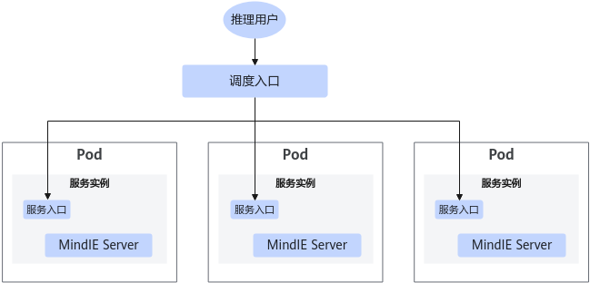
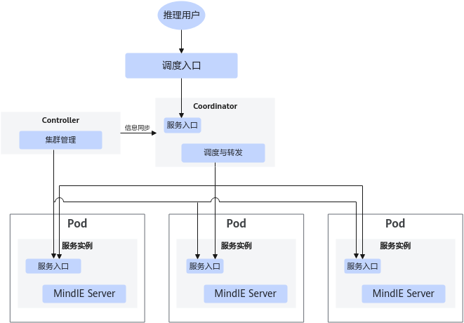
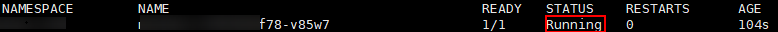
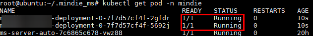
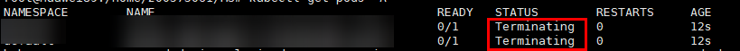

# 场景介绍

单机服务部署为非分布式实例部署的场景，即在一个计算节点内可部署一个完整独立的Server推理服务实例。根据设备资源情况，同一个计算节点可部署多个Server服务实例，也支持在多个计算节点上部署多个服务实例。 用户根据使用场景选择不同的组件作为服务请求入口，提供以下两种方案。

**Server作为对外服务入口**

推理请求：通过第三方平台的调度入口（由用户部署平台而定，比如K8s的调度入口或MA的调度入口等），基于特定的调度算法，直接调度请求发送给各个单机版的Server实例。具体部署详情请参见[使用Deployer部署服务示例](#方式一：使用Deployer部署服务示例)章节。使用该部署方式部署单机（非分布式）服务时，其支持的接口请参见《MindIE LLM开发指南》中的“API接口说明 > RESTful API参考”。

**图 1** Server作为对外服务入口<a name="fig15651193715716"></a>  


**Coordinator作为对外服务入口**

推理请求：通过第三方平台的调度入口（由用户部署平台而定，比如K8s的调度入口或MA的调度入口等），将所有请求发送给Coordinator，Coordinator基于本身支持的负载调度算法，调度请求发送给各个Server实例。具体部署详情请参见[使用kubectl部署服务示例](#方式二：使用kubectl部署服务示例)章节。使用该部署方式部署单机（非分布式）服务时，其支持的接口请参见[RESTful接口API](RESTful接口API-14.md)。

**图 2**  Coordinator作为对外服务入口<a name="fig1253625461216"></a>  


单机部署场景支持的调度算法如下表所示：

|调度算法|含义|部署建议|接口详情|
|--|--|--|--|
|cache_affinity|Cache亲和调度算法：当前只支持OpenAI多轮会话场景的亲和调度算法。|OpenAI多轮会话场景，推荐配置。|OpenAI推理接口|
|round_robin|轮询调度算法：非OpenAI多轮会话场景的调度算法。|使用非OpenAI多轮会话接口时默认执行此算法，用户无须配置。|<li>TGI流式推理接口<li>TGI文本推理接口<li>TGI文本/流式推理接口<li>vLLM文本/流式推理接口<li>Triton流式推理接口<li>Triton Token推理接口<li>Triton文本推理接口<li>MindIE原生文本/流式推理接口<li>Token计算接口|


>[!NOTE]说明
>为保障业务稳定运行，用户应严格控制自建Pod的权限，避免高权限Pod修改MindIE内部参数而导致异常。

# 方式一：使用Deployer部署服务示例

## 部署Deployer服务端

Deployer部署器提供Server推理服务在K8s集群场景下的部署管理能力，具体能力请参见[功能介绍](功能介绍.md)。 Deployer包含一个服务端组件ms\_server和一个客户端组件msctl，以下内容将介绍Deployer服务端的部署流程。

**前提条件**

已参照[Kubernetes安装与配置](Kubernetes安装与配置.md)、[MindCluster组件安装](MindCluster组件安装.md)和[准备MindIE镜像](准备MindIE镜像.md)完成K8s的安装配置、MindCluster组件的安装和MindIE镜像制作。

- 如果只需要部署一个Server服务进行推理的场景，请参见[使用Deployer部署服务示例](使用Deployer部署服务示例.md)进行部署。
- 如果需要配合使用集群管理组件（Deployer、Controller和Coordinator）功能的场景，请参见[使用kubectl部署服务示例](使用kubectl部署服务示例.md)进行部署。

**准备TLS证书**

集群管理组件（Deployer、Controller和Coordinator）当前业务定位是Kubernetes集群内组件，且仅集群管理员有使用权限，相关的TLS通信认证证书采用集群CA签发的证书。

证书分类

主要需要准备以下四套证书的CA证书、服务证书、私钥、KMC加密口令和KMC工作密钥。

-   集群管理组件服务端证书
-   集群管理组件服务端与kube API-Server通信的证书
-   集群管理组件客户端msctl与集群管理组件服务端通信的证书
-   集群管理组件服务端与Server通信的客户端证书

由于Kubernetes集群根CA证书（通常位于/etc/kubernetes/pki/ca.crt目录）不支持CRL吊销，为了保证集群管理组件中相关组件在集群控制面的通信安全，参照以下方法签发相关证书：

1.  首先使用Kubernetes集群根CA签发且具备CRL吊销能力（包含CRL Sign签名）的**中间CA**；中间CA的签发方法请参见[签发中间CA](#section186564391621)。
2.  使用该**中间CA**签发集群管理组件服务端证书、集群管理组件服务端与kube API-Server通信的客户端证书、集群管理组件客户端msctl与集群管理组件服务端通信证书；其签发方法请参见[签发其他证书](#section126354590313)。
3.  集群管理组件服务端与Server通信的客户端证书，由业务面的CA签发，需要用户自行准备。

>[!NOTE]说明
>集群管理组件不支持证书有效期检查和更新机制，用户需要自行检测证书有效期，并对证书进行更新，避免业务中断。可参考[CertTools](CertTools.md)章节，使用证书管理工具对证书进行有效期检查和更新。

**签发中间CA**

当前要求签发中间CA的subject name中CN=mindiems, O=msgroup；这是集群管理组件服务端唯一认可的中间CA名，且该中间CA由集群根CA签发，管理员确保只用于集群管理组件的证书签发。

签发中间CA对于路径没有要求，以下步骤以**/home/_\{用户名称\}_/cas**目录为例进行操作。

1.  执行以下命令进入到**/home/_\{用户名称\}_/cas**目录。

    ```
    cd /home/{用户名称}/cas
    ```

2.  执行以下命令创建格式为PKCS\#1的PKI私钥。

    ```
    export CERT_CN=mindiems
    export CA_CERT=/etc/kubernetes/pki/ca.crt
    export CA_KEY=/etc/kubernetes/pki/ca.key
    mkdir "$CERT_CN"
    openssl genrsa -aes256 -out  "$CERT_CN"/cert.key.pem 4096
    ```

    参数解释：

    -   CERT\_CN：集群管理组件服务端唯一认可的中间CA名，取值：mindiems；
    -   CA\_CERT：Kubernetes集群根CA证书路径，取值：/etc/kubernetes/pki/ca.crt；
    -   CA\_KEY：Kubernetes集群根CA私钥路径，取值：/etc/kubernetes/pki/ca.key。

    根据回显输入私钥口令，然后按回车键。

    ```
    Enter pass phrase for mindiems/cert.key.pem:
    Verifying - Enter pass phrase for mindiems/cert.key.pem:
    ```

    出于安全考虑，以及后续导入证书的要求，用户输入的私钥口令的复杂度必须符合以下要求：

    -   口令长度至少8个字符；
    -   口令必须包含如下至少两种字符的组合：
        -   至少一个小写字母；
        -   至少一个大写字母；
        -   至少一个数字；
        -   至少一个特殊字符。

3.  执行以下命令赋予cert.key.pem私钥文件可读权限。

    ```
    chmod 400 "$CERT_CN"/cert.key.pem
    ```

    执行以下命令检查"$CERT\_CN"目录下是否存在cert.key.pem私钥文件，并查看私钥内容。

    ```
    openssl rsa -in "$CERT_CN"/cert.key.pem
    ```

    根据回显输入[2]设置的私钥口令，然后按回车键，当打印私钥内容时表示cert.key.pem私钥文件生成成功。

4.  执行以下命令创建CSR文件，根据回显输入[2]设置的私钥口令，然后按回车键。

    ```
    openssl req -new -key  "$CERT_CN"/cert.key.pem -out "$CERT_CN"/cert.csr -subj "/CN="$CERT_CN"/O=msgroup"
    ```

5.  执行以下命令赋予cert.csr文件可读可写权限。

    ```
    chmod 600 "$CERT_CN"/cert.csr
    ```

    执行以下命令检查"$CERT\_CN"目录下是否存在cert.csr文件，当打印cert.csr文件内容表示cert.csr文件生成成功。

    ```
    openssl req -in "$CERT_CN"/cert.csr -noout -text
    ```

6.  执行以下命令创建证书扩展配置文件"$CERT\_CN"/cert.conf。

    ```
    vi "$CERT_CN"/cert.conf
    ```

    并在cert.conf文件中添加如下内容：

    ```
    [ req ]
    distinguished_name    = req_distinguished_name
    prompt                = no
    
    [ v3_req ]
    subjectKeyIdentifier = hash
    authorityKeyIdentifier = keyid:always,issuer
    basicConstraints = critical, CA:true
    keyUsage = critical, digitalSignature, cRLSign, keyCertSign
    ```

7.  执行以下命令签发证书（cert.pem），并赋予cert.pem文件可读权限。

    ```
    openssl x509 -req -days 365 -sha256 -extensions v3_req -CA "$CA_CERT" -CAkey "$CA_KEY"  -CAcreateserial -in "$CERT_CN"/cert.csr -out "$CERT_CN"/cert.pem -extfile "$CERT_CN"/cert.conf
    chmod 400 "$CERT_CN"/cert.pem
    ```

    执行以下命令检查“$CERT\_CN”目录下是否存在cert.pem文件，当回显中有subject name: CN=mindiems, O=msgroup信息则证书签发成功。

    ```
    openssl x509 -in "$CERT_CN"/cert.pem -noout -text
    ```

    签发完成后，在**/home/_\{用户名称\}_/cas**目录下将生成一个/mindiems目录，/mindiems目录中包含的文件为：cert.conf、cert.csr、cert.key.pem和cert.pem。

**签发其他证书**

签发集群管理组件服务端证书、集群管理组件服务端与kube API-Server通信的客户端证书、集群管理组件客户端msctl与集群管理组件服务端通信证书对于路径没有要求，且签发方法相同。

以下步骤以**/home/_\{用户名称\}_/cas**目录为例签发集群管理组件服务端证书进行操作。

1.  执行以下命令进入到**/home/_\{用户名称\}_/cas**目录。

    ```
    cd /home/{用户名称}/cas
    ```

2.  <a name="li19607729994"></a>执行以下命令创建格式为PKCS\#1的PKI私钥。

    ```
    export CERT_CN=msserver
    export CA_CERT=/home/{用户名称}/cas/mindiems/cert.pem
    export CA_KEY=/home/{用户名称}/cas/mindiems/cert.key.pem
    mkdir "$CERT_CN"
    openssl genrsa -aes256 -out  "$CERT_CN"/cert.key.pem 4096
    ```

    参数解释：

    -   CERT\_CN：证书类型由该参数决定，取值如下：
        -   集群管理组件服务端证书，取值为：msserver；
        -   集群管理组件服务端与kube API-Server通信的客户端证书，取值为：kubeclient；
        -   集群管理组件客户端msctl与集群管理组件服务端通信的证书，取值为：msclientuser。

    -   CA\_CERT：[签发中间CA](#section186564391621)的中间CA证书路径，取值：/home/_\{用户名称\}_/cas/mindiems/cert.pem；
    -   CA\_KEY：[签发中间CA](#section186564391621)的中间CA私钥路径，取值：/home/_\{用户名称\}_/cas/mindiems/cert.key.pem。

    根据回显输入私钥口令，然后按回车键。

    ```
    Enter pass phrase for msserver/cert.key.pem:
    Verifying - Enter pass phrase for msserver/cert.key.pem:
    ```

    出于安全考虑，以及后续导入证书的要求，用户输入的私钥口令的复杂度必须符合以下要求：

    -   口令长度至少8个字符；
    -   口令必须包含如下至少两种字符的组合：
        -   至少一个小写字母；
        -   至少一个大写字母；
        -   至少一个数字；
        -   至少一个特殊字符。

3.  执行以下命令赋予私钥文件（cert.key.pem）可读权限。

    ```
    chmod 400 "$CERT_CN"/cert.key.pem
    ```

    执行以下命令检查"$CERT\_CN"目录下是否存在私钥文件（cert.key.pem），并查看私钥内容。

    ```
    openssl rsa -in "$CERT_CN"/cert.key.pem
    ```

    根据回显输入[2](#li19607729994)设置的私钥口令，然后按回车键，当打印私钥内容时表示私钥文件（cert.key.pem）生成成功。

4.  执行以下命令创建CSR文件，根据回显输入[2](#li19607729994)设置的私钥口令，然后按回车键。

    ```
    openssl req -new -key  "$CERT_CN"/cert.key.pem -out "$CERT_CN"/cert.csr -subj "/CN="$CERT_CN"/O=msgroup"
    ```

5.  执行以下命令赋予cert.csr文件可读可写权限。

    ```
    chmod 600 "$CERT_CN"/cert.csr
    ```

    执行以下命令检查"$CERT\_CN"目录下是否存在cert.csr文件，当打印cert.csr文件内容表示cert.csr文件生成成功。

    ```
    openssl req -in "$CERT_CN"/cert.csr -noout -text
    ```

6.  执行以下命令创建证书扩展配置文件"$CERT\_CN"/cert.conf。

    ```
    vi "$CERT_CN"/cert.conf
    ```

    并在cert.conf文件中添加如下内容：

    ```
    [ req ]
    distinguished_name    = req_distinguished_name
    prompt                = no
    
    [ v3_req ]
    subjectKeyIdentifier = hash
    authorityKeyIdentifier = keyid:always,issuer
    basicConstraints = critical, CA:false
    keyUsage = critical, digitalSignature, keyCertSign
    ```

7.  执行以下命令签发集群管理组件服务端证书（cert.pem），并赋予cert.pem文件可读权限。

    ```
    openssl x509 -req -days 365 -sha256 -extensions v3_req -CA "$CA_CERT" -CAkey "$CA_KEY"  -CAcreateserial -in "$CERT_CN"/cert.csr -out "$CERT_CN"/cert.pem -extfile "$CERT_CN"/cert.conf
    chmod 400 "$CERT_CN"/cert.pem
    ```

    执行以下命令检查“$CERT\_CN”目录下是否存在cert.pem文件，当回显中有subject name: CN=msserver, O=msgroup信息则证书签发成功。

    ```
    openssl x509 -in "$CERT_CN"/cert.pem -noout -text
    ```

    签发完成后，在**/home/_\{用户名称\}_/cas**目录下将生成一个/msserver目录，/msserver目录中包含的文件为：cert.conf、cert.csr、cert.key.pem和cert.pem。

**镜像制作**

集群管理组件服务端可以采用镜像方式部署在Kubernetes的Deployment管理的容器中，以下操作步骤指导用户如何完成集群管理组件服务端镜像的制作。

>[!NOTE]说明
>不建议用户直接在物理机上部署集群管理组件服务端，通过Kubernetes集群集成部署的方式可实现进程故障恢复，增强可靠性。

以下操作对路径没有要求，用户自行选择路径进行操作，这里以/home/_\{用户名称\}_/package路径为例。

1. 单击[链接](https://www.hiascend.com/developer/download/community/result?module=ie+pt+cann)获取MindIE软件包（Ascend-mindie\__\{version\}_\_linux-aarch64.run）并上传至/home/_\{用户名称\}_/package目录。
    1. 使用以下命令进入/home/_\{用户名称\}_/package目录。

        ```
        cd /home/{用户名称}/package
        ```

    2. 使用以下命令增加对MindIE软件包的可执行权限。

        ```
        chmod +x Ascend-mindie_{version}_linux-aarch64.run
        ```

    3. 使用以下命令解压MindIE软件包到当前路径下的mindie目录，获取MindIE Motor的run包。

        ```
        ./Ascend-mindie_{version}_linux-aarch64.run --extract=mindie
        ```

    4. 使用以下命令安装Ascend-mindie-service\__\{version\}_\_linux-aarch64.run到当前目录。

        ```
        ./mindie/Ascend-mindie-service_{version}_linux-aarch64.run --install-path=$PWD
        ```

2. 配置ms\_server.json文件，更多参数解释请参见[配置说明](配置说明.md)。

    使用以下命令打开ms\_server.json文件。

    ```
    vi mindie-service/latest/conf/ms_server.json
    ```

    配置以下参数：

    k8s\_apiserver\_ip：配置为Kubernetes管理节点的物理机IP地址。

3. 使用以下命令拉取Ubuntu基础镜像。

    ```
    docker pull ubuntu:22.04
    ```

4. 执行以下命令检查ubuntu镜像，查询结果如[图3 镜像查询结果](#fig26265135413453)所示。

    ```
    docker images | grep ubuntu
    ```

    **图 3**  镜像查询结果<a name="fig26265135413453"></a>  
    
    

5. 使用MindIE证书管理工具导入[准备TLS证书](准备TLS证书.md)中所有的证书和私钥，并生成KMC加密口令文件。MindIE证书导入工具的详细用法请参见[CertTools](CertTools.md)。

    ```
    cd mindie-service/latest
    export LD_LIBRARY_PATH=$LD_LIBRARY_PATH:$PWD/lib
    mkdir -p -m 700 security/msserver
    mkdir -p -m 700 security/mindieclient
    mkdir -p -m 700 ./security/kubeclient
    cp -r ./bin ./security/kubeclient
    mkdir -p -m 700 ./security/kubeclient/security/ca
    mkdir -p -m 700 ./security/kubeclient/security/certs
    mkdir -p -m 700 ./security/kubeclient/security/keys
    mkdir -p -m 700 ./security/kubeclient/security/pass
    cp -r ./security/kubeclient/*  ./security/msserver
    cp -r ./security/kubeclient/*  ./security/mindieclient
    
    # 可选，为保证通信安全，建议选择。导入Deployer服务端与Server通信的证书
    python3 ./scripts/config_mindie_server_tls_cert.py ./security/mindieclient import_ca  {CA文件路径}
    python3 ./scripts/config_mindie_server_tls_cert.py ./security/mindieclient import_cert  {证书文件路径}  {加密私钥文件路径} 
    
    #必须，导入Deployer服务端证书
    export KUBE_CA_CERT_PATH=/etc/kubernetes/pki/ca.crt       #Kubernetes根CA证书文件路径
    cp $KUBE_CA_CERT_PATH ./security/msserver/security/ca/ca.pem
    chmod 400 ./security/msserver/security/ca/ca.pem
    mkdir -p msserver_chain
    cat /home/{用户名称}/cas/msserver/cert.pem /home/{用户名称}/cas/mindiems/cert.pem > ./msserver_chain/cert.pem     #/home/{用户名称}/cas/msserver/cert.pem：集群管理组件服务端证书文件路径；/home/{用户名称}/cas/mindiems/cert.pem：中间CA证书文件路径
    chmod 400 ./msserver_chain/cert.pem
    python3 ./scripts/config_mindie_server_tls_cert.py ./security/msserver import_cert  ./msserver_chain/cert.pem /home/{用户名称}/cas/msserver/cert.key.pem   #/home/{用户名称}/cas/msserver/cert.key.pem：集群管理组件服务端私钥文件路径
    rm -rf msserver_chain
    
    # 可选，为保证通信安全，建议选择。导入Deployer服务端与kube API-Server通信的证书
    cp $KUBE_CA_CERT_PATH ./security/kubeclient/security/ca/ca.pem
    chmod 400 ./security/kubeclient/security/ca/ca.pem
    mkdir -p kubeclient_chian
    cat /home/{用户名称}/cas/kubeclient/cert.pem /home/{用户名称}/cas/mindiems/cert.pem > ./kubeclient_chian/cert.pem   #/home/{用户名称}/cas/kubeclient/cert.pem：集群管理组件服务端与kube API-Server通信的客户端证书文件路径；/home/{用户名称}/cas/mindiems/cert.pem：中间CA证书文件路径
    chmod 400 ./kubeclient_chian/cert.pem
    python3 ./scripts/config_mindie_server_tls_cert.py ./security/kubeclient import_cert  ./kubeclient_chian/cert.pem /home/{用户名称}/cas/kubeclient/cert.key.pem   #/home/cas/kubeclient/cert.key.pem：集群管理组件服务端与kube API-Server通信的客户端私钥文件路径 
    rm -rf kubeclient_chian
    cd ../..
    ```

6. 在当前路径下编写Dockerfile文件，用于集群管理组件服务端镜像的制作，样例如下所示（格式必须和样例保持一致）。

    >[!NOTE]说明
    >以下为制作非root用户权限的集群管理组件服务端镜像，出于安全考虑，不建议用户制作root用户权限的集群管理组件服务端镜像。

    ```
    FROM ubuntu:22.04
    ARG USER_GROUP={用户群组}
    ARG USER={用户名}
    ARG UID={用户ID}
    ARG GID={群组ID}
    ARG USER_HOME_DIR=/home/${USER}
    
    RUN groupadd -g ${GID} ${USER_GROUP} && useradd -d ${USER_HOME_DIR} -u ${UID} -g ${GID} -m -s /usr/sbin/nologin ${USER} &&\
        usermod root -s /usr/sbin/nologin
    
    COPY ./mindie-service  /home/${USER}/mindie-service
    RUN rm -rf /home/${USER}/mindie-service/latest/security
    ARG MIES_INSTALL_PATH=/home/${USER}/mindie-service/latest
    
    ENV LD_LIBRARY_PATH=${MIES_INSTALL_PATH}/lib:$LD_LIBRARY_PATH
    ENV HSECEASY_PATH=${MIES_INSTALL_PATH}/lib
    
    RUN chown -R ${USER}:${USER_GROUP} ${MIES_INSTALL_PATH}
    USER ${USER}
    ```

    参数解释：

    -   USER\_GROUP：自定义集群管理组件的专用用户组名称，和USER保持一致；可使用cat /etc/passwd命令查看，回显中第四列即为该参数的值。
    -   USER：自定义集群管理组件的专用用户名称。
    -   UID：自定义用户UID，不要和已有用户ID冲突，且不能是rootID或者0；可使用cat /etc/passwd命令查看，回显中第三列即为该参数的值。
    -   GID：自定义用户GID，和UID保持一致。
    -   USER\_HOME\_DIR：用户的home目录。
    -   chmod权限：500用于可执行文件，400用于so动态库，440用于json配置文件，750用于文件夹权限。

7. 修改证书相关文件属主为容器内用户群组，其中UID为上述Dockerfile中配置的UID

    ```
    chown -R ${UID}:${GID} ./mindie-service/latest/security
    ```

8. 执行以下命令开始镜像制作，执行完成后回显如[图4 镜像制作成功](#fig235465453153415)所示即制作成功。

    ```
    docker build --no-cache -t {镜像名称}:{镜像版本} ./
    ```

    >[!NOTE]说明
    >-   请确保宿主机上的\{USER\_GROUP\}：\{UID\}用户是有权限使用kubernetes和集群管理组件的管理员用户，上述证书修改权限后将对该用户开放读取权限。
    >-   {镜像名称}:{镜像版本}需要用户自定义。

    **图 4**  镜像制作成功<a name="fig235465453153415"></a>  
    

**K8s集群部署Deployer服务端**

本章节介绍如何通过kubectl创建Deployment，实现Deployer服务端的部署。

1. 使用以下命令创建命名空间namespace。

    ```
    kubectl create ns mindie
    ```

2. 创建ClusterRole和ClusterRoleBinding。

    ClusterRole和ClusterRoleBinding用于授予Deployer服务端访问Kube API-Server的权限，用户需自行准备以下yaml文件（比如：ms-role.yaml）。

    ```
    apiVersion: rbac.authorization.k8s.io/v1
    kind: ClusterRole
    metadata:
      name: ms-role
    rules:
    - apiGroups: ["apps"]
      resources: ["deployments"]
      verbs: ["create", "delete", "get", "patch"]
    - apiGroups: [""]
      resources: ["pods"]
      verbs: ["get", "list", "patch"]
    - apiGroups: [""]
      resources: ["configmaps"]
      verbs: ["get", "create", "delete"]
    - apiGroups: [""]
      resources: ["services"]
      verbs: ["get", "delete", "create"]
    ---
    apiVersion: rbac.authorization.k8s.io/v1
    kind: ClusterRoleBinding
    metadata:
      name: ms-role-bind
    subjects:
    - kind: User
      name: kubeclient # 集群用户名，该值为集群管理组件与Kube API-Server通信的客户端证书的CN字段值。
      apiGroup: rbac.authorization.k8s.io
    roleRef:
      kind: ClusterRole
      name: ms-role
      apiGroup: rbac.authorization.k8s.io
    ```

    **表 1**  重要配置参数说明

    |参数|说明|
    |--|--|
    |rules|必填。resources：Kubernetes资源，集群管理组件的业务过程需要具备以下resources的操作权限。deployments：create、delete和get权限。pods：get、list和patch权限。configmaps：get、create和delete权限。services：get、create和delete权限。|
    |ClusterRoleBinding中subjects参数的name|必填。Kubernetes集群的用户名称，需要用户自定义。当创建该用户后，Kube API-Server将授予该用户rules参数中指定的权限。Deployer服务端作为客户端向Kube API-Server发送HTTPS请求，Kube API-Server会检验客户端证书的CN字段，如果与该name一致，将授予上述操作权限。所以用户在使用Deployer服务端之前，需要先准备由集群中间CA签发的客户端证书，详情请参见签发其他证书。|


    使用以下命令创建Role资源。

    ```
    kubectl apply -f ms-role.yaml
    ```

    如显示以下回显则表示Role创建成功。

    ```
    clusterrole.rbac.authorization.k8s.io/ms-role created
    clusterrolebinding.rbac.authorization.k8s.io/ms-role-bind created
    ```

3. 创建Deployment。
    1. 配置Deployment。

        用户需自行编写与Kubernetes交互的yaml文件（例：ms\_server\_deployment.yaml），样例如下所示（格式必须和样例保持一致），部分参数请参考[表2]自行修改。

        ```
        apiVersion: apps/v1
        kind: Deployment
        metadata:
          name: ms-server
          namespace: mindie
          labels:
            app: ms-server
        spec:
          replicas: 1
          selector:
            matchLabels:
              app: ms-server
          template:
            metadata:
              labels:
                app: ms-server
            spec:
              terminationGracePeriodSeconds: 5
              automountServiceAccountToken: false
              nodeSelector:
                masterselector: dls-master-node     #集群管理组件服务端需部署在Kubernetes管理节点上，节点标签必须选择为masterselector: dls-master-node
              containers:
                - image: {镜像名称}:{镜像版本}      #内容和用户自定义的镜像名称和镜像版本一致
                  imagePullPolicy: IfNotPresent
                  name: mindie-ms
                  securityContext:
                    allowPrivilegeEscalation: false
                    readOnlyRootFilesystem: true
                    runAsUser: {UID}     #容器用户ID，和Dockerfile的UID一致
                    runAsGroup: {UID}    #容器所属组ID，和Dockerfile的UID一致。
                    capabilities:
                      drop: ["ALL"]
                    seccompProfile:
                      type: RuntimeDefault
                  volumeMounts:
                  - name: dir1
                    mountPath: /var/log/mindie-ms
                  - name: dir2                                                #容器内业务持久化数据文件路径
                    mountPath: /var/lib/mindie-ms
                  - name: security                                           #容器内证书文件目录
                    mountPath: /home/{容器内用户名}/mindie-service/latest/security
                  command: ["bin/bash", "-c", "cd /home/{容器内用户名}/mindie-service/latest && ./bin/ms_server ./conf/ms_server.json"] #容器内用户名即为自定义集群管理组件的专用用户名称。
                  env:
                  - name: HSECEASY_PATH
                    value: /home/{容器内用户名}/mindie-service/latest/lib #容器内用户名即为自定义集群管理组件的专用用户名称。
                  - name: MINDIE_MS_SERVER_IP
                    valueFrom:
                      fieldRef:
                        fieldPath: status.podIP
                  resources:
                    requests:
                      memory: "512Mi"
                      cpu: "4000m"
                    limits:
                      memory: "1024Mi"
                      cpu: "4000m"
              volumes:
              - name: dir1
                hostPath:
                  path: /var/log/mindie-ms
                  type: Directory
              - name: dir2
                hostPath:
                  path: /var/lib/mindie-ms
                  type: Directory
              - name: security
                hostPath:
                  path: /{用户工作目录}/mindie-service/latest/security
                  type: Directory
        ```

        **表 2**  Deployment重要配置参数说明

          |参数|类型|说明|
          |--|--|--|
          |name|String|必填。服务名称。|
          |namespace|String|必填。服务所属的命名空间。|
          |image|String|必填。内容和用户自定义的镜像名称和镜像版本一致，镜像制作中Dockerfile已创建好的镜像。|
          |terminationGracePeriodSeconds|Int|允许Pod优雅退出的时间，用户可自行配置；当前Server Pod的默认值为60秒，其它Pod的默认值为10秒。优雅退出过程中存在端口占用的可能，若用户删除deployment后退出过程重新部署，可能因端口占用启动失败。|
          |runAsUser|Int|必填。容器用户ID，和Dockerfile的UID一致。|
          |runAsGroup|Int|必填。容器所属组ID，和Dockerfile的UID一致。|
          |volumeMounts|List|选填。用户需要挂载的容器路径（mountPath），需要与volumes参数中的name一一对应进行挂载，需要被挂载的物理路径都可以配置name和mountPath参数对应到容器路径。dir1：日志路径；如需挂载，则容器路径必须为/var/log/mindie-ms/。dir2：容器内持久化保存业务数据status.json文件路径；路径建议与volumes参数中的dir2保持一致。security：挂载到容器内的证书目录路径。挂载容器路径时，请勿挂载到6中的{USER_HOME_DIR}路径，防止覆盖。|
          |volumes|List|选填。用户需要挂载物理机路径（hostpath），需要与volumeMounts参数中的name一一对应进行挂载，需要保证挂载的物理路径容器内用户可读且可写*。*用户自定义被挂载的物理路径：dir1：服务端写入的日志目录；该路径需要保证可读取且真实存在，且文件属主需要与容器内用户保持一致。首次启动集群管理组件会自动创建日志文件，用户无需在该目录下创建文件，避免权限出现问题。dir2：持久化保存业务数据文件（status.json）的物理机路径，需和ms_server.json配置文件中的ms_status_file参数保持一致，用户不能创建文件，只能填写目录，目录要求真实存在且可读。security：宿主机上的证书目录，*{用户工作目录}*是用户安装MindIE Motor的所在的目录。|
          |command|List|必填。启动容器的运行指令。根据用户实际使用场景，填入真实且可以正常启动集群管理组件服务的命令。用户需保证命令的安全性。/home/*{容器内用户名}*：与6中的{USER_HOME_DIR}一致。ms_server.json：启动服务配置文件，请参见ms_server.json配置文件进行配置。|


        >[!NOTE]说明
        >用户应挂载安全路径（非软链接，非系统危险路径，非业务敏感路径），并设置合理的文件目录权限，避免挂载/home等公共目录，防止被非法用户篡改，导致容器逃逸问题。

    2.  在宿主机上创建日志文件目录和数据文件目录。

        ```
        mkdir -p /var/lib/mindie-ms/
        mkdir -p /var/log/mindie-ms/run
        mkdir -p /var/log/mindie-ms/operation
        chown -R {容器内uid}:{容器内gid} /var/lib/mindie-ms/
        chown -R {容器内uid}:{容器内gid} /var/log/mindie-ms/
        chmod 750 /var/log/mindie-ms/run
        chmod 750 /var/log/mindie-ms/operation
        chmod 750 /var/lib/mindie-ms/
        ```

    3.  使用以下命令创建Deployment。

        ```
        kubectl apply -f {Deployment配置文件路径}
        ```

    4.  <a name="li565421185015"></a>使用以下命令查看Deployment的状态，如果为“Running”，则表示创建成功，如[图5 Deployment状态](#fig15967257144712)所示。

        ```
        kubectl get pod -A
        ```

        **图 5**  Deployment状态<a name="fig15967257144712"></a>  
        

    5.  使用以下命令查看Deployer服务端是否部署成功，如[图6 Deployer服务端部署成功](#fig149674575476)所示，则表示部署成功。

        ```
        kubectl logs {NAME} -n {NAMESPACE}
        ```

        -   _\{NAME\}_：该参数为[3.d](#li565421185015)中查询到的NAME值。
        -   _\{NAMESPACE\}_：该参数为[1](#li1063165155218)中创建的服务所属的命名空间。

        **图 6**  Deployer服务端部署成功<a name="fig149674575476"></a>  
        

4.  卸载Deployer服务端。

    如不再使用Deployer服务端，可使用kubectl命令卸载服务。

    ```
    kubectl delete -f {Deployment配置文件路径}
    ```

    回显如下所示则表示卸载成功：

    ```
    deployment.apps {Deployment配置文件中的name} deleted
    ```

    >[!NOTE]说明
    >-   Deployer服务端部署成功后，可使用集群管理组件客户端和集群管理组件服务端进行交互，详细命令请参见[使用msctl部署服务](使用msctl部署服务.md)。
    >-   启动时如报错打印“change file mode error 30”，是由于内部KMC组件尝试在read only的文件系统中修改相关密钥文件权限失败，按照操作指导，文件权限已设置正常，不影响功能，可忽略。
    >-   启动时如出现“[warn] [1] entropy may not be enough”，是由于环境熵不足，需要安装haveged组件补熵。详情请参考《MindIE安装指南》中的“附录  \> 启动haveged服务”章节。


## 部署MindIE Server

**部署推理服务前准备**

在使用集群管理组件服务端API或者集群管理组件客户端命令行工具创建一个新的推理服务之前，需要完成以下的集群环境配置：

-   集群管理组件部署一个服务时会挂载以下宿主机路径至Pod容器内，主机路径和容器挂载路径一致，并确保每个计算节点都包含以下文件。

    为了避免挂载软链接带来容器逃逸风险，用户需要保证以下宿主机路径不是软链接（/mnt为默认挂载路径，用户可根据实际情况挂载至任意目录）：

    -   /mnt/mindie-service/ms/config/config.json：Server的config.json配置文件路径，文件权限设置为640，文件属主设置为MindIE镜像容器内用户群组。配置文件详情请参见《MindIE LLM开发指南》中的“核心概念与配置 \> 配置参数说明（服务化）”章节。
    -   /mnt/mindie-service/ms/model：模型文件目录，Server的config.json配置文件中的modelWeightPath参数需要配置为该目录下的权重路径。（例如：/mnt/mindie-service/ms/model/atb\_testdata/weights/llama3-70b-saftensors）

        如果用户已在其他路径（如：/data）存放模型文件数据，可通过mount --bind /data/  /mnt/mindie-service/ms/model命令创建一个挂载点。重启服务器后会失效，需要重新创建挂载点。该目录权限需要设置为750，目录内文件权限设置为640，属主设置为MindIE镜像容器内用户群组。

    -   /mnt/mindie-service/ms/writable-data：可写目录，容器内程序可将日志写入该目录下。目录权限需要设置为750，属主设置为MindIE镜像容器内用户群组。
    -   /mnt/mindie-service/ms/run/run.sh：启动脚本文件路径，需要修改文件权限为容器内用户可执行的权限。启动Pod容器时会调用该脚本启动MindIE推理服务进程，单机样例参考下方的脚本示例。该文件权限需要设置为550，属主设置为MindIE镜像容器内用户群组。

-   当前服务部署的namespace以mindie为例，用户使用集群管理组件部署服务之前需保证已经通过kubectl创建该命名空间。
-   已在计算节点上参照[准备MindIE镜像](准备MindIE镜像.md)章节准备好MindIE镜像，并使用以下命令更改名称为mindie:server。

    ```
    docker tag mindie:{TAG} mindie:server
    ```

脚本示例

单机场景非root用户镜像启动脚本样例如下所示：

```
LD_LIBRARY_PATH=/usr/local/python3.10.2/lib:/usr/local/Ascend/driver/lib64/common:/usr/local/Ascend/driver/lib64/driver:
PATH=/usr/local/python3.10.2/bin:/usr/local/sbin:/usr/local/bin:/usr/sbin:/usr/bin:/sbin:/bin:
export ASCEND_RT_VISIBLE_DEVICES=0,1,2,3,4,5,6,7                    #3-7行为运行所需环境变量
source /home/{用户名称}/Ascend/ascend-toolkit/set_env.sh
source /home/{用户名称}/Ascend/mindie/set_env.sh
source /home/{用户名称}/Ascend/nnal/atb/set_env.sh
source /home/{用户名称}/Ascend/atb-models/set_env.sh
cd /home/{用户名称}/Ascend/mindie/latest/mindie-service             #8-9行为运行启动命令/
./bin/mindieservice_daemon
```

>[!NOTE]说明
>-   \{用户名称\}_为_[准备MindIE镜像](准备MindIE镜像.md)中非root用户镜像制作中的用户名称。
>-   受限于kubernetes的能力，默认情况下configmap挂载到容器内文件的属主为root:root，且不可修改用户，只能设置属组。集群管理组件通过添加配置fsGroup 1001将挂载到容器内的configmap文件设置为1001属组。


**配置自动生成证书**

若用户开启Server的TLS认证功能（HTTPS或gRPC）时，通信客户端需要校验服务端证书的IP，由于PodIP的动态性，需要在Pod启动时生成具有PodIP别名的服务证书，以实现Server中master和slave间的通信，以及集群管理组件对Server的证书认证和校验。MindIE提供证书生成能力，具体操作步骤如下所示。

>[!NOTE]说明
>启动Server Pod调用生成证书接口如果出现“failed to read random number from system.”报错，大概率是由于环境熵不足，需要在计算节点安装haveged组件补熵。详情请参考《MindIE安装指南》中的“附录  \> 启动haveged服务”章节，将熵补至4096。

前提条件：在部署服务前准备Server服务端的CA证书和加密私钥。

1. 本地已通过MindIE证书管理工具import\_cert接口导入CA证书和私钥，输入证书私钥口令、生成KMC加密口令文件和KMC密钥库文件。
2. 准备生成证书的输入输出配置文件（gen\_cert.json）。

    ```
    {
        "ca_cert": "./security/ca/ca.pem",
        "ca_key": "./security/ca/ca.key.pem",
        "ca_key_pwd": "./security/ca/ca_passwd.txt",
        "cert_config": "./cert_info.json",
        "output_path": "./gen_cert_output",
        "kmc_ksf_master": "./tools/pmt/master/ksfa",
        "kmc_ksf_standby": "./tools/pmt/standby/ksfb"
    }
    ```

    server控制面证书输入输出配置文件（gen\_management\_cert.json）。

    ```
    {
        "ca_cert": "./security/ca/management_ca.pem",
        "ca_key": "./security/ca/management_ca.key.pem",
        "ca_key_pwd": "./security/ca/management_ca_passwd.txt",
        "cert_config": "./cert_info.json",
        "output_path": "./gen_cert_output",
        "kmc_ksf_master": "./tools/pmt/master/ksfa",
        "kmc_ksf_standby": "./tools/pmt/standby/ksfb"
    }
    ```

3. 准备待生成证书的配置文件（cert\_config.json）。

    ```
    {
        "subject": "subject_name",
        "expired_time": 365,
        "serial_number": 123,
        "req_distinguished_name": {
            "C": "***",
            "ST": "***",
            "L": "***",
            "O": "***",
            "OU": "***",
            "CN": "***"
        },
        "alt_names": {
            "IP": [],
            "DNS": []
        }
    }
    
    ```

4. 将[1](#li169021830134310)\~[3](#li4511612141818)的文件放在[准备MindIE镜像](准备MindIE镜像.md)章节中的Dockerfile所在目录，随其他文件一起复制至容器内的/tmp路径下，并在Dockerfile文件中添加以下命令将这些文件移动至mindie-service目录下。

    ```
    RUN chmod 400 ./ca* && \
        chmod 400 ./management_ca* &&\
        chmod 600 ./cert_info.json &&\
        chmod 600 ./gen_management_cert.json &&\
        chmod 600 ./gen_cert.json &&\
        chmod 600 ./tools/pmt/master/ksfa &&\
        chmod 600 ./tools/pmt/standby/ksfb &&\
        mv ./ca.pem /home/{用户名称}/Ascend/mindie/latest/mindie-service/security/ca && \
        mv ./ca.key.pem /home/{用户名称}/Ascend/mindie/latest/mindie-service/security/ca  && \
        mv ./ca_passwd.txt /home/{用户名称}/Ascend/mindie/latest/mindie-service/security/ca && \
        mv ./management_ca.pem /home/{用户名称}/Ascend/mindie/latest/mindie-service/security/ca && \
        mv ./management_ca.key.pem /home/{用户名称}/Ascend/mindie/latest/mindie-service/security/ca && \
        mv ./management_ca_passwd.txt /home/{用户名称}/Ascend/mindie/latest/mindie-service/security/ca && \
        mv ./tools  /home/{用户名称}/Ascend/mindie/latest/mindie-service/tools && \
        mv ./gen_cert.json /home/{用户名称}/Ascend/mindie/latest/mindie-service/ && \
        mv ./gen_management_cert.json /home/{用户名称}/Ascend/mindie/latest/mindie-service/ && \
        mv ./cert_info.json /home/{用户名称}/Ascend/mindie/latest/mindie-service/ && \
    ```

    \{用户名称\}：为容器内的用户账号。

5. 在[单机场景非root用户镜像启动脚本样例](部署推理服务前准备.md#section17374577510)中“./bin/mindieservice\_daemon”所在行之前添加以下生成证书的命令。

    ```
    export WORK_DIR=/home/{用户名称}/Ascend/mindie/latest/mindie-service/
    export LD_LIBRARY_PATH=$LD_LIBRARY_PATH:$WORK_DIR/lib
    export HSECEASY_PATH=$WORK_DIR/lib
    cd $WORK_DIR
    chmod 500 ./bin/gen_cert
    mkdir gen_cert_output
    python3 ./scripts/config_mindie_server_tls_cert.py  ./  gen_cert ./gen_cert.json  --ip=$MIES_CONTAINER_IP,{host_ip}
    chmod 400 ./gen_cert_output/*
    cp ./gen_cert_output/cert.pem /home/{用户名称}/Ascend/mindie/latest/mindie-service/security/certs/server.pem
    cp ./gen_cert_output/cert.key.pem /home/{用户名称}/Ascend/mindie/latest/mindie-service/security/keys/server.key.pem
    cp ./gen_cert_output/cert_passwd.txt /home/{用户名称}/Ascend/mindie/latest/mindie-service/security/pass/mindie_server_key_pwd.txt
    rm -rf ./gen_cert_output/*
    python3 ./scripts/config_mindie_server_tls_cert.py  ./  gen_cert ./gen_management_cert.json  --ip=$MIES_CONTAINER_IP,{host_ip}
    chmod 400 ./gen_cert_output/*
    cp ./gen_cert_output/cert.pem /home/{用户名称}/Ascend/mindie/latest/mindie-service/security/certs/management_server.pem
    cp ./gen_cert_output/cert.key.pem /home/{用户名称}/Ascend/mindie/latest/mindie-service/security/keys/management_server.key.pem
    cp ./gen_cert_output/cert_passwd.txt /home/{用户名称}/Ascend/mindie/latest/mindie-service/security/pass/management_mindie_server_key_pwd.txt
    rm -rf ./gen_cert_output/*
    ```

    \{host\_ip\}：为提供推理API的物理机IP。

**准备Deployer msctl命令行客户端**

以当前所在路径为/home/_\{用户名称\}_/package为例进行以下操作。

1. 使用以下命令将Ascend-mindie-service\__\{version\}_\_linux-aarch64.run安装后的msctl.json文件拷贝至\{$HOME\}/.mindie\_ms/路径下，且文件权限不高于640。

    ```
    cp mindie-service/latest/conf/msctl.json ~/.mindie_ms/
    ```

2. 打开msctl.json文件并根据实际情况参考[表1](#table93289273418)修改启动配置文件，配置样例如下所示（格式必须和样例保持一致）。

    ```
    vi ~/.mindie_ms/msctl.json
    ```

    msctl.json文件信息如下所示：

    ```
    {
        "http":{
            "dstPort" : 9789,                                
            "dstIP" : "127.0.0.1",                         
            "ca_cert": "./security/ca/ca.pem",                               
            "tls_cert": "./security/certs/cert.pem",    
            "tls_key": "./security/keys/cert.key.pem", 
            "tls_crl": "",
            "timeout": 60
        },
        "log_level": "INFO"
    }
    ```

    **表 1**  启动配置参数

     |参数|类型|说明|
     |--|--|--|
     |dstPort|Int|必填。对端端口（ 集群管理组件服务端），与ms_server.json中的port保持一致。取值范围：[1024，65535]，默认值9789。|
     |dstIP|String|必填。部署服务端IP地址，Deployment部署场景使用集群管理组件Server的Pod IP进行访问 。可通过以下命令查询Pod IP：kubectl get pods -n mindie -o wide|
     |ca_cert|String|必填。默认使用HTTPS通信。ca根证书文件。需集群管理组件服务端ca证书文件相互信任。|
     |tls_cert|String|必填。客户端tls证书文件。用户请参考下面步骤2准备证书。|
     |tls_key|String|必填。客户端tls私钥文件。出于安全的考虑，建议使用加密私钥，如使用，在执行命令时会提供用户输入加密口令。|
     |tls_crl|String|必填。校验通信对端服务端的证书吊销列表CRL文件，如为空，则不进行吊销校验。|
     |timeout|Int|必填。集群管理组件客户端可设置的等待响应时长，取值范围[1,60]。|
     |log_level|String|选填。客户端日志级别，默认INFO级别。DEBUGINFOWARNINGERRORCRITICAL|


3. 进入到infer\_server.json配置文件所在路径并打开。

    ```
    cd /mindie-service/latest/conf
    vi infer_server.json
    ```

4. 将infer\_server.json配置文件的"server\_type"参数改为"mindie\_single\_node"，infer\_server.json配置文件如下所示，其参数解释请参见[表2](#table67213616914)。

    ```
    {
       "server_name": "mindie-server",                                         
        "replicas": 1,       
        "service_port": 31005,
        "cross_node_num":2,
        "service_type": "NodePort",  
        "server_type":"mindie_single_node",                                        
        "scheduler": "default",
        "init_delay": 180,
        "detect_server_inner_error": true,
        "liveness_timeout": 10,
        "liveness_failure_threshold": 1,
        "readiness_timeout": 10, 
        "readiness_failure_threshold": 1,
        "resource_requests": {                                             
            "memory":   500000,                                              
            "cpu_core" : 32000,                                              
            "npu_type": "Ascend910",                                       
            "npu_chip_num": 8                                              
        },
        "mindie_server_config": {
            "mies_install_path": "/usr/local/Ascend/mindie/latest/mindie-service",
            "infer_port" : 1025,
            "management_port":1026,
            "enable_tls":true
        },
        "npu_fault_reschedule": true
        "termination_grace_period_seconds": 30,
        "max_unavailable": "50%",
        "max_surge": "50%"
    }
    ```

    **表 2**  infer\_server.json配置文件参数解释

     |参数|类型|说明|
     |--|--|--|
     |server_name|String|必填。任务服务名称。在集群管理组件管理范围内具备唯一性的ID，当前只支持部署一个服务。|
     |replicas|Int|必填。部署的实例副本数量，其中实例指的是最小可提供推理服务的单元。取值范围为[1, 256]，具体配置数量根据物理资源进行配置。|
     |service_port|Int|必填。部署服务对外可被用户访问的端口，NodePort取值范围[30000, 32767]。访问MindIE推理请求时需要使用该接口。|
     |cross_node_num|Int|暂不支持该参数。一个实例跨机部署的节点个数，当前只支持取值为2或4。|
     |service_type|String|必填。创建Kubernetes的Service资源类型，当前只支持NodePort类型。NodePort：表示从该参数获取Service的资源类型。|
     |server_type|String|必填。服务部署的形态，支持mindie_cross_node为多机部署和mindie_single_node单机部署。|
     |scheduler|String|必填。可选调度器类型；如需启用NPU故障重调度功能，需要选择“volcano”调度器。default：使用Kubernetes默认调度器。volcano：使用Volcano调度器。|
     |init_delay|Int|必填。允许推理实例启动的时间。从Pod启动的时间计算，超过这个时间，存活探针开始接管，若live检测失败（5秒触发一次），会触发重启。取值范围为[10, 1800]，单位为秒。|
     |detect_server_inner_error|Bool|必填。是否检测Server内部推理状态。启用后readiness和liveness探针会检测推理功能是否正常，发现异常将重启Pod。高并发场景下可能导致探针超时Pod被重启，用户需谨慎使用，设置合理的探针超时时间和重试次数。|
     |liveness_timeout|Int|必填。存活探针超时时间设置，取值范围[1, 600]，单位秒。注意在高并发场景下，liveness探针可能超时，此时认为Server状态异常，并对Server Pod进行重启。建议用户根据业务并发度配置合理的值，可以使用AISBench设置并发量发送请求进行模拟测试，确保Pod在并发度条件下没有发生重启。参考示例：LLaMA3-70B在Atlas 800I A2 推理服务器上单卡单实例部署，使用MMLU数据集将AISBench并发度设置为1000，超时时间配置为10秒。|
     |liveness_failure_threshold|Int|必填。存活探针最大允许的失败次数，取值范围[1, 10]。参考示例：LLaMA3-70B在Atlas 800I A2 推理服务器上单卡单实例部署，使用MMLU数据集将AISBench并发度设置为1000，失败次数设置为2时Pod不重启。|
     |readiness_timeout|Int|必填。就绪探针超时时间设置，取值范围[1, 600]，单位秒。就绪探针超时时间配置不足且当请求并发量大时，可能导致就绪探针超时，超时后Service状态变成“未就绪”，无法正常发送推理请求。|
     |readiness_failure_threshold|Int|必填。就绪探针最大允许的失败次数，建议配置为1。取值范围[1, 10]。|
     |memory|Int|必填。服务所需最少内存资源大小，单位为M。默认值256000，取值范围[1000, 256000]。|
     |cpu_core|Int|必填。服务所需最少CPU资源大小，取值范围[1000, 256000]，单位为M（1000M等于1核心）。|
     |npu_type|String|必填。服务所需NPU卡类型，支持输入"Ascend910"和"Ascend310P"。|
     |npu_chip_num|Int|必填。单个节点所需NPU卡的数量，规格限制[1, 8]。|
     |mindie_server_config|Object|必填。infer_port：推理服务的推理端口。management_port：推理服务的管理端口，用于查询服务状态。enable_tls：是否开启https，使用服务端启动时，配置的证书发送tls请求需要与Server的《MindIE LLM开发指南》中的“核心概念与配置 > 配置参数说明（服务化）”章节中httpsEnabled参数、表2中client_mindie_server_tls_enable参数的值保持一致。mies_install_path： MindIE Motor在镜像内的安装路径。|
     |infer_port|Int|必填。推理服务的推理端口。取值范围[1024, 65535]|
     |management_port|Int|必填。推理服务的管理端口。取值范围[1024, 65535]|
     |enable_tls|Bool|必填。是否开启https。|
     |mies_install_path|String|必填。MindIE Motor在镜像内的安装路径。|
     |npu_fault_reschedule|Bool|NPU故障重调度（主动识别NPU设备故障并重调度Pod到正常NPU设备）配置，是否以优雅方式进行重调度，前提安装volcano组件。true：表明使用优雅方式重调度，并在重调度过程优雅删除原Pod。false：表明使用非优雅方式重调度，在重调度过程中强制删除原Pod。|
     |termination_grace_period_seconds|Int|必填。Pod优雅退出时间；取值范围[0, 3600]；单位为秒。设置Pod优雅退出最大的容忍时间，超过该时间K8s将会强制停掉服务。滚动更新过程，若设置时间不足，可能导致服务中断。参考配置：以LLaMA3-70B模型实例数2为例，在Atlas 300I Duo 推理卡+Atlas 800 推理服务器（型号 3000）单卡设备使用gsm8k数据集并发度为1000的请求，需要配置Pod优雅退出时间为800秒，保证Pod退出过程业务不中断。当服务启动还未准备就绪时，此时服务无法正常处理优雅退出信号，删除服务将无法触发优雅退出，需等待程序自动退出或达到优雅退出的最大容忍时间。|
     |max_unavailable|String|必填。滚动更新配置。更新所需的可以处于不可用状态的最大Pod数量，指的是replicas * max_unavailable向下取整。max_unavailable格式必须是“{int数字}%”，取值范围0%~100%。|
     |max_surge|String|必填。滚动更新配置。更新所需的可以超出期望副本数的最大Pod数量，指replicas * max_surge向上取整。max_surge格式必须是“{int数字}%，取值范围0%~100%。|


5. 使用以下命令进入MindIE Motor的安装路径。

    ```
    cd ./mindie-service/latest
    ```

6. 导入[签发其他证书](准备TLS证书.md#section126354590313)中集群管理组件客户端msctl与集群管理组件服务端通信证书（即CERT\_CN取值为msclientuser签发的证书）。

    在当前路径下创建证书目录，导入中间CA证书、集群管理组件客户端msctl与集群管理组件服务端通信的证书和加密私钥。

    ```
    mkdir -m 700 ./security
    mkdir -m 700 ./security/certs
    mkdir -m 700 ./security/keys
    mkdir -m 700 ./security/ca
    mkdir -p msclientuser_chian
    cat /home/{用户名称}/cas/msclientuser/cert.pem /home/{用户名称}/cas/mindiems/cert.pem > ./msclientuser_chian/cert.pem  #/home/{用户名称}cas/msclientuser/cert.pem为：集群管理组件客户端msctl与集群管理组件服务端通信的证书；/home/{用户名称}/cas/mindiems/cert.pem为：中间CA证书文件路径
    chmod 400 ./msclientuser_chian/cert.pem
    cp ./msclientuser_chian/cert.pem  ./security/certs
    cp /etc/kubernetes/pki/ca.crt  ./security/ca/ca.pem          #/etc/kubernetes/pki/ca.crt为：Kubernetes根CA证书文件路径
    chmod 600 ./security/ca/ca.pem
    cp /home/{用户名称}/cas/msclientuser/cert.key.pem  ./security/keys     #/home/{用户名称}/cas/msclientuser/cert.key.pem为：集群管理组件客户端msctl与集群管理组件服务端通信的私钥文件路径
    rm -rf ./msclientuser_chian
    ```

7. 执行以下命令导入环境变量，将所依赖的so载入LD\_LIBRARY\_PATH，并设置KMC解密工具的依赖库路径。

    ```
    export LD_LIBRARY_PATH=/path/to/mindie-service/latest/lib:$LD_LIBRARY_PATH
    export HSECEASY_PATH=/path/to/mindie-service/latest/lib
    ```

**使用msctl部署服务**

集群管理组件Deployer提供命令行工具，可供用户使用，当前提供的对外命令为：

**表 1**  客户端命令

|指令|类型|说明|
|--|--|--|
|./bin/msctl create infer_server -f ./conf/infer_server.json|create|客户端服务部署。配置文件需要不大于640权限，否则启动失败。|
|./bin/msctl delete infer_server -n *{服务名称}*|delete|卸载服务，删除服务相关的Kubernetes资源，停止对外服务。|
|./bin/msctl get infer_server -n *{服务名称}*|get|获取服务状态，包括服务是否已就绪。|
|./bin/msctl -h/--help|-|命令使用帮助。|
|./bin/msctl update infer_server -f *./conf/update_server.json*|update|更新推理服务配置。|

<br>

<li>客户端部署命令

使用集群管理组件命令行客户端msctl发送部署请求命令，如下所示。

```
./bin/msctl create infer_server -f ./conf/infer_server.json
```

回显如下所示，则表示部署请求命令下发成功。

```
{
    "message": "Creating the server!",
    "status": "0"
}
```

执行以下Kubernetes查询指令，查询是否部署成功。

```
kubectl get pod -A
```

如下图所示，在Kubernetes的Pod资源用户自定义的 *{namespace}* 中，存在 *{server_name}*-deployment-0-*xxx* 且状态为Running时，则表示部署成功。

*{server_name}* 和 *{namespace}* 为[RESTful接口API](RESTful接口API.md)中用户自行编写的json配置文件中的"server\_name"和"namespace"参数值。



>[!NOTE]说明
>如果部署失败，请参见[表2]中的volumes参数，根据挂载的物理日志路径中的日志文件定位具体问题。

<br>
<li>客户端卸载命令

使用msctl在集群管理组件客户端发送卸载请求命令，如下所示。

```
./bin/msctl delete infer_server -n {server_name}
```

回显如下所示，则表示卸载请求命令下发成功且服务删除成功。

```
{
    "message": "succeed to clear resources",
    "status": "0"
}
```

也可以使用Kubernetes命令查看该服务是否已删除或者处于非Running状态，如下图所示。

```
kubectl get pod -A
```



<br>
<li>客户端查询命令

使用msctl在集群管理组件客户端发送查询请求命令，如下所示。

```
./bin/msctl get infer_server -n {server_name}
```

回显如下所示，则表示查询请求命令下发成功。

```
{
    "data": {
        "instances_status": [
            {
                "liveness": true,
                "pod_name": "mindie-server-zsm-586c8fb5f8-vtx2n",
                "readiness": true
            }
        ],
        "model_info": {
            "docker_label": null,
            "max_batch_total_tokens": 8192,
            "max_best_of": 1,
            "max_concurrent_requests": 200,
            "max_input_length": 2048,
            "max_stop_sequences": null,
            "max_waiting_tokens": null,
            "models": [
                {
                    "max_total_tokens": 2560,
                    "model_device_type": "npu",
                    "model_dtype": "float16",
                    "model_id": "llama3-70b",
                    "model_pipeline_tag": "text-generation",
                    "model_sha": null
                }
            ],
            "sha": null,
            "validation_workers": null,
            "version": "1.0.RC3",
            "waiting_served_ratio": null
        },
        "server_name": "mindie-server-zsm"
    },
    "message": "success",
    "status": "0"
}
```

重要参数解释：

-   "liveness"：表示服务存活状态。
    -   "true"：表示服务存活。
    -   "false"：表示服务未存活。

-   "readiness"：表示服务实例启动状态。
    -   "true"：表示服务实例已启动完成并进入就绪状态。
    -   "false"：表示服务实例未启动完成。

<li>客户端滚动更新命令

使用msctl在集群管理组件客户端发送更新请求命令，如下所示。

```
./bin/msctl update infer_server -f ./conf/update_server.json
```

回显如下所示，则表示更新请求命令下发成功。

```
{
    "message": "update server success.",
    "status": "0"
}
```

# 方式二：使用kubectl部署服务示例


>[!NOTE]说明
>-   该示例支持部署单机版的Server、Coordinator和Controller。
>-   Atlas 800I A2 推理服务器需要配置卡IP并安装Ascend Operator组件；Atlas 300I Duo 推理卡+Atlas 800 推理服务器（型号 3000）无需配置和安装。
>-   当前部署脚本不支持NPU故障重调度场景。

本小节使用MindIE Motor的run包安装目录（./mindie-service/latest/examples/kubernetes\_deploy\_scripts）中的脚本实现调用kubectl进行服务部署，脚本提供一键式部署和卸载单机形态集群功能，集群管理员用户可参考这些脚本线下使用K8s kubectl工具部署服务。

集群管理员用户只需在管理节点完成启动脚本编写、业务配置和K8s配置，再调用部署脚本，实现自动下发业务配置和启动脚本，自动生成包含节点设备信息的ranktable，并调度Pod到计算节点。

脚本文件所在目录结构如下所示：

```
├── boot_helper
│   ├── boot.sh
│   ├── gen_config_single_container.py
│   ├── get_group_id.py
│   └── update_mindie_server_config.py
├── chat.sh
├── conf
├── delete.sh
├── deployment
│   ├── mindie_ms_controller.yaml
│   ├── mindie_ms_coordinator.yaml
│   ├── mindie_server_heterogeneous.yaml
│   ├── mindie_server.yaml
│   └── mindie_service_single_container.yaml
├── deploy.sh
├── generate_stream.sh
├── gen_ranktable_helper
│   ├── gen_global_ranktable.py
│   └── global_ranktable.json
└── log.sh
```
<br>
关键目录及文件解释如下所示：

-   boot\_helper：包含容器启动脚本boot.sh，获取group\_id，刷新环境变量到配置文件，设置启动程序的环境变量等，用户可根据需要在这里调整日志等级等。
-   chat.sh：使用curl发送HTTP请求给推理服务的简单对话示例。
-   conf：集群管理组件和Server的主要业务配置文件，PD分离管理调度策略和模型相关配置。
-   delete.sh：卸载脚本，一键卸载所有MindIE组件。
-   deployment:  K8s部署任务定义，配置NPU资源使用量，实例数，镜像等。
-   deploy.sh：部署入口脚本，一键拉起所有MindIE组件。
-   generate\_stream.sh：使用curl发送HTTPS请求给推理服务的流式响应示例。
-   gen\_ranktable\_helper：生成global ranktable的工具，用户无需感知。
-   log.sh：查询Pod的打印日志，可查询到部署的所有Pod的日志。

**前提条件**

已参照[Kubernetes安装与配置](Kubernetes安装与配置.md)、[MindCluster组件安装](MindCluster组件安装.md)和[准备MindIE镜像](准备MindIE镜像.md)完成K8s的安装配置、MindCluster组件的安装和MindIE镜像制作。
<br>

**操作步骤**

部署样例如下所示，以下操作均在部署脚本路径下完成：

1. 创建mindie命名空间，默认值为mindie，如需创建其它名称请自行替换。

    ```
    kubectl create namespace mindie
    ```

2. 配置集群管理组件的Controller和Coordinator子组件，将这两个组件的部署模式配置为单机（非分布式）服务部署模式，其必配参数如下所示。
   - 配置ms\_controller.json文件，参数详情请参见[配置说明](配置说明-5.md)章节。

        将部署模式配置为单机（非分布式）服务部署模式，需配置以下参数。

        ```
        "deploy_mode"= "single_node"
        ```

   - 配置ms\_coordinator.json文件，参数详情请参见[配置说明](配置说明-11.md)章节。
        -   配置单机（非分布式）服务部署模式，需配置以下参数。

            ```
            "deploy_mode"= "single_node"
            ```

        -   配置OpenAI多轮会话Cache亲和调度场景，需配置以下参数。

            ```
            "scheduler_type": "default_scheduler",
            "algorithm_type": "cache_affinity",
            ```

3. 配置Server服务启动的config.json配置文件，单机（非分布式）服务部署模式需要配置以下参数，具体参数解释请参见《MindIE LLM开发指南》中的“核心概念与配置 \> 配置参数说明（服务化）”章节。
    - modelWeightPath：模型权重文件目录配置，默认情况下脚本会挂载物理机的/data目录，该参数需配置为/data路径下的模型权重路径，确保集群可调度计算节点在该路径下存在模型文件。
    - worldSize：配置一个实例需要占用的卡数；例如配置为"2"，表示使用两张卡。
    - npuDeviceIds：卡号配置成从0开始编号，总数与worldSize一致，例如配置为\[[0,1]]。
    - inferMode：设置为"standard"。
    - 使能Prefix Cache：
        - 在ModelDeployConfig中的ModelConfig下添加以下配置：

            ```
            "plugin_params": "{\"plugin_type\":\"prefix_cache\"}"
            ```

        - 在ScheduleConfig中添加以下信息：

            ```
            "enablePrefixCache": true
            ```

4. 配置http\_client\_ctl.json配置文件，该配置文件为集群启动、存活、就绪探针HTTP客户端工具的配置文件。

    "tls\_enable"为控制是否使用HTTPS的开关：

    - true：集群内MindIE组件使用HTTPS接口；需要导入证书到容器内，配置相应的证书路径。
    - false：集群内MindIE组件使用HTTP接口；无需准备证书文件。

    >[!NOTE]说明
    >建议用户打开tls\_enable，确保通信安全，如果关闭则存在较高的网络安全风险。

5. 配置kubernetes Deployment。

    在部署脚本目录中的deployment目录下找到mindie\_server.yaml、mindie\_ms\_coordinator.yaml和mindie\_ms\_controller.yaml文件。

    >[!NOTE]说明
    >- 本脚本仅作为一个部署参考，Pod容器的安全性由用户自行保证，实际生产环境请针对镜像和Pod安全进行加固。
    >- 用户在使用kubetl部署Deployment时，需要修改deployment的配置yaml文件，请避免使用危险配置，确保使用安全镜像（非root权限用户），配置安全的Pod上下文。
    >- 用户应挂载安全路径（非软链接，非系统危险路径，非业务敏感路径），并设置合理的文件目录权限，避免挂载/home等公共目录，防止被非法用户篡改，导致容器逃逸问题。

    -  mindie\_server.yaml文件主要配置的字段如下所示：
        - replicas：配置总实例数。
        - huawei.com/Ascend910：resources资源请求，配置一个实例占用的910 NPU卡数，与MindIE Serve的config.json配置文件中worldSize参数配置的卡数保持一致。
        - image：配置镜像名。
        - nodeSelector：节点选择，用户期望调度的节点，通过节点标签实现。
        - ring-controller.atlas：根据实际使用的设备型号配置为ascend-9xxx或ascend-3xxx。
        - startupProbe：启动探针，默认启动时间为500秒，如果在该时间内服务未启动成功，Pod将会自动重启。请用户根据实际场景设置合理的启动时间。

    - mindie\_ms\_coordinator.yaml和mindie\_ms\_controller.yaml文件主要配置的字段如下所示：

        - image：配置镜像名。
        - nodeSelector：节点选择，用户期望调度的节点，通过节点标签实现。

        >[!NOTE]说明
        >- mindie\_ms\_coordinator.yaml文件需特别关注livenessProbe（存活探针）参数，在高并发推理请求场景下，可能会因为探针超时，从而被K8s识别为Pod不存活，导致K8s重启Coordinator容器，建议用户谨慎开启livenessProbe（存活探针）。
        >- 为了支持MindIE Controller故障恢复功能，mindie\_ms\_controller.yaml文件中volumes参数的name: status-data所配置的目录，必须为待部署计算节点（该计算节点通过nodeSelector参数指定）上真实存在，且volumeMounts参数中的name: status-data挂载路径必须为：/_MindIE Motor安装路径_/logs。

6. 拉起集群。

    首先配置容器内mindie安装的目录：根据制作镜像时实际的安装路径，修改MINDIE\_USER\_HOME\_PATH的value值，如安装路径是/xxx/Ascend/mindie，则配置为/xxx 。

    ```
    export MINDIE_USER_HOME_PATH={镜像的安装路径}
    ```

    使用以下命令拉起集群。

    ```
    bash deploy.sh
    ```

    执行后，会同步等待global ranktable生成完成，如长时间处于阻塞状态，请ctrl+c中断后查看集群Pod状态，进行下一步的调试定位。

    >[!NOTE]说明
    >- 集群默认刷新挂载到容器内的configmap的频率是60s，如遇到容器内打印“status of ranktable is not completed”日志信息的时间偏久，可在每个待调度的计算节点修改kubelet同步configmap的周期，即修改/var/lib/kubelet/config.yaml中的syncFrequency参数，将周期减少到5s，注意此修改可能影响集群性能。
    >    ```
    >    syncFrequency: 5s
    >    ```
    >    然后使用以下命令重启kubelet：
    >    ```
    >    swapoff -a
    >    systemctl restart  kubelet.service
    >    systemctl status kubelet
    >    ```
    >-   确保Docker配置了标准输出流写入到文件的最大规格，防止磁盘占满导致Pod被驱逐。
    >    需在待部署服务的计算节点上修改Docker配置文件后重启Docker：
    >    1. 使用以下命令打开daemon.json文件。
    >        ```
    >        vim /etc/docker/daemon.json
    >        ```
    >        在daemon.json文件中添加日志选项"log-opts"，具体内容如下所示。
    >        ```
    >        "log-opts":{"max-size":"500m", "max-file":"3"}
    >        ```
    >        参数解释：
    >        max-size=500m：表示一个容器日志大小上限是500M。
    >        max-file=3：表示一个容器最多有三个日志，超过会自动滚动更新。
    >    2. 使用以下命令重启Docker.
    >        ```
    >        systemctl daemon-reload
    >        systemctl restart docker
    >        ```

7. 查看集群状态。

    通过kubectl命令查看Pod状态：

    ```
    kubectl get pods -n mindie
    ```

    如启动4个Server实例，回显如下所示：

    ```
    NAME                                     READY   STATUS    RESTARTS   AGE    IP               NODE       NOMINATED NODE   READINESS GATES
    mindie-ms-controller-7845dcd697-h4gw7    1/1     Running   0          145m   xxx.xxx.xxx    ubuntu10   <none>           <none>
    mindie-ms-coordinator-6bff995ff8-l6fwz   1/1     Running   0          145m   xxx.xxx.xxx    ubuntu10   <none>           <none>
    mindie-server-7b795f8df9-2xvh4           1/1     Running   0          145m   xxx.xxx.xxx   ubuntu     <none>           <none>
    mindie-server-7b795f8df9-j4z7d           1/1     Running   0          145m   xxx.xxx.xxx   ubuntu     <none>           <none>
    mindie-server-7b795f8df9-v2tcz           1/1     Running   0          145m   xxx.xxx.xxx   ubuntu     <none>           <none>
    mindie-server-7b795f8df9-vl9hv           1/1     Running   0          145m   xxx.xxx.xxx   ubuntu     <none>           <none>
    ```

    - 以mindie-ms-controller开头的为集群管理组件的Controller控制器组件。
    - 以mindie-ms-coordinator开头的为集群管理组件的Coordinator调度器组件。
    - 以mindie-server开头的为Server推理服务。

    如观察Pod进入Running状态，表示Pod容器已成功被调度到节点并正常启动，但还需要进一步确认业务程序是否启动成功。

    通过脚本示例提供的log.sh脚本可查询这些Pod的标准输出日志，查看是否出现异常：

    ```
    bash log.sh
    ```

    -   如需要查询具体某个Pod（如上面mindie-server-7b795f8df9-2xvh4）的日志，则执行以下命令：

        ```
        kubectl logs mindie-server-7b795f8df9-2xvh4 -n mindie
        ```

    -   如需要进入容器查找更多定位信息，则执行以下命令：

        ```
        kubectl exec -it mindie-server-7b795f8df9-2xvh4 -n mindie -- bash
        ```

8.  通过脚本示例提供的chat.sh发起推理请求。

    需修改chat.sh中的IP地址为集群管理节点宿主机的IP地址，其中role配置为user。

    ```
    bash chat.sh
    ```

9.  卸载集群。

    如需停止单机服务或者修改业务配置重新部署实例，需要调用以下命令卸载已部署的实例，重新部署请执行[6](#li1651115619332)。

    ```
    bash delete.sh
    ```

    >[!NOTE]说明
    >mindie为[1](#li121732348534)创建的命名空间，请根据实际的命名空间进行替换。