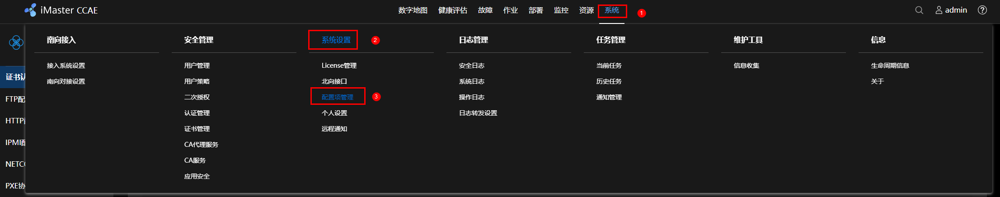
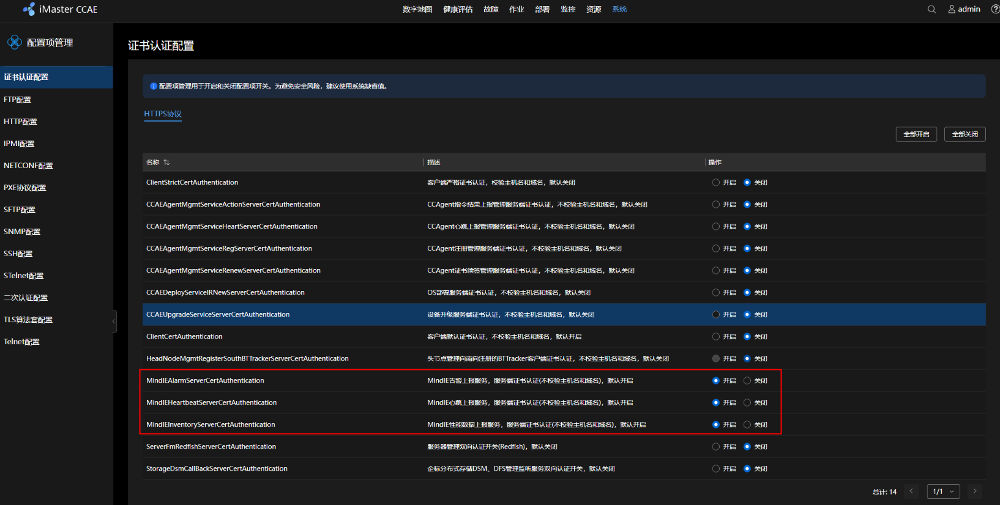
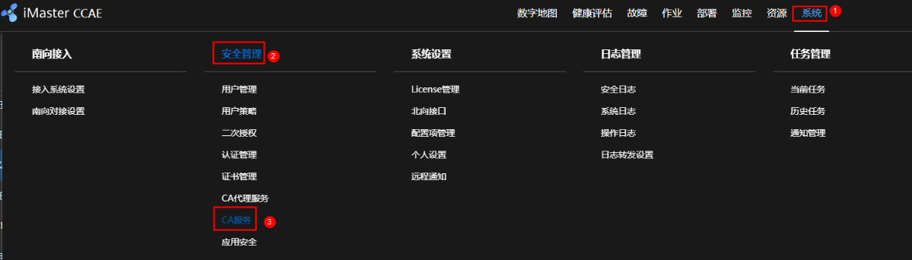
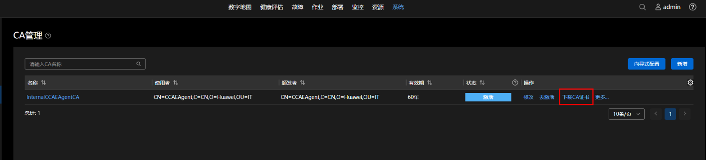
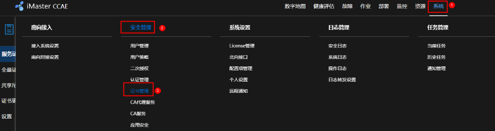
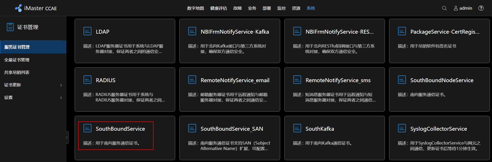
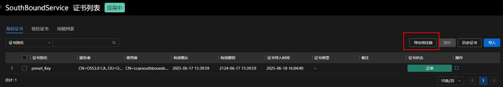
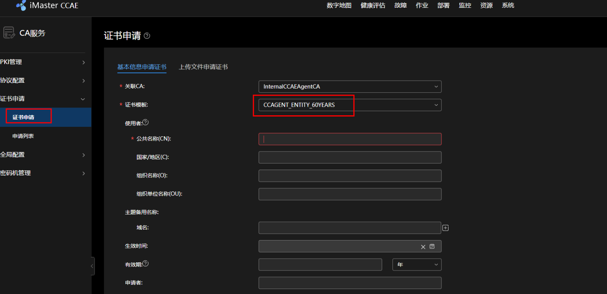
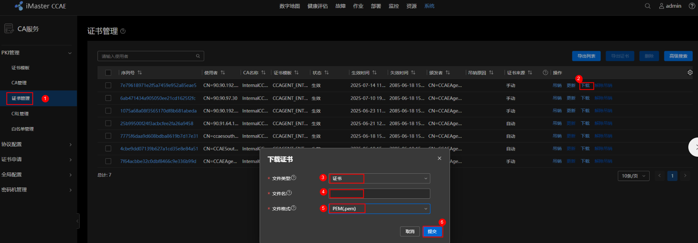
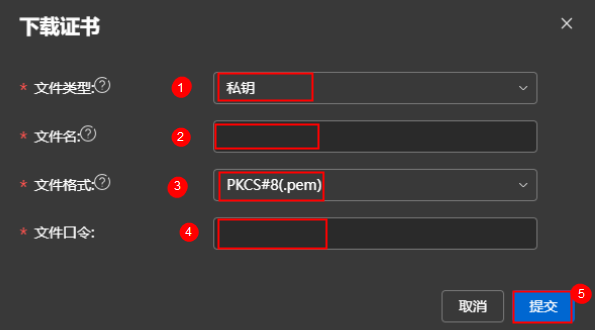

# 性能/精度测试工具

目前MindIE支持AISBench工具进行精度和性能测试，其详细使用方法请参见[AISBench工具](https://gitee.com/aisbench/benchmark)。支持的功能特性及性能测试指标详情请参见以下[表1 工具特性](#table_ptrm001)和[表2 性能测试结果指标](#table_ptrm002)。

**表 1**  工具特性<a name="table_ptrm001"></a>

|特性|AISBench|
|--|--|
|推理模式|支持Client模式|
|推理引擎|MindIE、vLLM、SGLang、TGI、Triton|
|推理模式|支持流式推理和文本推理|
|数据集|支持39个开源数据集和synthetic随机数据集|
|发送模式|支持均匀分布和泊松分布|
|精度测试|支持，介绍链接|
|性能测试|支持，介绍链接|
|token推理|支持，介绍链接|
|Multi LoRA推理|支持，介绍链接|
|Function Call测试|支持，介绍链接|
|多轮对话测试|支持，介绍链接|
|稳态测试|支持，介绍链接|
|压力测试|支持，介绍链接|
|多任务测试|支持，介绍链接|
|过程可视化|支持，介绍链接|
|断点续测|支持，介绍链接|
|自定义数据集|支持，介绍链接|
|支持插件化拓展|支持，介绍链接|


**表 2**  性能测试结果指标<a name="table_ptrm002"></a>

|AISBench|指标含义|
|--|--|
|TTFT|Time To First Token，首token时延该指标在beam search场景下无法测量。|
|ITL|Inter-token Latency，chunk间时延|
|TPOT|Time Per Output Token，decode token间时延，计算公式为：(E2EL - TTFT) / （OutputTokens - 1）该指标在beam search场景下无法测量。|
|E2EL|Ene To End Latency，请求的端到端时延|
|InputTokens|请求的输入token数量|
|OutputTokens|请求的生成token数量|
|PrefillTokenThroughput|请求的prefill吞吐，计算公式为：InputTokens / TTFT|
|OutputTokenThroughput|请求的吞吐，计算公式为：OutputTokens / E2EL|
|Benchmark Duration|性能测试的端到端耗时|
|Total Requests|发送总请求数|
|Failed Requests|失败总请求数|
|Successful Requests|成功总请求数|
|Concurrency|平均并发数，计算公式为：sum(E2EL) / Benchmark Duration|
|Max Concurrency|配置并发数|
|Request Throughput|请求吞吐量，计算公式为：Successful Requests|
|Total Input Tokens|-|所有请求总的输入token数量|
|Total generated tokens|所有请求总的输出token数量|
|Input Token Throughput|本次测试的input token计算速度，计算公式为： Total Input Tokens / Benchmark Duration|
|Output Token Throughput|本次测试的output token计算速度，计算公式为：Total generated tokens / Benchmark Duration|
|Total Token Throughput|本次测试输入输出的总token计算速度，计算公式为：(Total Input Tokens + Total generated tokens)  / Benchmark Duration|

# MindIE探针工具

MindIE Motor提供探针脚本，使能kubernetes探针检测功能，支持启动，存活，就绪三种探针。

脚本适用于以下部署场景：

-   集成Controller、Coordinator和Server的部署场景。
-   仅集成Server  PD混合部署场景。

在MindIE Motor安装路径下，可找到探针入口脚本：$MIES_INSTALL_PATH/scripts/http_client_ctl/probe.sh。

探针的使用命令如[表1](#table244018227454)所示。

**表 1**  探针的使用

|指令|类型|说明|
|--|--|--|
|`bash probe.sh startup`|启动探针|用于判断程序是否已启动，探针触发后设置了60s的超时时间。|
|`bash probe.sh liveness`|存活探针|用于发现程序进程状态是否健康，探针触发后内部设置了60s的请求超时时间。|
|`bash probe.sh readiness`|就绪探针|用于判断程序是否就绪接收流量，探针触发后设置了60s的超时时间。|


使用的环境变量如[表2](#table11103133092913)所示。

**表 2**  环境变量

|环境变量|说明|
|--|--|
|POD_IP|容器Pod IP。|
|MIES_INSTALL_PATH|MindIE Motor安装路径。|
|MINDIE_SERVER_PROBE_ONLY|仅针对Server进行状态探测的标志，设置为1时生效，适用于仅集成部署Server的PD混合场景。|
|GLOBAL_RANK_TABLE_FILE_PATH|全局ranktable文件路径，适用于集成Controller、Coordinator和Server多组件部署的场景。|
|MINDIE_UTILS_HTTP_CLIENT_CTL_CONFIG_FILE_PATH|探针配置文件的读取路径。|
|MINDIE_USE_HTTPS|是否启用HTTPS安全通信，取值为true或false，设置后优先使用该配置替代http_client_ctl.json。建议用户打开，确保通信安全。如果关闭则存在较高的网络安全风险。|
|MINDIE_CHECK_INPUTFILES_PERMISSION|用户可设置是否需要检查外部挂载文件，具体包括http_client_ctl.json以及证书相关文件。默认值为空，表示需要做权限校验。<li>0：对外部挂载文件不做权限校验。<li>非0：对外部挂载文件做权限校验。<br>**当用户使用MINDIE_UTILS_HTTP_CLIENT_CTL_CONFIG_FILE_PATH设置配置文件路径时，http_client_ctl.json为外部挂载文件。**|
|**注：日志相关环境变量详情请参见。**|-|


probe.sh脚本依赖http\_client\_ctl组件发送HTTP请求，请求指令如[表3](#table96741227103714)所示。

**表 3**  http\_client\_ctl命令介绍

|指令|说明|
|--|--|
|./http_client_ctl [ip] [port] [url] [timeout] [retrytime]|<li>[ip]：目标IPv4或IPv6格式的IP地址。<li>[port]：目标端口。取值范围[1024, 65535]。<li>[url]：HTTP请求的URL。<li>[timeout]：请求超时时间，单位秒。取值范围[1, 600]。<li>[retrytime]：重试次数。取值范围[0, 30]。|
|./http_client_ctl -h/--help|命令使用帮助。|


另外，http\_client\_ctl还需配置http\_client\_ctl.json文件，其字段解释如[表4](#table13687127115213)所示。

```
{
     "tls_enable" : true,
     "cert": {
          "ca_cert" : "./security/http_client/ca/ca.pem",
          "tls_cert": "./security/http_client/certs/cert.pem",
          "tls_key": "./security/http_client/keys/cert.key.pem",
          "tls_passwd": "./security/http_client/pass/key_pwd.txt",
          "kmc_ksf_master": "./tools/pmt/master/ksfa",
          "kmc_ksf_standby": "./tools/pmt/standby/ksfb",
          "tls_crl": ""
     },
     "log_info": {
          "log_level": "INFO",
          "to_file": false,
          "run_log_path": "/var/log/mindie-ms/run/log.txt",
          "operation_log_path": "/var/log/mindie-ms/operation/log.txt"
     }
}
```

**表 4**  http\_client\_ctl.json配置说明

|配置类型|配置项|配置介绍|
|--|--|--|
|证书配置|tls_enable|必填。是否开启HTTPS通信，默认为true。<li>true：表示开启；<li>false：表示关闭。<br>建议用户开启，确保通信安全。如果关闭则存在较高的网络安全风险。<br>如设置环境变量MINDIE_USE_HTTPS，则优先读取环境变量的值。|
|证书配置|ca_cert|必填。<br>客户端ca根证书文件路径，该路径真实存在且可读。|
|证书配置|tls_cert|必填。<br>客户端tls证书文件路径，该路径真实存在且可读。|
|证书配置|tls_key|必填。<br>客户端tls私钥文件路径，该路径真实存在且可读。|
|证书配置|tls_passwd|必填。<br>KMC加密的私钥口令的文件路径。|
|证书配置|kmcKsfMaster|必填。<br>加密口令的KMC密钥库文件。|
|证书配置|kmcKsfStandby|必填。<br>加密口令的KMC standby密钥库备份文件。|
|证书配置|tls_crl|必填。<br>证书吊销列表CRL文件路径，该路径存在且可读。如为空，则不进行吊销校验。|
|日志配置|log_level|可选。<br>日志级别。默认值为INFO。<li>DEBUG<li>INFO<li>WARNING<li>ERROR<li>CRITICAL<br>如设置环境变量MINDIEMS_LOG_LEVEL或者MINDIE_LOG_LEVEL，则优先读取环境变量的值，详情请参见日志配置。|
|日志配置|to_file|可选。<br>是否写入到文件。默认值为false。<li>true：输出到文件。<li>false：不输出到文件。<br>如设置环境变量MINDIE_LOG_TO_FILE，则优先读取环境变量的值，详情请参见日志配置。|
|日志配置|run_log_path|运行日志文件路径。建议使用环境变量配置日志，详情请参见日志配置。|
|日志配置|operation_log_path|操作日志文件路径。建议使用环境变量配置日志，详情请参见日志配置。|


若用户开启了HTTPS安全通信，需要设置上述tls\_enable为true，并准备相关证书（CA证书，客户端证书，私钥文件），使用证书管理工具导入后生成KMC加密口令文件，详情请参见[config\_mindie\_server\_tls\_cert.py](config_mindie_server_tls_cert-py.md)。

将证书（包括security和tools目录）导入容器，两种方式如下所示：

-   方式一：在制作镜像的过程中拷贝相关的证书和KMC文件到容器内。
-   方式二：在启动容器时将相关文件通过宿主机挂载方式导入。

最后需将MindIE Motor安装路径下的conf/http\_client\_ctl.json文件"cert"字段中的相关文件路径配置为导入容器后的绝对路径。

# 服务化调优工具
在服务化框架的性能测试中，由于其内部机制不透明（黑盒效应），常出现反直觉现象，例如并发量增加时吞吐量反而降低，或相同配置在不同硬件平台上呈现显著性能差异。msServiceProfiler服务化调优工具的核心价值在于实现服务化框架从“黑盒”到“白盒”的转变，通过全链路性能剖析（Profiling），清晰呈现服务化调度全过程的性能表现。

该工具提供对MindIE Motor推理服务的深度性能数据采集与解析能力：

-   框架调度透视：全面采集服务化框架调度信息、模型推理状态及关键事件（如重计算）的精确时序。
-   性能瓶颈定界：集成MSPTI与msprof能力，同时采集算子级性能数据，支持用户关联分析框架调度与纯模型推理性能，快速定界问题（框架侧或模型侧）。
-   动态采集支持：提供动态性能数据采集能力，只关注核心采集时间段。

借助msServiceProfiler提供的全方位、可视化性能洞察，用户能够深刻理解服务化内部运行机制，从而高效进行性能优化。


>[!NOTE]说明
>以下仅提供服务化调优工具的快速入门，工具更多操作及接口、参数、字段等详细内容介绍请参见《服务化调优工具》。

<br>

**操作步骤**

1.  环境准备。

    请参见《MindIE安装指南》完成MindIE的安装和配置并确认MindIE Motor可以正常运行。

2.  <a name="li104932444507"></a>配置环境变量。

    msServiceProfiler的采集能力需要在部署MindIE Motor服务之前，通过设置环境变量SERVICE\_PROF\_CONFIG\_PATH方能生效。如果环境变量拼写错误，或者没有在部署MindIE Motor服务之前设置环境变量，都无法使能msServiceProfiler的采集能力。

    以ms\_service\_profiler\_config.json文件名为例，执行下列命令配置环境变量。

    ```
    export SERVICE_PROF_CONFIG_PATH="./ms_service_profiler_config.json"
    ```

    SERVICE\_PROF\_CONFIG\_PATH的值需要指定到json文件名，该json文件即为控制性能数据采集的配置文件，比如采集性能元数据存放位置、算子采集开关等等，具体字段介绍参考[4](#li10670349115211)。若路径下无配置文件，工具将自动生成默认配置（采集开关默认为关闭状态）。

3.  运行MindIE Motor服务。

    如果正确配置了环境变量，工具会在服务部署完成之前输出如下[msservice_profiler]开头的日志，说明msServiceProfiler已启动，如下所示。

    ```
    [msservice_profiler] [PID:225] [INFO] [ParseEnable:179] profile enable_: false
    [msservice_profiler] [PID:225] [INFO] [ParseAclTaskTime:264] profile enableAclTaskTime_: false
    [msservice_profiler] [PID:225] [INFO] [ParseAclTaskTime:265] profile msptiEnable_: false
    [msservice_profiler] [PID:225] [INFO] [LogDomainInfo:357] profile enableDomainFilter_: false
    ```

    如果SERVICE\_PROF\_CONFIG\_PATH环境变量所指定的配置文件不存在，工具输出自动创建的日志。以[2](#li104932444507)的配置为例，那么工具输出日志如下。

    ```
    [msservice_profiler] [PID:225] [INFO] [SaveConfigToJsonFile:588] Successfully saved profiler configuration to: ./ms_service_profiler_config.json
    ```

4.  <a name="li10670349115211"></a>数据采集。

    MindIE Motor服务部署成功之后，可以通过修改配置文件中的字段来进行精准控制采集行为。

    ```
    {
    	"enable": 1,
    	"prof_dir": "${PATH}/prof_dir/",
    	"acl_task_time": 0
    ...    # 此处仅以配置上面三个字段为例
    }
    ```

    **表 1**  参数说明

     |参数|说明|是否必选|
     |--|--|--|
     |enable|性能数据采集总开关。取值为：<br>-0：关闭。<br>-1：开启。<br>即便其他开关开启，该开关不开启，仍然不会进行任何数据采集；如果只有该开关开启，只采集服务化性能数据。|是|
     |prof_dir|采集到的性能数据的存放路径，默认值为${HOME}/.ms_server_profiler。<br>该路径下存放的是性能原始数据，需要继续执行后续解析步骤，才能获取可视化的性能数据文件进行分析。<br>在enable为0时，对prof_dir进行自定义修改，随后修改enable为1时生效；在enable为1时，直接修改prof_dir，则修改不生效。|否|
     |acl_task_time|开启采集算子下发耗时、算子执行耗时数据的开关，取值为：<br>-0：关闭。默认值，配置为0或其他非法值均表示关闭。<br>-1：开启。**<br>该功能开启时会占用一定的设备性能，导致采集的性能数据不准确，建议在模型执行耗时异常时开启，用于更细致的分析。<br>算子采集数据量较大，一般推荐集中采集3 ~ 5s，时间过长会导致占用额外磁盘空间，消耗额外的解析时间，从而导致性能定位时间拉长。<br>默认算子采集等级为L0，如果需要开启其他算子采集等级，请参见《服务化调优工具》的完整参数介绍。**|否|


    一般来说，如果enable一直为1，当MindIE Motor推理服务从收到请求的那一刻，工具会一直采集，直到请求结束，prof\_dir下的目录大小也会不断增长，因此推荐用户仅采集关键时间段的信息。

    每当enable字段发生变更时，工具都会输出对应的日志进行告知。

    ```
    [msservice_profiler] [PID:3259] [INFO] [DynamicControl:407] Profiler Enabled Successfully!
    ```

    或者

    ```
    [msservice_profiler] [PID:3057] [INFO] [DynamicControl:411] Profiler Disabled Successfully!
    ```

    每当enable由0改为1时，配置文件中的所有字段都会被工具重新加载，从而实现动态地更新。

5.  数据解析。
    1.  安装环境依赖。

        ```
        python >= 3.10
        pandas >= 2.2
        numpy >= 1.24.3
        psutil >= 5.9.5
        ```

    2.  执行解析命令示例：

        ```
        python3 -m ms_service_profiler.parse --input-path=${PATH}/prof_dir
        ```

        --input-path指定为[4](#li10670349115211)中**prof\_dir**参数指定的路径。

        解析完成后默认在命令执行目录下生成解析后的性能数据文件。

6.  调优分析。

    解析后的性能数据包含db格式、csv格式和json格式，用户可以通过csv进行请求、调度等不同维度的快速分析，也可以通过MindStudio Insight工具导入db文件或者json文件进行可视化分析，详细操作和分析说明请参见《MindStudio Insight 用户指南》中的“服务化调优”章节。

# MindIE Service Tools

## CertTools

### 功能介绍

CertTools用于管理证书和密钥，其具有3个子组件，分别为config_mindie_server_tls_cert.py、二进制文件seceasy_encrypt和二进制文件gen_cert。

### config_mindie_server_tls_cert.py

**脚本功能**

EndPoint开启HTTPS时，使用该脚本对证书进行管理，主要功能如下：

<li>生成服务证书
<li>导入CA证书
<li>删除CA证书
<li>导入服务证书和私钥
<li>删除服务证书和私钥
<li>导入更新吊销列表
<li>查询已导入证书信息
<li>恢复CA证书
<li>恢复服务证书

>[!NOTE]说明
>CA（Certificate Authority，证书颁发机构）证书用于验证其他证书的合法性。服务证书（Server Certificate）用于服务端的验证，通常用于SSL/TLS通信中验证服务端身份。

**参数说明**

|参数类型|参数名|参数说明|
|--|--|--|
|位置参数|<project_path>|软件包安装路径。|
|位置参数|<sub_command>|子命令类型，包括[gen_cert, import_ca, delete_ca, import_cert, delete_cert, import_crl, query, restore_ca, restore_cert]，分别对应生成证书，导入CA证书，删除CA证书，导入服务证书和私钥，删除服务证书和私钥，导入更新吊销列表，查询已导入证书信息，恢复CA证书，恢复服务证书。各个子命令的使用方法请参见使用指南。|
|选项参数|--business|需要证书管理业务类型，默认为HTTPS证书，可以设置为[management, grpc]，分别对应HTTPS management证书和gRPC证书。|
|选项参数|--ip|证书的IP，如果不设置证书，则使用None代替。|

<br>

**证书规范**

-   CA证书规范：
    -   证书必须使用X.509 v3标准。
    -   证书必须未过期。
    -   证书建议使用sha256WithRSAEncryption或sha512WithRSAEncryption算法签名。
    -   证书建议包含Certificate Signature和cRLSign字段。
    -   RSA密钥长度必须不低于3072比特。

-   Cert服务证书规范：
    -   证书必须使用X.509 v3标准。
    -   证书必须未过期。
    -   证书建议使用sha256WithRSAEncryption或sha512WithRSAEncryption算法签名。
    -   证书建议包含Certificate Signature和cRLSign字段。
    -   RSA密钥长度必须不低于3072比特。
    -   证书和私钥必须匹配。

-   CRL吊销列表规范：
    -   吊销列表未过期。
    -   吊销列表非空。

**前置配置**

```
# 缺失的包
pip3 install pyOpenSSL

# 开启日志
export MINDIE_LOG_TO_FILE=1
export MINDIE_LOG_TO_STDOUT=1

# 日志配置
export MINDIE_LOG_LEVEL=INFO
export MINDIE_LOG_PATH=~/mindie/log   # 日志保存文件夹 
```

**使用指南**

-   准备CA证书及CA证书密钥。

    为了实现HTTPS通信，需要特定的CA获取CA证书，获取证书中应包括CA密钥。

-   生成证书。

    ```
    cd /{MindIE安装目录}/latest/mindie-service/ #进入MindIE Motor安装目录
    ```

    ```
    python3 scripts/config_mindie_server_tls_cert.py 软件包安装目录 gen_cert CA证书配置文件路径 --ip 证书ip
    # 样例 
    python3 scripts/config_mindie_server_tls_cert.py /home/Ascend-mindie-service_{version}_linux-{arch} gen_cert /home/Ascend-mindie-service_{version}_linux-{arch}/conf/gen_cert.json --ip=1.1.1.1,2.2.2.2
    ```

-   对CA证书进行导入/更新。

    ```
    python3 scripts/config_mindie_server_tls_cert.py 软件包安装目录 import_ca CA文件列表（不超过5个）
    # 样例 
    python3 scripts/config_mindie_server_tls_cert.py /home/Ascend-mindie-service_{version}_linux-{arch} import_ca /home/ca.pem /home/ca2.pem
    ```

-   对已导入的CA文件进行删除。

    ```
    python3 scripts/config_mindie_server_tls_cert.py 软件包安装目录 delete_ca CA文件名称列表（不超过5个）
    # 样例 
    python3 scripts/config_mindie_server_tls_cert.py /home/Ascend-mindie-service_{version}_linux-{arch} delete_ca ca.pem ca2.pem
    ```

-   对服务证书，私钥进行导入/更新（会在弹窗中进行私钥口令输入）。

    ```
    python3 scripts/config_mindie_server_tls_cert.py 软件包安装目录 import_cert 服务证书路径 服务私钥路径
    # 样例 
    python3 scripts/config_mindie_server_tls_cert.py /home/Ascend-mindie-service_{version}_linux-{arch} import_cert /home/server.pem /home/server.key.pem
    ```

-   对服务证书，私钥进行删除。

    ```
    python3 scripts/config_mindie_server_tls_cert.py 软件包安装目录 delete_cert
    # 样例 
    python3 scripts/config_mindie_server_tls_cert.py /home/Ascend-mindie-service_{version}_linux-{arch} delete_cert --cert_file=server.pem --key_file=server.key.pem
    ```

    参数解释：

    -   --cert\_file：客户端证书文件路径；
    -   --key\_file：客户端私钥文件路径。

-   对吊销列表进行导入/更新，CRL配套CA文件列表中的第一个CA文件。

    ```
    python3 scripts/config_mindie_server_tls_cert.py 软件包安装目录 import_crl 吊销列表文件路径
    # 样例 
    python3 scripts/config_mindie_server_tls_cert.py /home/Ascend-mindie-service_{version}_linux-{arch} import_crl /home/server_crl.pem
    ```

-   查询导入的CA证书，服务证书，吊销列表文件详情。

    ```
    python3 scripts/config_mindie_server_tls_cert.py 软件包安装目录 query
    # 样例 
    python3 scripts/config_mindie_server_tls_cert.py /home/Ascend-mindie-service_{version}_linux-{arch} query --cert_file=server.pem --crl_file=server_crl.pem
    ```

    参数解释：

    --crl\_file：客户端吊销列表路径。

-   恢复CA证书。

    ```
    python3 scripts/config_mindie_server_tls_cert.py 软件包安装目录 restore_ca
    # 样例
    python3 scripts/config_mindie_server_tls_cert.py /home/Ascend-mindie-service_{version}_linux-{arch} restore_ca --ca_backup_file=/backup/ca.pem --ca_dst_file=ca.pem
    ```

    参数解释：

    -   --ca\_backup\_file：备份的CA证书路径。
    -   --ca\_dst\_file：将CA证书恢复至指定路径。

-   恢复服务证书。

    ```
    python3 scripts/config_mindie_server_tls_cert.py 软件包安装目录 restore_cert
    # 样例
    python3 scripts/config_mindie_server_tls_cert.py /home/Ascend-mindie-service_{version}_linux-{arch} restore_cert --cert_backup_file=/backup/server.pem --cert_dst_file=server.pem --key_backup_file=/backup/server.key.pem --key_dst_file=server.key.pem
    ```

    参数解释：

    -   --cert\_backup\_file：备份的服务证书路径。
    -   --cert\_dst\_file：将服务证书恢复至指定路径。
    -   --key\_backup\_file：备份的服务证书密钥路径。
    -   --key\_dst\_file：将服务证书密钥恢复至指定路径。

>[!NOTE]说明
>-   HTTPS和gRPC不建议使用同一套安全证书，使用同一套安全证书会导致存在较高的网络安全风险。
>-   导入证书时，对于用户导入CA证书的脚本权限要求为600，服务证书的脚本权限要求为600，私钥证书的脚本权限要求为400，吊销列表证书的脚本权限要求为600。

### seceasy_encrypt

- **encrypt**
<br>

     - 命令功能

          EndPoint开启https时，对服务端密钥口令加密。交互输入明文字符串，输出密文字符串。

     - 命令格式


          ```
          ./seceasy_encrypt --encrypt domainId domainCount
          ```

          >[!NOTE]说明
          >该命令必须在_\{MindIE安装目录\}_/latest/mindie-service/bin目录下执行。

     - 参数说明
          |参数|说明|
          |--|--|
          |domainId|域ID，取值不能大于domainCount，当前业务要求取值为1。|
          |domainCount|域的数量，取值范围为[2,1023]，当前业务要求取值为2。|
     
- **activeKey**
<br>

     - 命令功能

          更新主密钥。

     - 命令格式

          ```
          ./seceasy_encrypt --activeKey domainId domainCount
          ```

          >[!NOTE]说明
          >该命令必须在_\{MindIE安装目录\}_/latest/mindie-service/bin目录下执行。

     - 参数说明

          |参数|说明|
          |--|--|
          |domainId|域ID，取值不能大于domainCount，当前业务要求取值为1。|
          |domainCount|域的数量，取值范围为[2,1023]，当前业务要求取值为2。|

- **secureEraseAllKeystore**
<br>

     - 命令功能

          删除密钥。

          >[!NOTE]说明
          >-   执行该指令后会删除密钥，会导致功能异常。
          >-   仅在卸载Server时需执行该命令。

     - 命令格式

          ```
          ./seceasy_encrypt --secureEraseAllKeystore domainCount
          ```

          >[!NOTE]说明
          >该命令必须在_\{MindIE安装目录\}_/latest/mindie-service/bin目录下执行。

     - 参数说明

          |参数|说明|
          |--|--|
          |domainCount|域的数量，取值范围为[2,1023]，当前业务要求取值为2。|


 - **updateMasterKey**
<br>

     - 命令功能

          更新主密钥。由于工作密钥由主密钥派生，因此更新主密钥也将更新工作密钥。

          >[!NOTE]说明
          >更新主密钥后，旧主密钥仍然能用于解密，新主密钥将用于新来数据的加密。

     - 命令格式

          ```
          ./seceasy_encrypt --updateMasterKey domainId domainCount aheadDays cipherTextFilePath
          ```

          >[!NOTE]说明
          >-   该命令必须在_\{MindIE安装目录\}_/latest/mindie-service/bin目录下执行。
          >-   更新主密钥时将新增一个新主密钥，将原来加密的内容使用旧密钥解密，再使用新密钥加密，之后删除旧主密钥。目前仅支持加密后的内容存储在一个文件中。

     - 参数说明

          |参数|说明|
          |--|--|
          |domainId|域ID，取值不能大于domainCount，当前业务要求取值为1。|
          |domainCount|域的数量，取值范围为[2,1023]，当前业务要求取值为2。|
          |aheadDays|失效多少天前更新主密钥，取值范围为[0, 1825]，1825 = 5 * 365，代表5年。|
          |cipherTextFilePath|加密文件路径，文件中存储使用主密钥加密后的内容。|


### gen_cert

**命令功能**

根据配置文件，离线生成证书、密钥和口令文件。

<br>

**命令格式**

```
./bin/gen_cert configFile ip
```

**参数说明**

|参数|说明|
|--|--|
|configFile|gen_cert.json配置文件的路径。|
|ip|证书的IP，如果不设置证书，则使用None代替。|


gen\_cert.json文件如下所示：

```
{
    "ca_cert": "/path/to/ca.pem",                         # CA证书的路径
    "ca_key": "/path/to/ca.key.pem",                      # CA证书的密钥文件路径
    "ca_key_pwd": "/path/to/ca_passwd.txt",               # CA证书的密钥口令文件路径
    "cert_config": "/path/to/cert_config.json",           # 证书配置文件路径
    "output_path": "/path/to/output_dir",                 # 存放生成文件的目录
    "kmc_ksf_master": "/path/to/tools/pmt/master/ksfa",   # 加解密使用的kmc master文件
    "kmc_ksf_standby": "/path/to/tools/pmt/standby/ksfb"  # 加解密使用的kmc standby文件
}
```

cert\_config.json文件如下所示：

```
{
    "subject": "subject_name",      # 证书主体名称
    "expired_time": 365,            # 证书有效时间(天)
    "serial_number": 123,           # 证书序列号
    "req_distinguished_name": {     # 证书所属组织
        "C": "CN",                  # 国家
        "ST": "Sichuan",            # 省份
        "L": "Chengdu",             # 城市
        "O": "Huawei",              # 公司
        "OU": "Ascend",             # 部门
        "CN": "MindIE"              # 组织
    },
    "alt_names": {                  # 别名
        "IP": [],                   # ip地址
        "DNS": []                   # 域名
    }
}
```

## OM Adapter

### 特性介绍

MindIE的OM Adapter作为中间层组件，向上对接告警管控平台，向下对接Controller和Coordinator组件。由用户自行配置管控平台的IP地址和端口等信息，然后使用boot.sh脚本后台拉起OM Adapter子进程后，子进程将MindIE的心跳、告警、存量资源、日志等信息上报给管控平台。这里以向上对接CCAE管控平台为例，介绍OM Adapter组件的具体对接方法。**该特性只支持在大规模专家并行场景下使用**。

### 使用样例


**限制与约束**

提前在Controller的ms\_controller.json配置文件中配置CCAE管控平台的IP地址和端口信息，如需使用日志上报功能还需配置证书信息。

<br>

**生成OM Adapter对接CCAE证书**

OM Adapter对接CCAE可自行选择是否需要配置证书，如需配置证书，请参考以下操作步骤生成证书。如不需要配置证书，请参见[1](#li2027465725811)登录CCAE管控平台，在证书认证配置页面关闭以MindIE命名开头的三个配置项，并直接参见[配置OM Adapter对接CCAE管控平台](#section2604135155615)进行OM Adapter对接CCAE管控平台。

1. 打开CCAE证书配置开关。
    1.  在CCAE业务面主菜单中选择“系统  >  系统设置  >  配置项管理”，如[图1 配置项管理](#fig1790823617105)所示。

        **图 1**  配置项管理<a name="fig1790823617105"></a>  
        

    2.  在“证书认证配置”页面，找到以MindIE命名开头的三个配置项，在后方“操作”列中选择“开启”，如[图2 证书认证配置](#fig124812229199)所示。

        **图 2**  证书认证配置<a name="fig124812229199"></a>  
        

2.  获取CA证书文件，即为Controller的ms_controller.json配置文件中"ccae_tls_items"字段下"ca_cert"参数所需要配置的文件路径。
    1.  在CCAE业务面主菜单中选择“系统  >  安全管理  >  CA服务”，进入CA证书管理界面，如[图3 CA管理](#fig4103518422)所示。

        **图 3**  CA管理<a name="fig4103518422"></a>  
        

    2.  单击“下载CA证书”下载CA证书，得到一个.pem文件，即为不带信任链的CA证书。

        **图 4**  下载CA证书<a name="fig10396719441"></a>  
        

    3.  在CCAE业务面主菜单中选择“系统  >  安全管理  >  证书管理”，进入“服务列表”页面获取CA证书信任链，如[图5 证书管理](#fig834614510511)所示。

        **图 5**  证书管理<a name="fig834614510511"></a>  
        

    4.  选择“SouthBoundService”，进入“SouthBoundService证书列表”界面。

        **图 6**  SouthBoundService<a name="fig1263102411524"></a>  
        

    5.  单击右上方“导出信任链”按钮，得到一个.pem文件，即为CA证书信任链文件。

        **图 7**  导出信任链<a name="fig29614261127"></a>  
        

    6.  复制CA证书信任链文件中的内容粘贴到CA证书文件后面，即将两个文件内容合并为一个.pem文件，即为完整CA证书文件。

3.  获取tls证书文件和tls私钥，即为Controller的ms_controller.json配置文件中"ccae_tls_items"字段下"tls_cert"和"tls_key"参数所需要配置的文件路径。
    1.  在CCAE业务面主菜单中选择“系统  >  安全管理  >  CA服务”，进入“CA服务”界面，如[图8 CA服务](#fig13969591238)所示。

        **图 8**  CA服务<a name="fig13969591238"></a>  
        

    2.  在左侧导航栏中选择“证书申请  >  证书申请”，进入“证书申请”界面，在“基本信息申请证书”页签输入以下内容，然后提交申请，如[图9 证书申请](#fig134037181238)所示。

        -   关联CA：为[2.b](#li8288111234111)中下载的CA名称。
        -   证书模板：选择“CCAGENT_ENTITY_60YEARS”。
        -   公共名称(CN)：用户自定义名称。

        **图 9**  证书申请<a name="fig134037181238"></a>  
        

    3.  在左侧导航栏中选择“PKI  \>  证书管理”，进入“证书管理”界面，如[图10 获取tls证书文件](#fig521415100485)所示。

        选择需要下载的证书，单击后方的“下载”按钮，在“下载证书”弹窗中填充以下信息，然后单击“提交”进行下载。

        -   文件类型：选择“证书”。
        -   文件名：需要用户自定义，如“tls\_cert”。
        -   文件格式：选择“PEM(.pem)”。

        **图 10**  获取tls证书文件<a name="fig521415100485"></a>  
        

    4.  在[3.c](#li1371271219172)中“下载证书”弹窗中填充以下信息，然后单击“提交”进行下载即可获取tls私钥，如[图11 获取tls私钥](#fig3321229115517)所示。

        -   文件类型：选择“私钥”。
        -   文件名：需要用户自定义，如“tls\_key”。
        -   文件格式：选择“PKCS#8(.pem)”。

        -   文件口令：需要用户自定义。

        **图 11**  获取tls私钥<a name="fig3321229115517"></a>  
        

4.  <a name="li85842047175916"></a>获取密文数据，即为Controller的ms\_controller.json配置文件中"ccae\_tls\_items"字段下"tls\_passwd"参数所需要配置的文件路径。

    该操作需要在MindIE的容器中执行，MindIE镜像中包含生成密文的工具，详情请参见[encrypt](encrypt.md)。

    1.  使用以下命令进入MindIE Service的安装目录。

        ```
        cd /usr/local/Ascend/mindie/latest/mindie-service
        ```

    2.  使用以下命令生成密文。

        ```
        ./bin/seceasy_encrypt --encrypt 1 2
        ```

    3.  根据回显提示输入[3.d](#li109144522235)获取tls私钥文件时配置的口令，即可在encrypted:后方生成密文，如下所示。

        ```
        root@mindie-controller-master-0:/usr/local/Ascend/mindie/latest/mindie-service# ./bin/seceasy_encrypt --encrypt 1 2
        please input the password to encrypt 
        please input the password to encrypt again
        encrypted: AAAAAgAAAAAAAAABAAAQAAAl+zJLrsq6Bduk6QPIWUNIsc+DyyOnVmy2xtrh2AAAAAEAAAAEAAAAAAAAAGXqKpZ+ZKbuFdCHBZH9ZYCYOTBTbxyIlRQ=
        ```

    4.  自行创建一个.txt文件，将encrypted:后方生成密文复制至该.txt文件中即可。

5.  [4](#li85842047175916)执行完成后，会在当前目录生成一个/tools文件夹，该文件夹中的/tools/pmt/master/ksfa和/tools/pmt/standby/ksfb即为Controller的ms_controller.json配置文件中"ccae_tls_items"字段下"kmc_ksf_master"和"kmc_ksf_standby"参数所需要配置的文件路径。
   

6.  将[2](#li7101714411)\~[5](#li92514562597)中获取的文件或目录放在物理机同一目录下，以/mnt为例，如果环境中没有该目录，请使用以下自行创建。

    ```
    mkdir /mnt
    ```
<br>

**配置OM Adapter对接CCAE管控平台**

1.  在Controller的ms\_controller.json配置文件中自行配置CCAE管控平台的IP地址和端口信息（10~13行）。

    ```
    {
      "allow_all_zero_ip_listening": false,
      "deploy_mode": "pd_separate",
      "initial_dist_server_port": 10000,
      "cluster_port":8899,
      "process_manager" : {
        "to_file": true,
        "file_path": "./logs/controller_process_status.json"
      },
      "ccae": {
        "ip": "xxx.xxx.xxx.xxx",
        "port": 31948
      },
      "cluster_status" : {
        "to_file": true,
        "file_path": "./logs/cluster_status_output.json"
      },
    ...
    }
    ```

2.  （可选）开启证书校验，其中证书路径需挂载到容器可见路径下。证书生成方式请参见[生成OM Adapter对接CCAE证书](#section7584102751117)。
    1.  将证书路径挂载至容器目录，该操作需要在deployment/controller\_init.yaml文件中进行挂载，挂载路径如以下配置文件中加粗内容所示。

        ```
        apiVersion: mindxdl.gitee.com/v1
        kind: AscendJob
        metadata:
          name: mindie-ms-controller        #以具体任务为准, xxxx默认mindie-ms
          namespace: mindie            #以MindIE为准，用户可修改
          labels:
            framework: pytorch
            app: mindie-ms-controller      #固定
            jobID: xxxx               # 推理任务的名称，用户需配置，追加，xxxx默认mindie-ms
            ring-controller.atlas: ascend-xxxx
        spec:
          schedulerName: volcano   # work when enableGangScheduling is true
          runPolicy:
            schedulingPolicy:      # work when enableGangScheduling is true
              minAvailable: 1      # 保持和replicas一致
              queue: default
          successPolicy: AllWorkers
          replicaSpecs:
            Master:
              replicas: 1           # controller的副本数
              restartPolicy: Always
              template:
                metadata:
                  labels:
                    #ring-controller.atlas: ascend-xxxx
                    app: mindie-ms-controller
                    jobID: xxxx      #推理任务的名称，用户需配置，追加，xxxx默认为mindie
                spec:                              # 保持默认值
                  affinity:
                    podAntiAffinity:
                      requiredDuringSchedulingIgnoredDuringExecution:
                        - labelSelector:
                            matchExpressions:
                              - key: app
                                operator: In
                                values:
                                  - mindie-ms-controller
                          topologyKey: kubernetes.io/hostname
                  nodeSelector:
                    # masterselector: dls-master-node
                    accelerator: huawei-Ascend310P
                    # machine-id: "7"
                  terminationGracePeriodSeconds: 0
                  automountServiceAccountToken: false
                  securityContext:
                    fsGroup: 1001
                  containers:
                    - image: mindie:dev-2.0.RC1-B087-800I-A2-py311-ubuntu22.04-aarch64
                      imagePullPolicy: IfNotPresent
                      name: ascend
                      securityContext:
                        # allowPrivilegeEscalation: false
                        privileged: true
                        capabilities:
                          drop: [ "ALL" ]
                        seccompProfile:
                          type: "RuntimeDefault"
                      readinessProbe:
                        exec:
                          command:
                            - bash
                            - -c
                            - "$MIES_INSTALL_PATH/scripts/http_client_ctl/probe.sh readiness"
                        periodSeconds: 5
                      livenessProbe:
                        exec:
                          command:
                            - bash
                            - -c
                            - "$MIES_INSTALL_PATH/scripts/http_client_ctl/probe.sh liveness"
                        periodSeconds: 5
                      startupProbe:
                        exec:
                          command:
                            - bash
                            - -c
                            - "$MIES_INSTALL_PATH/scripts/http_client_ctl/probe.sh startup"
                        periodSeconds: 5
                        failureThreshold: 100
                      env:
                        - name: POD_IP
                          valueFrom:
                            fieldRef:
                              fieldPath: status.podIP
                        - name: GLOBAL_RANK_TABLE_FILE_PATH
                          value: "/user/serverid/devindex/config/..data/global_ranktable.json"
                        - name: MIES_INSTALL_PATH
                          value: $(MINDIE_USER_HOME_PATH)/Ascend/mindie/latest/mindie-service
                        - name: CONFIG_FROM_CONFIGMAP_PATH
                          value: /mnt/configmap
                        - name: CONTROLLER_LOG_CONFIG_PATH
                          value: /root/mindie
                      envFrom:
                        - configMapRef:
                            name: common-env
                      command: [ "/bin/bash", "-c", "
                          /mnt/configmap/boot.sh; \n
                      " ]
                      resources:
                        requests:
                          memory: "2Gi"
                          cpu: "4"
                        limits:
                          memory: "4Gi"
                          cpu: "8"
                      volumeMounts:
                        - name: global-ranktable
                          mountPath: /user/serverid/devindex/config
                        - name: mindie-http-client-ctl-config
                          mountPath: /mnt/configmap/http_client_ctl.json
                          subPath: http_client_ctl.json
                        - name: python-script-get-group-id
                          mountPath: /mnt/configmap/get_group_id.py
                          subPath: get_group_id.py
                        - name: boot-bash-script
                          mountPath: /mnt/configmap/boot.sh
                          subPath: boot.sh
                        - name: mindie-ms-controller-config
                          mountPath: /mnt/configmap/ms_controller.json
                          subPath: ms_controller.json
                        - name: status-data
                          mountPath: /usr/local/Ascend/mindie/latest/mindie-service/logs
                        - name: localtime
                          mountPath: /etc/localtime
                        - name: mnt
                          mountPath: /mnt
                  volumes:
                    - name: localtime
                      hostPath:
                        path: /etc/localtime
                    - name: global-ranktable
                      configMap:
                        name: global-ranktable
                        defaultMode: 0640
                    - name: mindie-http-client-ctl-config
                      configMap:
                        name: mindie-http-client-ctl-config
                        defaultMode: 0640
                    - name: python-script-get-group-id
                      configMap:
                        name: python-script-get-group-id
                        defaultMode: 0640
                    - name: boot-bash-script
                      configMap:
                        name: boot-bash-script
                        defaultMode: 0550
                    - name: mindie-ms-controller-config
                      configMap:
                        name: mindie-ms-controller-config
                        defaultMode: 0640
                    - name: status-data
                      hostPath:
                        path: /data/mindie-ms/status
                        type: Directory
                    - name: mnt
                      hostPath:
                        path: /mnt
        ```

    2.  在Controller组件中的user\_config.json配置文件中配置证书校验（2~4行）。

        CCAE证书配置时需要将“tls\_enable”字段置为“true”或“null”：

        -   当“tls\_enable”为“true”时，所有“xxx\_tls\_enable”会置为“true”且所有“xxx\_tls\_enable”的配置项会生效；
        -   当“tls\_enable”为“null”时，“tls\_config”中所有配置项根据自身内容生效；
        -   当“tls\_enable”为“false”时，所有“xxx\_tls\_enable”会置为“false”且所有“xxx\_tls\_enable”的配置项不会生效。

        ```
        ...    
              "tls_config": {
              "tls_enable": true,
              "kmc_ksf_master": "./security/master/tools/pmt/master/ksfa",
              "kmc_ksf_standby": "./security/standby/tools/pmt/standby/ksfb",
              "infer_tls_enable": true,
              "infer_tls_items": {
                "ca_cert": "./security/infer/security/certs/ca.pem",
                "tls_cert": "./security/infer/security/certs/cert.pem",
                "tls_key": "./security/infer/security/keys/cert.key.pem",
                "tls_passwd": "./security/infer/security/pass/key_pwd.txt",
                "tls_crl": "infer"
              },
              "management_tls_enable": true,
              "management_tls_items": {
                "ca_cert": "./security/management/security/certs/ca.pem",
                "tls_cert": "./security/management/security/certs/cert.pem",
                "tls_key": "./security/management/security/keys/cert.key.pem",
                "tls_passwd": "./security/management/security/pass/key_pwd.txt",
                "tls_crl": "management"
              },
              "ccae_tls_enable": true,
              "ccae_tls_items": {
                "ca_cert": "./security/ccae/security/certs/ca.pem",
                "tls_cert": "./security/ccae/security/certs/cert.pem",
                "tls_key": "./security/ccae/security/keys/cert.key.pem",
                "tls_passwd": "./security/ccae/security/pass/key_pwd.txt",
                "tls_crl": "ccae"
              },
               ...
            }
        ...
        ```

        >[!NOTE]说明
        >Controller容器调度的物理机节点上需要放置证书，才能保证Controller的容器中能访问到证书路径；Coordinator默认随机调度，可以修改Coordinator的调度标签或者在每一个节点上都放置证书，保证Coordinator的容器中能访问到证书路径。

3.  （可选）设置以下环境变量开启性能管控。

    ```
    export MIES_SERVICE_MONITOR_MODE=1
    ```

    >[!NOTE]说明
    >启动服务前需确保主机时间与当地时间对齐，否则会导致CCAE平台观测到的性能数据对应时间不准确。

4.  执行以下命令启动MindIE。

    ```
    python deploy_ac_job.py
    ```

5.  服务启动后，OM Adapter将心跳、告警、日志、inventory等信息上报给CCAE管控平台，具体告警信息请参见[告警参考](告警参考.md)章节。

### 告警参考

**0xFC001000 Controller Slave To  Master**

<br>

**事件解释**

当备Controller升级为主Controller时，上报Controller主备倒换事件。

<br>

**事件属性**
|事件ID|事件级别|事件类型|
|--|--|--|
|0xFC001000|重要|保护倒换|

<br>

**事件参数**

描述定位信息中的参数和附加信息中的参数。

|类别|参数名称|参数含义|
|--|--|--|
|定位信息|servicename|组件名称“Controller”|
|定位信息|service ip|组件“Controller”IP|
|附加信息|servicename|组件名称“Controller”|
|附加信息|service ip|组件“Controller”IP|
|附加信息 |pod id|模型ID|

<br>

**对系统的影响**

主Controller发生异常，备Controller接替主Controller承担业务逻辑，加载最新状态，恢复主Controller业务，确保业务连续性。

<br>

**可能原因**

软硬件故障导致原来的主Controller异常。

<br>

**处理步骤**

1.  查看原主Controller所在服务器是否发生硬件故障。
2.  查看原主Controller日志当中是否有软件故障发生。
  
<br>

**事件清除**

事件上报无需针对性清除。

<br>

**0xFC001001 Service Level Degradation Alarm**

<br>

**告警解释**

-   告警上报

    检测Server可用节点数减少时，上报此告警。

-   告警恢复

    检测到Server可用节点数恢复到告警前数目时，该告警自动清除。

**告警属性**

|告警ID|告警级别|告警类型|
|--|--|--|
|0xFC001001|紧急|状态改变|

<br>

**告警参数**

描述定位信息中的参数和附加信息中的参数。

|类别|参数名称|参数含义|
|--|--|--|
|定位信息|servicename|组件名称“Controller”|
|附加信息|servicename|组件名称“Controller”|
|附加信息|mindie server ip|异常Server IP|
|附加信息|prefill_inst/decode_inst|告警时存活Prefill实例数量和Decode实例数量|

<br>

**对系统的影响**

MindIE nodes发生缩容，服务最大吞吐能力下降。

<br>

**可能原因**

-   软件故障导致Prefill实例、Decode实例数减少。
-   硬件故障导致Prefill实例、Decode实例数减少。

<br>

**处理步骤**

1.  <a name="p259mcpsimp"></a>查看Controller日志中可用节点变更情况。
2.  根据[1](#p259mcpsimp)排查结论获取对应Server日志进一步诊断。

<br>

**告警清除**

此告警修复后，系统会自动清除此告警，无需手工清除。

<br>

**0xFC001002 Model Instance Exception Alarm**

<br>

**告警解释**

-   告警上报

    当PD分离实例状态异常，Controller进行缩容时，产生此告警。此告警伴随0xFC001003事件。

-   告警恢复

    当PD实例状态恢复后，Controller重新将实例扩回，上报PD分离实例异常告警消除。

<br>

**告警属性**

|告警ID|告警级别|告警类型|
|--|--|--|
|0xFC001002|紧急|状态改变|

<br>

**告警参数**

描述定位信息中的参数和附加信息中的参数。

|类别|参数名称|参数含义|
|--|--|--|
|定位信息|servicename|组件名称“Controller”|
|定位信息|inst_id|异常实例ID|
|附加信息|servicename|组件名称“Controller”|
|附加信息|inst_id|异常实例ID|
|附加信息|pod id|模型ID|

<br>

**对系统的影响**

PD分离实例异常导致服务最大吞吐能力下降或服务不可用。

<br>

**可能原因**

软硬件故障实例异常。

<br>

**处理步骤**

1.  查看PD实例所在服务器是否发生硬件故障。
2.  查看Controller日志当中是否有PD实例软件故障发生。

<br>

**告警清除**

此告警修复后，系统会自动清除此告警，无需手工清除。

<br>

**0xFC001003 MindIE Server Exception Alarm**

<br>

**事件解释**

Controller检测到Server状态异常时，上报状态异常事件。

<br>

事件属性

|事件ID|事件级别|事件类型|
|--|--|--|
|0xFC001003|重要|状态改变|

<br>


**事件参数**

描述定位信息中的参数和附加信息中的参数。

|类别|参数名称|参数含义|
|--|--|--|
|定位信息|servicename|组件名称“Controller”|
|定位信息|mindie server ip|异常Server IP|
|附加信息|servicename|组件名称“Controller”|
|附加信息|mindie server ip|异常Server IP|
|附加信息|pod id|模型ID|

<br>

**对系统的影响**

Server进程出现异常。

<br>

**可能原因**

-   Server无响应。
-   Server响应异常状态。
-   P实例或者D实例故障恢复重启，主动触发Server重启。

<br>

**处理步骤**

1.  查看事件reasonID是否因为P实例或者D实例故障恢复重启，主动触发Server重启。
2.  查看异常状态的Server所在服务器是否发生硬件故障。
3.  根据异常状态Server的日志查看是否有软件故障。

<br>

**事件清除**

事件上报无需针对性清除。

<br>

**0xFC001004 Coordinator Service Exception Alarm**

<br>

**告警解释**

-   告警上报

    当Coordinator检测到自身健康状态异常或无可用的P实例或者D实例时，上报此告警。

-   告警恢复

    当Coordinator检测到自身健康状态恢复且存在可用P、D实例时，上报该告警消除。

<br>

**告警属性**

|告警ID|告警级别|告警类型|
|--|--|--|
|0xFC001004|紧急|业务质量告警|

<br>

**告警参数**

描述定位信息中的参数和附加信息中的参数。

|类别|参数名称|参数含义|
|--|--|--|
|定位信息|servicename|组件名称“Coordinator”|
|定位信息|service ip|组件“Coordinator”ip|
|附加信息|servicename|组件名称“Coordinator”|
|附加信息|service ip|组件“Coordinator”ip|
|附加信息|pod id|模型ID|

<br>

**对系统的影响**

Coordinator服务状态异常时，系统无法正常推理请求。

<br>

**可能原因**

-   无可用P或者D实例组。
-   Coordinator自身状态异常。

<br>

**处理步骤**

1.  检查集群硬件状态。
2.  查看Coordinator日志当中是否有软件故障发生。

<br>

**告警清除**

当健康状态恢复和存在可用P、D实例时，该告警自动清除。

<br>

**0xFC001005 Coordinator Request Congestion Alarm**

<br>

**事件解释**

当Coordinator检测到请求数量高于最大请求数量85%时，上报请求拥塞。

当Coordinator检测到请求数量低于最大请求数量75%时，上报请求拥塞消除。

<br>

**事件属性**

|事件ID|事件级别|事件类型|
|--|--|--|
|0xFC001005|紧急|状态改变|

<br>

**事件参数**

描述定位信息中的参数和附加信息中的参数。

|类别|参数名称|参数含义|
|--|--|--|
|定位信息|servicename|组件名称“Coordinator”|
|定位信息|service ip|组件“Coordinator”IP|
|附加信息|servicename|组件名称“Coordinator”|
|附加信息|service ip|组件“Coordinator”IP|
|附加信息|pod id|模型ID|
|附加信息|additional Information|附加信息|

<br>

**对系统的影响**

仅事件上报，对系统无影响。

<br>

**可能原因**

Coordinator正在处理的请求拥塞。

<br>

**处理步骤**

无

<br>

**事件清除**

事件上报无需针对性清除。

<br>

**0xFC001006 MindCluster Connection Exception Alarm**

<br>

**告警解释**

-   告警上报

    当Controller检测到和MindCluster之间的gRPC长链接建立连接失败、中断或者订阅服务失败时，上报此告警。

-   告警恢复

    当Controller检测到gRPC长链接或订阅服务恢复时，上报该告警消除。

<br>

**告警属性**

|告警ID|告警级别|告警类型|
|--|--|--|
|0xFC001006|紧急|状态改变|

<br>

**告警参数**

描述定位信息中的参数和附加信息中的参数

|类别|参数名称|参数含义|
|--|--|--|
|定位信息|service name|组件名称“Controller”|
|定位信息|service ip|组件“Controller”IP|
|附加信息|Service name|组件名称“Controller”|
|附加信息|service ip|组件“Controller”IP|
|附加信息|cluster ip|组件“MindCluster”IP|
|附加信息|pod id|模型ID|

<br>

**对系统的影响**

Controller和MindCluster之间gRPC长链接中断时，Controller与MindCluster之间的数据传输中断，Controller无法从MindCluster获取所需数据，可能导致业务操作无法继续进行。

<br>

**可能原因**

-   集群服务连接失败。
-   订阅RankTable失败。
-   订阅故障消息失败。
-   连接中断。

<br>

**处理步骤**

-   确保Controller与MindCluster之间的网络连接正常。可以尝试使用ping命令或检查路由设置来确认网络可达性。
-   验证MindCluster的IP和端口配置是否正确。
-   确保MindCluster组件正常运行并且没有故障。

<br>

**告警清除**

-   当Controller和MindCluster之间的gRPC长链接恢复时，链接中断告警和订阅服务失败告警将被自动消除。
-   如果是一开始建立链接失败上传的告警不会自动恢复，需要检查各项配置后重新启动服务。


# Node Manager

## 功能介绍

Node Manager是MindIE的节点级健康管理组件，只支持用于**大规模专家并行场景**中拉起对应的推理服务引擎进程，作为Server Endpoint的守护进程，负责进行进程管理和健康管理，执行实例级的推理业务快速恢复流程。


## 配置说明

使用该功能需要在Controller的ms_controller.json配置文件中配置端口信息，此外还需要配置HTTPS证书信息以保证通信传输安全。配置ms_controller.json文件请参见[启动配置文件（ms_controller.json）](#li10670349115211)，
node\_manager.json配置文件样例如下所示，参数解释请参见[表1](#table6896123481516)，用户可根据具体场景进行配置。

```
{
  "version": "v1.0",
  "controller_alarm_port": 1027,
  "node_manager_port": 1028,
  "heartbeat_interval_seconds": 5,
  "tls_config": {
    "server_tls_enable": true,
    "server_tls_items": {
        "ca_cert" : "./security/node_manager/security/certs/ca.pem",
        "tls_cert": "./security/node_manager/security/certs/cert.pem",
        "tls_key": "./security/node_manager/security/keys/cert.key.pem",
        "tls_passwd": "./security/node_manager/security/pass/key_pwd.txt",
        "kmcKsfMaster": "./security/node_manager/tools/pmt/master/ksfa",
        "kmcKsfStandby": "./security/node_manager/tools/pmt/standby/ksfb",
        "tls_crl": ""
    },
    "client_tls_enable": true,
    "client_tls_items": {
        "ca_cert" : "./security/node_manager/security/certs/ca.pem",
        "tls_cert": "./security/node_manager/security/certs/cert.pem",
        "tls_key": "./security/node_manager/security/keys/cert.key.pem",
        "tls_passwd": "./security/node_manager/security/pass/key_pwd.txt",
        "kmcKsfMaster": "./security/node_manager/tools/pmt/master/ksfa",
        "kmcKsfStandby": "./security/node_manager/tools/pmt/standby/ksfb",
        "tls_crl": ""
    }
  }
}
```

**表 1** node\_manager.json配置文件 

|参数名称|取值范围|配置说明|
|--|--|--|
|version|-|版本号。|
|controller_alarm_port|[1024,65535]|必填；默认值为1027。<br>Controller告警服务端端口。|
|node_manager_port|[1024,65535]|必填；默认值为1028。<br>Node Manager服务端端口。|
|heartbeat_interval_seconds|[1,60]，单位为秒|必填；默认值为5s。<br>检测Endpoint健康状态的周期。|
|**tls_config ：HTTPS配置**|-|-|
|server_tls_enable|<li>true：开启。<li>false：关闭。|必填；默认值为true。<br>是否开启Node Manager HTTPS服务端tls。建议用户开启，确保Node Manager与客户端之间的通信安全。如果关闭则存在较高的网络安全风险。|
|**server_tls_items： HTTPS服务端的证书相关配置**|-|-|
|ca_cert|-|开启tls时必填。<br>Node Manager HTTPS服务端ca根证书文件路径，要求该文件真实存在且可读。|
|tls_cert|-|开启tls时必填。<br>Node Manager HTTPS服务端tls证书文件路径，要求该文件真实存在且可读。|
|tls_key|-|开启tls时必填。<br>Node Manager HTTPS服务端tls私钥文件路径，要求该文件真实存在且可读。|
|tls_passwd|-|开启tls时必填。<br>Node Manager HTTPS服务端的KMC加密的私钥口令的文件路径，要求该文件真实存在且可读。|
|kmcKsfMaster|-|开启tls时必填。<br>Node Manager HTTPS服务端加密口令的KMC密钥库文件，要求该文件真实存在且可读。|
|kmcKsfStandby|-|开启tls时必填。<br>Node Manager HTTPS服务端加密口令的KMC standby密钥库备份文件，要求该文件真实存在且可读。|
|tls_crl|-|开启tls时必填。<br>Node Manager HTTPS服务端校验客户端的证书吊销列表CRL文件路径，要求该文件真实存在且可读。如为空，则不进行吊销校验。|
|client_tls_enable：|<li>true：开启。<li>false：关闭。|必填；默认值为true。<br>是否开启Node Manager HTTPS客户端tls。建议用户开启，确保N通信安全。如果关闭则存在较高的网络安全风险。|
|**client_tls_items：HTTPS客户端的证书相关配置**|-|-|
|ca_cert|-|开启tls时必填。<br>Node Manager HTTPS客户端ca根证书文件路径，要求该文件真实存在且可读。|
|tls_cert|-|开启tls时必填。<br>Node Manager HTTPS客户端tls证书文件路径，要求该文件真实存在且可读。|
|tls_key|-|开启tls时必填。<br>Node Manager HTTPS客户端tltls私钥文件路径，要求该文件真实存在且可读。|
|tls_passwd|-|开启tls时必填。<br>Node Manager HTTPS客户端的KMC加密的私钥口令的文件路径，要求该文件真实存在且可读。|
|kmcKsfMaster|-|开启tls时必填。<br>Node Manager HTTPS客户端加密口令的KMC密钥库文件，要求该文件真实存在且可读。|
|kmcKsfStandby|-|开启tls时必填。<br>Node Manager HTTPS服客户端加密口令的KMC standby密钥库备份文件，要求该文件真实存在且可读。|
|tls_crl|-|开启tls时必填。<br>Node Manager HTTPS校验客户端的证书吊销列表CRL文件路径，要求该文件真实存在且可读。如为空，则不进行吊销校验。|

<br>

## 接口API

### 状态查询接口

**接口功能**

查询服务运行健康状态。

<br>

**接口格式**

操作类型：**GET**

```
URL：https://{ip}:{port}/v1/node-manager/running-status
```

>[!NOTE]说明
>-   \{ip\}取server容器内环境变量POD\_IP的值。
>-   \{port\}取配置文件node\_manager.json的"node\_manager\_port"参数值。

<br>

**请求参数**

无

**使用样例**

请求样例：

```
GET https://{ip}:{port}/v1/node-manager/running-status
```

响应样例：

```
{
    "status": 0,
    "errors": []
}
```

**输出说明**

|返回值|类型|说明|
|--|--|--|
|status|int|健康状态。<li>0：服务就绪。<li>1：服务正常。<li>2：服务异常。<li>3：服务暂停。<li>4：服务初始化中。|
|errors|dict|故障信息。|

### 故障处理接口

**接口功能**

接收故障处理指令信息。

<br>

**接口格式**

操作类型：POST

```
URL：https://{ip}:{port}//v1/node-manager/fault-handling-command
```

>[!NOTE]说明
>-   \{ip\}取server容器内环境变量POD\_IP的值。
>-   \{port\}取配置文件node\_manager.json的"node\_manager\_port"参数值。

<br>

**请求参数**

|返回值|类型|说明|
|--|--|--|
|cmd|string|必填。<br>接受故障处理指令。<li>PAUSE_ENGINE：暂停推理引擎。<li>REINIT_NPU：清理NPU。<li>START_ENGINE：启动推理引擎。<li>STOP_ENGINE：停止推理引擎。|

**使用样例**

请求样例：

```
GET https://{ip}:{port}/v1/node-manager/running-status
{
 "cmd": "PAUSE_ENGINE"
}
```

响应样例：

```
{
}
```

**输出说明**

-   状态码200，表示指令执行成功。
-   无响应或状态码为400，表示指令失败。


