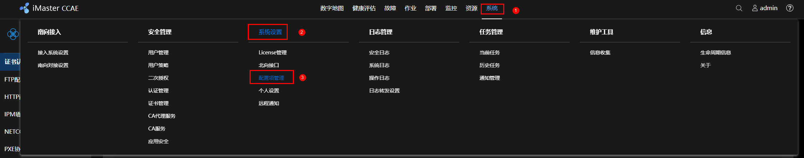
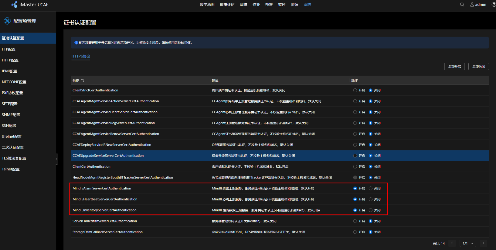
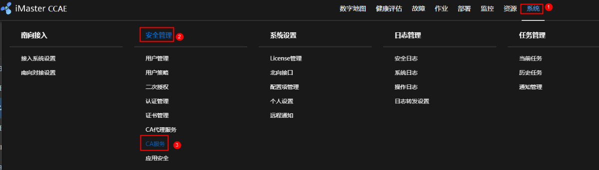
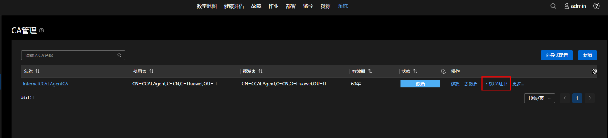
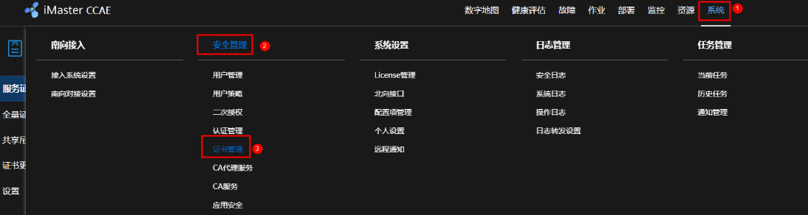
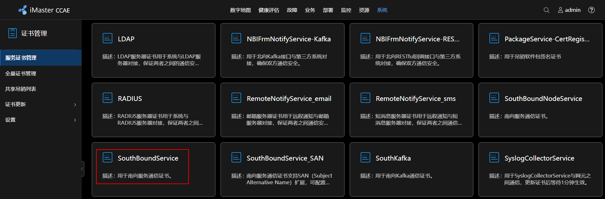
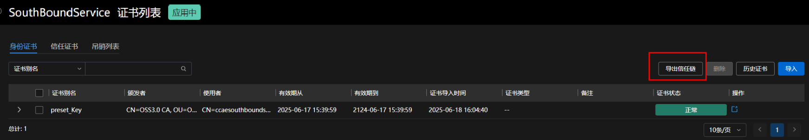
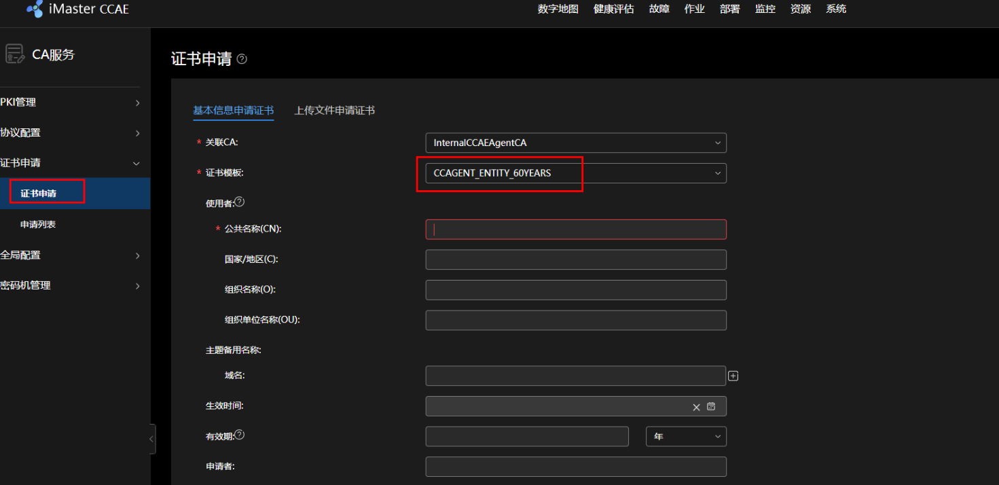
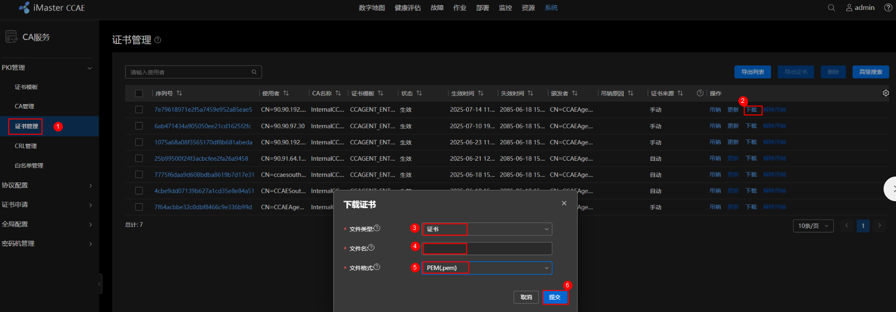
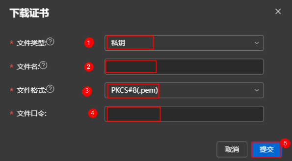

# MindIE Service Tools

## OM Adapter

### 特性介绍

MindIE的OM Adapter作为中间层组件，向上对接告警管控平台，向下对接Controller和Coordinator组件。由用户自行配置管控平台的IP地址和端口等信息，然后使用boot.sh脚本后台拉起OM Adapter子进程后，子进程将MindIE的心跳、告警、存量资源、日志等信息上报给管控平台。这里以向上对接CCAE管控平台为例，介绍OM Adapter组件的具体对接方法。**该特性只支持在大规模专家并行场景下使用**。

### 使用样例

**限制与约束**

提前在Controller的ms_controller.json配置文件中配置CCAE管控平台的IP地址和端口信息，如需使用日志上报功能还需配置证书信息。

<br>

**生成OM Adapter对接CCAE证书**<a id="section7584102751117"></a>

OM Adapter对接CCAE可自行选择是否需要配置证书，如需配置证书，请参考以下操作步骤生成证书。如不需要配置证书，请参见[1](#li2027465725811)登录CCAE管控平台，在证书认证配置页面关闭以MindIE命名开头的三个配置项，并直接参见[配置OM Adapter对接CCAE管控平台](#section001)进行OM Adapter对接CCAE管控平台。

1. <a id="li2027465725811"></a>打开CCAE证书配置开关。
    1. 在CCAE业务面主菜单中选择“系统  >  系统设置  >  配置项管理”，如[图1 配置项管理](#fig1790823617105)所示。

        **图 1**  配置项管理<a id="fig1790823617105"></a>

        

    2. 在“证书认证配置”页面，找到以MindIE命名开头的三个配置项，在后方“操作”列中选择“开启”，如[图2 证书认证配置](#fig124812229199)所示。

        **图 2**  证书认证配置<a id="fig124812229199"></a>

        

2. <a id="li0006"></a>获取CA证书文件，即为Controller的ms_controller.json配置文件中"ccae_tls_items"字段下"ca_cert"参数所需要配置的文件路径。
    1. 在CCAE业务面主菜单中选择“系统  >  安全管理  >  CA服务”，进入CA证书管理界面，如[图3 CA管理](#fig4103518422)所示。

        **图 3**  CA管理<a id="fig4103518422"></a>

        

    2. 单击“下载CA证书”下载CA证书，得到一个.pem文件，即为不带信任链的CA证书。<a id="li0002"></a>

        **图 4**  下载CA证书<a id="fig10396719441"></a>

        

    3. 在CCAE业务面主菜单中选择“系统  >  安全管理  >  证书管理”，进入“服务证书管理”页面获取CA证书信任链，如[图5 证书管理](#fig834614510511)所示。

        **图 5**  证书管理<a id="fig834614510511"></a>

        

    4. 选择“SouthBoundService”，进入“SouthBoundService证书列表”界面。

        **图 6**  SouthBoundService<a id="fig1263102411524"></a>

        

    5. 单击右上方“导出信任链”按钮，得到一个.pem文件，即为CA证书信任链文件。

        **图 7**  导出信任链<a id="fig29614261127"></a>

        

    6. 复制CA证书信任链文件中的内容粘贴到CA证书文件后面，即将两个文件内容合并为一个.pem文件，即为完整CA证书文件。

3. 获取tls证书文件和tls私钥，即为Controller的ms_controller.json配置文件中"ccae_tls_items"字段下"tls_cert"和"tls_key"参数所需要配置的文件路径。
    1. 在CCAE业务面主菜单中选择“系统  >  安全管理  >  CA服务”，进入“CA服务”界面，如[图8 CA服务](#fig13969591238)所示。

        **图 8**  CA服务<a id="fig13969591238"></a>

        

    2. 在左侧导航栏中选择“证书申请  >  证书申请”，进入“证书申请”界面，在“基本信息申请证书”页签输入以下内容，然后提交申请，如[图9 证书申请](#fig134037181238)所示。

        - 关联CA：为[2.b](#li0002)中下载的CA名称。
        - 证书模板：选择“CCAGENT_ENTITY_60YEARS”。
        - 公共名称(CN)：用户自定义名称。

        **图 9**  证书申请<a id="fig134037181238"></a>

        

    3. 在左侧导航栏中选择“PKI管理  >  证书管理”，进入“证书管理”界面，如[图10 获取tls证书文件](#fig521415100485)所示。<a id="li0003"></a>

        选择需要下载的证书，单击后方的“下载”按钮，在“下载证书”弹窗中填充以下信息，然后单击“提交”进行下载。

        - 文件类型：选择“证书”。
        - 文件名：需要用户自定义，如“tls\_cert”。
        - 文件格式：选择“PEM(.pem)”。

        **图 10**  获取tls证书文件<a id="fig521415100485"></a>

        

    4. <a id="li0005"></a>在[3.c](#li0003)中“下载证书”弹窗中填充以下信息，然后单击“提交”进行下载即可获取tls私钥，如[图11 获取tls私钥](#fig3321229115517)所示。

        - 文件类型：选择“私钥”。
        - 文件名：需要用户自定义，如“tls_key”。
        - 文件格式：选择“PKCS#8(.pem)”。

        - 文件口令：需要用户自定义。

        **图 11**  获取tls私钥<a id="fig3321229115517"></a>

        

4. 将以上步骤中获取的文件或目录放在物理机同一目录下，以/mnt为例，如果环境中没有该目录，请使用以下命令自行创建。

    ```bash
    mkdir /mnt
    ```

<br>

**配置OM Adapter对接CCAE管控平台**<a id="section001"></a>

1. 在Controller的ms_controller.json配置文件中自行配置CCAE管控平台的IP地址和端口信息（10~13行）。

    ```json
    {
      "allow_all_zero_ip_listening": false,
      "deploy_mode": "pd_separate",
      "initial_dist_server_port": 10000,
      "cluster_port":8899,
      "process_manager" : {
        "to_file": true,
        "file_path": "./logs/controller_process_status.json"
      },
      "ccae": {
        "ip": "xxx.xxx.xxx.xxx",
        "port": 31948,
        "kafka_port": 26329
      },
      "cluster_status" : {
        "to_file": true,
        "file_path": "./logs/cluster_status_output.json"
      },
    ...
    }
    ```

2. （可选）开启证书校验，其中证书路径需挂载到容器可见路径下。证书生成方式请参见[生成OM Adapter对接CCAE证书](#section7584102751117)。
    1. 将证书路径挂载至容器目录，该操作需要在deployment/controller_init.yaml文件中进行挂载，挂载路径如以下配置文件中加粗内容所示。

        ```yaml
        apiVersion: mindxdl.gitee.com/v1
        kind: AscendJob
        metadata:
          name: mindie-ms-controller        #以具体任务为准, xxxx默认mindie-ms
          namespace: mindie            #以MindIE为准，用户可修改
          labels:
            framework: pytorch
            app: mindie-ms-controller      #固定
            jobID: xxxx               # 推理任务的名称，用户需配置，追加，xxxx默认mindie-ms
            ring-controller.atlas: ascend-xxxx
        spec:
          schedulerName: volcano   # work when enableGangScheduling is true
          runPolicy:
            schedulingPolicy:      # work when enableGangScheduling is true
              minAvailable: 1      # 保持和replicas一致
              queue: default
          successPolicy: AllWorkers
          replicaSpecs:
            Master:
              replicas: 1           # controller的副本数
              restartPolicy: Always
              template:
                metadata:
                  labels:
                    #ring-controller.atlas: ascend-xxxx
                    app: mindie-ms-controller
                    jobID: xxxx      #推理任务的名称，用户需配置，追加，xxxx默认为mindie
                spec:                              # 保持默认值
                  affinity:
                    podAntiAffinity:
                      requiredDuringSchedulingIgnoredDuringExecution:
                        - labelSelector:
                            matchExpressions:
                              - key: app
                                operator: In
                                values:
                                  - mindie-ms-controller
                          topologyKey: kubernetes.io/hostname
                  nodeSelector:
                    # masterselector: dls-master-node
                    accelerator: huawei-Ascend310P
                    # machine-id: "7"
                  terminationGracePeriodSeconds: 0
                  automountServiceAccountToken: false
                  securityContext:
                    fsGroup: 1001
                  containers:
                    - image: mindie:dev-2.0.RC1-B087-800I-A2-py311-ubuntu22.04-aarch64
                      imagePullPolicy: IfNotPresent
                      name: ascend
                      securityContext:
                        # allowPrivilegeEscalation: false
                        privileged: true
                        capabilities:
                          drop: [ "ALL" ]
                        seccompProfile:
                          type: "RuntimeDefault"
                      readinessProbe:
                        exec:
                          command:
                            - bash
                            - -c
                            - "$MIES_INSTALL_PATH/scripts/http_client_ctl/probe.sh readiness"
                        periodSeconds: 5
                      livenessProbe:
                        exec:
                          command:
                            - bash
                            - -c
                            - "$MIES_INSTALL_PATH/scripts/http_client_ctl/probe.sh liveness"
                        periodSeconds: 5
                      startupProbe:
                        exec:
                          command:
                            - bash
                            - -c
                            - "$MIES_INSTALL_PATH/scripts/http_client_ctl/probe.sh startup"
                        periodSeconds: 5
                        failureThreshold: 100
                      env:
                        - name: POD_IP
                          valueFrom:
                            fieldRef:
                              fieldPath: status.podIP
                        - name: GLOBAL_RANK_TABLE_FILE_PATH
                          value: "/user/serverid/devindex/config/..data/global_ranktable.json"
                        - name: MIES_INSTALL_PATH
                          value: $(MINDIE_USER_HOME_PATH)/Ascend/mindie/latest/mindie-service
                        - name: CONFIG_FROM_CONFIGMAP_PATH
                          value: /mnt/configmap
                        - name: CONTROLLER_LOG_CONFIG_PATH
                          value: /root/mindie
                      envFrom:
                        - configMapRef:
                            name: common-env
                      command: [ "/bin/bash", "-c", "
                          /mnt/configmap/boot.sh; \n
                      " ]
                      resources:
                        requests:
                          memory: "2Gi"
                          cpu: "4"
                        limits:
                          memory: "4Gi"
                          cpu: "8"
                      volumeMounts:
                        - name: global-ranktable
                          mountPath: /user/serverid/devindex/config
                        - name: mindie-http-client-ctl-config
                          mountPath: /mnt/configmap/http_client_ctl.json
                          subPath: http_client_ctl.json
                        - name: python-script-get-group-id
                          mountPath: /mnt/configmap/get_group_id.py
                          subPath: get_group_id.py
                        - name: boot-bash-script
                          mountPath: /mnt/configmap/boot.sh
                          subPath: boot.sh
                        - name: mindie-ms-controller-config
                          mountPath: /mnt/configmap/ms_controller.json
                          subPath: ms_controller.json
                        - name: status-data
                          mountPath: $MINDIE_USER_HOME_PATH/lib/python3.11/site-packages/mindie_motor/logs
                        - name: localtime
                          mountPath: /etc/localtime
                        - name: mnt
                          mountPath: /mnt
                  volumes:
                    - name: localtime
                      hostPath:
                        path: /etc/localtime
                    - name: global-ranktable
                      configMap:
                        name: global-ranktable
                        defaultMode: 0640
                    - name: mindie-http-client-ctl-config
                      configMap:
                        name: mindie-http-client-ctl-config
                        defaultMode: 0640
                    - name: python-script-get-group-id
                      configMap:
                        name: python-script-get-group-id
                        defaultMode: 0640
                    - name: boot-bash-script
                      configMap:
                        name: boot-bash-script
                        defaultMode: 0550
                    - name: mindie-ms-controller-config
                      configMap:
                        name: mindie-ms-controller-config
                        defaultMode: 0640
                    - name: status-data
                      hostPath:
                        path: /data/mindie-ms/status
                        type: Directory
                    - name: mnt
                      hostPath:
                        path: /mnt
        ```

    2. 在Controller组件中的user_config.json配置文件中配置证书校验（2~4行）。

        CCAE证书配置时需要将“tls_enable”字段置为“true”或“null”：

        - 当“tls_enable”为“true”时，所有“xxx_tls_enable”会置为“true”且所有“xxx_tls_enable”的配置项会生效；
        - 当“tls_enable”为“null”时，“tls_config”中所有配置项根据自身内容生效；
        - 当“tls_enable”为“false”时，所有“xxx_tls_enable”会置为“false”且所有“xxx_tls_enable”的配置项不会生效。

        ```json
        ...
              "tls_config": {
              "tls_enable": true,
              "kmc_ksf_master": "./security/master/tools/pmt/master/ksfa",
              "kmc_ksf_standby": "./security/standby/tools/pmt/standby/ksfb",
              "infer_tls_enable": true,
              "infer_tls_items": {
                "ca_cert": "./security/infer/security/certs/ca.pem",
                "tls_cert": "./security/infer/security/certs/cert.pem",
                "tls_key": "./security/infer/security/keys/cert.key.pem",
                "tls_passwd": "./security/infer/security/pass/key_pwd.txt",
                "tls_crl": "infer"
              },
              "management_tls_enable": true,
              "management_tls_items": {
                "ca_cert": "./security/management/security/certs/ca.pem",
                "tls_cert": "./security/management/security/certs/cert.pem",
                "tls_key": "./security/management/security/keys/cert.key.pem",
                "tls_passwd": "./security/management/security/pass/key_pwd.txt",
                "tls_crl": "management"
              },
              "ccae_tls_enable": true,
              "ccae_tls_items": {
                "ca_cert": "./security/ccae/security/certs/ca.pem",
                "tls_cert": "./security/ccae/security/certs/cert.pem",
                "tls_key": "./security/ccae/security/keys/cert.key.pem",
                "tls_passwd": "./security/ccae/security/pass/key_pwd.txt",
                "tls_crl": "ccae"
              },
               ...
            }
        ...
        ```

        >[!NOTE]说明
        >Controller容器调度的物理机节点上需要放置证书，才能保证Controller的容器中能访问到证书路径；Coordinator默认随机调度，可以修改Coordinator的调度标签或者在每一个节点上都放置证书，保证Coordinator的容器中能访问到证书路径。

3. 设置以下环境变量开启性能管控。

     - PD混部：在容器内执行以下环境变量即可，多机场景在每个容器都需要执行。
     - PD分离：在examples/kubernetes_deploy_scripts/boot_helper/boot.sh中添加以下环境变量，建议在#！/bin/bash和set_common_env之间添加。

     ```bash
     export MIES_SERVICE_MONITOR_MODE=1
     ```

       >[!NOTE]说明
       >启动服务前需确保主机时间与当地时间对齐，否则会导致CCAE平台观测到的性能数据对应时间不准确。

4. 执行以下命令启动MindIE。

    ```python
    python deploy_ac_job.py
    ```

5. 服务启动约五分钟后，OM Adapter将心跳、告警、日志、inventory等信息上报给CCAE管控平台，具体告警信息请参见[告警参考](#告警参考)章节。

### 告警参考

**0xFC001000 Controller Slave To  Master**

<br>

**事件解释**

当备Controller升级为主Controller时，上报Controller主备倒换事件。

<br>

**事件属性**

|事件ID|事件级别|事件类型|
|--|--|--|
|0xFC001000|重要|保护倒换|

<br>

**事件参数**

描述定位信息中的参数和附加信息中的参数。

|类别|参数名称|参数含义|
|--|--|--|
|定位信息|servicename|组件名称“Controller”|
|定位信息|service ip|组件“Controller”IP|
|附加信息|servicename|组件名称“Controller”|
|附加信息|service ip|组件“Controller”IP|
|附加信息 |pod id|模型ID|

<br>

**对系统的影响**

主Controller发生异常，备Controller接替主Controller承担业务逻辑，加载最新状态，恢复主Controller业务，确保业务连续性。

<br>

**可能原因**

软硬件故障导致原来的主Controller异常。

<br>

**处理步骤**

1. 查看原主Controller所在服务器是否发生硬件故障。
2. 查看原主Controller日志当中是否有软件故障发生。

<br>

**事件清除**

事件上报无需针对性清除。

<br>

**0xFC001001 Service Level Degradation Alarm**

<br>

**告警解释**

- 告警上报

    检测Server可用节点数减少时，上报此告警。

- 告警恢复

    检测到Server可用节点数恢复到告警前数目时，该告警自动清除。

**告警属性**

|告警ID|告警级别|告警类型|
|--|--|--|
|0xFC001001|紧急|状态改变|

<br>

**告警参数**

描述定位信息中的参数和附加信息中的参数。

|类别|参数名称|参数含义|
|--|--|--|
|定位信息|servicename|组件名称“Controller”|
|附加信息|servicename|组件名称“Controller”|
|附加信息|mindie server ip|异常Server IP|
|附加信息|prefill_inst/decode_inst|告警时存活Prefill实例数量和Decode实例数量|

<br>

**对系统的影响**

MindIE nodes发生缩容，服务最大吞吐能力下降。

<br>

**可能原因**

- 软件故障导致Prefill实例、Decode实例数减少。
- 硬件故障导致Prefill实例、Decode实例数减少。

<br>

**处理步骤**

1. <a id="p259mcpsimp"></a>查看Controller日志中可用节点变更情况。
2. 根据[1](#p259mcpsimp)排查结论获取对应Server日志进一步诊断。

<br>

**告警清除**

此告警修复后，系统会自动清除此告警，无需手工清除。

<br>

**0xFC001002 Model Instance Exception Alarm**

<br>

**告警解释**

- 告警上报

    当PD分离实例状态异常，Controller进行缩容时，产生此告警。此告警伴随0xFC001003事件。

- 告警恢复

    当PD实例状态恢复后，Controller重新将实例恢复，上报PD分离实例异常告警消除。

<br>

**告警属性**

|告警ID|告警级别|告警类型|
|--|--|--|
|0xFC001002|紧急|状态改变|

<br>

**告警参数**

描述定位信息中的参数和附加信息中的参数。

|类别|参数名称|参数含义|
|--|--|--|
|定位信息|servicename|组件名称“Controller”|
|定位信息|inst_id|异常实例ID|
|附加信息|servicename|组件名称“Controller”|
|附加信息|inst_id|异常实例ID|
|附加信息|pod id|模型ID|

<br>

**对系统的影响**

PD分离实例异常导致服务最大吞吐能力下降或服务不可用。

<br>

**可能原因**

软硬件故障实例异常。

<br>

**处理步骤**

1. 查看PD实例所在服务器是否发生硬件故障。
2. 查看Controller日志中是否有PD实例软件故障发生。

<br>

**告警清除**

此告警修复后，系统会自动清除此告警，无需手工清除。

<br>

**0xFC001003 MindIE Server Exception Alarm**

<br>

**事件解释**

Controller检测到Server状态异常时，上报状态异常事件。

<br>

事件属性

|事件ID|事件级别|事件类型|
|--|--|--|
|0xFC001003|重要|状态改变|

<br>

**事件参数**

描述定位信息中的参数和附加信息中的参数。

|类别|参数名称|参数含义|
|--|--|--|
|定位信息|servicename|组件名称“Controller”|
|定位信息|mindie server ip|异常Server IP|
|附加信息|servicename|组件名称“Controller”|
|附加信息|mindie server ip|异常Server IP|
|附加信息|pod id|模型ID|

<br>

**对系统的影响**

Server进程出现异常。

<br>

**可能原因**

- Server无响应。
- Server响应异常状态。
- P实例或者D实例故障恢复重启，主动触发Server重启。

<br>

**处理步骤**

1. 查看事件reasonID是否因为P实例或者D实例故障恢复重启，主动触发Server重启。
2. 查看异常状态的Server所在服务器是否发生硬件故障。
3. 根据异常状态Server的日志查看是否有软件故障。

<br>

**事件清除**

事件上报无需针对性清除。

<br>

**0xFC001004 Coordinator Service Exception Alarm**<a id="001004"></a>

<br>

**告警解释**

- 告警上报

    当Coordinator检测到自身健康状态异常或无可用的P实例或者D实例时，上报此告警。

- 告警恢复

    当Coordinator检测到自身健康状态恢复且存在可用P、D实例时，上报该告警消除。

<br>

**告警属性**

|告警ID|告警级别|告警类型|
|--|--|--|
|0xFC001004|紧急|业务质量告警|

<br>

**告警参数**

描述定位信息中的参数和附加信息中的参数。

|类别|参数名称|参数含义|
|--|--|--|
|定位信息|servicename|组件名称“Coordinator”|
|定位信息|service ip|组件“Coordinator”ip|
|附加信息|servicename|组件名称“Coordinator”|
|附加信息|service ip|组件“Coordinator”ip|
|附加信息|pod id|模型ID|

<br>

**对系统的影响**

Coordinator服务状态异常时，系统无法正常进行推理请求。

<br>

**可能原因**

- 无可用P或者D实例组。
- Coordinator自身状态异常。

<br>

**处理步骤**

1. 检查集群硬件状态。
2. 查看Coordinator日志中是否有软件故障发生。

<br>

**告警清除**

当健康状态恢复和存在可用P、D实例时，该告警自动清除。

<br>

**0xFC001005 Coordinator Request Congestion Alarm**

<br>

**事件解释**

当Coordinator检测到请求数量高于最大请求数量85%时，上报请求拥塞。

当Coordinator检测到请求数量低于最大请求数量75%时，上报请求拥塞消除。

<br>

**事件属性**

|事件ID|事件级别|事件类型|
|--|--|--|
|0xFC001005|紧急|状态改变|

<br>

**事件参数**

描述定位信息中的参数和附加信息中的参数。

|类别|参数名称|参数含义|
|--|--|--|
|定位信息|servicename|组件名称“Coordinator”|
|定位信息|service ip|组件“Coordinator”IP|
|附加信息|servicename|组件名称“Coordinator”|
|附加信息|service ip|组件“Coordinator”IP|
|附加信息|pod id|模型ID|
|附加信息|additional Information|附加信息|

<br>

**对系统的影响**

仅事件上报，对系统无影响。

<br>

**可能原因**

Coordinator正在处理的请求拥塞。

<br>

**处理步骤**

无

<br>

**事件清除**

事件上报无需针对性清除。

<br>

**0xFC001006 MindCluster Connection Exception Alarm**

<br>

**告警解释**

- 告警上报

    当Controller检测到和MindCluster之间的gRPC长连接建立连接失败、中断或者订阅服务失败时，上报此告警。

- 告警恢复

    当Controller检测到gRPC长连接或订阅服务恢复时，上报该告警消除。

<br>

**告警属性**

|告警ID|告警级别|告警类型|
|--|--|--|
|0xFC001006|紧急|状态改变|

<br>

**告警参数**

描述定位信息中的参数和附加信息中的参数。

|类别|参数名称|参数含义|
|--|--|--|
|定位信息|service name|组件名称“Controller”|
|定位信息|service ip|组件“Controller”IP|
|附加信息|Service name|组件名称“Controller”|
|附加信息|service ip|组件“Controller”IP|
|附加信息|cluster ip|组件“MindCluster”IP|
|附加信息|pod id|模型ID|

<br>

**对系统的影响**

Controller和MindCluster之间gRPC长连接中断时，Controller与MindCluster之间的数据传输中断，Controller无法从MindCluster获取所需数据，可能导致业务操作无法继续进行。

<br>

**可能原因**

- 集群服务连接失败。
- 订阅RankTable失败。
- 订阅故障消息失败。
- 连接中断。

<br>

**处理步骤**

- 确保Controller与MindCluster之间的网络连接正常。可以尝试使用ping命令或检查路由设置来确认网络可达性。
- 验证MindCluster的IP和端口配置是否正确。
- 确保MindCluster组件正常运行并且没有故障。

<br>

**告警清除**

- 当Controller和MindCluster之间的gRPC长连接恢复时，链接中断告警和订阅服务失败告警将被自动消除。
- 如果是一开始建立链接失败上传的告警不会自动恢复，需要检查各项配置后重新启动服务。

<br>

**0xFC001007 Coordinator与P实例或者D实例业务面通信异常**

<br>

**告警解释**

- 告警上报

    当Coordinator检测到与Prefill或Decode实例的业务面心跳异常时，上报此告警。

- 告警恢复

    故障恢复后，需要手工清除。

<br>

**告警属性**

|告警ID|告警级别|告警类型|
|--|--|--|
|0xFC001007|重要|Coordinator与P实例或D实例业务面通信异常。|

<br>

**告警参数**

描述定位信息中的参数和附加信息中的参数。

|类别|参数名称|参数含义|
|--|--|--|
|定位信息|service name|组件名称“Coordinator”|
|定位信息|service ip|组件“Coordinator”IP|
|定位信息|prefill instance address|对端Prefill实例地址，包含IP和Port|
|定位信息|decode instance address|对端Decode实例地址，包含IP和Port|
|附加信息|Service name|组件名称“Coordinator”|
|附加信息|service ip|组件“Coordinator”IP|
|附加信息|prefill instance address|对端Prefill实例地址，包含IP和Port|
|附加信息|decode instance address|对端Decode实例地址，包含IP和Port|

<br>

**对系统的影响**

Coordinator与Prefill或Decode实例的业务面心跳异常时，系统可能无法正常进行推理请求。

<br>

**可能原因**

Prefill或Decode实例故障。

<br>

**处理步骤**

1. 参见告警的定位信息、附加信息，获取接口不可用的Prefill或Decode实例信息（IP、Port）。
2. 手动发送建连请求**curl https://{ip}:{port}/dresult**，如果返回200，说明重连成功，手动清除该告警；如果返回非200，需要进一步分析Server日志。

<br>

**告警清除**

故障恢复后需要手动清除该告警。

## Node Manager

### 功能介绍

Node Manager是MindIE的节点级健康管理组件，只支持**大规模专家并行场景**中拉起对应的推理服务引擎进程，作为Server Endpoint的守护进程，负责进行进程管理和健康管理，执行实例级的推理业务快速恢复流程。

### 配置说明

使用该功能需要在Controller的ms_controller.json配置文件中配置端口信息，此外还需要配置HTTPS证书信息以保证通信传输安全。配置ms_controller.json文件请参见[启动配置文件（ms_controller.json）](../cluster_management_component/controller.md#配置说明)，
node_manager.json配置文件样例如下所示，参数解释请参见[表1 node_manager.json配置文件](#table0001)，用户可根据具体场景进行配置。

```json
{
  "version": "v1.0",
  "controller_alarm_port": 1027,
  "node_manager_port": 1028,
  "heartbeat_interval_seconds": 5,
  "tls_config": {
    "server_tls_enable": true,
    "server_tls_items": {
        "ca_cert" : "./security/node_manager/security/certs/ca.pem",
        "tls_cert": "./security/node_manager/security/certs/cert.pem",
        "tls_key": "./security/node_manager/security/keys/cert.key.pem",
        "tls_passwd": "./security/node_manager/security/pass/key_pwd.txt",
        "tls_crl": ""
    },
    "client_tls_enable": true,
    "client_tls_items": {
        "ca_cert" : "./security/node_manager/security/certs/ca.pem",
        "tls_cert": "./security/node_manager/security/certs/cert.pem",
        "tls_key": "./security/node_manager/security/keys/cert.key.pem",
        "tls_passwd": "./security/node_manager/security/pass/key_pwd.txt",
        "tls_crl": ""
    }
  }
}
```

**表 1** node_manager.json配置文件<a id="table0001"></a>

|参数名称|取值范围|配置说明|
|--|--|--|
|version|-|版本号。|
|controller_alarm_port|[1024,65535]|必填；默认值为1027。<br>Controller告警服务端端口。|
|node_manager_port|[1024,65535]|必填；默认值为1028。<br>Node Manager服务端端口。|
|heartbeat_interval_seconds|[1,60]，单位为秒|必填；默认值为5s。<br>检测Endpoint健康状态的周期。|
|**tls_config ：HTTPS配置**|-|-|
|server_tls_enable|<ul><li>true：开启。</li><li>false：关闭。</li></ul>|必填；默认值为true。<br>是否开启Node Manager HTTPS服务端tls。建议用户开启，确保Node Manager与客户端之间的通信安全。如果关闭则存在较高的网络安全风险。|
|**server_tls_items： HTTPS服务端的证书相关配置**|-|-|
|ca_cert|-|开启tls时必填。<br>Node Manager HTTPS服务端ca根证书文件路径，要求该文件真实存在且可读。|
|tls_cert|-|开启tls时必填。<br>Node Manager HTTPS服务端tls证书文件路径，要求该文件真实存在且可读。|
|tls_key|-|开启tls时必填。<br>Node Manager HTTPS服务端tls私钥文件路径，要求该文件真实存在且可读。|
|tls_passwd|-|开启tls时必填。<br>Node Manager HTTPS服务端的KMC加密的私钥口令的文件路径，要求该文件真实存在且可读。|
|tls_crl|-|开启tls时必填。<br>Node Manager HTTPS服务端校验客户端的证书吊销列表CRL文件路径，要求该文件真实存在且可读。如为空，则不进行吊销校验。|
|client_tls_enable：|<ul><li>true：开启。</li><li>false：关闭。</li></ul>|必填；默认值为true。<br>是否开启Node Manager HTTPS客户端tls。建议用户开启，确保Node Manager通信安全。如果关闭则存在较高的网络安全风险。|
|**client_tls_items：HTTPS客户端的证书相关配置**|-|-|
|ca_cert|-|开启tls时必填。<br>Node Manager HTTPS客户端ca根证书文件路径，要求该文件真实存在且可读。|
|tls_cert|-|开启tls时必填。<br>Node Manager HTTPS客户端tls证书文件路径，要求该文件真实存在且可读。|
|tls_key|-|开启tls时必填。<br>Node Manager HTTPS客户端tls私钥文件路径，要求该文件真实存在且可读。|
|tls_passwd|-|开启tls时必填。<br>Node Manager HTTPS客户端的KMC加密的私钥口令的文件路径，要求该文件真实存在且可读。|
|tls_crl|-|开启tls时必填。<br>Node Manager HTTPS校验客户端的证书吊销列表CRL文件路径，要求该文件真实存在且可读。如为空，则不进行吊销校验。|

<br>

### 接口API

#### 状态查询接口

**接口功能**

查询服务运行健康状态。

<br>

**接口格式**

操作类型：**GET**

```json
URL：https://{ip}:{port}/v1/node-manager/running-status
```

>[!NOTE]说明
>
>- {ip}取server容器内环境变量POD_IP的值。
>- {port}取配置文件node_manager.json的"node_manager_port"参数值。

<br>

**请求参数**

无

**使用样例**

请求样例：

```json
GET https://{ip}:{port}/v1/node-manager/running-status
```

响应样例：

```json
{
    "status": 0,
    "errors": []
}
```

**输出说明**

|参数名称|类型|说明|
|--|--|--|
|status|int|健康状态。<ul><li>0：服务就绪。</li><li>1：服务正常。</li><li>2：服务异常。</li><li>3：服务暂停。</li><li>4：服务初始化中。</li></ul>|
|errors|dict|故障信息。|

#### 故障处理接口

**接口功能**

接收故障处理指令信息。

<br>

**接口格式**

操作类型：GET

```json
URL：https://{ip}:{port}/v1/node-manager/fault-handling-command
```

>[!NOTE]说明
>
>- {ip}取server容器内环境变量POD_IP的值。
>- {port}取配置文件node_manager.json的"node_manager_port"参数值。

<br>

**请求参数**

|参数名称|类型|说明|
|--|--|--|
|cmd|string|必填。<br>接收故障处理指令。<ul><li>PAUSE_ENGINE：暂停推理引擎。</li><li>REINIT_NPU：清理NPU。</li><li>START_ENGINE：启动推理引擎。</li><li>STOP_ENGINE：停止推理引擎。</li></ul>|

**使用样例**

请求样例：

```json
GET https://{ip}:{port}/v1/node-manager/running-status
{
 "cmd": "PAUSE_ENGINE"
}
```

响应样例：

```json
{
}
```

**输出说明**

- 状态码200，表示指令执行成功。
- 无响应或状态码为400，表示指令失败。
